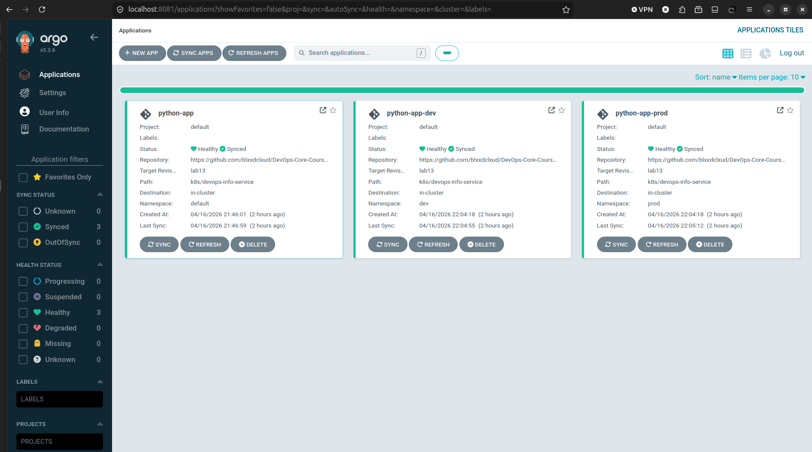
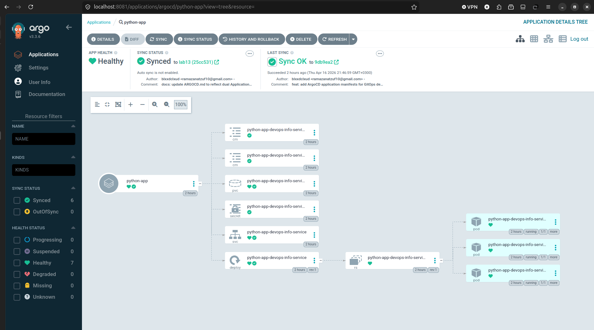
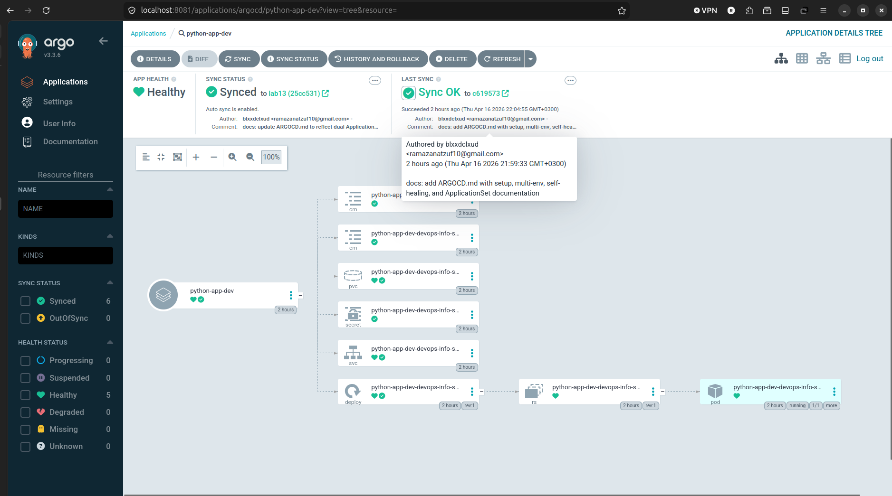
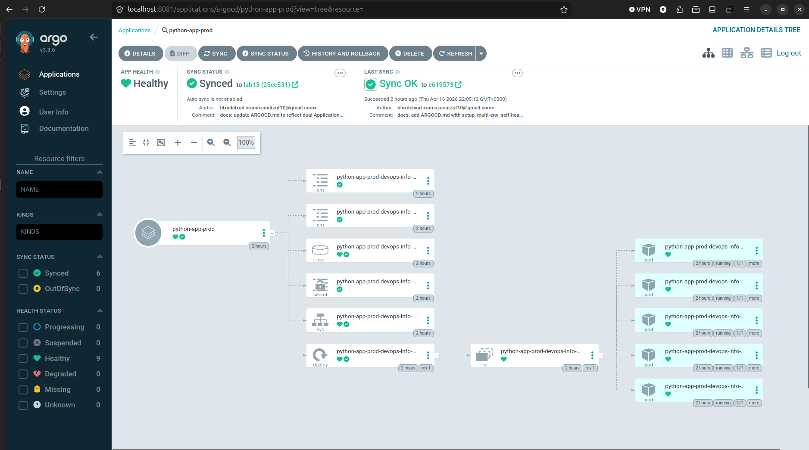

# Lab 13 — GitOps with ArgoCD

## 1. ArgoCD Setup

### Installation

ArgoCD was installed into the `kind-lab12` cluster using Helm:

```bash
helm repo add argo https://argoproj.github.io/argo-helm
helm repo update
kubectl create namespace argocd
helm install argocd argo/argo-cd --namespace argocd
```

### Verification

All ArgoCD pods are running in the `argocd` namespace:

```
NAME                                               READY   STATUS    RESTARTS   AGE
argocd-application-controller-0                    1/1     Running   0          16m
argocd-applicationset-controller-9f85b7f7d-928v7   1/1     Running   0          16m
argocd-dex-server-64766d9569-x9989                 1/1     Running   0          16m
argocd-notifications-controller-cdf598886-n68lw    1/1     Running   0          16m
argocd-redis-7476bcff9b-j89d7                      1/1     Running   0          16m
argocd-repo-server-76c5f678c7-bjzbv                1/1     Running   0          16m
argocd-server-66c66bcc9f-8xfms                     1/1     Running   0          16m
```

### UI Access

Port forward to access the web interface:

```bash
kubectl port-forward svc/argocd-server -n argocd 8081:443
# Access at https://localhost:8081
# Username: admin
```

Initial admin password retrieved with:

```bash
kubectl -n argocd get secret argocd-initial-admin-secret -o jsonpath="{.data.password}" | base64 -d
```

### CLI Installation and Login

ArgoCD CLI v3.3.7 was downloaded from GitHub releases:

```bash
curl -sL -o ~/.local/bin/argocd \
  https://github.com/argoproj/argo-cd/releases/download/v3.3.7/argocd-linux-amd64
chmod +x ~/.local/bin/argocd

argocd login localhost:8081 --insecure --username admin --password <password>
# Output: 'admin:login' logged in successfully
```

---

## 2. Application Configuration

All ArgoCD application manifests live in `k8s/argocd/`.

### Main Application (`application.yaml`)

Points to the `default` namespace, uses the base `values.yaml`, sync is manual.

```yaml
apiVersion: argoproj.io/v1alpha1
kind: Application
metadata:
  name: python-app
  namespace: argocd
spec:
  project: default
  source:
    repoURL: https://github.com/blxxdclxud/DevOps-Core-Course.git
    targetRevision: lab13
    path: k8s/devops-info-service
    helm:
      valueFiles:
        - values.yaml
  destination:
    server: https://kubernetes.default.svc
    namespace: default
  syncPolicy:
    syncOptions:
      - CreateNamespace=true
```

Initial sync result:

```
Sync Status:  Synced to lab13 (0504cd5)
Health Status: Healthy
```

All resources were deployed: Deployment (3 replicas), Service (NodePort 30080), ConfigMaps, Secret, PersistentVolumeClaim. Pre-install and post-install Helm hooks ran successfully.

---

## 3. Multi-Environment Deployment

### Namespaces

```bash
kubectl create namespace dev
kubectl create namespace prod
```

### Dev Application (`application-dev.yaml`)

- Uses `values-dev.yaml` (1 replica, ClusterIP, smaller resources)
- Auto-sync enabled with `selfHeal` and `prune`

```yaml
syncPolicy:
  automated:
    prune: true
    selfHeal: true
  syncOptions:
    - CreateNamespace=true
```

### Prod Application (`application-prod.yaml`)

- Uses `values-prod.yaml` (5 replicas, ClusterIP, larger resources)
- No `automated` block — manual sync only

### Configuration Differences

| Setting | dev | prod |
|---|---|---|
| Replicas | 1 | 5 |
| Memory request | 64Mi | 256Mi |
| Memory limit | 128Mi | 512Mi |
| CPU request | 50m | 200m |
| CPU limit | 100m | 500m |
| Service type | ClusterIP | ClusterIP |
| Sync policy | Auto (selfHeal + prune) | Manual |

### Why Manual for Prod?

Production needs a human to review every change before it lands. Auto-sync can push broken configs instantly if there's a bug in Git. Manual sync gives you a chance to check the diff first, pick the right time to release, and roll back safely if something goes wrong.

### Verification

```
NAME                    STATUS  HEALTH   SYNCPOLICY
argocd/python-app       Synced  Healthy  Manual
argocd/python-app-dev   Synced  Healthy  Auto-Prune
argocd/python-app-prod  Synced  Healthy  Manual
```

Pods in each namespace:

```
# default namespace
python-app-devops-info-service-xxx  1/1  Running  (3 pods)

# dev namespace
python-app-dev-devops-info-service-xxx  1/1  Running  (1 pod)

# prod namespace
python-app-prod-devops-info-service-xxx  1/1  Running  (5 pods)
```

---

## 4. Self-Healing Evidence

### Test 1 — Manual Scale (Configuration Drift)

Manually scaled the dev deployment to 5 replicas:

```bash
kubectl scale deployment python-app-dev-devops-info-service -n dev --replicas=5
# Scaled to 5 at Thu 16 Apr 21:51:43 MSK 2026
```

ArgoCD detected the drift and reverted it automatically:

```bash
# 10 seconds later:
kubectl get deployment python-app-dev-devops-info-service -n dev -o jsonpath='{.spec.replicas}'
# Output: 1
# Reverted at Thu 16 Apr 21:51:53 MSK 2026
```

ArgoCD self-heal reverted the replica count from 5 to 1 in under 10 seconds.

### Test 2 — Pod Deletion

Deleted the running pod in the dev namespace:

```bash
kubectl delete pod -n dev python-app-dev-devops-info-service-549d5498c6-2ddf8
```

Kubernetes immediately created a new pod through the ReplicaSet controller:

```
NAME                                                  READY   STATUS    RESTARTS   AGE
python-app-dev-devops-info-service-549d5498c6-vr8lv   1/1     Running   0          3s
```

This is **Kubernetes self-healing** — the ReplicaSet controller ensures the desired pod count is maintained. ArgoCD is not involved here.

### Test 3 — Configuration Drift (Label)

Added a label to the dev deployment:

```bash
kubectl label deployment python-app-dev-devops-info-service -n dev test-drift=true
```

ArgoCD does not revert labels that are not part of the Helm template — only fields managed in Git are tracked. The replica count, container specs, and environment variables are managed and will be reverted. Extra metadata labels added outside the template are not tracked.

### Difference: Kubernetes Self-Healing vs ArgoCD Self-Healing

| What | Who heals it | How |
|---|---|---|
| Pod crash / deletion | Kubernetes (ReplicaSet) | Recreates pod immediately |
| Replica count changed | ArgoCD selfHeal | Syncs back to Git state |
| Container image changed | ArgoCD selfHeal | Re-applies Helm template |
| Config in Git changed | ArgoCD auto-sync | Detects drift within 3 min |

### ArgoCD Sync Behavior

- Default Git poll interval: **3 minutes**
- With selfHeal enabled: reverts manual cluster changes on next sync cycle
- With webhooks: sync is immediate after a Git push
- Manual trigger: `argocd app sync <app-name>`









---

## 5. Bonus — ApplicationSet

### Manifest (`applicationset.yaml`)

Uses two ApplicationSets with the **List generator** — one for dev (with auto-sync) and one for prod (manual sync). This approach properly separates sync policies per environment since ApplicationSet templates don't support conditional blocks.

**Dev ApplicationSet (auto-sync):**

```yaml
apiVersion: argoproj.io/v1alpha1
kind: ApplicationSet
metadata:
  name: python-app-dev-set
  namespace: argocd
spec:
  generators:
    - list:
        elements:
          - env: dev
            namespace: dev
            valuesFile: values-dev.yaml
  template:
    metadata:
      name: 'python-app-{{env}}'
    spec:
      project: default
      source:
        repoURL: https://github.com/blxxdclxud/DevOps-Core-Course.git
        targetRevision: lab13
        path: k8s/devops-info-service
        helm:
          valueFiles:
            - '{{valuesFile}}'
      destination:
        server: https://kubernetes.default.svc
        namespace: '{{namespace}}'
      syncPolicy:
        automated:
          prune: true
          selfHeal: true
        syncOptions:
          - CreateNamespace=true
```

**Prod ApplicationSet (manual sync):** Same structure but without the `automated` block.

### ApplicationSet Status

Both ApplicationSets generated their apps successfully:

```
NAME                    STATUS  HEALTH   SYNCPOLICY
python-app-dev          Synced  Healthy  Auto-Prune  (managed by python-app-dev-set)
python-app-prod         Synced  Healthy  Manual      (managed by python-app-prod-set)
```

### Benefits of ApplicationSet vs Individual Applications

| | Individual Applications | ApplicationSet |
|---|---|---|
| Adding a new env | Create a new file | Add one list element |
| Consistency | Can drift between files | Template guarantees consistency |
| Scale to 10 envs | 10 separate YAML files | 10 list elements |
| Multi-cluster | Repeat per cluster | Cluster generator handles it |

### When to Use Which Generator

- **List generator**: Fixed list of environments (dev/staging/prod) — simple and explicit
- **Cluster generator**: Deploy same app to multiple clusters — scales automatically
- **Git directory generator**: Mono-repo with many apps — auto-discovers by folder structure
- **Matrix generator**: Combine two generators (e.g., all apps × all clusters)

For a simple dev/prod setup like this one, the List generator is the best fit — it's easy to read, easy to extend, and explicit about what environments exist.
