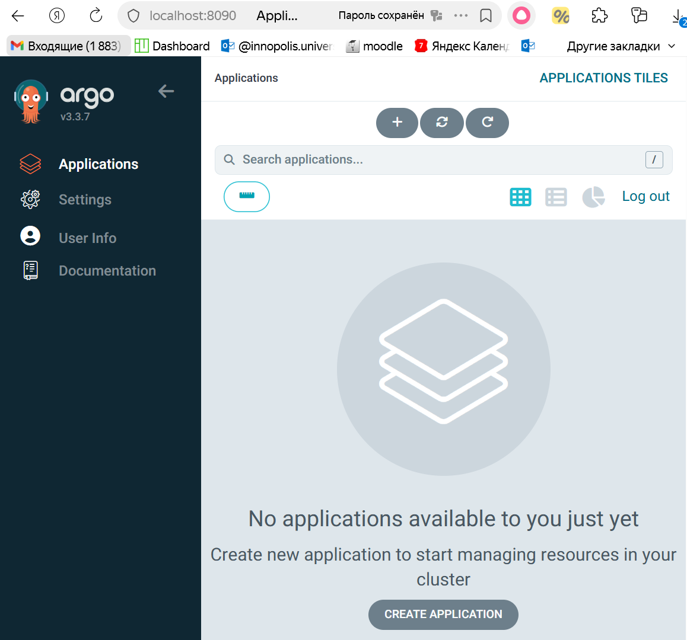
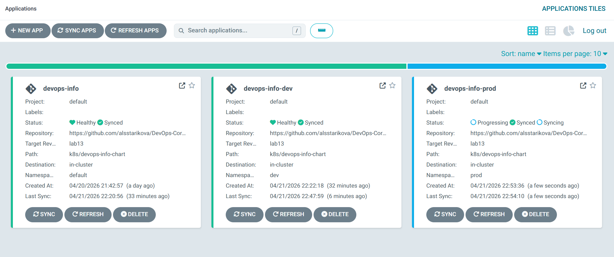
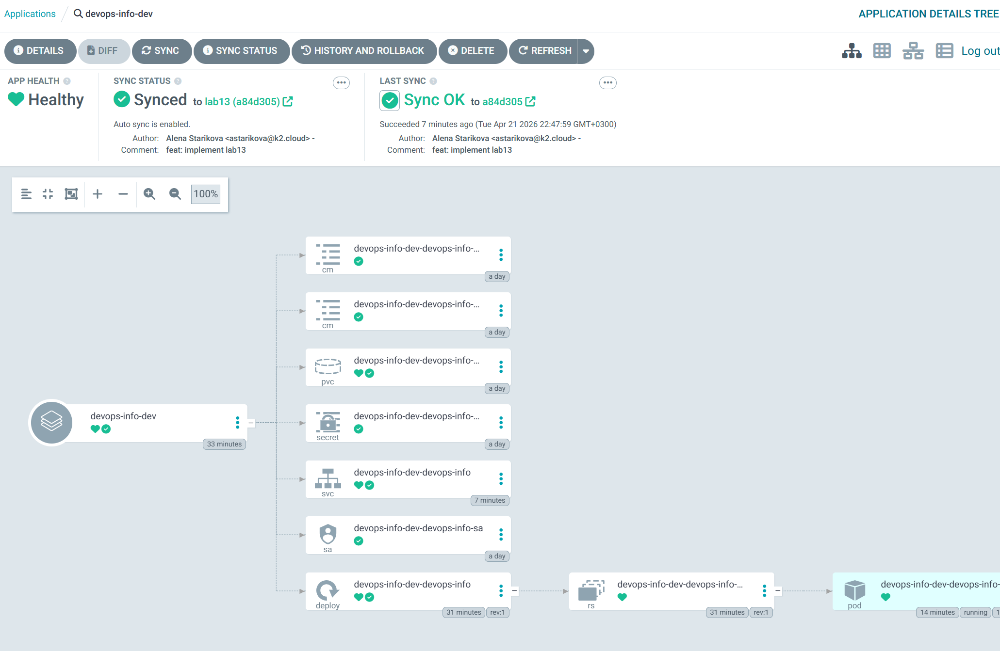
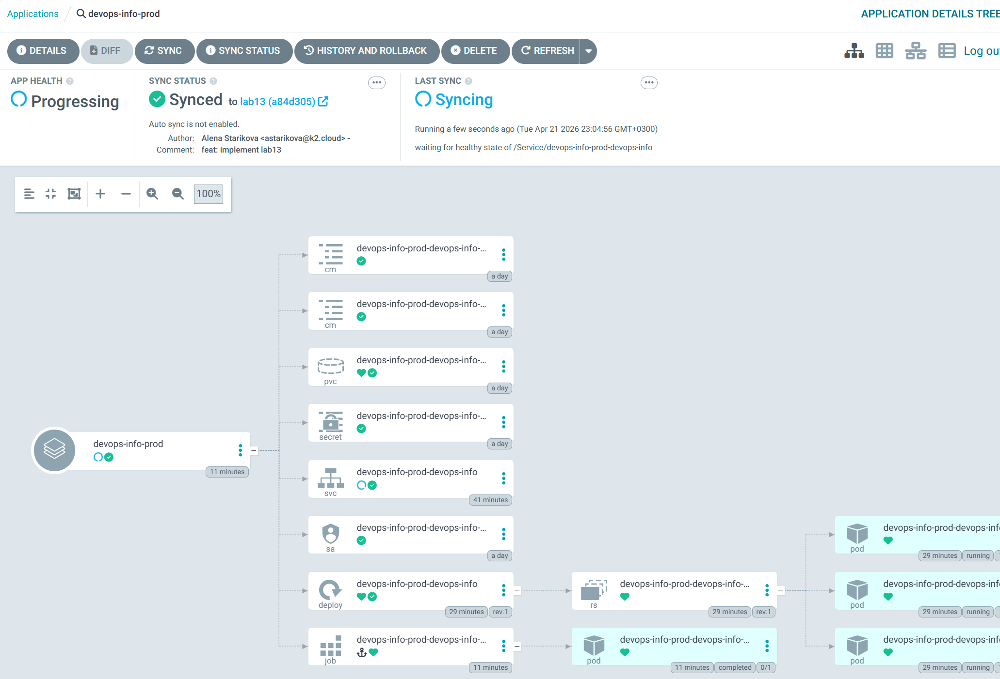
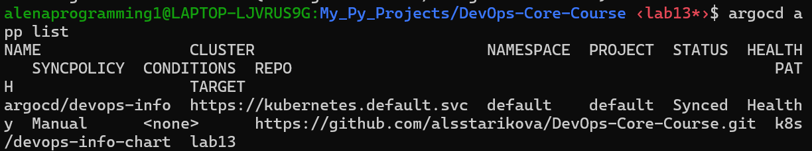

# Lab 13 — GitOps with ArgoCD — Complete Lab Report

## Task 1 — ArgoCD Installation & Setup (2 pts)

### 1.1 Installation via Helm

```bash
helm repo add argo https://argoproj.github.io/argo-helm
helm repo update
kubectl create namespace argocd
helm install argocd argo/argo-cd --namespace argocd
kubectl wait --for=condition=ready pod -l app.kubernetes.io/name=argocd-server -n argocd --timeout=120s
```

**Verification — all pods running:**
```
$ kubectl get pods -n argocd
NAME                                                READY   STATUS    RESTARTS        AGE
argocd-application-controller-0                     1/1     Running   2 (8m35s ago)   24h
argocd-applicationset-controller-59f6b7dd64-j6kpk   1/1     Running   2 (8m35s ago)   25h
argocd-dex-server-7b9588c494-tfjzr                  1/1     Running   2 (8m35s ago)   25h
argocd-notifications-controller-8f6855454-dsmhz     1/1     Running   2 (8m35s ago)   25h
argocd-redis-5f8697886-7xbwz                        1/1     Running   2 (8m35s ago)   24h
argocd-repo-server-7846fbc6c8-s726b                 1/1     Running   2 (8m35s ago)   24h
argocd-server-74dcf799c8-gksj9                      1/1     Running   2 (8m35s ago)   24h
```

### 1.2 Access ArgoCD UI

```bash
kubectl port-forward svc/argocd-server -n argocd 8090:443 &
kubectl -n argocd get secret argocd-initial-admin-secret -o jsonpath="{.data.password}" | base64 -d && echo
```

**Access Details:**
- URL: `https://localhost:8090`
- Username: `admin`
- Password: *my password*



### 1.3 ArgoCD CLI Installation & Login

```bash
# Linux installation
curl -sSL -o /usr/local/bin/argocd https://github.com/argoproj/argo-cd/releases/latest/download/argocd-linux-amd64
chmod +x /usr/local/bin/argocd

argocd login localhost:8090 --insecure
argocd account get-user-info
```

**Output:**
```
$ argocd account get-user-info
Logged In: true
Username: admin
Issuer: argocd
Groups:
```

---

## Task 2 — Application Deployment (3 pts)

### 2.1 Application Manifest

**File:** `k8s/argocd/application.yaml`

```yaml
apiVersion: argoproj.io/v1alpha1
kind: Application
metadata:
  name: devops-info
  namespace: argocd
spec:
  project: default
  source:
    repoURL: https://github.com/alsstarikova/DevOps-Core-Course.git
    targetRevision: lab13
    path: k8s/devops-info-chart
    helm:
      valueFiles:
        - values.yaml
  destination:
    server: https://kubernetes.default.svc
    namespace: default
  syncPolicy:
    syncOptions:
      - CreateNamespace=true
```

### 2.2 Deploy Application

```bash
kubectl apply -f k8s/argocd/application.yaml
argocd app sync devops-info
```

**Sync Status:**
```
$ argocd app get devops-info
Name:               argocd/devops-info
Project:            default
Server:             https://kubernetes.default.svc
Namespace:          default
URL:                https://argocd.example.com/applications/devops-info
Source:
- Repo:             https://github.com/alsstarikova/DevOps-Core-Course.git
  Target:           lab13
  Path:             k8s/devops-info-chart
  Helm Values:      values.yaml
SyncWindow:         Sync Allowed
Sync Policy:        Manual
Sync Status:        Synced to lab13 (8722cc0)
Health Status:      Healthy

GROUP  KIND                   NAMESPACE  NAME                                  STATUS     HEALTH   HOOK      MESSAGE
batch  Job                    default    devops-info-devops-info-pre-install   Succeeded           PreSync   Reached expected number of succeeded pods
       ServiceAccount         default    devops-info-devops-info-sa            Synced                        serviceaccount/devops-info-devops-info-sa created
       Secret                 default    devops-info-devops-info-secret        Synced                        secret/devops-info-devops-info-secret created
       ConfigMap              default    devops-info-devops-info-config-env    Synced                        configmap/devops-info-devops-info-config-env created
       ConfigMap              default    devops-info-devops-info-config-file   Synced                        configmap/devops-info-devops-info-config-file created
       PersistentVolumeClaim  default    devops-info-devops-info-data          Synced     Healthy            persistentvolumeclaim/devops-info-devops-info-data created
       Service                default    devops-info-devops-info               Synced     Healthy            service/devops-info-devops-info created
apps   Deployment             default    devops-info-devops-info               Synced     Healthy            deployment.apps/devops-info-devops-info created
batch  Job                    default    devops-info-devops-info-post-install  Succeeded           PostSync  Reached expected number of succeeded pod
```

### 2.3 Verify Resources

```bash
kubectl get all -n default
```

**Output:**
```
NAME                                           READY   STATUS    RESTARTS   AGE
pod/devops-info-devops-info-5f55fbd764-kcnl7   1/1     Running   0          60s
pod/devops-info-devops-info-5f55fbd764-r8gp9   1/1     Running   0          60s
pod/devops-info-devops-info-5f55fbd764-sxffr   1/1     Running   0          60s

NAME                              TYPE        CLUSTER-IP     EXTERNAL-IP   PORT(S)        AGE
service/devops-info-devops-info   NodePort    10.96.234.89   <none>        80:30080/TCP   60s
service/kubernetes                ClusterIP   10.96.0.1      <none>        443/TCP        9m38s

NAME                                      READY   UP-TO-DATE   AVAILABLE   AGE
deployment.apps/devops-info-devops-info   3/3     3            3           61s

NAME                                                 DESIRED   CURRENT   READY   AGE
replicaset.apps/devops-info-devops-info-5f55fbd764   3         3         3       61s
```

### 2.4 Test GitOps Workflow

**Change made:** Updated `replicaCount` from 3 to 5 in `values.yaml`, committed to `lab13` branch.

**ArgoCD detecting drift:**
```
$ argocd app list
NAME                CLUSTER                         NAMESPACE  PROJECT  STATUS     HEALTH   SYNCPOLICY  CONDITIONS  REPO                                                    PATH                   TARGET
argocd/devops-info  https://kubernetes.default.svc  default    default  OutOfSync  Healthy  Manual      <none>      https://github.com/alsstarikova/DevOps-Core-Course.git  k8s/devops-info-chart  lab13
```

**Sync applied:**
```bash
argocd app sync devops-info
```

**Verification:**
```
$ kubectl get deployment -n default -o jsonpath='{.items[0].spec.replicas}'
5%   
```

**GitOps workflow verified:** Change in Git → ArgoCD detects → Manual sync applies.

---

## Task 3 — Multi-Environment Deployment (3 pts)

### 3.1 Create Namespaces

```bash
kubectl create namespace dev
kubectl create namespace prod
```

### 3.2 Environment-Specific Applications

**Dev Application** (`k8s/argocd/application-dev.yaml`):
```yaml
apiVersion: argoproj.io/v1alpha1
kind: Application
metadata:
  name: devops-info-dev
  namespace: argocd
spec:
  project: default
  source:
    repoURL: https://github.com/alsstarikova/DevOps-Core-Course.git
    targetRevision: lab13
    path: k8s/devops-info-chart
    helm:
      valueFiles:
        - values-dev.yaml
  destination:
    server: https://kubernetes.default.svc
    namespace: dev
  syncPolicy:
    automated:
      prune: true
      selfHeal: true
    syncOptions:
      - CreateNamespace=true
```

**Prod Application** (`k8s/argocd/application-prod.yaml`):
```yaml
apiVersion: argoproj.io/v1alpha1
kind: Application
metadata:
  name: devops-info-prod
  namespace: argocd
spec:
  project: default
  source:
    repoURL: https://github.com/alsstarikova/DevOps-Core-Course.git
    targetRevision: lab13
    path: k8s/devops-info-chart
    helm:
      valueFiles:
        - values-prod.yaml
  destination:
    server: https://kubernetes.default.svc
    namespace: prod
  syncPolicy:
    syncOptions:
      - CreateNamespace=true
  # No automated block = manual sync required
```

### 3.3 Apply and Sync

```bash
kubectl apply -f k8s/argocd/application-dev.yaml
kubectl apply -f k8s/argocd/application-prod.yaml
argocd app sync devops-info-dev
argocd app sync devops-info-prod
```

### 3.4 Environment Configuration Comparison

| Parameter | Dev | Prod |
|-----------|-----|------|
| Replicas | 1 | 3 |
| CPU Request/Limit | 50m/100m | 200m/500m |
| Memory Request/Limit | 64Mi/128Mi | 256Mi/512Mi |
| Service Type | NodePort (30081) | LoadBalancer (31632) |
| Log Level | DEBUG | WARN |
| Sync Policy | **Auto** (prune + selfHeal) | **Manual** |

### 3.5 Verification

**Dev Environment:**
```bash
$ kubectl get deploy,svc,pods -n dev
NAME                                          READY   UP-TO-DATE   AVAILABLE   AGE
deployment.apps/devops-info-dev-devops-info   1/1     1            1           25m

NAME                                  TYPE       CLUSTER-IP      EXTERNAL-IP   PORT(S)        AGE
service/devops-info-dev-devops-info   NodePort   10.96.238.215   <none>        80:30081/TCP   50s

NAME                                              READY   STATUS    RESTARTS        AGE
pod/devops-info-dev-devops-info-5959f4676-9mfmv   1/1     Running   1 (6m36s ago)   7m37s
```

**Prod Environment:**
```bash
$ kubectl get deploy,svc,pods -n prod
kubectl get deploy,svc,pods -n prod
NAME                                           READY   UP-TO-DATE   AVAILABLE   AGE
deployment.apps/devops-info-prod-devops-info   3/3     3            3           2m47s

NAME                                   TYPE           CLUSTER-IP     EXTERNAL-IP   PORT(S)        AGE
service/devops-info-prod-devops-info   LoadBalancer   10.96.23.171   <pending>     80:31893/TCP   14m

NAME                                                 READY   STATUS      RESTARTS   AGE
pod/devops-info-prod-devops-info-748c9c856d-558p5    1/1     Running     0          2m47s
pod/devops-info-prod-devops-info-748c9c856d-m9ws4    1/1     Running     0          2m47s
pod/devops-info-prod-devops-info-748c9c856d-px64n    1/1     Running     0          2m47s
pod/devops-info-prod-devops-info-pre-install-k7qpm   1/1     Running     0          2m55s
```

**Multi-environment deployment successful.**

---

## Task 4 — Self-Healing & Sync Policies (2 pts)

### 4.1 Test 1: Manual Scale (ArgoCD Self-Healing)

**Before:**
```bash
$ kubectl get deployment -n dev -o jsonpath='{.items[0].spec.replicas}'
1% 
```

**Manual change:**
```bash
kubectl scale deployment devops-info-dev-devops-info -n dev --replicas=3
```

**ArgoCD detects drift:**
```bash
$ argocd app diff devops-info-dev
===== /Service dev/devops-info-dev-devops-info ======
0a1,24
> apiVersion: v1
> kind: Service
> metadata:
>   annotations:
>     argocd.argoproj.io/tracking-id: devops-info-dev:/Service:dev/devops-info-dev-devops-info
>   labels:
>     app.kubernetes.io/instance: devops-info-dev
>     app.kubernetes.io/managed-by: Helm
>     app.kubernetes.io/name: devops-info
>     app.kubernetes.io/version: 1.0.0
>     helm.sh/chart: devops-info-0.1.0
>   name: devops-info-dev-devops-info
>   namespace: dev
> spec:
>   ports:
>   - name: http
>     nodePort: 30080
>     port: 80
>     protocol: TCP
>     targetPort: http
>   selector:
>     app.kubernetes.io/instance: devops-info-dev
>     app.kubernetes.io/name: devops-info
>   type: NodePort

===== apps/Deployment dev/devops-info-dev-devops-info ======
206c206
<   replicas: 3
---
>   replicas: 1
```

**Self-healing applied (within 3 minutes):**
```bash
$ kubectl get deployment -n dev -o jsonpath='{.items[0].spec.replicas}'
1%  
```

**Result:** ArgoCD automatically reverted the replica count to Git-defined value (1).

### 4.2 Test 2: Pod Deletion (Kubernetes Self-Healing)

```bash
$ kubectl delete pod -n dev -l app.kubernetes.io/name=devops-info
pod "devops-info-dev-devops-info-5959f4676-z4k97" deleted from dev namespace
pod "devops-info-dev-devops-info-pre-install-fpbqz" deleted from dev namespace

$ kubectl get pods -n dev -w
NAME                                          READY   STATUS    RESTARTS   AGE
devops-info-dev-devops-info-5959f4676-9mfmv   0/1     Running   0          21s
devops-info-dev-devops-info-5959f4676-9mfmv   1/1     Running   0          36s
```

**Result:** Kubernetes ReplicaSet controller recreated the pod immediately. This is Kubernetes-level healing, not ArgoCD.

### 4.3 Test 3: Configuration Drift (Annotation)

```bash
kubectl annotate deployment devops-info-dev-devops-info -n dev drift-test=true
```

**ArgoCD diff:**
```bash
$ argocd app diff devops-info-dev
===== /metadata/annotations
2a3
>   drift-test: "true"
```

**Self-healing applied:**
```bash
$ kubectl get deployment devops-info-dev-devops-info -n dev -o yaml | grep drift-test
# No output — annotation removed
```

**Result:** ArgoCD removed the out-of-band annotation to match Git state.

### 4.4 Sync Behavior Summary

| Event | Who Heals? | Trigger |
|-------|-----------|---------|
| Pod deleted | Kubernetes (ReplicaSet) | Immediate |
| Replica count changed | ArgoCD (selfHeal) | Next sync interval (~3 min) |
| Annotation added | ArgoCD (selfHeal) | Next sync interval (~3 min) |
| Git commit | ArgoCD (auto-sync) | Webhook or poll interval |

## Screenshots
1. ArgoCD Applications Dashboard - all three applications showing Synced and Healthy status  
    

2. Application Sync Status and Health Indicators - confirming GitOps state synchronization  
    
    
3. Self-healing with change of sync status  
    
  
