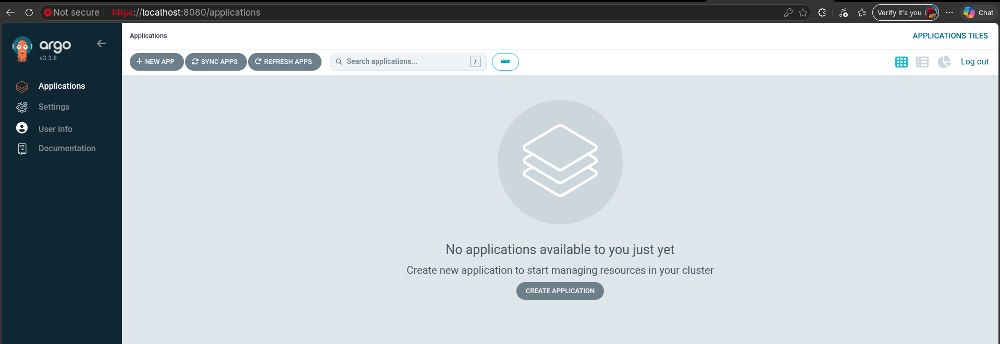
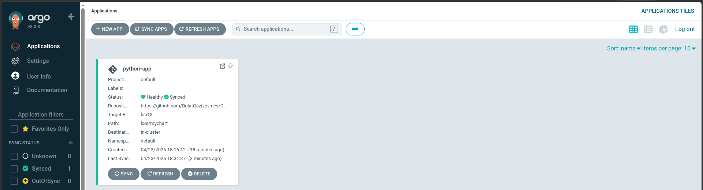
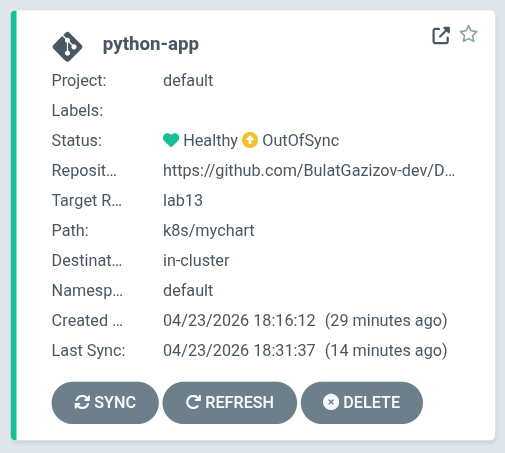
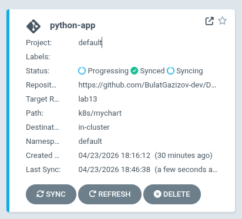
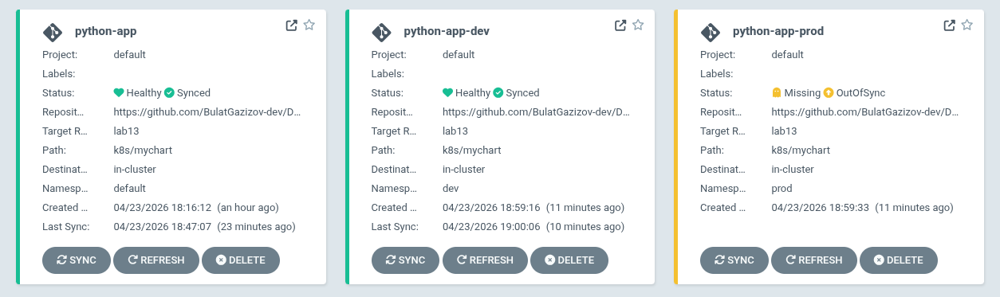
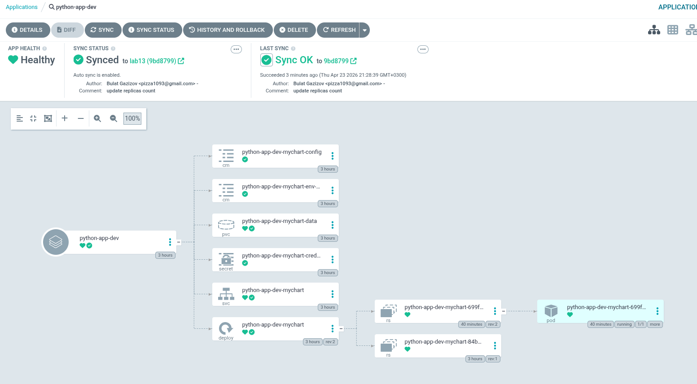

# Lab 13

## ArgoCD Setup

### Installation verification

```bash
kubectl wait --for=condition=ready pod -l app.kubernetes.io/name=argocd-server -n argocd --timeout=120s
pod/argocd-server-7f857f54f-f5vrh condition met
```

### UI access method

```bash
kubectl port-forward svc/argocd-server -n argocd 8080:443
```



### CLI configuration

```bash
argocd login localhost:8080 --insecure
Username: admin
Password: 
'admin:login' logged in successfully
Context 'localhost:8080' updated
```

## Application Configuration

### Application manifests

#### Source and destination configuration

Source repository: <https://github.com/BulatGazizov-dev/DevOps-Core-Course.git> \
Target branch: lab13 \
Helm chart path: k8s/mychart \
Destination cluster: In-cluster (Kubernetes)

#### Values file selection

k8s/app-python/values.yaml



### Sync status

```bash
argocd app sync python-app
TIMESTAMP  GROUP        KIND   NAMESPACE                  NAME    STATUS   HEALTH        HOOK  MESSAGE
2026-04-23T18:30:53+03:00  batch         Job     default  python-app-mychart-pre-install   Running   Synced     PreSync  job.batch/python-app-mychart-pre-install created
2026-04-23T18:31:10+03:00             Secret                default  python-app-mychart-credentials   Running    Synced              secret/python-app-mychart-credentials created
2026-04-23T18:31:10+03:00          ConfigMap                default  python-app-mychart-env-config    Running    Synced              configmap/python-app-mychart-env-config created
2026-04-23T18:31:10+03:00          ConfigMap                default  python-app-mychart-config        Running    Synced              configmap/python-app-mychart-config created
2026-04-23T18:31:10+03:00         PersistentVolumeClaim     default  python-app-mychart-data          Running    Synced              persistentvolumeclaim/python-app-mychart-data created
2026-04-23T18:31:10+03:00            Service                default    python-app-mychart             Running    Synced              service/python-app-mychart created
2026-04-23T18:31:10+03:00   apps  Deployment                default    python-app-mychart             Running    Synced              deployment.apps/python-app-mychart created
2026-04-23T18:31:10+03:00  batch         Job                default  python-app-mychart-pre-install  Succeeded   Synced     PreSync  Reached expected number of succeeded pods
2026-04-23T18:31:10+03:00             Secret                default  python-app-mychart-credentials  Succeeded   Synced              secret/python-app-mychart-credentials created
2026-04-23T18:31:10+03:00          ConfigMap                default  python-app-mychart-env-config   Succeeded   Synced              configmap/python-app-mychart-env-config created
2026-04-23T18:31:10+03:00          ConfigMap                default  python-app-mychart-config       Succeeded   Synced              configmap/python-app-mychart-config created
2026-04-23T18:31:10+03:00         PersistentVolumeClaim     default  python-app-mychart-data         Succeeded   Synced              persistentvolumeclaim/python-app-mychart-data created
2026-04-23T18:31:10+03:00            Service                default    python-app-mychart            Succeeded   Synced              service/python-app-mychart created
2026-04-23T18:31:21+03:00   apps  Deployment     default    python-app-mychart             Succeeded   Synced              deployment.apps/python-app-mychart created
2026-04-23T18:31:21+03:00  batch         Job     default  python-app-mychart-post-install   Running    Synced    PostSync  job.batch/python-app-mychart-post-install created
2026-04-23T18:31:38+03:00  batch         Job     default  python-app-mychart-post-install  Succeeded   Synced    PostSync  Reached expected number of succeeded pods

Name:               argocd/python-app
Project:            default
Server:             https://kubernetes.default.svc
Namespace:          default
URL:                https://argocd.example.com/applications/python-app
Source:
- Repo:             https://github.com/BulatGazizov-dev/DevOps-Core-Course.git
  Target:           lab13
  Path:             k8s/mychart
  Helm Values:      values.yaml
SyncWindow:         Sync Allowed
Sync Policy:        Manual
Sync Status:        Synced to lab13 (8927fde)
Health Status:      Healthy

Operation:          Sync
Sync Revision:      8927fdef4bb3ba7f2766f5fbde204ad73d83cef1
Phase:              Succeeded
Start:              2026-04-23 18:30:46 +0300 MSK
Finished:           2026-04-23 18:31:37 +0300 MSK
Duration:           51s
Message:            successfully synced (no more tasks)

GROUP  KIND                   NAMESPACE  NAME                             STATUS     HEALTH   HOOK      MESSAGE
batch  Job                    default    python-app-mychart-pre-install   Succeeded           PreSync   Reached expected number of succeeded pods
       Secret                 default    python-app-mychart-credentials   Synced                        secret/python-app-mychart-credentials created
       ConfigMap              default    python-app-mychart-env-config    Synced                        configmap/python-app-mychart-env-config created
       ConfigMap              default    python-app-mychart-config        Synced                        configmap/python-app-mychart-config created
       PersistentVolumeClaim  default    python-app-mychart-data          Synced     Healthy            persistentvolumeclaim/python-app-mychart-data created
       Service                default    python-app-mychart               Synced     Healthy            service/python-app-mychart created
apps   Deployment             default    python-app-mychart               Synced     Healthy            deployment.apps/python-app-mychart created
batch  Job                    default    python-app-mychart-post-install  Succeeded           PostSync  Reached expected number of succeeded pods
```

#### After commit




## Multi-Environment

### Dev vs Prod configuration differences

They use different values files with different replicas count and resourses allocation

### Sync policy differences and rationale

#### For development environment

- Changes pushed to Git are automatically applied to the - cluster
- If someone manually deletes a pod, ArgoCD recreates it
- If someone manually edits a deployment, ArgoCD reverts it
- Resources deleted from Git are removed from cluster

It's best for Dev because:

- Developers need rapid feedback on changes
- Frequent iterations and experimentation
- No concern about approval delays
- Self-healing catches accidental manual changes

#### For production environment

Changes in Git are detected but not applied automatically
Requires explicit approval via argocd app sync or UI
Manual changes to the cluster are preserved (no auto-healing)
Resources are not pruned automatically

It's better for production because it requires explicit approval before deployment and catches issues before they hit production

### Namespace separation



## Self-Healing Evidence

### Manual scale test with before/after

```bash
kubectl get deployments -n dev
NAME                     READY   UP-TO-DATE   AVAILABLE   AGE
python-app-dev-mychart   1/1     1            1           35m
bulatgazizov@fedora:~/Projects/DevOps-Core-Course$ kubectl scale deployment python-app-dev-mychart -n dev --replicas=5
deployment.apps/python-app-dev-mychart scaled

kubectl get pods -n dev
NAME                                      READY   STATUS        RESTARTS   AGE
python-app-dev-mychart-84bccdfc57-5mlfx   1/1     Terminating   0          32s
python-app-dev-mychart-84bccdfc57-7sx9d   1/1     Terminating   0          32s
python-app-dev-mychart-84bccdfc57-jwl52   1/1     Terminating   0          32s
python-app-dev-mychart-84bccdfc57-k5j2b   1/1     Terminating   0          32s
python-app-dev-mychart-84bccdfc57-lp5dh   1/1     Running       0          35m
```

- ArgoCD scaled down replicas

### Pod deletion test

```bash
kubectl get pods -n dev
NAME                                      READY   STATUS    RESTARTS   AGE
python-app-dev-mychart-84bccdfc57-lp5dh   1/1     Running   0          39m
bulatgazizov@fedora:~/Projects/DevOps-Core-Course$ kubectl delete pod python-app-dev-mychart-84bccdfc57-lp5dh -n dev
pod "python-app-dev-mychart-84bccdfc57-lp5dh" deleted from dev namespace
bulatgazizov@fedora:~/Projects/DevOps-Core-Course$ kubectl get pods -n dev
NAME                                      READY   STATUS    RESTARTS   AGE
python-app-dev-mychart-84bccdfc57-64glx   0/1     Running   0          4s
```

- K8s created new pod to restore replicas count

### Configuration drift test

```bash
kubectl label deployment  python-app-dev-mychart -n dev test=label
deployment.apps/python-app-dev-mychart labeled

bulatgazizov@fedora:~/Projects/DevOps-Core-Course$ argocd app diff python-app-dev

bulatgazizov@fedora:~/Projects/DevOps-Core-Course$ kubectl describe deployment  python-app-dev-mychart -n dev
Name:                   python-app-dev-mychart
Namespace:              dev
CreationTimestamp:      Thu, 23 Apr 2026 18:59:34 +0300
Labels:                 app.kubernetes.io/instance=python-app-dev
                        app.kubernetes.io/managed-by=Helm
                        app.kubernetes.io/name=mychart
                        app.kubernetes.io/version=1.0.1
                        helm.sh/chart=mychart-0.1.0
                        test=label
```

- Actually changes nothing..

### Explanation of behaviors

Kubernetes Self-Healing:

- Triggered by pod failures or deletions
- ReplicaSet controller recreates pods
- Ensures desired replica count
- Happens in seconds

ArgoCD Self-Healing (Configuration-level)

- Triggered by configuration drift
- Reverts manual cluster changes
- Restores Git-defined state
- Happens on sync interval (or webhook)

ArgoCD triggers when last version of deployment configuration in git is different from deployed.

Sync interval is how ofter ArgoCD checks our git repository

### Application details view


