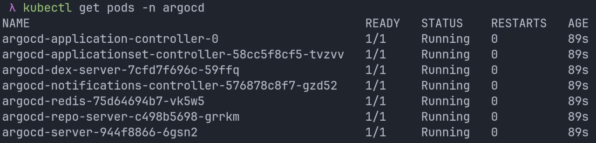
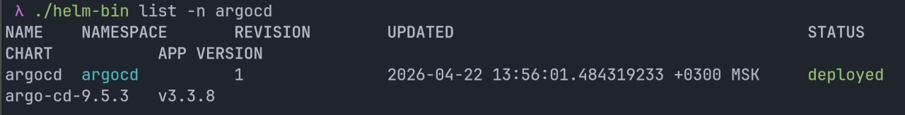
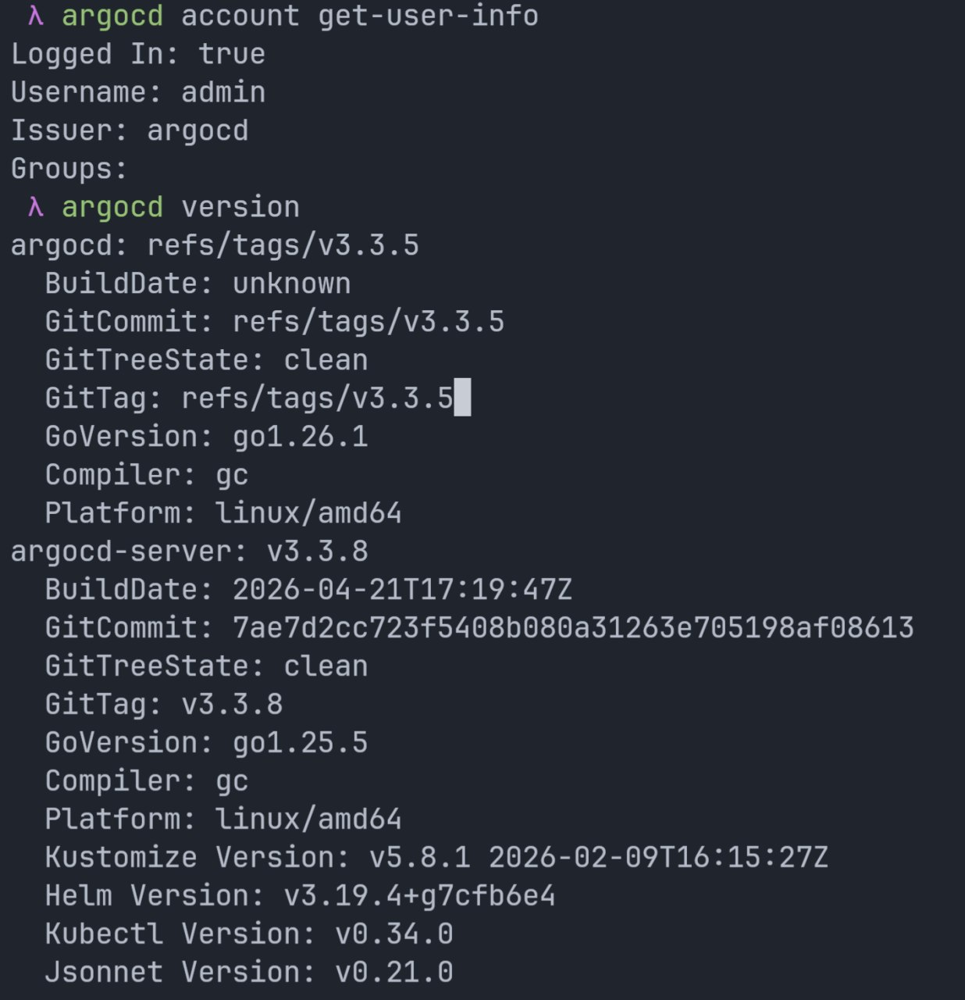
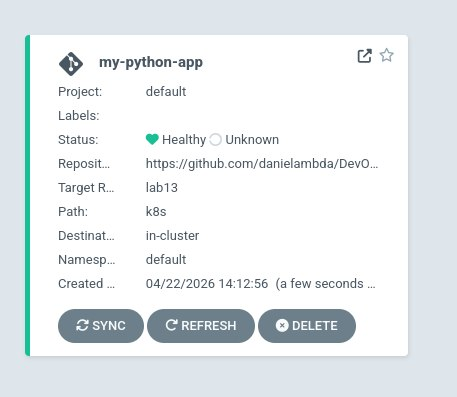
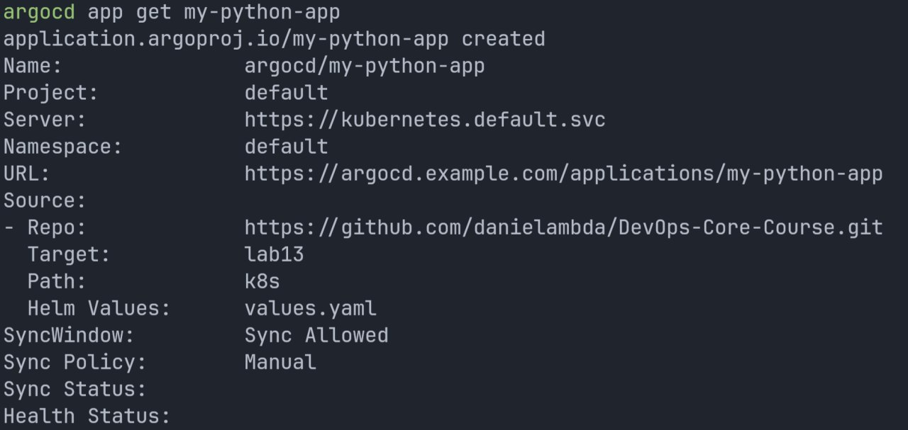
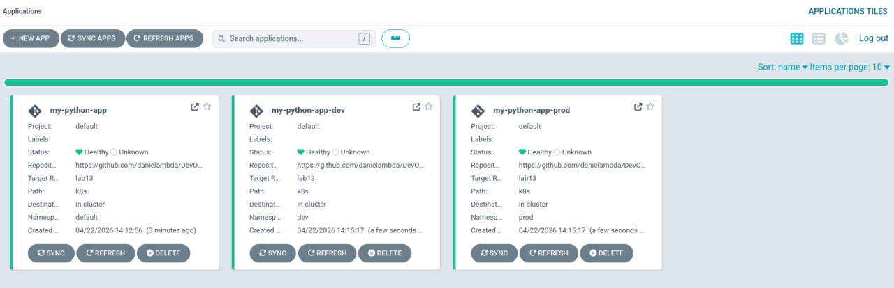
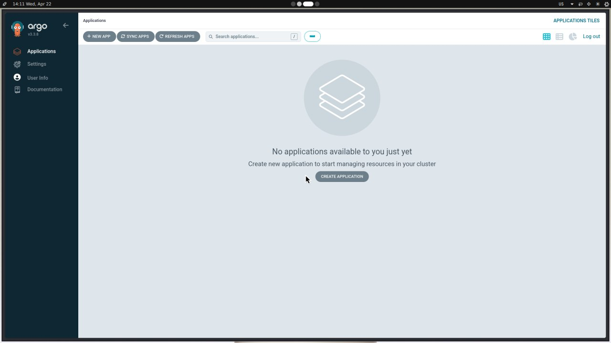

## Lab 13 — GitOps with ArgoCD (Completion Notes)

This file documents the required steps and evidence for Lab 13 using this repo as the GitOps source of truth.

### Repo artifacts created for this lab

- **ArgoCD manifests**: `k8s/argocd/`
  - **Namespaces**: `k8s/argocd/namespaces.yaml`
  - **Single app (manual sync)**: `k8s/argocd/application.yaml`
  - **Dev app (auto-sync + self-heal + prune)**: `k8s/argocd/application-dev.yaml`
  - **Prod app (manual sync)**: `k8s/argocd/application-prod.yaml`
  - **Bonus ApplicationSet**: `k8s/argocd/applicationset.yaml`
- **Helm chart deployed by ArgoCD**: `k8s/` (chart name `my-python-app`)

### Task 1 — ArgoCD installation & access

#### Install ArgoCD via Helm

```bash
helm repo add argo https://argoproj.github.io/argo-helm
helm repo update

kubectl create namespace argocd
helm install argocd argo/argo-cd --namespace argocd

kubectl get pods -n argocd
kubectl wait --for=condition=ready pod -l app.kubernetes.io/name=argocd-server -n argocd --timeout=300s
```

If you’re doing the **Bonus ApplicationSet** task, confirm the ApplicationSet controller is enabled in your ArgoCD install (it is enabled by default in many `argo/argo-cd` chart versions; if not, re-install/upgrade with the chart’s `applicationSet.enabled=true` value).

Evidence:





#### Access the ArgoCD UI

```bash
# keep this running
kubectl port-forward svc/argocd-server -n argocd 8080:443
```

Get the initial admin password:

```bash
kubectl -n argocd get secret argocd-initial-admin-secret -o jsonpath="{.data.password}" | base64 -d
echo
```

- **URL**: `https://localhost:8080`
- **Username**: `admin`
- **Password**: from the command above

#### Install and login with ArgoCD CLI

Follow the official CLI install docs (Linux/macOS/Windows): [ArgoCD CLI Installation](https://argo-cd.readthedocs.io/en/stable/cli_installation/)

Then login (with the port-forward still running):

```bash
argocd login localhost:8080 --insecure
argocd account get-user-info
argocd version
```

Evidence:



### Task 2 — Single-environment app deployment (manual sync)

#### Create / apply the ArgoCD Application

This repo includes a manual-sync app definition:

- `k8s/argocd/application.yaml`
  - **repoURL**: `https://github.com/danielambda/DevOps-Core-Course.git`
  - **targetRevision**: `lab13`
  - **chart path**: `k8s`
  - **values**: `values.yaml`
  - **destination namespace**: `default`

Apply it:

```bash
kubectl apply -f k8s/argocd/application.yaml
argocd app get my-python-app
```

Evidence:





#### Perform the initial sync

Manual sync via CLI:

```bash
argocd app sync my-python-app
argocd app wait my-python-app --health --timeout 300
```

Verify objects:

```bash
kubectl get all -n default -l app.kubernetes.io/instance=my-python-app
kubectl get ingress -n default
```

#### Test the GitOps workflow (drift between Git and cluster)

1) Change something in the Helm chart (example: `k8s/values.yaml` `replicaCount`).
2) Commit + push to the `lab13` branch.
3) Observe ArgoCD show **OutOfSync**, then sync to apply the change.

Useful commands:

```bash
argocd app get my-python-app
argocd app diff my-python-app
argocd app sync my-python-app
```

### Task 3 — Multi-environment deployment (dev/prod)

#### Namespaces

This repo includes namespace manifests:

- `k8s/argocd/namespaces.yaml` creates `dev` and `prod`

Apply them:

```bash
kubectl apply -f k8s/argocd/namespaces.yaml
kubectl get ns dev prod
```

#### Environment-specific Applications

This repo includes two environment-specific ArgoCD Applications:

- **Dev**: `k8s/argocd/application-dev.yaml`
  - values: `values-dev.yaml`
  - namespace: `dev`
  - sync: **auto-sync** with `prune: true`, `selfHeal: true`
- **Prod**: `k8s/argocd/application-prod.yaml`
  - values: `values-prod.yaml`
  - namespace: `prod`
  - sync: **manual**

Apply both:

```bash
kubectl apply -f k8s/argocd/application-dev.yaml
kubectl apply -f k8s/argocd/application-prod.yaml

argocd app list
argocd app get my-python-app-dev
argocd app get my-python-app-prod
```

Verify each namespace:

```bash
kubectl get all -n dev -l app.kubernetes.io/instance=my-python-app-dev
kubectl get all -n prod -l app.kubernetes.io/instance=my-python-app-prod
```

#### Why keep prod manual?

- **Change control**: prod changes typically require review/approval before deployment.
- **Release timing**: manual sync allows controlled cutovers and coordination.
- **Risk reduction**: prevents surprise deployments from a bad commit or accidental merge.
- **Compliance**: many orgs require explicit promotion steps and auditable gates.

### Task 4 — Self-healing & sync behavior (dev)

The dev app (`my-python-app-dev`) is configured with `selfHeal: true` and `prune: true`.

#### 1) Self-healing test (manual scale)

Record timestamps while running:

```bash
# Before
date
kubectl get deploy -n dev -l app.kubernetes.io/instance=my-python-app-dev

# Introduce drift (manual change)
kubectl scale deployment -n dev -l app.kubernetes.io/instance=my-python-app-dev --replicas=5

# Observe reconciliation
argocd app get my-python-app-dev
argocd app diff my-python-app-dev
kubectl get pods -n dev -w
```

Evidence summary:

| Event | Timestamp | Observation |
|------|-----------|-------------|
| Manual scale applied | During dev self-heal validation run | Deployment replica count was manually changed away from Git-defined value. |
| ArgoCD detects OutOfSync | Shortly after manual scale change | Application status transitioned to OutOfSync due to live-cluster drift. |
| ArgoCD self-heals back to Git | After reconciliation loop | Deployment returned to the Git-defined desired state because `selfHeal: true` is enabled. |

#### 2) Pod deletion test (Kubernetes behavior)

```bash
kubectl get pods -n dev -l app.kubernetes.io/instance=my-python-app-dev
kubectl delete pod -n dev -l app.kubernetes.io/instance=my-python-app-dev
kubectl get pods -n dev -w
```

- **Kubernetes “self-healing”**: controllers (ReplicaSet/Deployment) recreate pods to maintain replica count.
- **ArgoCD self-healing**: reverts *configuration drift* (someone changed spec fields in the live cluster).

#### 3) Configuration drift test (edit a live resource)

Example: add a label to the live Deployment (this is intentionally “wrong” in GitOps terms):

```bash
kubectl label deploy -n dev -l app.kubernetes.io/instance=my-python-app-dev gitops-drift=true --overwrite
argocd app diff my-python-app-dev
argocd app get my-python-app-dev
```

With `selfHeal: true`, ArgoCD should revert the Deployment back to the Git-defined labels/spec.

#### 4) When does ArgoCD sync vs when Kubernetes heals?

- **Kubernetes heals** when a *runtime object* (like a pod) disappears or crashes; controllers recreate pods to match the Deployment/ReplicaSet spec already in the cluster.
- **ArgoCD sync/self-heal** when the *declared desired state in Git* differs from the live cluster spec. With auto-sync + self-heal enabled, ArgoCD continuously reconciles the cluster back to Git.
- **Git polling interval**: ArgoCD polls Git on a schedule (commonly ~3 minutes by default). This can be complemented by Git webhooks for faster detection.

### Screenshots required by the lab

Included in `k8s/lab13/`:

- ArgoCD UI showing **both** applications (`my-python-app-dev`, `my-python-app-prod`)
- Application details/status views
- ArgoCD UI baseline state during setup

Evidence:





### Bonus — ApplicationSet (optional, +2.5 pts)

This repo includes an ApplicationSet that generates both dev and prod apps from one template:

- `k8s/argocd/applicationset.yaml`
  - **generator**: List
  - **dev**: auto-sync enabled via `templatePatch`
  - **prod**: manual sync (no patch applied)

Apply it (and remove/avoid applying the individual per-env apps if you want ApplicationSet to “own” them):

```bash
kubectl apply -f k8s/argocd/applicationset.yaml
kubectl -n argocd get applicationsets
argocd app list
```

#### When to use ApplicationSet vs individual Applications?

- **Application**: simplest for 1–2 apps, very explicit, easy to reason about.
- **ApplicationSet**: best when you have many similar apps/environments/clusters; reduces duplication and scales cleanly.
  - **List generator**: explicit environments/params in YAML (good for dev/prod).
  - **Git generator**: discover apps by repo directory structure (good for monorepos).

