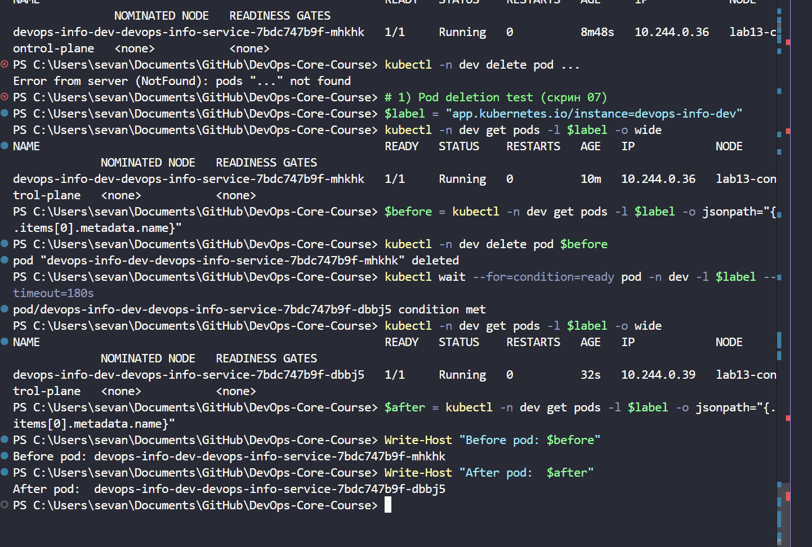
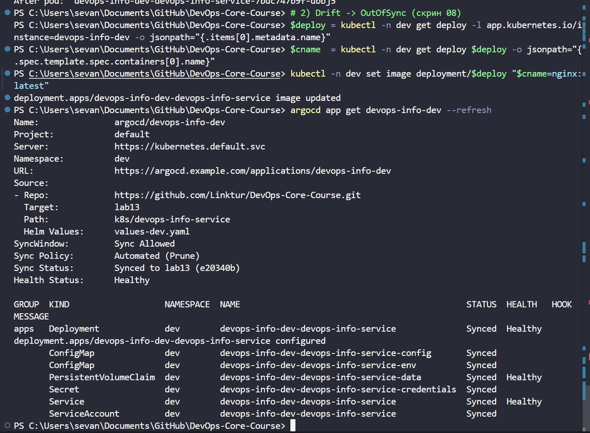
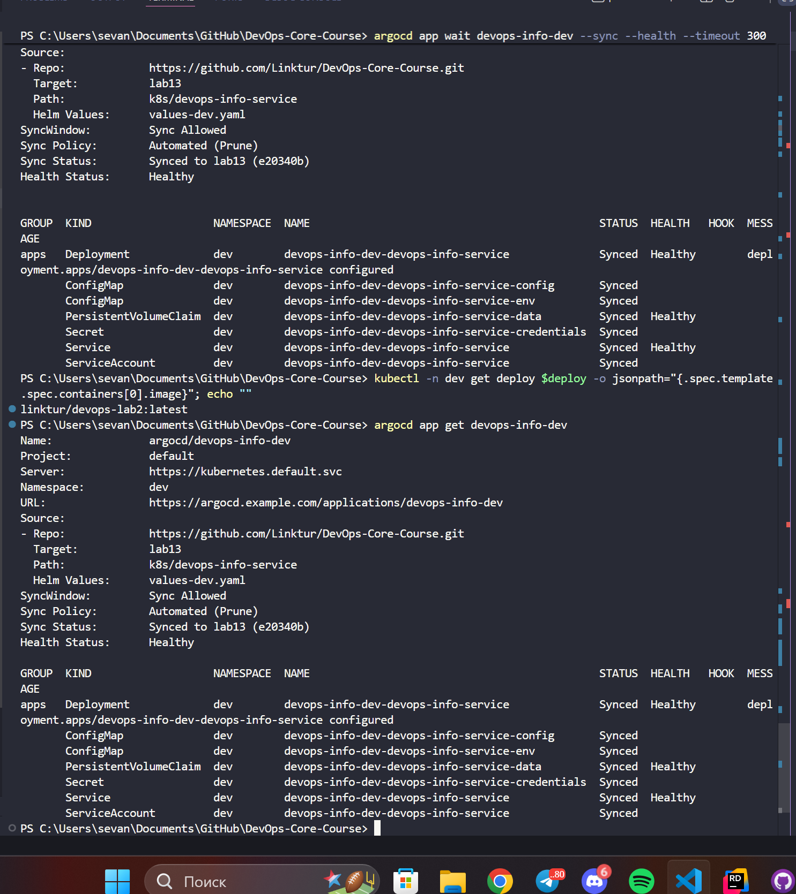

# Lab 13: GitOps with ArgoCD

## 1. ArgoCD Setup

I installed ArgoCD and checked CLI on Windows PowerShell.

Client versions:

```text
PS> helm version
version.BuildInfo{Version:"v4.1.4", ... KubeClientVersion:"v1.35"}

PS> argocd version --client
argocd: v3.3.8+7ae7d2c
  BuildDate: 2026-04-21T17:45:55Z
  Platform: windows/amd64
```

Install commands:

```bash
helm repo add argo https://argoproj.github.io/argo-helm
helm repo update

kubectl create namespace argocd
helm install argocd argo/argo-cd --namespace argocd

kubectl wait --for=condition=ready pod -l app.kubernetes.io/name=argocd-server -n argocd --timeout=180s
kubectl get pods -n argocd
```

UI and login:

```bash
kubectl port-forward svc/argocd-server -n argocd 8080:443
kubectl -n argocd get secret argocd-initial-admin-secret -o jsonpath="{.data.password}" | base64 -d
argocd login localhost:8080 --insecure
```

Login result:

```text
'admin:login' logged in successfully
Context 'localhost:8080' updated
```

## 2. Application Configuration

ArgoCD files are in `k8s/argocd/`:

- `application.yaml`: base app to `default`, manual sync.
- `application-dev.yaml`: dev app with `values-dev.yaml`, auto-sync on (`prune`, `selfHeal`).
- `application-prod.yaml`: prod app with `values-prod.yaml`, manual sync.
- `namespaces.yaml`: `dev` and `prod` namespaces.
- `applicationset.yaml`: bonus ApplicationSet file.

Source settings:

- `repoURL`: `https://github.com/Linktur/DevOps-Core-Course.git`
- `targetRevision`: `lab13`
- `path`: `k8s/devops-info-service`
- Helm values:
  - `values.yaml`
  - `values-dev.yaml`
  - `values-prod.yaml`

Destination settings:

- cluster: `https://kubernetes.default.svc`
- namespaces: `default`, `dev`, `prod`

Apply commands:

```bash
kubectl apply -f k8s/argocd/namespaces.yaml
kubectl apply -f k8s/argocd/application.yaml
kubectl apply -f k8s/argocd/application-dev.yaml
kubectl apply -f k8s/argocd/application-prod.yaml
```

Apply output:

```text
namespace/dev created
namespace/prod created
application.argoproj.io/devops-info created
application.argoproj.io/devops-info-dev created
application.argoproj.io/devops-info-prod created
```

There was one typo in the first run:

```text
kubectl apply -f k8s/argocd/application-prod.yamlargocd app list
```

It caused `Unexpected args: [app list]`.  
Then I applied `application-prod.yaml` again, correctly.

Sync and check commands:

```bash
argocd app list
argocd app sync devops-info
argocd app sync devops-info-dev
argocd app sync devops-info-prod

argocd app get devops-info
argocd app get devops-info-dev
argocd app get devops-info-prod
```

Final app state:

```text
PS> argocd app list
NAME                     CLUSTER                         NAMESPACE  PROJECT  STATUS  HEALTH       SYNCPOLICY
argocd/devops-info       https://kubernetes.default.svc  default    default  Synced  Healthy      Manual
argocd/devops-info-dev   https://kubernetes.default.svc  dev        default  Synced  Healthy      Auto-Prune
argocd/devops-info-prod  https://kubernetes.default.svc  prod       default  Synced  Progressing  Manual
```

## 3. Multi-Environment Design

Config differences:

| Parameter | Dev | Prod |
|---|---|---|
| ArgoCD app | `devops-info-dev` | `devops-info-prod` |
| Namespace | `dev` | `prod` |
| Helm values | `values-dev.yaml` | `values-prod.yaml` |
| Sync mode | Auto (`prune`, `selfHeal`) | Manual |
| Replica count | `1` | `5` |
| Service type | `NodePort` | `LoadBalancer` |
| Log level | `debug` | `warn` |

Why prod is manual:

- team can review changes first
- release time is controlled
- lower risk in production
- rollback is easier to plan

Namespace check:

```bash
kubectl get ns dev prod
kubectl get all -n dev
kubectl get all -n prod
```

Prod service state:

```text
PS> kubectl get svc -n prod
NAME                                   TYPE           CLUSTER-IP     EXTERNAL-IP   PORT(S)        AGE
devops-info-prod-devops-info-service   LoadBalancer   10.96.46.123   <pending>     80:30394/TCP   9m6s
```

`prod` is `Progressing` because this lab uses `kind` without an external load balancer.  
So `EXTERNAL-IP` stays `<pending>` for `LoadBalancer` service.

## 4. Self-Healing and Drift Tests

### 4.1 Manual scale drift (ArgoCD self-heal)

```bash
DEV_DEPLOY=$(kubectl -n dev get deploy -l app.kubernetes.io/instance=devops-info-dev -o jsonpath="{.items[0].metadata.name}")
kubectl -n dev get deploy "$DEV_DEPLOY" -o jsonpath="{.spec.replicas}{'\n'}"

kubectl -n dev scale deployment "$DEV_DEPLOY" --replicas=5
argocd app get devops-info-dev
kubectl -n dev get deploy "$DEV_DEPLOY" -w
```

Evidence:

```text
PS> Get-Date
Thursday, April 23, 2026 11:22:19 PM

PS> kubectl -n dev scale deployment devops-info-dev-devops-info-service --replicas=5
deployment.apps/devops-info-dev-devops-info-service scaled
```

Watch output:

```text
NAME                                  READY   UP-TO-DATE   AVAILABLE   AGE
devops-info-dev-devops-info-service   1/5     5            1           9m56s
devops-info-dev-devops-info-service   1/1     5            1           10m
devops-info-dev-devops-info-service   1/1     1            1           10m
```

Result:

- manual scale changed replicas to 5
- ArgoCD returned state to Git (`values-dev.yaml`, replicas=1)
- app went back to `Synced/Healthy`

### 4.2 Pod deletion (Kubernetes self-heal)

```bash
kubectl -n dev delete pod -l app.kubernetes.io/instance=devops-info-dev
kubectl -n dev get pods -w
```

Evidence:

```text
PS> Get-Date
Thursday, April 23, 2026 11:31:27 PM

PS> kubectl -n dev get pods -l app.kubernetes.io/instance=devops-info-dev -o wide
NAME                                                   READY   STATUS        AGE
devops-info-dev-devops-info-service-7bdc747b9f-n7qfv   1/1     Running       24s
devops-info-dev-devops-info-service-7bdc747b9f-pqxgb   1/1     Terminating   19m

PS> kubectl -n dev delete pod devops-info-dev-devops-info-service-7bdc747b9f-n7qfv
pod "devops-info-dev-devops-info-service-7bdc747b9f-n7qfv" deleted

PS> kubectl wait --for=condition=ready pod -n dev -l app.kubernetes.io/instance=devops-info-dev --timeout=180s
pod/devops-info-dev-devops-info-service-7bdc747b9f-mhkhk condition met
```

Before/after pod:

```text
Before pod: devops-info-dev-devops-info-service-7bdc747b9f-n7qfv
After pod:  devops-info-dev-devops-info-service-7bdc747b9f-mhkhk
```

Result:

- ReplicaSet recreated deleted pod automatically
- this is Kubernetes healing, not ArgoCD Git drift healing

### 4.3 Manual resource drift

```bash
kubectl -n dev label deploy "$DEV_DEPLOY" drift=test --overwrite
argocd app diff devops-info-dev
argocd app get devops-info-dev
```

Main drift evidence (image change):

```text
PS> Get-Date
Thursday, April 23, 2026 11:33:26 PM

PS> kubectl -n dev set image deployment/devops-info-dev-devops-info-service devops-info-service=nginx:latest
deployment.apps/devops-info-dev-devops-info-service image updated

Image immediately after manual change: nginx:latest
```

ArgoCD detected drift:

```text
PS> argocd app get devops-info-dev --refresh
Sync Status: OutOfSync from lab13 (e20340b)
Health Status: Progressing
```

After reconciliation:

```text
Image after ArgoCD reconciliation wait: linktur/devops-lab2:latest

PS> argocd app get devops-info-dev
Sync Status: Synced to lab13 (e20340b)
Health Status: Healthy
```

Result:

- manual change made app `OutOfSync`
- with `automated + selfHeal`, ArgoCD restored Git image

Diff command used:

```bash
argocd app diff devops-info-dev --hard-refresh
```

In this local setup, diff text was empty (exit code `0`) because reconciliation was very fast.  
Strong evidence is still clear:

- live image changed to `nginx:latest`
- app became `OutOfSync`
- image returned to `linktur/devops-lab2:latest`
- app returned to `Synced/Healthy`

### 4.4 Sync triggers and interval

ArgoCD sync is triggered by:

- Git polling (about every 3 minutes by default)
- Git webhook
- manual sync in UI/CLI
- self-heal loop (if enabled)

Kubernetes healing is triggered by:

- pod/container failure
- pod deletion (Deployment/ReplicaSet recreates pod)

## 5. Screenshots and Evidence

Screenshots folder: `k8s/lab13_images/`

Inserted screenshots:

1. `screen07.png` - pod deletion test



2. `screen08.png` - drift detected (`OutOfSync`)



3. `screen09.png` - self-heal complete (`Synced`)



Useful commands for evidence:

```bash
kubectl get pods -n argocd
argocd app list
argocd app get devops-info-dev
argocd app get devops-info-prod
argocd app diff devops-info-dev
```

Setup troubleshooting note:

- first there was `ComparisonError` (`repo-server :8081 connection refused`)
- after repo-server became stable, apps moved to `Synced`

## 6. Bonus: ApplicationSet

Bonus file: `k8s/argocd/applicationset.yaml`

Apply:

```bash
# optional cleanup of standalone apps first
kubectl delete -f k8s/argocd/application-dev.yaml --ignore-not-found
kubectl delete -f k8s/argocd/application-prod.yaml --ignore-not-found

kubectl apply -f k8s/argocd/applicationset.yaml
argocd app list
```

Pattern summary:

- List generator sets env params (`env`, `namespace`, `valuesFile`, `autoSync`)
- one template creates many apps
- `templatePatch` enables auto-sync only for `dev`

Why this is useful:

- less copy-paste
- easier to add more environments
- one place to manage repo/path/revision
- consistent app naming and policies
