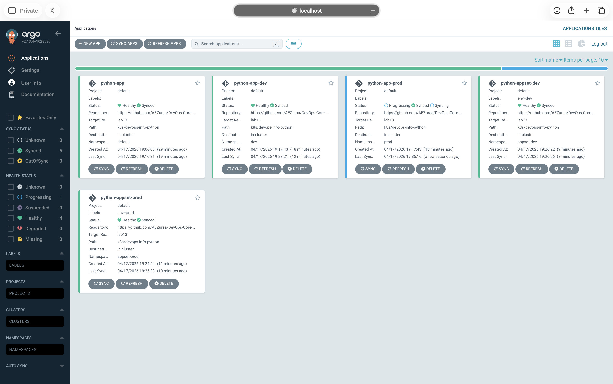
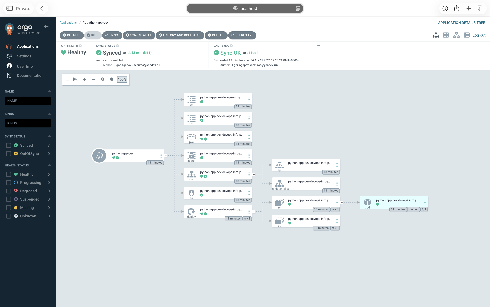
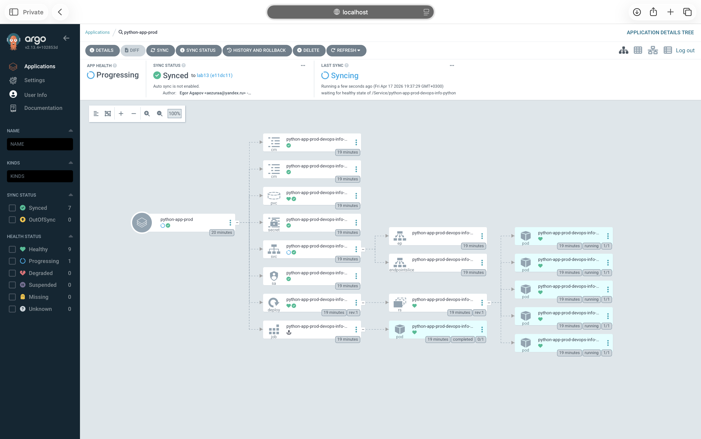
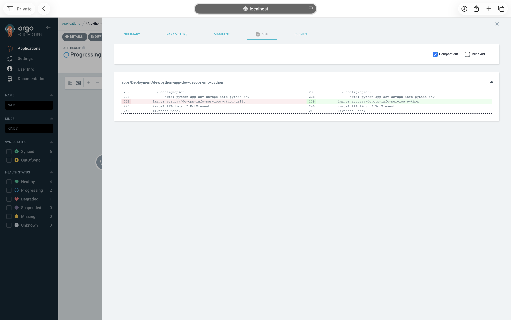
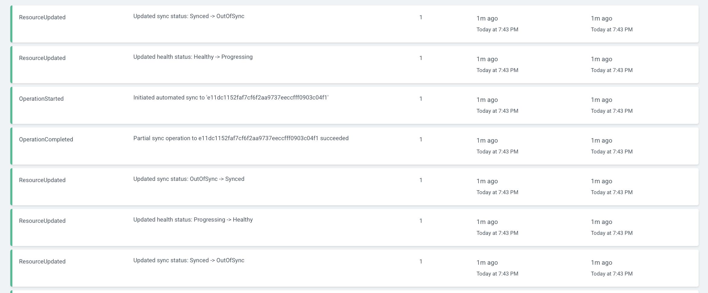

# ArgoCD GitOps — Lab 13

> GitOps continuous deployment for the `devops-info-python` Helm chart from Labs 10–12, managed by ArgoCD.

## Quick Facts

- **ArgoCD chart:** `argo/argo-cd` version `7.7.22` (ArgoCD server `v2.13.4`).
- **Cluster:** local minikube (Docker driver), namespace `argocd`.
- **Source repo:** `https://github.com/AEZuraa/DevOps-Core-Course.git`, branch `lab13`.
- **Helm chart:** `k8s/devops-info-python`.
- **Applications deployed:** `python-app` (default, manual), `python-app-dev` (dev, auto-sync + selfHeal + prune), `python-app-prod` (prod, manual), plus `python-appset-dev` and `python-appset-prod` generated by an `ApplicationSet`.

---

## 1. ArgoCD Setup

### 1.1 Install via Helm

```bash
helm repo add argo https://argoproj.github.io/argo-helm
helm repo update
kubectl create namespace argocd
helm install argocd argo/argo-cd \
  --namespace argocd \
  --version 7.7.22 \
  --set configs.params."server\.insecure"=true
kubectl -n argocd wait --for=condition=ready pod \
  -l app.kubernetes.io/name=argocd-server --timeout=300s
```

`server.insecure=true` lets the ArgoCD server accept HTTP from the port-forward, which matches the `argocd login … --plaintext` client flag. Without it, the `argocd` CLI negotiates gRPC over TLS through the port-forward and gets `gRPC connection not ready: context deadline exceeded`.

### 1.2 Access the UI

```bash
kubectl port-forward svc/argocd-server -n argocd 8080:80
```

Open `http://localhost:8080`, log in with `admin` and the initial password:

```bash
kubectl -n argocd get secret argocd-initial-admin-secret \
  -o jsonpath="{.data.password}" | base64 -d
```


### 1.3 Install and configure the CLI

```bash
brew install argocd
argocd login localhost:8080 --plaintext --username admin \
  --password "$(kubectl -n argocd get secret argocd-initial-admin-secret \
    -o jsonpath="{.data.password}" | base64 -d)"
argocd account get-user-info
```

---

## 2. Application Configuration

All three manifests live in [`k8s/argocd/`](argocd/). They share the same `repoURL`, `targetRevision: lab13`, and `path: k8s/devops-info-python`.

| Manifest | App name | Namespace | Values files | Sync policy |
|---|---|---|---|---|
| [`application.yaml`](argocd/application.yaml) | `python-app` | `default` | `values.yaml` | Manual |
| [`application-dev.yaml`](argocd/application-dev.yaml) | `python-app-dev` | `dev` | `values.yaml`, `values-dev.yaml` | `automated` + `prune` + `selfHeal` |
| [`application-prod.yaml`](argocd/application-prod.yaml) | `python-app-prod` | `prod` | `values.yaml`, `values-prod.yaml` | Manual |

Common sync option: `CreateNamespace=true` so ArgoCD creates `dev` / `prod` on first sync.

### Values per environment

| | default | dev | prod |
|---|---|---|---|
| `replicaCount` | 3 | 2 *(bumped from 1 to exercise the GitOps workflow in §5)* | 5 |
| `resources.requests` | 100m / 128Mi | 50m / 64Mi | 200m / 256Mi |
| `resources.limits` | 200m / 256Mi | 100m / 128Mi | 500m / 512Mi |
| `service.type` | NodePort | NodePort | LoadBalancer |
| `service.nodePort` | 30080 | 30081 | — |

Dev uses nodePort `30081` (bumped from `30080`) so `python-app` and `python-app-dev` can coexist on the same minikube node.

### Deploy and sync

```bash
kubectl apply -f k8s/argocd/application.yaml \
              -f k8s/argocd/application-dev.yaml \
              -f k8s/argocd/application-prod.yaml

argocd app sync python-app          # manual: default
argocd app sync python-app-prod     # manual: prod
# python-app-dev syncs automatically
```

Local image build (minikube can't pull `linux/arm64` from Docker Hub):

```bash
docker build -t aezuraa/devops-info-service:python app_python/
minikube image load aezuraa/devops-info-service:python
```

All five Applications (three individual + two from the ApplicationSet in §6) visible in the UI:



From the CLI:

```
$ argocd app list
NAME                       NAMESPACE    PROJECT  STATUS  HEALTH       SYNCPOLICY  TARGET
argocd/python-app          default      default  Synced  Healthy      Manual      lab13
argocd/python-app-dev      dev          default  Synced  Healthy      Auto-Prune  lab13
argocd/python-app-prod     prod         default  Synced  Progressing  Manual      lab13
argocd/python-appset-dev   appset-dev   default  Synced  Healthy      Auto-Prune  lab13
argocd/python-appset-prod  appset-prod  default  Synced  Healthy      Manual      lab13
```

All five Applications point to `repoURL: https://github.com/AEZuraa/DevOps-Core-Course.git`, `path: k8s/devops-info-python`. `python-app-prod` shows `Progressing` only because its `LoadBalancer` Service waits for an external IP in minikube without `minikube tunnel` — the Deployment itself is `Synced / Healthy`.

---

## 3. Multi-Environment

### Sync-policy rationale

| Stage | Policy | Why |
|---|---|---|
| **dev** | `automated` + `prune` + `selfHeal` | Fast feedback. Every push lands within the 3-minute reconcile interval, manual `kubectl` changes get reverted so the cluster matches Git, deleted objects are pruned. |
| **prod** | Manual | Human review of the diff before release. Change is staged in Git, an operator runs `argocd app sync python-app-prod` after approval. Rollback = `git revert` + sync. |

### Namespace separation

- `dev` — single replica, tight resource requests, NodePort 30081.
- `prod` — five replicas, bigger requests, LoadBalancer (pending external IP in plain minikube; use `minikube tunnel` to expose).

Resources live in distinct namespaces, so secrets / configmaps / PVCs do not collide.

### UI — resource tree per environment

Dev (auto-sync, 2 replicas):



Prod (manual sync, 5 replicas):



### Pod inventory per environment

```
$ kubectl get pods -n default
NAME                                             READY   STATUS    RESTARTS   AGE
python-app-devops-info-python-67f5458c7c-6qbxh   1/1     Running   0          53m
python-app-devops-info-python-67f5458c7c-l5wqv   1/1     Running   0          53m
python-app-devops-info-python-67f5458c7c-qzjsf   1/1     Running   0          53m

$ kubectl get pods -n dev
NAME                                                READY   STATUS    RESTARTS   AGE
python-app-dev-devops-info-python-855bd58b5-2kwxt   1/1     Running   0          64m
python-app-dev-devops-info-python-855bd58b5-hx9bk   1/1     Running   0          9m17s

$ kubectl get pods -n prod
NAME                                                   READY   STATUS      RESTARTS   AGE
python-app-prod-devops-info-python-699f869975-bxcwj    1/1     Running     0          51m
python-app-prod-devops-info-python-699f869975-q476z    1/1     Running     0          51m
python-app-prod-devops-info-python-699f869975-rwrzw    1/1     Running     0          51m
python-app-prod-devops-info-python-699f869975-w7r2t    1/1     Running     0          51m
python-app-prod-devops-info-python-699f869975-xncsf    1/1     Running     0          51m
python-app-prod-devops-info-python-pre-install-xbqxv   0/1     Completed   0          51m
```

`default`, `dev`, and `prod` have 3 / 2 / 5 running pods — matching `replicaCount` in `values.yaml`, `values-dev.yaml` (bumped from 1 to 2 during the GitOps test in §5), and `values-prod.yaml` respectively. The `pre-install` Completed pod in `prod` is a finished Helm `PreSync` hook Job.

### ArgoCD `app get` per environment

```
$ argocd app get python-app-dev
Name:               argocd/python-app-dev
Namespace:          dev
Source:
- Repo:             https://github.com/AEZuraa/DevOps-Core-Course.git
  Target:           lab13
  Path:             k8s/devops-info-python
  Helm Values:      values.yaml,values-dev.yaml
Sync Policy:        Automated (Prune)
Sync Status:        Synced to lab13 (ccac837)
Health Status:      Healthy

GROUP  KIND                   NAMESPACE  NAME                                      STATUS  HEALTH
apps   Deployment             dev        python-app-dev-devops-info-python         Synced  Healthy
       ConfigMap              dev        python-app-dev-devops-info-python-config  Synced
       ConfigMap              dev        python-app-dev-devops-info-python-env     Synced
       PersistentVolumeClaim  dev        python-app-dev-devops-info-python-data    Synced  Healthy
       Secret                 dev        python-app-dev-devops-info-python-secret  Synced
       Service                dev        python-app-dev-devops-info-python         Synced  Healthy
       ServiceAccount         dev        python-app-dev-devops-info-python         Synced
```

```
$ argocd app get python-app-prod
Name:               argocd/python-app-prod
Namespace:          prod
Source:
- Repo:             https://github.com/AEZuraa/DevOps-Core-Course.git
  Target:           lab13
  Path:             k8s/devops-info-python
  Helm Values:      values.yaml,values-prod.yaml
Sync Policy:        Manual
Sync Status:        Synced to lab13 (ccac837)   ← prod renders the same output at ccac837 (only values-dev.yaml changed)
Health Status:      Progressing

GROUP  KIND                   NAMESPACE  NAME                                            STATUS     HEALTH        HOOK
batch  Job                    prod       python-app-prod-devops-info-python-pre-install  Succeeded                PreSync
       ServiceAccount         prod       python-app-prod-devops-info-python              Synced
       Secret                 prod       python-app-prod-devops-info-python-secret       Synced
       ConfigMap              prod       python-app-prod-devops-info-python-config       Synced
       ConfigMap              prod       python-app-prod-devops-info-python-env          Synced
       PersistentVolumeClaim  prod       python-app-prod-devops-info-python-data         Synced     Healthy
       Service                prod       python-app-prod-devops-info-python              Synced     Progressing
apps   Deployment             prod       python-app-prod-devops-info-python              Synced     Healthy
```

Dev has `Sync Policy: Automated (Prune)` with `selfHeal` enabled; Prod stays `Manual`.

### Deployment workflow

```
                                Git (branch: lab13)
                                       │
                       ┌───────────────┴───────────────┐
                       │                               │
                   reconcile                       reconcile
                   every 3m                        every 3m
                       │                               │
                       ▼                               ▼
              python-app-dev                   python-app-prod
              auto-sync ✓                      manual sync
              selfHeal  ✓                      (operator: argocd app sync)
              prune     ✓
                       │                               │
                       ▼                               ▼
                namespace: dev                namespace: prod
                replicas: 2                   replicas: 5
```

---

## 4. Self-Healing Evidence

All tests were run against `python-app-dev` (dev, auto-sync + selfHeal).

### 4.1 Manual scale test

```
$ date -u +%FT%TZ
2026-04-17T16:21:29Z
$ kubectl get deployment python-app-dev-devops-info-python -n dev -o jsonpath='{.spec.replicas}'
1
$ kubectl scale deployment python-app-dev-devops-info-python -n dev --replicas=5
deployment.apps/python-app-dev-devops-info-python scaled
# pods observed: 1 Running + 4 ContainerCreating/Pending
# poll every 3s:
2026-04-17T16:21:37Z - replicas: 1   ← ArgoCD reverted in under 10 s
```

ArgoCD detected that `.spec.replicas=5` diverged from Git (`values-dev.yaml: replicaCount=1`) and patched the deployment back within the next reconcile (selfHeal runs right after detection).

### 4.2 Pod deletion test

```
$ date -u +%FT%TZ
2026-04-17T16:21:59Z
$ kubectl delete pod -n dev python-app-dev-devops-info-python-855bd58b5-dfffv
pod "…dfffv" deleted from dev namespace
# 0 s later
python-app-dev-devops-info-python-855bd58b5-2kwxt  1/1 Running  31s
```

A replacement pod appeared immediately — but this is **Kubernetes**, not ArgoCD. The Deployment controller reconciles its ReplicaSet against the desired replica count. ArgoCD does not see drift here because the Deployment spec never changed; only the pod set did, and pods are owned by the ReplicaSet.

### 4.3 Configuration drift test (container image)

```
$ date -u +%FT%TZ
2026-04-17T16:23:20Z
$ kubectl get deployment python-app-dev-devops-info-python -n dev \
    -o jsonpath='{.spec.template.spec.containers[0].image}'
aezuraa/devops-info-service:python
$ kubectl set image deployment/python-app-dev-devops-info-python -n dev \
    devops-info-python=aezuraa/devops-info-service:python-drift
deployment.apps/python-app-dev-devops-info-python image updated
# poll every 3s:
2026-04-17T16:23:23Z - image: aezuraa/devops-info-service:python   ← self-healed in ~3 s
```

`.spec.template.spec.containers[0].image` is a field rendered by the chart, so ArgoCD tracks it and reverts the change.





Note: a drift that is **additive and ignored** by the managed-fields owner (e.g. `kubectl label deployment … drift-test=manual`) is *not* treated as drift. ArgoCD compares its own rendered manifest to the live object via strategic merge; extra labels added outside the controlled set are merged, not reverted. This is [documented behavior](https://argo-cd.readthedocs.io/en/stable/user-guide/diffing/).

### 4.4 K8s self-healing vs ArgoCD self-healing

| | Kubernetes | ArgoCD |
|---|---|---|
| **Scope** | pods / replicas (RS, Deployment) | any resource ArgoCD tracks |
| **Trigger** | `ownerReferences` + controller reconcile | poll Git (default 3 min) + webhook + explicit `refresh` |
| **Example fix** | pod dies → RS creates a new one | `kubectl set image` → ArgoCD re-applies rendered manifest |
| **Source of truth** | the resource's `.spec` in etcd | Git (rendered Helm output) |

### 4.5 What triggers an ArgoCD sync?

1. **Reconcile timer** — default `timeout.reconciliation=3m` (polls repo, re-renders, compares).
2. **Explicit refresh** — `argocd app refresh <name>` or the UI "Refresh" button forces an immediate diff.
3. **Webhook** — a GitHub/GitLab webhook hitting `/api/webhook` fires an instant sync (configured on the `argocd-server` service).
4. **Manual sync** — `argocd app sync <name>` applies the diff immediately, regardless of drift.
5. **Self-heal** — with `automated.selfHeal=true`, any detected drift kicks off a sync on the next reconcile.

---

## 5. GitOps Workflow Test

The full round-trip with `python-app-dev` (auto-sync enabled):

```bash
# 1. Make a change locally
sed -i '' 's/^replicaCount: 1$/replicaCount: 2/' \
    k8s/devops-info-python/values-dev.yaml

# 2. Commit + push
git add k8s/devops-info-python/values-dev.yaml
git commit -m "chore(dev): bump dev replicas to 2"
git push origin lab13

# 3. Wait for reconcile OR force refresh (hard-refresh busts the repo-server cache)
argocd app get python-app-dev --hard-refresh

# 4. Observe
argocd app get python-app-dev | grep -E "Sync Status|Revision"
kubectl get deployment python-app-dev-devops-info-python -n dev \
    -o jsonpath='{.spec.replicas}'; echo
```

### Live run

Starting point: dev was synced to the previous commit `e11dc11` with 1 replica. After pushing `ccac837` (the commit that flips `replicaCount: 1 → 2` in `values-dev.yaml`):

```
$ argocd app get python-app-dev | grep -E "Sync Status|Health"
Sync Status:        Synced to lab13 (e11dc11)   ← repo-server cache, Git already has ccac837
Health Status:      Healthy

$ argocd app get python-app-dev --hard-refresh | grep -E "Sync Status|Health"
Sync Status:        OutOfSync from lab13 (ccac837)   ← drift detected
Health Status:      Healthy

# automated sync kicks in ~13 s later
2026-04-17T17:17:37Z | Synced to lab13 (ccac837) | replicas=2 pods=1
2026-04-17T17:17:42Z | Synced to lab13 (ccac837) | replicas=2 pods=2

$ argocd app history python-app-dev
ID  DATE                           REVISION
0   2026-04-17 19:19:25 +0300 MSK  lab13 (e11dc11)   ← initial sync
1   2026-04-17 19:21:04 +0300 MSK  lab13 (e11dc11)   ← re-sync after Application spec edit
2   2026-04-17 20:17:59 +0300 MSK  lab13 (ccac837)   ← GitOps sync triggered by push
```

End state — two pods in dev, both from the new ReplicaSet:

```
$ kubectl get pods -n dev
NAME                                                READY   STATUS    RESTARTS   AGE
python-app-dev-devops-info-python-855bd58b5-2kwxt   1/1     Running   0          64m
python-app-dev-devops-info-python-855bd58b5-hx9bk   1/1     Running   0          9m17s
```

Why `--hard-refresh` was needed: `argocd app refresh` only re-runs the diff against the cached checkout; `--hard-refresh` additionally forces the repo-server to re-clone and pick up the new commit. In production a GitHub webhook on `/api/webhook` makes this instant, and the 3-minute reconcile timer would pick it up anyway within `timeout.reconciliation`.

For `python-app-prod` (manual) the same push would produce `Sync Status: OutOfSync` until an operator runs `argocd app sync python-app-prod` — only if the push changes something rendered by `values.yaml` or `values-prod.yaml`. The `ccac837` commit only touched `values-dev.yaml`, so prod renders identically and stays `Synced` after the hard-refresh. To force a manual-sync demo, change a field used by prod (e.g. bump `replicaCount` in `values-prod.yaml`) and observe `python-app-prod` go OutOfSync.

---

## 6. ApplicationSet (Bonus)

[`k8s/argocd/applicationset.yaml`](argocd/applicationset.yaml) uses the **List generator** to render two Applications from one template.

### Why ApplicationSet over individual Applications

| | Individual `Application` | `ApplicationSet` |
|---|---|---|
| Lines of YAML | 3 files × ~25 lines | 1 file × ~50 lines |
| Adding a new env | copy-paste a new file | add one list element |
| Per-env overrides | full spec duplicated | element parameters + `templatePatch` |
| Scaling to N envs / clusters | O(N) edits | O(1) template |

### Generator types (when to use which)

- **List** — small, explicit env set (what we use here: dev / prod).
- **Cluster** — one app per registered cluster (fan-out a monitoring stack across staging/prod clusters).
- **Git Directory** — monorepo where each subdirectory is a chart; the generator watches `k8s/*` and creates an app per folder.
- **Git Files** — each file matching a glob (e.g. `environments/*.yaml`) produces one Application with that file's parameters.
- **Matrix** — Cartesian product of two generators (e.g. Clusters × Git Files).
- **Merge** — element-wise merge (e.g. Cluster generator + per-cluster overrides file).

### Per-env divergence

`templatePatch` uses Go templating to inject the `automated` sync policy only for `env == dev`:

```yaml
templatePatch: |
  {{- if eq .env "dev" }}
  spec:
    syncPolicy:
      automated:
        prune: true
        selfHeal: true
      syncOptions:
        - CreateNamespace=true
  {{- end }}
```

Helm parameter overrides force `service.type=ClusterIP` (and clear `nodePort`) so the generated apps can coexist with `python-app-dev`/`python-app-prod` on the same cluster without port collisions.

### Result

```
$ argocd appset list
NAME                   PROJECT  SYNCPOLICY  CONDITIONS
argocd/python-app-set  default  nil         [{ParametersGenerated Successfully generated parameters for all Applications … True ParametersGenerated}
                                             {ResourcesUpToDate ApplicationSet up to date … True ApplicationSetUpToDate}]
```

```
$ argocd app list | awk 'NR==1 || /appset/'
NAME                       NAMESPACE    SYNCPOLICY  STATUS  HEALTH
argocd/python-appset-dev   appset-dev   Auto-Prune  Synced  Healthy
argocd/python-appset-prod  appset-prod  Manual      Synced  Healthy
```

Matching pod inventory:

```
$ kubectl get pods -n appset-dev
NAME                                                    READY   STATUS    AGE
python-appset-dev-devops-info-python-5c6bb8fcc8-h6mts   1/1     Running   42m

$ kubectl get pods -n appset-prod
NAME                                                     READY   STATUS    AGE
python-appset-prod-devops-info-python-66d8d7d66f-8z5kn   1/1     Running   44m
python-appset-prod-devops-info-python-66d8d7d66f-bvp8h   1/1     Running   44m
python-appset-prod-devops-info-python-66d8d7d66f-fs6km   1/1     Running   44m
python-appset-prod-devops-info-python-66d8d7d66f-hxvtl   1/1     Running   44m
python-appset-prod-devops-info-python-66d8d7d66f-wmzk6   1/1     Running   44m
```

Deleting `applicationset.yaml` cascades-deletes both generated Applications (and their resources, thanks to `resources-finalizer.argocd.argoproj.io` inherited via the template).

---

## 7. Verification Commands

```bash
# Status
argocd app list
argocd appset list
kubectl get pods -A | grep -E 'argocd|default|dev|prod|appset'

# Dev replicas (2 from values-dev.yaml)
kubectl get deploy -n dev -o jsonpath='{.items[0].spec.replicas}'; echo

# Prod replicas (5 from values-prod.yaml)
kubectl get deploy -n prod -o jsonpath='{.items[0].spec.replicas}'; echo

# Force reconcile and print sync status
argocd app refresh python-app-dev
argocd app get python-app-dev | grep -E 'Sync Status|Health Status'
```
