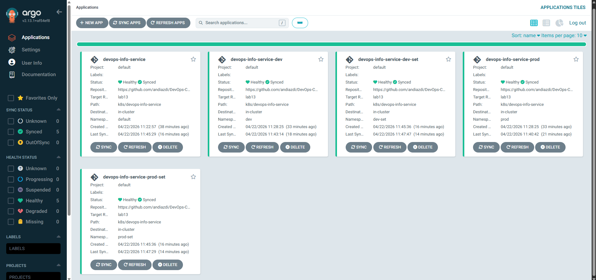
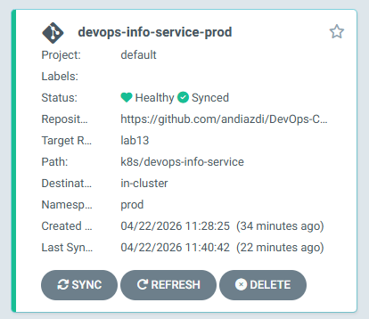
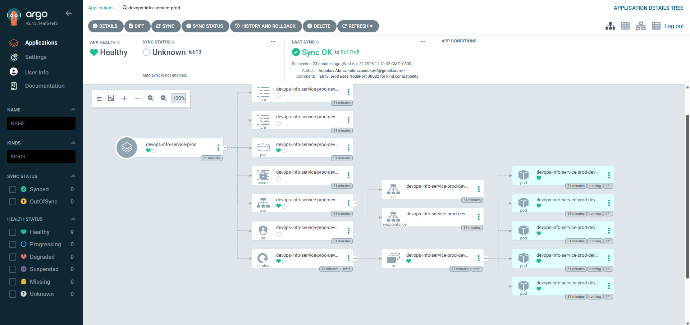

## ArgoCD Setup

### Installation verification

Installed via the upstream Helm chart `argo/argo-cd 7.7.7` (ArgoCD server
`v2.13.1`):

```bash
helm repo add argo https://argoproj.github.io/argo-helm
helm repo update
kubectl create namespace argocd
helm install argocd argo/argo-cd -n argocd \
  --version 7.7.7 --set crds.install=true
kubectl wait --for=condition=ready pod \
  -l app.kubernetes.io/name=argocd-server -n argocd --timeout=120s
```

```text
$ kubectl get pods -n argocd
NAME                                                READY   STATUS    RESTARTS   AGE
argocd-application-controller-0                     1/1     Running   0          31m
argocd-applicationset-controller-66d4866ddc-26dl4   1/1     Running   0          31m
argocd-dex-server-85c96ccbb-zg8j9                   1/1     Running   0          31m
argocd-notifications-controller-86d9b55cdb-p5k4v    1/1     Running   0          31m
argocd-redis-5dc67d8f78-rcsgf                       1/1     Running   0          31m
argocd-repo-server-7d5bc74b9f-9ngpp                 1/1     Running   0          31m
argocd-server-777bf5c6d4-b7r8c                      1/1     Running   0          26m
```

### UI access method

The default chart serves HTTPS on the `argocd-server` container, but
`argocd login` over `kubectl port-forward` fails to upgrade gRPC over the
SPDY tunnel. The standard remediation is to switch the server to
*insecure* mode and terminate TLS at the port-forward / ingress:

```bash
kubectl -n argocd patch configmap argocd-cmd-params-cm --type merge \
  -p '{"data":{"server.insecure":"true"}}'
kubectl -n argocd rollout restart deployment argocd-server

kubectl port-forward --address 0.0.0.0 svc/argocd-server -n argocd 18080:80
# UI: http://localhost:18080
```

Initial admin password:

```bash
kubectl -n argocd get secret argocd-initial-admin-secret \
  -o jsonpath='{.data.password}' | base64 -d
```

### CLI configuration

```bash
curl -sLo /usr/local/bin/argocd \
  https://github.com/argoproj/argo-cd/releases/latest/download/argocd-linux-amd64
chmod +x /usr/local/bin/argocd

argocd login localhost:18080 --plaintext \
  --username admin --password '<initial-password>'
# 'admin:login' logged in successfully

argocd account get-user-info
# Logged In: true
# Username: admin
# Issuer: argocd
```

---

## Application Configuration

All four manifests live under [`k8s/argocd/`](./argocd):

| File | Sync policy | Namespace | values |
|------|-------------|-----------|--------|
| `application.yaml` | Manual | `default` | `values.yaml` |
| `application-dev.yaml` | Automated (prune + selfHeal) | `dev` | `values.yaml` + `values-dev.yaml` |
| `application-prod.yaml` | Manual | `prod` | `values.yaml` + `values-prod.yaml` |
| `applicationset.yaml` | List generator (per-env policy) | `dev-set`, `prod-set` | per environment |

Base manifest [`application.yaml`](./argocd/application.yaml):

```yaml
apiVersion: argoproj.io/v1alpha1
kind: Application
metadata:
  name: devops-info-service
  namespace: argocd
  finalizers:
    - resources-finalizer.argocd.argoproj.io
spec:
  project: default
  source:
    repoURL: https://github.com/andiazdi/DevOps-Core-Course.git
    targetRevision: lab13
    path: k8s/devops-info-service
    helm:
      releaseName: devops-info-service
      valueFiles:
        - values.yaml
  destination:
    server: https://kubernetes.default.svc
    namespace: default
  syncPolicy:
    syncOptions:
      - CreateNamespace=true
      - ServerSideApply=true
```

* **Source** - the chart in this repo (`k8s/devops-info-service` on the
  `lab13` branch). Helm `valueFiles` selects which values overlay to use.
* **Destination** - the in-cluster API server (`https://kubernetes.default.svc`)
  and a per-app target namespace.
* **`finalizers: resources-finalizer.argocd.argoproj.io`** - cascade
  delete cluster resources when the `Application` itself is deleted.
* **`ServerSideApply=true`** - the chart contains immutable fields
  (e.g. `Service.spec.clusterIP`) that legacy three-way merge sometimes
  refuses to update.

Initial sync (manual app):

```text
$ argocd app sync devops-info-service
Sync Status:        Synced to lab13 (a5c09c5)
Health Status:      Healthy
Phase:              Succeeded   Duration: 21s

GROUP  KIND                   NAMESPACE  NAME                                STATUS     HEALTH   HOOK
batch  Job                    default    ...-pre-install                     Succeeded           PreSync
       ServiceAccount         default    ...-sa                              Synced
       Secret                 default    ...-secret                          Synced
       ConfigMap              default    ...-config                          Synced
       ConfigMap              default    ...-env                             Synced
       PersistentVolumeClaim  default    ...-data                            Synced     Healthy
       Service                default    ...                                 Synced     Healthy
apps   Deployment             default    ...                                 Synced     Healthy
batch  Job                    default    ...-post-install                    Succeeded           PostSync
```

GitOps drift workflow on the manual app: `replicaCount: 1 → 2` in
`values.yaml`, commit, push → ArgoCD reports `OutOfSync from lab13
(ed1e549)` after `argocd app get --refresh`; manual `argocd app sync`
brings cluster state to `replicas: 2 | available: 2`.

---

## Multi-Environment

### Namespace separation

Each environment owns its own namespace; ArgoCD provisions the workload
inside it:

```bash
kubectl create namespace dev
kubectl create namespace prod
```

### Dev vs Prod configuration differences

Both Apps point at the same chart and branch but layer different values
files:

| Setting                             | `dev` (`values-dev.yaml`) | `prod` (`values-prod.yaml`) |
|-------------------------------------|---------------------------|-----------------------------|
| `replicaCount`                      | 1                         | 5                           |
| `image.tag`                         | `latest`                  | `1.0.0`                     |
| `image.pullPolicy`                  | `Always`                  | `IfNotPresent`              |
| `service.nodePort`                  | 30081                     | 30082                       |
| `resources.limits.cpu`              | 100m                      | 500m                        |
| `resources.limits.memory`           | 128Mi                     | 512Mi                       |
| `livenessProbe.initialDelaySeconds` | 5                         | 30                          |

### Sync policy differences and rationale

`application-dev.yaml`:

```yaml
syncPolicy:
  automated:
    prune: true
    selfHeal: true
  syncOptions:
    - CreateNamespace=true
    - ServerSideApply=true
  retry:
    limit: 3
    backoff: { duration: 10s, factor: 2, maxDuration: 1m }
```

`application-prod.yaml` deliberately **omits** the `automated` block - a
sync only happens when a human runs `argocd app sync
devops-info-service-prod` (or clicks Sync in the UI).

Why manual for prod:

* **Change review** - a human approves what the cluster is about to do.
* **Release windows** - production rollouts can be timed (off-hours,
  after on-call hand-off, after a load-test, …).
* **Compliance** - SOX / ISO 27001 / SOC 2 controls usually require a
  documented approval per production change.
* **Blast-radius control** - manual sync forces an `argocd app diff`
  review and gives a chance to roll back via Git if a chart bug slipped
  through.

### Verification

```text
$ argocd app list
NAME                             NAMESPACE  STATUS  HEALTH   SYNCPOLICY
argocd/devops-info-service       default    Synced  Healthy  Manual
argocd/devops-info-service-dev   dev        Synced  Healthy  Auto-Prune
argocd/devops-info-service-prod  prod       Synced  Healthy  Manual

$ kubectl get pods -n dev | wc -l   # 1 replica
$ kubectl get pods -n prod | wc -l  # 5 replicas
```


## Self-Healing Evidence

All three tests below were run against `devops-info-service-dev`.

### Manual scale test (managed-field drift)

```text
Before scale at 2026-04-22T11:41:12+03:00
replicas: 1 | available: 1

Scaling deployment to 5 at 2026-04-22T11:41:13+03:00
post-scale replicas: 1                       # API already coerced

Reverted to 1 replica after 1s at 2026-04-22T11:41:13+03:00
final replicas: 1 | available: 1
```

`kubectl scale … --replicas=5` was effectively a no-op: the application
controller observed the Deployment update event, computed the diff
against the Helm-rendered manifest (`replicaCount: 1`) and re-applied the
canonical state within ~1 s.

### Pod deletion test

```text
Deleting pod ...-9cc87f6c7-f9429 at 2026-04-22T11:41:13+03:00
pod "...-f9429" deleted from dev namespace
Pods after deletion:
NAME                                                          READY   STATUS    RESTARTS   AGE
devops-info-service-dev-devops-info-service-9cc87f6c7-mjjtm   1/1     Running   0          12m
```

The replacement pod was created by Kubernetes itself: the Deployment →
ReplicaSet controller noticed `desired=1, current=0` and scheduled a new
one. ArgoCD did *nothing* here - no resource it manages actually drifted.

### Configuration drift test

**Attempt 1 - adding an unmanaged label** (`kubectl label deploy/...
drift=manual`). ArgoCD did **not** revert it. With server-side apply the
controller only owns the fields it itself wrote; a label that nobody
declared in Git is left alone, `argocd app diff` returned empty, and the
application stayed `Synced/Healthy`. This is the documented behaviour and
prevents fights with third-party mutators (Linkerd / Istio injectors,
Kiali, etc.).

**Attempt 2 - mutating a managed field** (`spec.template.spec.containers[0].image`):

```text
Image before drift at 2026-04-22T11:42:48+03:00:
andiazdi/lab02:latest
Patching image to nginx:alpine (drift!) at 2026-04-22T11:42:48+03:00
nginx:alpine

ArgoCD diff right after drift:
===== apps/Deployment dev/devops-info-service-dev-... ======
220c219
<         image: nginx:alpine
---
>         image: andiazdi/lab02:latest

Image after self-heal:
andiazdi/lab02:latest
```

Within the next reconciliation cycle the controller patched the image
back to `andiazdi/lab02:latest`; the
Application stayed `Synced/Healthy`.

### 4.4 Explanation of behaviours

| Event                                            | Source of truth | Reaction                                                                                                              |
|--------------------------------------------------|-----------------|-----------------------------------------------------------------------------------------------------------------------|
| Pod crash / delete                               | cluster         | **Kubernetes** restarts the pod via the ReplicaSet. ArgoCD does nothing - the manifest never changed.                 |
| `kubectl scale` / `set image` on a managed field | cluster         | **ArgoCD** reverts on the next reconciliation tick (selfHeal).                                                        |
| `git push` to `targetRevision`                   | repo            | App becomes `OutOfSync`. With `automated` it syncs immediately; with manual sync the operator runs `argocd app sync`. |
| New label/annotation outside the Helm template   | cluster         | Ignored by ArgoCD (server-side apply field-ownership).                                                                |

**What triggers an ArgoCD sync?** A managed field changing in the
cluster (informer event), a refresh of the Git revision, or an explicit
`argocd app sync` / UI click.

**Sync interval.** The application controller polls Git every 3 minutes
by default. For in-cluster
events the controller subscribes to API-server informers, so drift on a
managed field is observed almost immediately (Test 4.1 - 1 s round trip).
Sub-minute Git latency requires a webhook pointing at
`https://<argocd>/api/webhook`.


## Screenshots




---

## Bonus - ApplicationSet

### Manifest

[`applicationset.yaml`](./argocd/applicationset.yaml) replaces the two
hand-written `application-dev.yaml` / `application-prod.yaml` with a
single template + List generator:

```yaml
apiVersion: argoproj.io/v1alpha1
kind: ApplicationSet
metadata:
  name: devops-info-service-set
  namespace: argocd
spec:
  goTemplate: true
  goTemplateOptions: ["missingkey=error"]
  generators:
    - list:
        elements:
          - { env: dev,  namespace: dev-set,  valuesFile: values-dev.yaml,  nodePort: "30091", autoSync: "true"  }
          - { env: prod, namespace: prod-set, valuesFile: values-prod.yaml, nodePort: "30092", autoSync: "false" }
  template:
    metadata:
      name: 'devops-info-service-{{.env}}-set'
      finalizers: [resources-finalizer.argocd.argoproj.io]
    spec:
      project: default
      source:
        repoURL: https://github.com/andiazdi/DevOps-Core-Course.git
        targetRevision: lab13
        path: k8s/devops-info-service
        helm:
          releaseName: 'devops-info-service-{{.env}}-set'
          valueFiles:
            - values.yaml
            - '{{.valuesFile}}'
          parameters:
            - name: service.nodePort
              value: '{{.nodePort}}'
      destination:
        server: https://kubernetes.default.svc
        namespace: '{{.namespace}}'
      syncPolicy:
        syncOptions: [CreateNamespace=true, ServerSideApply=true]
  templatePatch: |
    spec:
      syncPolicy:
        {{- if eq .autoSync "true" }}
        automated:
          prune: true
          selfHeal: true
        {{- end }}
```

### Generator configuration

* **`list` generator** - static, in-line elements. Each element is a map
  whose keys (`env`, `namespace`, `valuesFile`, `nodePort`, `autoSync`)
  are interpolated into the template via Go templating
  (`goTemplate: true`).
* **`helm.parameters`** - overrides `service.nodePort` per environment
  (equivalent to `helm install --set service.nodePort=…`); keeps the two
  generated services from colliding on the same NodePort.
* **`templatePatch`** - strategic-merge style overlay applied *after* the
  template renders. The `{{- if eq .autoSync "true" }}` block injects the
  `automated` sync policy only for `dev`, leaving `prod` on manual sync -
  the same dev/prod policy split as Task 3.

After `kubectl apply -f k8s/argocd/applicationset.yaml` the controller
materialises two child Applications:

```text
$ kubectl get applicationset -n argocd
NAME                      AGE
devops-info-service-set   2m43s

$ argocd app list
NAME                                 NAMESPACE  STATUS  HEALTH   SYNCPOLICY
argocd/devops-info-service-dev-set   dev-set    Synced  Healthy  Auto-Prune
argocd/devops-info-service-prod-set  prod-set   Synced  Healthy  Manual
```

### Generated Applications


### Comparison with individual Applications

| Aspect                   | Hand-written Applications                | ApplicationSet                                                |
|--------------------------|------------------------------------------|---------------------------------------------------------------|
| Boilerplate              | 1 file per environment                   | 1 file for N environments                                     |
| Adding a new environment | copy + edit a YAML file                  | append one element to the generator                           |
| Cluster fan-out          | manual per cluster                       | `cluster` generator does it for free                          |
| Repository fan-out       | one file per app                         | `git directory/files` generator auto-discovers apps           |
| Conditional logic        | none - duplicate YAML                    | `templatePatch`, `valuesObject`, Go templating                |
| Lifecycle of children    | each Application managed individually    | ApplicationSet controller creates / updates / prunes children |
| When *not* to use it     | one-off / strongly per-env customisation | when every environment is genuinely unique                    |
