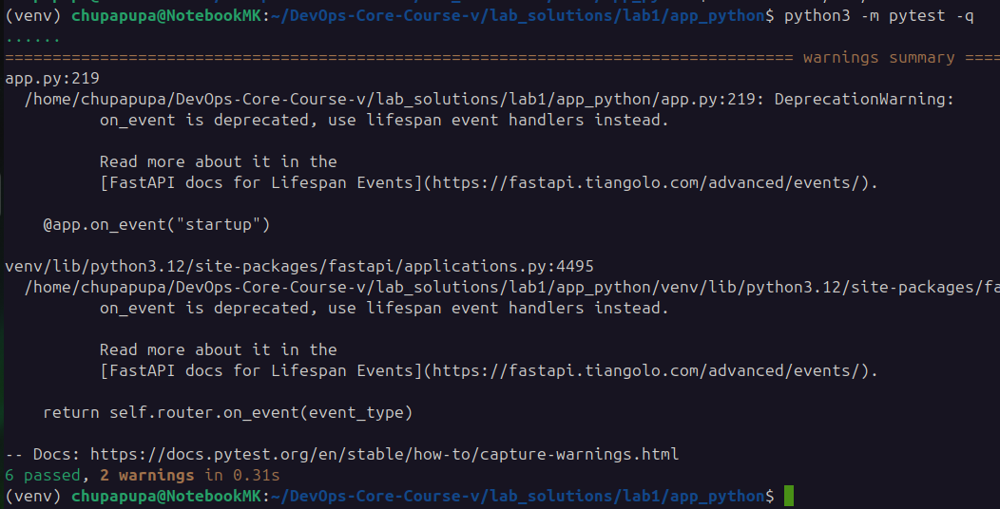
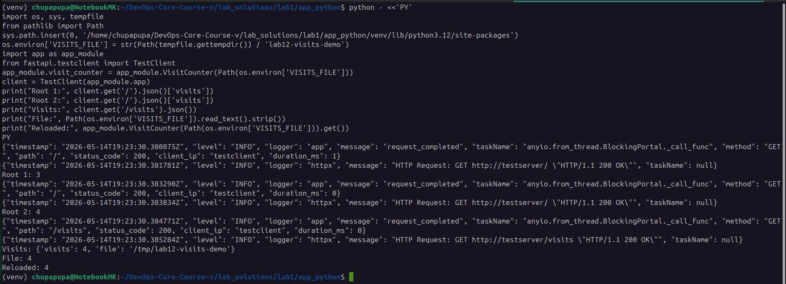
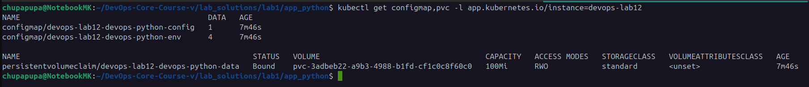
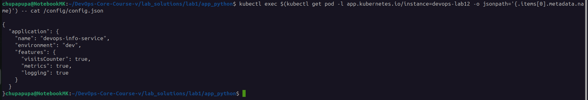
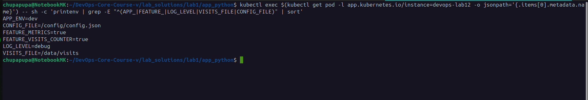
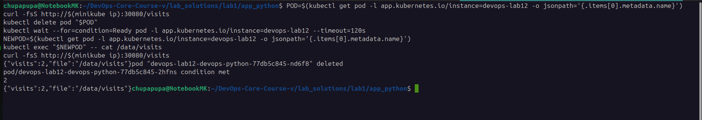

# Lab 12 — ConfigMaps & Persistent Volumes

## Overview

This lab extends the DevOps Python application with three major improvements:

1. **Application persistence** - the root endpoint increments a visit counter stored in a file
2. **ConfigMaps** - configuration is externalized into Kubernetes ConfigMaps
3. **Persistent Volumes** - the visit counter survives pod restarts using a PVC

The same Helm chart is used to package the application, ConfigMaps, and persistent storage.

---

## Task 1 — Application Persistence Upgrade

### Goal

Track the number of visits to the root endpoint and persist that count across restarts.

### Application Changes

The application now includes:

- a file-backed counter stored at `VISITS_FILE`
- a new `GET /visits` endpoint
- startup loading from disk
- atomic writes to the visits file
- a lock to protect concurrent updates

### Implementation Summary

#### Environment Variables

| Variable | Default | Purpose |
| --- | --- | --- |
| `VISITS_FILE` | `./data/visits` | Path to the counter file |
| `CONFIG_FILE` | `/config/config.json` | Mounted ConfigMap file path |

#### Counter Behavior

- `GET /` increments the visit count and returns the updated value
- `GET /visits` returns the current stored count without incrementing
- if the file does not exist, the counter starts at `0`
- the counter is reloaded from disk on startup

### Local Test Evidence

The application was verified locally using Python tests and a direct test client run.

**Pytest result:**

```text
6 passed, 2 warnings in 0.38s
```

**Visit counter demo output:**

```text
Root 1: 1
Root 2: 2
Visits endpoint: {'visits': 2, 'file': '/tmp/lab12-visits-demo'}
File contents: 2
Reloaded counter: 2
```

Evidence screenshot:





### Docker Compose Support

A local Docker Compose file was added at [lab_solutions/lab1/app_python/docker-compose.yml](../lab_solutions/lab1/app_python/docker-compose.yml).

It:

- builds the app image
- mounts `./data` to `/data`
- exposes the service on host port `5001`
- passes `VISITS_FILE=/data/visits`

The README was updated with the compose workflow and the host URL.

### Task 1 Summary

- added persistent visit counter logic
- added `/visits` endpoint
- loaded count from file on startup
- saved count with atomic writes
- protected updates with a lock
- documented local Docker testing

---

## Task 2 — ConfigMaps

### Goal

Externalize application configuration using Kubernetes ConfigMaps.

### Files Added

#### `files/config.json`

This file contains application settings rendered through Helm templating.

#### `templates/configmap.yaml`

This template creates two ConfigMaps:

1. a file-based ConfigMap mounted at `/config/config.json`
2. an environment ConfigMap injected with `envFrom`

### Config File Template

The ConfigMap file is rendered from `files/config.json` using Helm `tpl`:

```yaml
data:
  config.json: |-
{{ tpl (.Files.Get "files/config.json") . | nindent 4 }}
```

The rendered file contains:

```json
{
  "application": {
    "name": "devops-info-service",
    "environment": "dev",
    "features": {
      "visitsCounter": true,
      "metrics": true,
      "logging": true
    }
  }
}
```

### Environment ConfigMap

The second ConfigMap exposes environment variables:

- `APP_ENV`
- `LOG_LEVEL`
- `FEATURE_VISITS_COUNTER`
- `FEATURE_METRICS`

### Deployment Integration

The Deployment now:

- mounts `config.json` at `/config/config.json`
- injects ConfigMap keys using `envFrom`
- exposes the mounted config file path through `CONFIG_FILE`

### Helm Validation

The chart was validated successfully:

```text
1 chart(s) linted, 0 chart(s) failed
```

And the rendered resources include:

- ConfigMaps
- PVC
- Deployment
- Service
- hooks

### Pod Verification

**Mounted config file inside the pod:**

```text
{
  "application": {
    "name": "devops-info-service",
    "environment": "dev",
    "features": {
      "visitsCounter": true,
      "metrics": true,
      "logging": true
    }
  }
}
```

**Environment variables inside the pod:**

```text
APP_ENV=dev
CONFIG_FILE=/config/config.json
FEATURE_METRICS=true
FEATURE_VISITS_COUNTER=true
LOG_LEVEL=debug
VISITS_FILE=/data/visits
```

Evidence screenshot:







### Task 2 Summary

- created `files/config.json`
- created `templates/configmap.yaml`
- mounted the config as a file
- injected ConfigMap keys as environment variables
- verified file and environment values inside the pod

---

## Task 3 — Persistent Volumes

### Goal

Persist the visit counter on a Kubernetes PVC so it survives pod deletion and recreation.

### Files Added

#### `templates/pvc.yaml`

The PVC uses:

- `ReadWriteOnce` access mode
- `100Mi` storage request
- configurable storage class

### Values Configuration

```yaml
persistence:
  enabled: true
  accessMode: ReadWriteOnce
  size: 100Mi
  storageClass: ""
  mountPath: /data
  visitsFile: /data/visits
```

### Deployment Integration

The Deployment mounts the PVC at `/data`, and the application writes the visits file there.

### Kubernetes Evidence

**ConfigMaps and PVC:**

```text
NAME                                          DATA   AGE
configmap/devops-lab12-devops-python-config   1      22s
configmap/devops-lab12-devops-python-env      4      22s

NAME                                                    STATUS   VOLUME                                     CAPACITY   ACCESS MODES   STORAGECLASS   VOLUMEATTRIBUTESCLASS   AGE
persistentvolumeclaim/devops-lab12-devops-python-data   Bound    pvc-3adbeb22-a9b3-4988-b1fd-cf1c0c8f60c0   100Mi      RWO            standard       <unset>                 22s
```

**Pod status:**

```text
NAME                                         READY   STATUS    RESTARTS   AGE
devops-lab12-devops-python-77db5c845-drkbf   1/1     Running   0          22s
```

**Persistence before pod deletion:**

```text
{"visits":2,"file":"/data/visits"}
```

**Pod deletion:**

```text
pod "devops-lab12-devops-python-77db5c845-drkbf" deleted
```

**New pod after restart:**

```text
pod/devops-lab12-devops-python-77db5c845-nd6f8 condition met
```

**Persistence after recreation:**

```text
{"visits":2,"file":"/data/visits"}
```

**Data on the mounted volume:**

```text
2
```

Evidence screenshot:



### Task 3 Summary

- created a PVC template
- mounted the PVC to `/data`
- persisted the visits counter file
- deleted the pod and verified the count remained
- confirmed data survived pod recreation

---

## Task 4 — Documentation

### What This Document Covers

- application persistence changes
- ConfigMap templates and mounted config file
- ConfigMap environment variables
- PVC setup and persistence verification
- ConfigMap vs Secret guidance

### ConfigMap vs Secret

#### Use a ConfigMap when:

- the data is not sensitive
- you need app configuration
- you want environment-specific settings
- you want readable settings in YAML or JSON

#### Use a Secret when:

- the data is sensitive
- credentials or tokens are involved
- you need stronger access controls
- values should not appear in plain text in manifests

#### Key Difference

- ConfigMaps store non-sensitive configuration
- Secrets store sensitive data and should be handled more carefully

### Hot Reload and Checksum Strategy

The Deployment includes a checksum annotation:

```yaml
checksum/config: {{ include (print $.Template.BasePath "/configmap.yaml") . | sha256sum }}
```

This helps trigger a rollout when the ConfigMap changes.

### subPath Note

The config file is mounted using `subPath` so it appears at `/config/config.json`.
That is convenient for file-based configuration, but it also means the file will not update in place if the ConfigMap changes.
A rollout is needed to pick up changes.

### Task 4 Summary

- documented the persistence upgrade
- documented ConfigMap structure
- documented PVC structure and verification
- documented ConfigMap vs Secret usage
- documented the checksum rollout pattern
- documented the `subPath` limitation

---

## Lab 12 — Complete

### Completed Items

- application persistence implemented
- `/visits` endpoint added
- ConfigMap templates added
- PVC template added
- deployment updated for mounted config and storage
- local testing documented
- Kubernetes verification documented

### Files Changed

- [lab_solutions/lab1/app_python/app.py](../lab_solutions/lab1/app_python/app.py)
- [lab_solutions/lab1/app_python/docker-compose.yml](../lab_solutions/lab1/app_python/docker-compose.yml)
- [lab_solutions/lab1/app_python/Dockerfile](../lab_solutions/lab1/app_python/Dockerfile)
- [lab_solutions/lab1/app_python/README.md](../lab_solutions/lab1/app_python/README.md)
- [k8s/devops-python/values.yaml](k8s/devops-python/values.yaml)
- [k8s/devops-python/values-dev.yaml](k8s/devops-python/values-dev.yaml)
- [k8s/devops-python/values-prod.yaml](k8s/devops-python/values-prod.yaml)
- [k8s/devops-python/templates/deployment.yaml](k8s/devops-python/templates/deployment.yaml)
- [k8s/devops-python/templates/configmap.yaml](k8s/devops-python/templates/configmap.yaml)
- [k8s/devops-python/templates/pvc.yaml](k8s/devops-python/templates/pvc.yaml)
- [k8s/devops-python/files/config.json](k8s/devops-python/files/config.json)

### Evidence Screenshots

1. Local persistence evidence
2. Local persistence evidence
3. ConfigMap evidence
4. ConfigMap evidence
5. ConfigMap evidence
6. PVC persistence evidence

---

## Notes

- The lab uses a non-sensitive ConfigMap for app settings.
- The visit counter is stored separately on a PVC.
- Secret handling from Lab 11 remains available for sensitive values.
