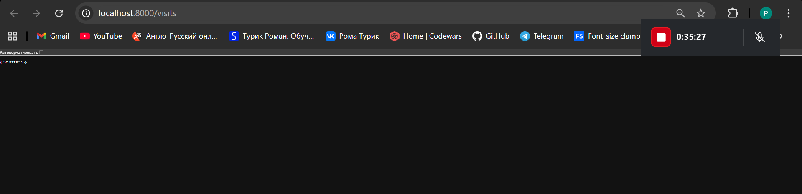
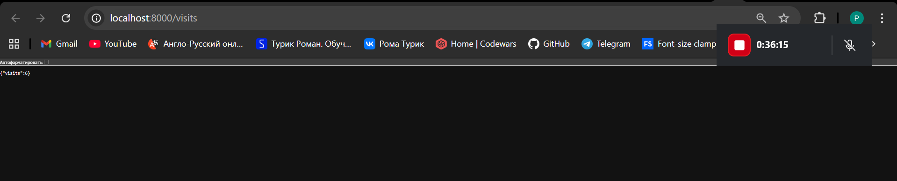
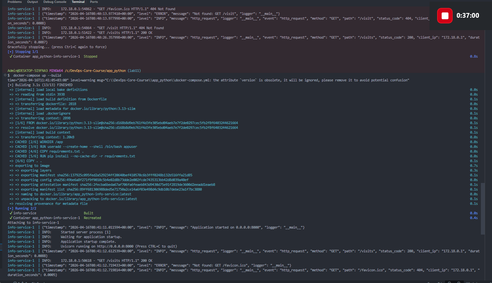
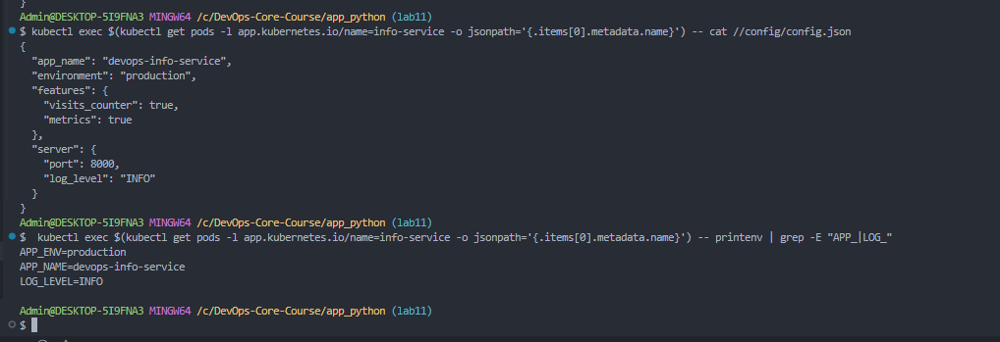
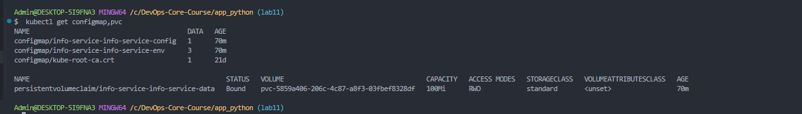
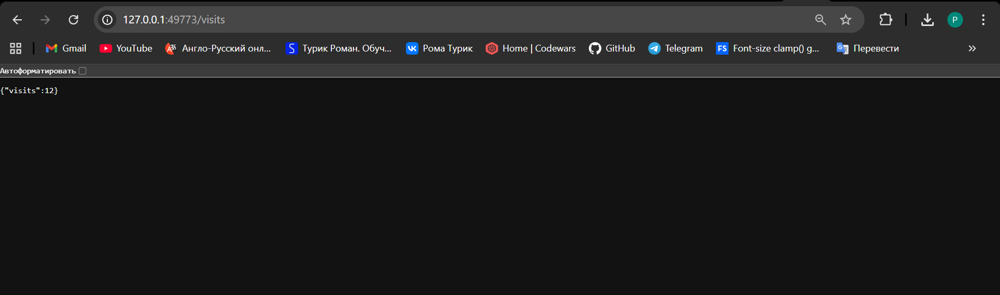
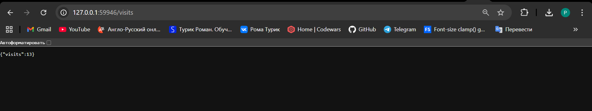

# Lab 12 — ConfigMaps & Persistent Volumes

## 1. Application Changes

### Visits Counter

Added a file-based visit counter to the application (`routes/system_info.py`):

- Each request to `GET /` reads counter from `/data/visits`, increments, and writes back
- On startup, reads from file (defaults to 0 if file doesn't exist)
- Thread-safe access via `threading.Lock`

### New Endpoint

**`GET /visits`** — returns the current visit count:

```json
{"visits": 13}
```

### Local Testing with Docker

`docker-compose.yml` mounts a volume `./data:/data` for local persistence:

```yaml
services:
  info-service:
    build: .
    ports:
      - "8000:8000"
    volumes:
      - ./data:/data
```

Before restart — counter at 6:



After container restart — counter preserved at 6:



Docker Compose terminal output:



---

## 2. ConfigMap Implementation

### ConfigMap from File (`configmap.yaml`)

Loads `files/config.json` into the cluster using `.Files.Get`:

```yaml
apiVersion: v1
kind: ConfigMap
metadata:
  name: {{ include "info-service.fullname" . }}-config
data:
  config.json: |-
{{ .Files.Get "files/config.json" | indent 4 }}
```

**`files/config.json` content:**

```json
{
  "app_name": "devops-info-service",
  "environment": "production",
  "features": {
    "visits_counter": true,
    "metrics": true
  },
  "server": {
    "port": 8000,
    "log_level": "INFO"
  }
}
```

### Mounted as File

ConfigMap is mounted as a volume at `/config`:

```yaml
volumes:
  - name: config-volume
    configMap:
      name: {{ include "info-service.fullname" . }}-config
volumeMounts:
  - name: config-volume
    mountPath: /config
```

### ConfigMap for Environment Variables (`configmap-env.yaml`)

Key-value pairs injected via `envFrom` with `configMapRef`:

```yaml
apiVersion: v1
kind: ConfigMap
metadata:
  name: {{ include "info-service.fullname" . }}-env
data:
  APP_ENV: {{ .Values.config.environment | quote }}
  LOG_LEVEL: {{ .Values.config.logLevel | quote }}
  APP_NAME: {{ .Values.config.appName | quote }}
```

```yaml
envFrom:
  - configMapRef:
      name: {{ include "info-service.fullname" . }}-env
```

### Verification

Config file and environment variables inside the pod:



---

## 3. Persistent Volume

### PVC Configuration (`pvc.yaml`)

```yaml
apiVersion: v1
kind: PersistentVolumeClaim
metadata:
  name: {{ include "info-service.fullname" . }}-data
spec:
  accessModes:
    - ReadWriteOnce
  resources:
    requests:
      storage: {{ .Values.persistence.size }}
```

- **Access Mode:** `ReadWriteOnce` (RWO) — single node can mount read-write
- **Storage Class:** default (Minikube standard provisioner)
- **Size:** 100Mi

Configurable via `values.yaml`:

```yaml
persistence:
  enabled: true
  size: 100Mi
  storageClass: ""
```

### Volume Mount

PVC mounted at `/data` where the visits counter file is stored:

```yaml
volumes:
  - name: data-volume
    persistentVolumeClaim:
      claimName: {{ include "info-service.fullname" . }}-data
volumeMounts:
  - name: data-volume
    mountPath: /data
```

### Resources Overview



### Persistence Test

Before pod deletion — visits at 12:



```bash
kubectl delete pod <pod-name>
```

After new pod starts — visits at 13 (counter preserved):



Data survived pod deletion — PVC works correctly.

---

## 4. ConfigMap vs Secret

| Aspect | ConfigMap | Secret |
|--------|-----------|--------|
| Purpose | Non-sensitive configuration | Sensitive data |
| Storage | Plain text in etcd | Base64-encoded in etcd |
| Examples | URLs, feature flags, log levels | Passwords, API keys, TLS certs |
| Size limit | 1MB | 1MB |
| Access | Anyone with API access | RBAC-restricted |
| Use case in this project | App config, environment vars | Docker Hub credentials (Lab 11) |

**When to use ConfigMap:** application settings, feature flags, log levels, server configuration — anything non-sensitive.

**When to use Secret:** passwords, API keys, tokens, TLS certificates — anything sensitive that should be access-controlled.
