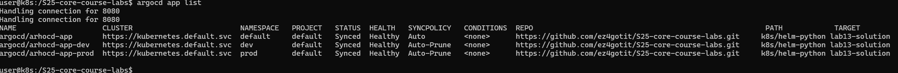
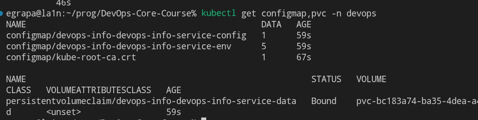
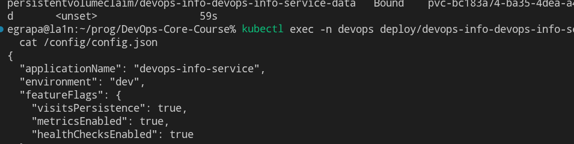
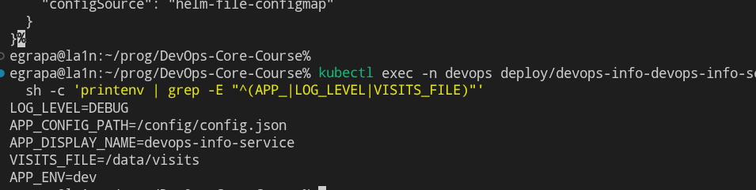
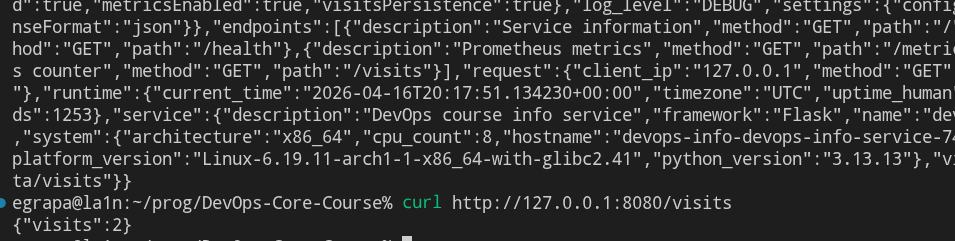
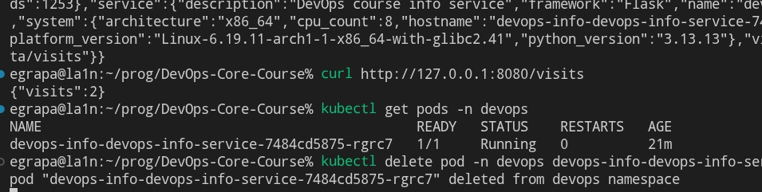
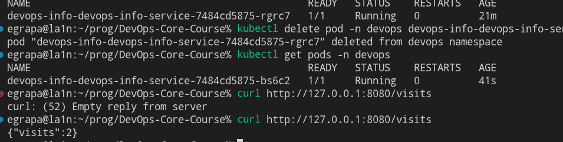

# Lab 12 — ConfigMaps And Persistent Volumes

## Implementation Summary

This lab extends the Helm chart and Flask application with externalized configuration and persistent storage.

Relevant implementation files:

- [`k8s/devops-info-service/files/config.json`](devops-info-service/files/config.json)
- [`k8s/devops-info-service/templates/configmap.yaml`](devops-info-service/templates/configmap.yaml)
- [`k8s/devops-info-service/templates/pvc.yaml`](devops-info-service/templates/pvc.yaml)
- [`k8s/devops-info-service/templates/deployment.yaml`](devops-info-service/templates/deployment.yaml)
- [`k8s/devops-info-service/values.yaml`](devops-info-service/values.yaml)
- [`app_python/app.py`](../app_python/app.py)
- [`monitoring/docker-compose.yml`](../monitoring/docker-compose.yml)
- [`app_python/README.md`](../app_python/README.md)

Implemented behavior:

- `GET /` increments a persistent visits counter stored in a file.
- `GET /visits` returns the current counter value.
- The application loads JSON configuration from `/config/config.json`.
- A file-based ConfigMap provides `config.json`.
- A second ConfigMap injects environment variables with `envFrom`.
- A PersistentVolumeClaim stores the visits file under `/data/visits`.

## 1. Application Changes

### Visits Counter

The Flask app now includes a thread-safe `VisitCounter` that:

- reads the counter from the visits file on startup
- defaults to `0` when the file does not exist
- increments and persists the counter on each `GET /`
- writes updates atomically through a temporary file and `os.replace`

The counter path is configurable through:

```bash
VISITS_FILE=/data/visits
```

### New Endpoint

The application exposes:

```bash
GET /visits
```

Example response:

```json
{
  "visits": 3
}
```

The root endpoint also includes:

- current visits count
- configuration metadata
- config file path
- whether config was loaded successfully



### Local Docker Testing

The monitoring compose stack now mounts a host directory for persistence:

```yaml
volumes:
  - ./data:/data
  - ../k8s/devops-info-service/files/config.json:/config/config.json:ro
```

- the `visits` file appears in `monitoring/data/`
- the counter value survives the container restart

## 2. ConfigMap Implementation

### File-Based ConfigMap

The chart includes `templates/configmap.yaml` with a ConfigMap built from a file:

```yaml
data:
  config.json: |-
{{ .Files.Get "files/config.json" | indent 4 }}
```

The file content is stored in:

```json
{
  "applicationName": "devops-info-service",
  "environment": "dev",
  "featureFlags": {
    "visitsPersistence": true,
    "metricsEnabled": true,
    "healthChecksEnabled": true
  },
  "settings": {
    "responseFormat": "json",
    "configSource": "helm-file-configmap"
  }
}
```

### Env ConfigMap

The same template also creates a second ConfigMap for environment variables:

```yaml
data:
  APP_CONFIG_PATH: "/config/config.json"
  APP_DISPLAY_NAME: "devops-info-service"
  APP_ENV: "dev"
  LOG_LEVEL: "INFO"
  VISITS_FILE: "/data/visits"
```

### Deployment Wiring

The deployment consumes both configuration styles:

- file mount through `volumes` and `volumeMounts`
- environment variables through `envFrom.configMapRef`

Config file mount:

```yaml
volumeMounts:
  - name: app-config
    mountPath: /config/config.json
    subPath: config.json
    readOnly: true
```

Env injection:

```yaml
envFrom:
  - configMapRef:
      name: {{ include "devops-info-service.envConfigMapName" . }}
```

### Verification Commands

List created resources:

```bash
kubectl get configmap,pvc -n devops
```


Read the mounted file inside the pod:

```bash
kubectl exec -n devops deploy/devops-info-devops-info-service -- \
  cat /config/config.json
```


Inspect environment variables:

```bash
kubectl exec -n devops deploy/devops-info-devops-info-service -- \
  sh -c 'printenv | grep -E "^(APP_|LOG_LEVEL|VISITS_FILE)"'
```


## 3. Persistent Volume

### PVC Configuration

The chart now includes `templates/pvc.yaml`:

```yaml
spec:
  accessModes:
    - ReadWriteOnce
  resources:
    requests:
      storage: 100Mi
```

The storage class is configurable through:

```yaml
persistence:
  enabled: true
  size: 100Mi
  storageClass: ""
```

If `storageClass` is left empty, Kubernetes uses the cluster default storage class.

### Deployment Mount

The PVC is mounted into the application container:

```yaml
volumes:
  - name: app-data
    persistentVolumeClaim:
      claimName: {{ include "devops-info-service.pvcName" . }}
```

```yaml
volumeMounts:
  - name: app-data
    mountPath: /data
```

The application stores the visits file in:

```text
/data/visits
```

### Persistence Test

Access the application a few times:

```bash
curl http://127.0.0.1:8080/
curl http://127.0.0.1:8080/
curl http://127.0.0.1:8080/visits
```


Capture the pod name and delete it:

```bash
kubectl get pods -n devops
kubectl delete pod -n devops <pod-name>
```

Wait for the replacement pod, then verify the counter:

```bash
kubectl get pods -n devops
curl http://127.0.0.1:8080/visits
kubectl exec -n devops deploy/devops-info-devops-info-service -- cat /data/visits
```


This demonstrates that the data survives pod recreation because it is stored on the PVC rather than inside the container filesystem.

## 4. ConfigMap Vs Secret

Use a ConfigMap when:

- the data is not sensitive
- the values are application settings
- the same container image must run in different environments

Use a Secret when:

- the data includes passwords, tokens, API keys, or certificates
- access to the values must be restricted more tightly
- you want to integrate with secret-management systems such as Vault

Key differences:

- ConfigMaps are intended for non-sensitive configuration.
- Secrets are intended for sensitive values.
- Both can be mounted as files or exposed as environment variables.
- Secrets are still only base64-encoded in manifests and should be protected with RBAC and encryption at rest.

## 5. Notes And Limitations

The current chart mounts `config.json` with `subPath` so the file appears exactly at `/config/config.json`, matching the lab requirement. This is fine for the main tasks, but it means ConfigMap updates will not be reflected automatically inside a running pod. For the bonus task, the better approaches are:

- mount the whole directory instead of using `subPath`
- add a checksum annotation to the Deployment to trigger a rollout on ConfigMap changes
- use a config reloader pattern
