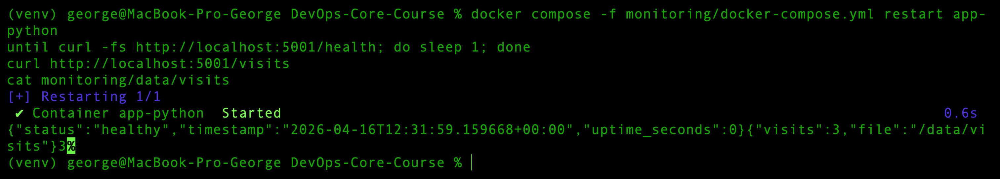
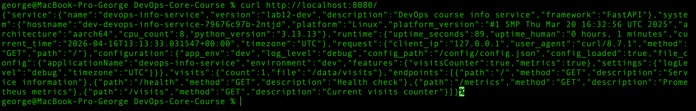

# Lab 12 — ConfigMaps & Persistent Volumes

## 1. Application Persistence Upgrade 

The application was upgraded to support a persistent visits counter.

### Implemented Changes

The FastAPI service now:
- stores the visits counter in a file at `/data/visits`
- increments the counter on every request to `GET /`
- exposes a new endpoint `GET /visits` to return the current counter value
- initializes the counter from file on startup
- uses file locking during read/write operations to reduce race conditions

### New Endpoint

```bash
curl http://localhost:5000/visits
```

Example response:

```json
{
  "visits": 3,
  "file": "/data/visits"
}
```

### Root Endpoint Behavior

Each request to `GET /` increments the counter and returns application information together with:

* loaded configuration
* current visits count
* visits file path

Example fields in the response:

```json
{
  "configuration": {
    "app_env": "dev",
    "log_level": "info",
    "config_path": "/config/config.json",
    "config_loaded": true
  },
  "visits": {
    "count": 3,
    "file": "/data/visits"
  }
}
```

### Local Docker Persistence Test

A bind mount was added in `monitoring/docker-compose.yml`:

```yaml
volumes:
  - ./data:/data
  - ./config.local.json:/config/config.json:ro
```

This allows the visits counter file to persist on the host between container restarts.

### Local Test Commands

```bash
mkdir -p monitoring/data
chmod 777 monitoring/data

docker compose -f monitoring/docker-compose.yml up --build -d app-python

curl http://localhost:5001/
curl http://localhost:5001/
curl http://localhost:5001/visits
cat monitoring/data/visits

docker compose -f monitoring/docker-compose.yml restart app-python
until curl -fs http://localhost:5001/health; do sleep 1; done

curl http://localhost:5001/visits
cat monitoring/data/visits
```

### Evidence

Before restart:

```json
{"visits":3,"file":"/data/visits"}
3
```

After restart:




### Conclusion

The visits counter is persisted successfully:

* requests to `/` increment the value
* `/visits` returns the current stored value
* the value survives container restart because the file is stored in a mounted host volume

---


## 2. ConfigMaps

Application configuration was externalized using Kubernetes ConfigMaps in two forms:
1. as a mounted JSON configuration file
2. as environment variables injected into the container

### 2.1 Configuration File

A Helm template file was added:

```text
k8s/devops-info-service/files/config.json.tpl
```
For better IDE support, the file was stored as `config.json.tpl` and rendered by Helm into `config.json` inside the ConfigMap.

It contains:

* application name
* environment
* feature flags
* application settings

Template content:

```json
{
  "applicationName": "{{ include "devops-info-service.name" . }}",
  "environment": "{{ .Values.config.environment }}",
  "features": {
    "visitsCounter": {{ .Values.config.featureVisitsEnabled }},
    "metrics": {{ .Values.config.featureMetricsEnabled }}
  },
  "settings": {
    "logLevel": "{{ .Values.config.logLevel }}",
    "timezone": "UTC"
  }
}
```

### 2.2 ConfigMap Templates

A new Helm template file was created:

```text
k8s/devops-info-service/templates/configmap.yaml
```

It creates two ConfigMaps:

* `dev-devops-info-service-config` — file-based configuration
* `dev-devops-info-service-env` — environment variables

The file-based ConfigMap uses:

* `.Files.Get` to load the external file
* `tpl` to render Helm expressions inside the JSON template

### 2.3 Mounted File Verification

The file-based ConfigMap is mounted into the container at:

```text
/config/config.json
```

Verification command:

```bash
kubectl exec dev-devops-info-service-79676c97b-2ntjd -- cat /config/config.json
```

Output:

```json
{
  "applicationName": "devops-info-service",
  "environment": "dev",
  "features": {
    "visitsCounter": true,
    "metrics": true
  },
  "settings": {
    "logLevel": "debug",
    "timezone": "UTC"
  }
}
```

### 2.4 Environment Variables Verification

A second ConfigMap injects environment variables using `envFrom`.

Verification command:

```bash
kubectl exec dev-devops-info-service-79676c97b-2ntjd -- printenv | grep -E 'APP_|LOG_LEVEL|FEATURE_|CONFIG_PATH|DATA_DIR'
```

Relevant output:

```text
APP_ENV=dev
DATA_DIR=/data
FEATURE_METRICS_ENABLED=true
FEATURE_VISITS_ENABLED=true
LOG_LEVEL=debug
CONFIG_PATH=/config/config.json
```

### 2.5 ConfigMap Resource Check

```bash
kubectl get configmap
```

Output:

```text
NAME                             DATA   AGE
dev-devops-info-service-config   1      44s
dev-devops-info-service-env      6      44s
kube-root-ca.crt                 1      20d
```

Combined check can also be performed with:
```bash
kubectl get configmap,pvc
```


### 2.6 Helm Validation

```bash
helm lint ./k8s/devops-info-service
```

Result:

```text
==> Linting ./k8s/devops-info-service
[INFO] Chart.yaml: icon is recommended

1 chart(s) linted, 0 chart(s) failed
```

Helm templates were rendered successfully for both dev and prod, and the resulting configuration changed correctly:

* `environment=dev`, `logLevel=debug` for dev
* `environment=prod`, `logLevel=info` for prod

### 2.7 Image Update

A new Docker image was built and pushed with tag `lab12`:

```bash
docker build -t egorlazutkin/devops-info-service:lab12 ./app_python
docker push egorlazutkin/devops-info-service:lab12
docker pull egorlazutkin/devops-info-service:lab12
```

The final `docker pull` confirmed that the tag exists in Docker Hub and is available for Kubernetes.

### 2.8 Service-Level Verification

The application service was forwarded locally:

```bash
kubectl port-forward svc/dev-devops-info-service 8080:80
curl http://localhost:8080/
```

Response:


This confirms that:

* the request was served by the correct Pod of the `dev` release
* the mounted ConfigMap file was successfully read by the application
* the environment variables were injected correctly
* the loaded configuration is visible in the API response

### 2.9 Important Fix During Verification

During verification, it turned out that multiple Helm releases were using the same generic label (`app=devops-info-service`), which caused Services to route traffic to Pods from another release.

To fix this, release-specific selector labels were introduced:

* `app.kubernetes.io/name`
* `app.kubernetes.io/instance`

After recreating the Deployment with the new selector labels, the Service started routing traffic only to Pods of the current release.

### 2.10 Conclusion

Task was implemented successfully:

* configuration was externalized from the container image
* a ConfigMap provides a mounted JSON file at `/config/config.json`
* another ConfigMap provides environment variables through `envFrom`
* the same image can now run with different dev/prod settings
* the application successfully reads and exposes the loaded configuration

---


## 3. Persistent Volume

Persistent storage was added for the visits counter so that application data survives Pod recreation.

### 3.1 PersistentVolumeClaim

A new Helm template was created:

```text
k8s/devops-info-service/templates/pvc.yaml
````

The chart creates a `PersistentVolumeClaim` with:

* access mode: `ReadWriteOnce`
* requested size: `100Mi`
* configurable storage class through values

The values files include:

```yaml
persistence:
  enabled: true
  size: 100Mi
  storageClass: ""
```

This allows Kubernetes to use the default StorageClass of the cluster.

### 3.2 PVC Mount in Deployment

The Deployment mounts the claim into the application container at:

```text
/data
```

The visits counter file is stored at:

```text
/data/visits
```

This path is used by the application through:

```python
DATA_DIR = Path(os.getenv("DATA_DIR", "/data"))
VISITS_FILE = Path(os.getenv("VISITS_FILE", str(DATA_DIR / "visits")))
```

### 3.3 PVC Verification

PVC list:

```bash
kubectl get pvc
```

Output:

```text
NAME                           STATUS   VOLUME                                     CAPACITY   ACCESS MODES   STORAGECLASS   VOLUMEATTRIBUTESCLASS   AGE
dev-devops-info-service-data   Bound    pvc-98a32734-19c5-4495-aaaa-74bbecc2e43c   100Mi      RWO            standard       <unset>                 21m
```

This confirms that:

* the PVC was created successfully
* it is bound to a volume
* it uses `ReadWriteOnce`
* the requested storage was provisioned

### 3.4 StorageClass Verification

```bash
kubectl get storageclass
```

Output:

```text
NAME                 PROVISIONER                RECLAIMPOLICY   VOLUMEBINDINGMODE   ALLOWVOLUMEEXPANSION   AGE
standard (default)   k8s.io/minikube-hostpath   Delete          Immediate           false                  20d
```

The cluster uses the default `standard` StorageClass provided by Minikube.

### 3.5 Data Before Pod Deletion

Before deleting the Pod, the visits counter was increased by sending multiple requests to `/`.

Commands used:

```bash
curl http://localhost:8080/
curl http://localhost:8080/
curl http://localhost:8080/
curl http://localhost:8080/visits
```

Result:

```json
{"visits":4,"file":"/data/visits"}
```

The file inside the Pod also contained the same value:

```bash
kubectl exec dev-devops-info-service-79676c97b-2ntjd -- cat /data/visits
```

Output:

```text
4
```

### 3.6 Pod Deletion Test

The Pod was deleted without deleting the Deployment:

```bash
kubectl delete pod dev-devops-info-service-79676c97b-2ntjd
```

Kubernetes automatically created a replacement Pod:

```text
dev-devops-info-service-79676c97b-vfvn6
```

Pod recreation was observed with:

```bash
kubectl get pods -w
```

Observed state:

```text
dev-devops-info-service-79676c97b-vfvn6   1/2   Running   0   5s
dev-devops-info-service-79676c97b-vfvn6   2/2   Running   0   13s
```

### 3.7 Data After Pod Recreation

After the new Pod started, the visits file was checked again:

```bash 
kubectl exec dev-devops-info-service-79676c97b-vfvn6 -- cat /data/visits
```

Output:

```text 
4
```

```bash
curl http://localhost:8080/visits
```

Output:
```json
{"visits":4,"file":"/data/visits"}
```

The value remained unchanged after Pod recreation, which confirms that the data is stored on persistent storage rather than inside the ephemeral container filesystem.

### 3.8 Conclusion

Task was implemented successfully:

* a PVC was added to the Helm chart
* the PVC is mounted into the application at `/data`
* the visits counter is stored in `/data/visits`
* the PVC remained attached after Pod deletion
* the new Pod preserved the same visits counter value

This proves that the application's visit counter survives Pod restart and rescheduling.

---

## 4. ConfigMap vs Secret

### When to Use ConfigMap

ConfigMap should be used for non-sensitive application configuration, for example:
- environment name
- feature flags
- log level
- JSON/YAML application settings
- file-based configuration such as `config.json`

### When to Use Secret

Secret should be used for sensitive data, for example:
- passwords
- API tokens
- access keys
- database credentials
- private certificates

### Key Differences

- **ConfigMap** is intended for non-confidential configuration data
- **Secret** is intended for sensitive or confidential data
- both can be mounted as files or injected as environment variables
- Secrets should be used whenever exposing the value publicly would be unsafe

### In This Lab

In this project:
- ConfigMap is used for application configuration (`config.json`, `APP_ENV`, `LOG_LEVEL`)
- Secret is used for sensitive values such as:
  - `username`
  - `password`

This separation follows Kubernetes best practices by keeping non-sensitive configuration and sensitive credentials in different resource types.
