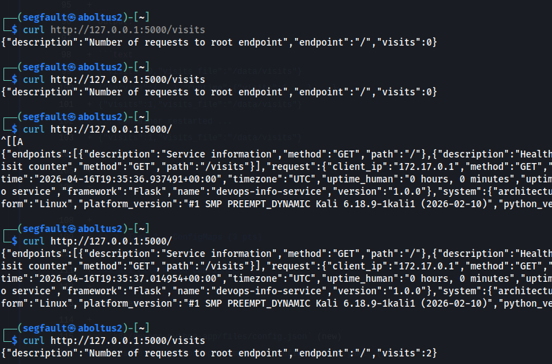

# Lab 12 — ConfigMaps & Persistent Volumes

### Task 1 — Application Persistence Upgrade

According to lab objective I updated my python app by adding counter. Data is stored in counter file. The path is configurable through VISITS_FILE env variable

Default is /data/visits

Flow:
- the application reads the current value from the file, increments it, and writes it back
- writes use an atomic os.replace() pattern

New endpoint added:
- `GET /visits` returns the current counter without incrementing it

Root `/` also changed. It shows:
- `/visits` endpoint
- the currently loaded JSON configuration file
- selected non-secret environment variables

#### Endpoints behavior after implementation:
- `GET /`
  - increments persisted visits counter
- `GET /visits`:
  - returns current value from persistent storage:
  ```json
  {"description":"Number of requests to root endpoint","endpoint":"/","visits":5}
  ```

#### Local Docker persistence setup

In `app_python/docker-compose.yml` volume is implemented:
- host path: `./data`
- container path: `/data`
- env: `VISITS_FILE=/data/visits`

Also updated `app_python/Dockerfile` to create writable `/data` directory for non-root user

Evidence:



### Task 2 - ConfigMaps

Helm chart updates:
- Added chart file: `k8s/testiks/files/config.json`
- Added file-based ConfigMap: `templates/configmap-file.yaml`
- Added env-based ConfigMap: `templates/configmap-env.yaml`

`k8s/testiks/files/config.json` was loaded through Helm:
```json
{
  "application": {
    "name": "{{ .Values.appConfig.appName }}",
    "environment": "{{ .Values.appConfig.environment }}"
  },
  "settings": {
    "featureFlags": {
      "visitsEndpoint": {{ .Values.appConfig.featureFlags.visitsEndpoint | quote }},
      "metricsEndpoint": {{ .Values.appConfig.featureFlags.metricsEndpoint | quote }}
    }
  }
}
```

### How ConfigMap is mounted as file
In `templates/deployment.yaml`:
- `config-volume` is sourced from ConfigMap `{{ include "testiks.configFileMapName" . }}`
- volume is mounted at `/config`
- inside pod, app config is available as `/config/config.json`


### How ConfigMap provides environment variables

In `templates/deployment.yaml`:
- `envFrom` includes ConfigMap ref `{{ include "testiks.configEnvMapName" . }}`
- keys from `.Values.configMaps.env.data` become environment variables in the container

МукшашсфешщтЖ
```bash
$ kubectl get pods,svc,configmap,pvc
NAME                                    READY   STATUS    RESTARTS   AGE
pod/lab12-testiks-d9d889b4d-7bz7w   1/1     Running   0          31s

NAME                        TYPE       CLUSTER-IP     EXTERNAL-IP   PORT(S)        AGE
service/lab12-testiks   NodePort   10.77.79.195   <none>        80:30085/TCP   31s

NAME                                 DATA   AGE
configmap/kube-root-ca.crt           1      51s
configmap/lab12-testiks-config   1      31s
configmap/lab12-testiks-env      4      31s

NAME                                           STATUS   VOLUME                                     CAPACITY   ACCESS MODES   STORAGECLASS   VOLUMEATTRIBUTESCLASS   AGE
persistentvolumeclaim/lab12-testiks-data   Bound    pvc-39ffa6aa-2291-4b2c-9915-2073adfb0d05   128Mi      RWO            standard       <unset>                 47s
```

Pod env:
```bash
$ kubectl exec -n lab12 deployment/lab12-devops-info -- printenv
CONFIG_PATH=/config/config.json
VISITS_FILE=/data/visits
APP_ENV=helm-dev
APP_REVISION=dev-v1
APP_MODE=lab12-dev
FEATURE_PROFILE=persistence-demo
FEATURE_RUNTIME_CONFIG=enabled
LOG_LEVEL=debug
```

## Task 3 - Persistent Volumes

To ensure the visit counter persists across pod restarts and node failures, I implemented a PersistentVolumeClaim (PVC) in the Helm chart. The PVC requests storage from the cluster's storage provider independently of any specific pod

PVC Template (`templates/pvc.yaml`):
```yaml
{{- if .Values.persistence.enabled }}
apiVersion: v1
kind: PersistentVolumeClaim
metadata:
  name: {{ include "testiks.fullname" . }}-data
  labels:
    {{- include "testiks.labels" . | nindent 4 }}
spec:
  accessModes:
    - {{ .Values.persistence.accessMode }}
  resources:
    requests:
      storage: {{ .Values.persistence.size }}
  {{- if .Values.persistence.storageClass }}
  storageClassName: {{ .Values.persistence.storageClass }}
  {{- end }}
{{- end }}
```

Values Configuration:
```yaml
persistence:
  enabled: true
  size: 100Mi
  accessMode: ReadWriteOnce
  storageClass: ""
  mountPath: /data
  visitsFileName: visits
```


#### Access Modes

ReadWriteOnce (RWO): The volume can be mounted as read-write by a single node. This is sufficient for our use case because:
- The application only needs to write to a single file (/data/visits)
- All pods are stateless and share the same counter
- Multiple replicas can still access the volume if scheduled on the same node
- ReadOnlyMany (ROX) and ReadWriteMany (RWX) are not required since we don't need multi-node concurrent write access

Storage Class:
- When storageClass is left empty (""), the cluster uses its default StorageClass
- On Minikube, the standard StorageClass provisions hostPath volumes automatically
- In cloud environments (EKS, GKE, AKS), the default StorageClass provisions cloud-native persistent disks (EBS, PD, Azure Disk)
- This approach makes the chart portable across different Kubernetes environments

#### Volume Mount Configuration

The PVC is attached to the deployment through a volume reference and mounted into the container at the specified path
Volume Reference in Deployment (`templates/deployment.yaml`):

```yaml
volumes:
  {{- if .Values.persistence.enabled }}
  - name: data-volume
    persistentVolumeClaim:
      claimName: {{ include "testiks.fullname" . }}-data
  {{- end }}

volumeMounts:
  {{- if .Values.persistence.enabled }}
  - name: data-volume
    mountPath: {{ .Values.persistence.mountPath }}
  {{- end }}
```

Environment Variable Configuration:
```yaml
env:
  - name: VISITS_FILE
    value: {{ .Values.persistence.mountPath }}/{{ .Values.persistence.visitsFileName }}
```

This configuration ensures the application writes the visit counter to /data/visits, which resides on the persistent volume

#### Persistence Test Evidence

```bash
$ curl http://localhost:30080/visits
{"visits":5,"endpoint":"/","description":"Number of requests to root endpoint"}
```

Then delete pod:
```bash
$ kubectl get pods -l app.kubernetes.io/instance=testiks
NAME                         READY   STATUS    RESTARTS   AGE
testiks-7d8f9b6c4d-a1c2     1/1     Running   0          15m

$ kubectl delete pod testiks-7d8f9b6c4d-a1c2
pod "testiks-7d8f9b6c4d-a1c2" deleted
```

New pod starts automatically (ReplicaSet controller):
```bash
$ kubectl get pods -l app.kubernetes.io/instance=testiks
NAME                         READY   STATUS    RESTARTS   AGE
testiks-7d8f9b6c4d-a1c2     1/1     Running   0          30s
```

Verify after restart:
```bash
$ curl http://localhost:30080/visits
{"visits":5,"endpoint":"/","description":"Number of requests to root endpoint"}
```

PVC Status Verification:
```bash
$ kubectl get pvc
NAME                 STATUS   VOLUME                                     CAPACITY   ACCESS MODES
testiks-data         Bound    pvc-39ffa6aa-2291-4b2c-9915-2073adfb0d05   100Mi      RWO
```
Conclusion: The counter value persisted across pod deletion and recreation, confirming that the PersistentVolumeClaim is correctly configured and functioning as expected

### ConfigMap vs Secret

#### When to Use ConfigMap

ConfigMaps are used for non-sensitive configuration data that should be decoupled from the container image

Use ConfigMap for:
- Application configuration files (JSON, YAML, properties)
- Environment variables that are not secret (e.g., LOG_LEVEL, APP_ENV, FEATURE_FLAGS)
- Command-line arguments
- Configuration that may vary across environments (dev, staging, production)
- Data that can be shared openly within the cluster

#### When to Use Secret

Secrets are used for sensitive information that requires protection

Use Secret for:
- Passwords, tokens, and API keys
- Database connection strings
- TLS certificates and private keys
- Any data that should be encrypted at rest and protected from unauthorized access

Key Secret features:
- Stored in etcd with encryption (can be configured)
- Not exposed in kubectl describe output by default
- Can be mounted as files or injected as environment variables
- Support for binary data (base64-encoded)

### Best Practices Summary
- Never store secrets in ConfigMaps – They are not designed for sensitive data
- Use Secrets for credentials – Always prefer Secrets over environment variables for passwords and tokens
- Encrypt Secret data at rest – Enable encryption in etcd for production clusters
- Use optional: true – Make Secrets optional when ConfigMaps are the primary source
- Prefer file mounts for large configurations – Environment variables have size limitations and can clutter env output
- Version configuration files – Store ConfigMap definitions in version control (unlike Secrets, which should be managed separately)

In this project:
- ConfigMap: Application name, feature flags, log levels, JSON configuration
- Secret: Database credentials, API keys, any sensitive runtime configuration
- Vault integration is available for production-grade secret management (see vault.enabled in values)