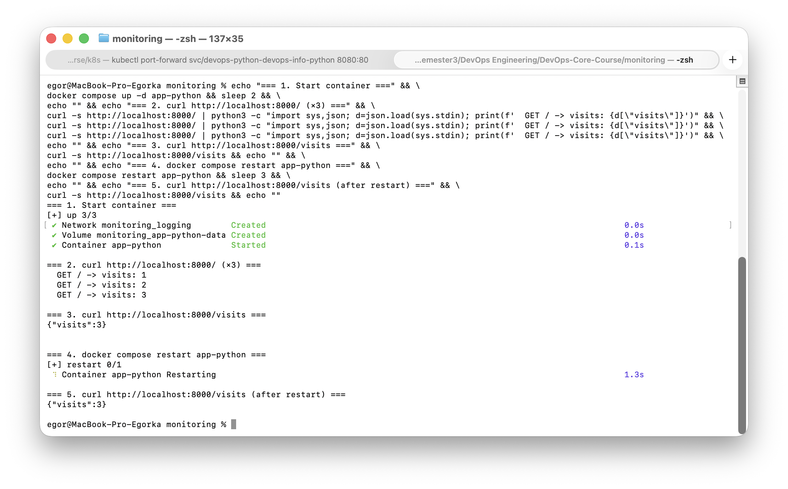
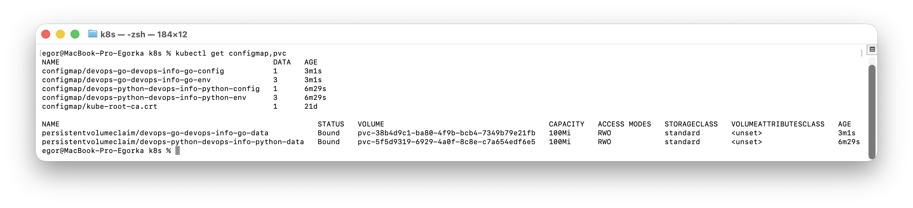
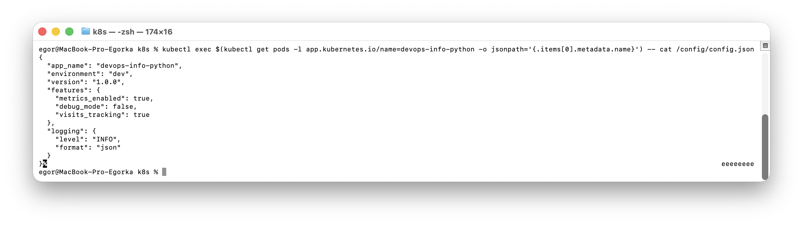
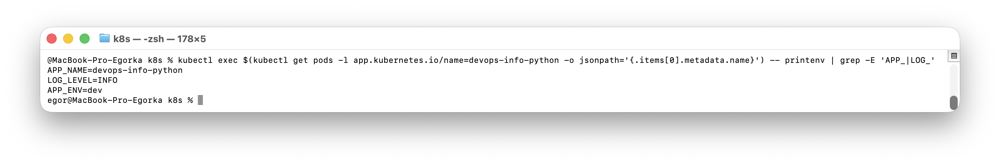
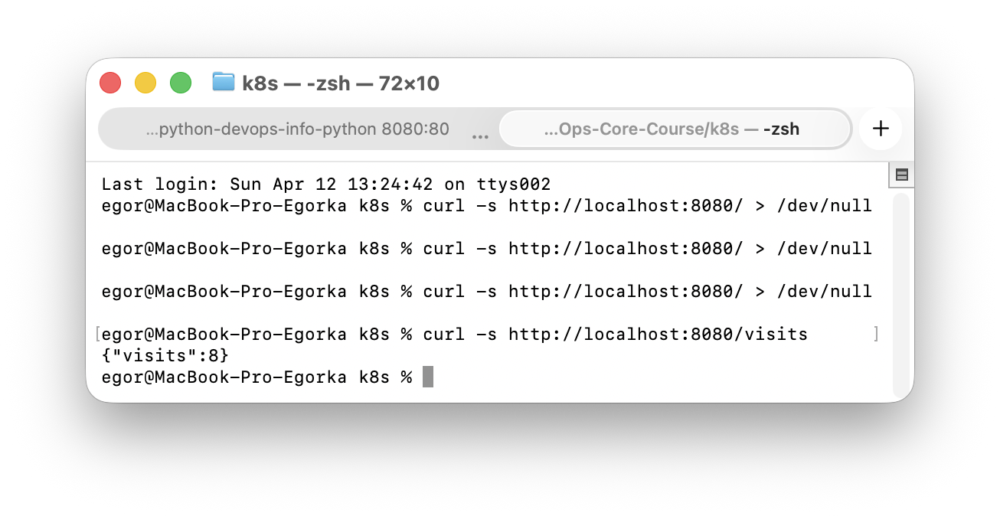
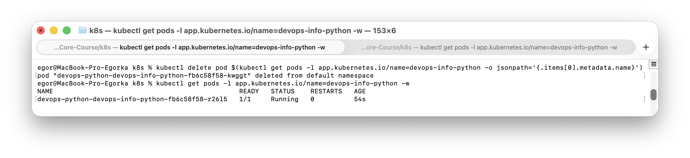
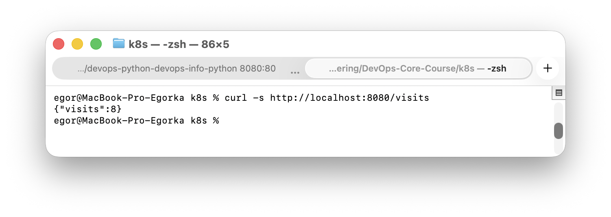
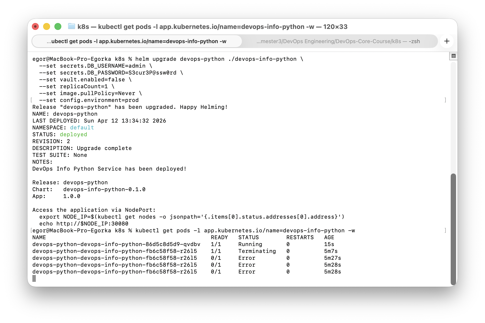

# ConfigMaps & Persistent Volumes

## 1. Application Changes

### Visits Counter

Both apps (Python and Go) now have a file-backed visit counter:
- Each `GET /` request increments a counter stored in `/data/visits`
- New `GET /visits` endpoint returns the current count
- Thread-safe: uses `threading.Lock` (Python) / `sync.Mutex` (Go)
- Atomic writes via temp file + rename to prevent corruption

### New Endpoint — `/visits`

```
GET /visits  →  { "visits": 42 }
```

### Local Testing with Docker

Docker Compose volumes configured in `monitoring/docker-compose.yml`:

```yaml
app-python:
  volumes:
    - app-python-data:/data

app-go:
  volumes:
    - app-go-data:/data
```

**Test procedure:**
1. `docker compose up -d app-python`
2. `curl http://localhost:8000/` (repeat several times)
3. `curl http://localhost:8000/visits` — verify counter
4. `docker compose restart app-python`
5. `curl http://localhost:8000/visits` — counter preserved



---

## 2. ConfigMap Implementation

### ConfigMap Template Structure

Each chart has `templates/configmap.yaml` with **two ConfigMaps**:

**1) File-based ConfigMap** (`*-config`) — mounts `config.json` as a file:

```yaml
apiVersion: v1
kind: ConfigMap
metadata:
  name: <release>-<chart>-config
data:
  config.json: |-
    <contents of files/config.json>
```

**2) Env-var ConfigMap** (`*-env`) — injects key-value pairs as environment variables:

```yaml
apiVersion: v1
kind: ConfigMap
metadata:
  name: <release>-<chart>-env
data:
  APP_ENV: "dev"
  LOG_LEVEL: "INFO"
  APP_NAME: "devops-info-python"
```

### `config.json` Content

```json
{
  "app_name": "devops-info-python",
  "environment": "dev",
  "version": "1.0.0",
  "features": {
    "metrics_enabled": true,
    "debug_mode": false,
    "visits_tracking": true
  },
  "logging": {
    "level": "INFO",
    "format": "json"
  }
}
```

### How ConfigMap Is Mounted as File

In `deployment.yaml`:

```yaml
volumes:
  - name: config-volume
    configMap:
      name: <fullname>-config

containers:
  - volumeMounts:
      - name: config-volume
        mountPath: /config
```

The file becomes available at `/config/config.json` inside the pod.

### How ConfigMap Provides Environment Variables

```yaml
envFrom:
  - configMapRef:
      name: <fullname>-env
```

This injects `APP_ENV`, `LOG_LEVEL`, `APP_NAME` as environment variables.

### Verification

```bash
# 1. List ConfigMaps and PVCs
kubectl get configmap,pvc

# 2. Verify config file inside pod
kubectl exec <pod-name> -- cat /config/config.json

# 3. Verify environment variables
kubectl exec <pod-name> -- printenv | grep -E 'APP_|LOG_'
```







---

## 3. Persistent Volume

### PVC Configuration

`templates/pvc.yaml`:

```yaml
apiVersion: v1
kind: PersistentVolumeClaim
metadata:
  name: <fullname>-data
spec:
  accessModes:
    - ReadWriteOnce
  resources:
    requests:
      storage: 100Mi
```

### Access Modes and Storage Class

| Access Mode | Description |
|---|---|
| `ReadWriteOnce` (RWO) | Volume can be mounted as read-write by a single node |
| `ReadOnlyMany` (ROX) | Volume can be mounted as read-only by many nodes |
| `ReadWriteMany` (RWX) | Volume can be mounted as read-write by many nodes |

We use `ReadWriteOnce` — sufficient for a single-replica deployment writing visit counts.

**Storage class** is left empty (`""`) to use the cluster default. In Minikube this is `standard` (hostPath provisioner), which dynamically provisions PVs.

### Volume Mount Configuration

In `deployment.yaml`:

```yaml
volumes:
  - name: data-volume
    persistentVolumeClaim:
      claimName: <fullname>-data

containers:
  - volumeMounts:
      - name: data-volume
        mountPath: /data
```

The app writes visit counts to `/data/visits`, which lives on the PVC.

### Persistence Test Evidence

**Test procedure:**
1. Deploy: `helm upgrade --install devops-python ./devops-info-python --set secrets.DB_USERNAME=admin --set secrets.DB_PASSWORD=S3cur3P@ssw0rd`
2. Access root endpoint: `curl http://<node-ip>:30080/` (several times)
3. Check counter: `curl http://<node-ip>:30080/visits`
4. Delete pod: `kubectl delete pod <pod-name>`
5. Wait for new pod: `kubectl get pods -w`
6. Check counter again: `curl http://<node-ip>:30080/visits` — same value!







---

## 4. ConfigMap vs Secret

| Aspect | ConfigMap | Secret |
|---|---|---|
| **Purpose** | Non-sensitive configuration | Sensitive data (passwords, tokens, keys) |
| **Encoding** | Plain text | Base64-encoded (not encrypted by default) |
| **Use cases** | App settings, feature flags, config files | DB passwords, API keys, TLS certificates |
| **Size limit** | 1 MiB | 1 MiB |
| **RBAC** | Standard access | Can be restricted with stricter RBAC policies |
| **etcd storage** | Plain | Can be encrypted at rest with EncryptionConfiguration |

**When to use ConfigMap:**
- Application configuration files (`config.json`, `.env`)
- Feature flags, log levels, environment names
- Non-sensitive key-value settings

**When to use Secret:**
- Database credentials
- API keys, OAuth tokens
- TLS certificates and private keys
- Any data that should not appear in logs or version control

---

## 5. Bonus — ConfigMap Hot Reload

### Update Delay (Kubelet Sync Period)

When a ConfigMap is updated, mounted volumes are eventually updated by the kubelet. Default delay: **up to 60 seconds + cache TTL** (configurable via `--sync-frequency`). Total propagation can take 1–2 minutes.

### `subPath` Limitation

When mounting with `subPath`, the file is a **copy**, not a symlink. It will **not** receive automatic updates when the ConfigMap changes. Only full directory mounts (without `subPath`) get auto-updated via symlink rotation.

**Use `subPath`** when you need to mount a single file into a directory without hiding other files.
**Avoid `subPath`** when you need automatic ConfigMap updates.

### Chosen Approach — Checksum Annotation

We use the **checksum annotation pattern** in the deployment template:

```yaml
metadata:
  annotations:
    checksum/config: {{ include (print $.Template.BasePath "/configmap.yaml") . | sha256sum }}
```

**How it works:**
1. The annotation value is a SHA-256 hash of the rendered ConfigMap template
2. When ConfigMap content changes, the hash changes
3. This makes the pod template different, triggering a rolling update
4. `helm upgrade` detects the change and restarts pods automatically

**Demonstration:**
1. Change `config.json` (e.g., set `"environment": "prod"`)
2. Run `helm upgrade --install devops-python ./devops-info-python --set secrets.DB_USERNAME=admin --set secrets.DB_PASSWORD=S3cur3P@ssw0rd`
3. Observe pods being recreated with new configuration



### Alternative Approaches

- **Stakater Reloader** — controller that watches ConfigMaps/Secrets and triggers rolling updates
- **Application file watching** — inotify/fsnotify to detect file changes and reload config
- **Manual `kubectl rollout restart`** — simple but not automated
