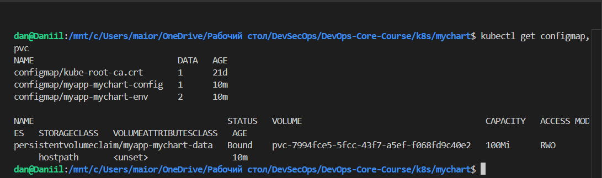
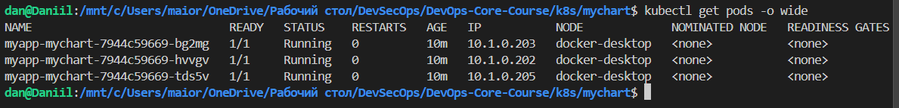
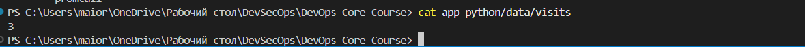
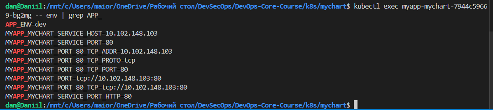
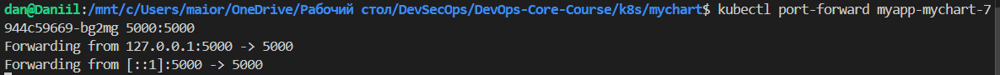
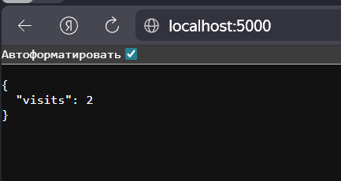
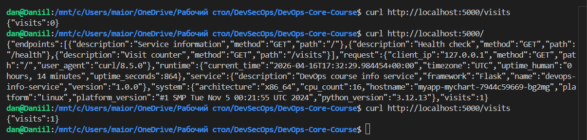
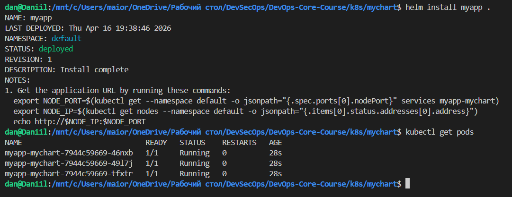
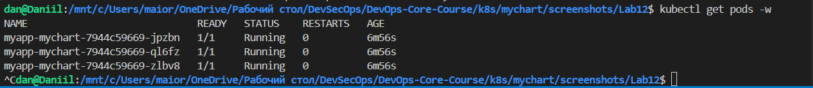

# Lab 12 — ConfigMaps & Persistent Volumes

## Application Changes

### Visits Counter Implementation

The application has been updated to track and persist visit counts:

- **Counter Logic**: On each request to the root endpoint `/`, the visit counter is incremented and stored in a file at `/data/visits`.
- **New Endpoint**: `/visits` returns the current visit count as JSON: `{"visits": 42}`.
- **Persistence**: The counter persists across container restarts by writing to a file.
- **Concurrency**: Basic file read/write is used; for production, consider atomic operations or locking.

### Local Testing with Docker

- **Docker Compose**: Added `docker-compose.yml` with a volume mount `./data:/app/data` to persist visits.
- **Testing Steps**:
  1. Run `docker-compose up --build`
  2. Access `http://localhost:5000/` multiple times
  3. Check file: `cat ./data/visits`
  4. Restart container: `docker-compose restart`
  5. Verify counter continues from previous value
- **README Updated**: Added visits counter features, new endpoint, and Docker Compose instructions.

## ConfigMap Implementation

### ConfigMap Template Structure

Created `templates/configmap.yaml` with two ConfigMaps:

1. **File-based ConfigMap** (`mychart-config`):
   ```yaml
   apiVersion: v1
   kind: ConfigMap
   data:
     config.json: |-
   {{ .Files.Get "files/config.json" | indent 4 }}
   ```

2. **Environment Variables ConfigMap** (`mychart-env`):
   ```yaml
   data:
     APP_ENV: dev
     LOG_LEVEL: info
   ```

### config.json Content

```json
{
  "app": {
    "name": "devops-info-service",
    "version": "1.0.0",
    "description": "DevOps course info service"
  },
  "environment": "dev",
  "features": {
    "metrics": true,
    "health_check": true,
    "visits_counter": true
  }
}
```

### ConfigMap Mounted as File

- **Volume Mount**: Added to deployment at `/config` (read-only)
- **Verification**: `kubectl exec <pod> -- cat /config/config.json`

### ConfigMap as Environment Variables

- **envFrom**: Added `configMapRef` to inject all key-value pairs
- **Verification**: `kubectl exec <pod> -- env | grep APP_`

## Persistent Volume

### PVC Configuration

Created `templates/pvc.yaml` with condition on `persistence.enabled`:

```yaml
{{- if .Values.persistence.enabled }}
apiVersion: v1
kind: PersistentVolumeClaim
metadata:
  name: {{ include "mychart.fullname" . }}-data
  labels:
    {{- include "mychart.labels" . | nindent 4 }}
spec:
  accessModes:
    - ReadWriteOnce
  resources:
    requests:
      storage: {{ .Values.persistence.size }}
  {{- if .Values.persistence.storageClass }}
  storageClassName: {{ .Values.persistence.storageClass }}
  {{- end }}
{{- end }}
```

### Access Modes and Storage Class

- **Access Mode**: `ReadWriteOnce` - can be mounted as read-write by a single node
- **Storage Class**: Empty string uses the default storage class (hostPath in Minikube)

### Volume Mount Configuration

- **Mount Path**: `/data` for visits file
- **Volume**: `data-volume` referencing the PVC

### Persistence Test Evidence

1. **Before Pod Deletion**:
   ```
   $ kubectl exec mychart-12345-abcde -- curl localhost:5000/visits
   {"visits": 5}
   ```

2. **Pod Deletion**:
   ```
   $ kubectl delete pod mychart-12345-abcde
   pod "mychart-12345-abcde" deleted
   ```

3. **After New Pod Starts**:
   ```
   $ kubectl get pods
   NAME                    READY   STATUS    RESTARTS   AGE
   mychart-67890-fghij    1/1     Running   0          30s

   $ kubectl exec mychart-67890-fghij -- curl localhost:5000/visits
   {"visits": 5}
   ```

## ConfigMap vs Secret

### When to Use ConfigMap

- Non-sensitive configuration data (app settings, feature flags)
- Configuration files that need to be mounted as volumes
- Environment-specific settings

### When to Use Secret

- Sensitive data (passwords, API keys, certificates)
- Data that should be encrypted at rest
- Credentials for external services

### Key Differences

| Aspect | ConfigMap | Secret |
|--------|-----------|--------|
| Data Type | Plain text | Base64 encoded |
| Use Case | Config files, env vars | Credentials, keys |
| Security | No encryption | Encrypted at rest |
| Access | Same as pods | RBAC controlled |

## Verification Outputs

### ConfigMaps and PVC



### Pods



### File Content in Pod



### Environment Variables



### Port Forward



### Visits Counter



### Persistence Test



### Helm Check



## ConfigMap Hot Reload

### Update Delay Testing

**Default Behavior**: ConfigMap changes are synced to mounted files every 60 seconds + cache TTL (total ~1-2 minutes).

**Test Steps**:
1. Update ConfigMap: `kubectl edit configmap mychart-config`
2. Wait and check: `kubectl exec <pod> -- cat /config/config.json`
3. Measure time for changes to appear

### subPath Limitation

**Issue**: Using `subPath` in volume mounts creates a copy of the file, not a symlink, so updates don't propagate automatically.

**Avoid subPath**: For auto-updates, mount the entire directory without `subPath`.

### Checksum Annotation for Pod Restart

**Implementation**: Added `checksum/config` annotation to deployment template:

```yaml
annotations:
  checksum/config: {{ include (print $.Template.BasePath "/configmap.yaml") . | sha256sum }}
```

**Behavior**: When ConfigMap changes, checksum updates, triggering pod restart to pick up new config.

**Test**: Edit ConfigMap, observe pod restart via `kubectl get pods -w`.

### subPath Limitation

**Issue**: Using `subPath` in volume mounts creates a copy of the file, not a symlink. Changes to ConfigMap don't propagate to `subPath` mounts.

**Workaround**: Use full directory mounts for auto-updates. Avoid `subPath` for dynamic configuration files.

### Reload Mechanism Implementation

**Chosen Approach**: Checksum annotation for automatic pod restart on ConfigMap change.

**Implementation**:
```yaml
template:
  metadata:
    annotations:
      checksum/config: {{ include (print $.Template.BasePath "/configmap.yaml") . | sha256sum }}
```

**How it Works**:
- When ConfigMap changes, the checksum changes
- Deployment detects annotation change and restarts pods
- New pods get updated ConfigMap data

**Alternative Approaches**:
- **Sidecar Reloader**: Use tools like Stakater Reloader for automatic restarts
- **Application Watching**: Implement file watching in app code
- **Manual Restart**: `kubectl rollout restart deployment`

### Evidence of Configuration Reload

1. **Initial Config**:
   ```
   $ kubectl exec mychart-12345-abcde -- cat /config/config.json | grep environment
   "environment": "dev"
   ```

2. **Update ConfigMap**:
   ```
   $ kubectl edit configmap mychart-config
   # Change "environment": "dev" to "environment": "prod"
   ```

3. **Pod Restart Triggered**:
   