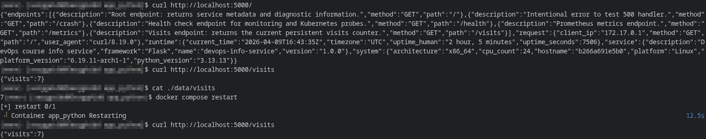
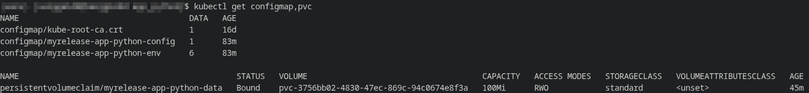
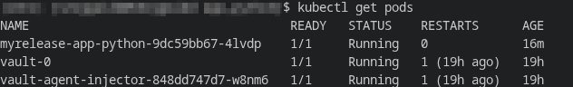
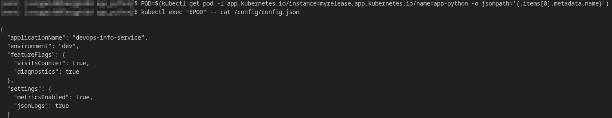
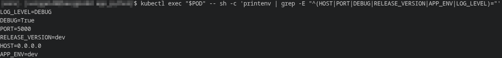
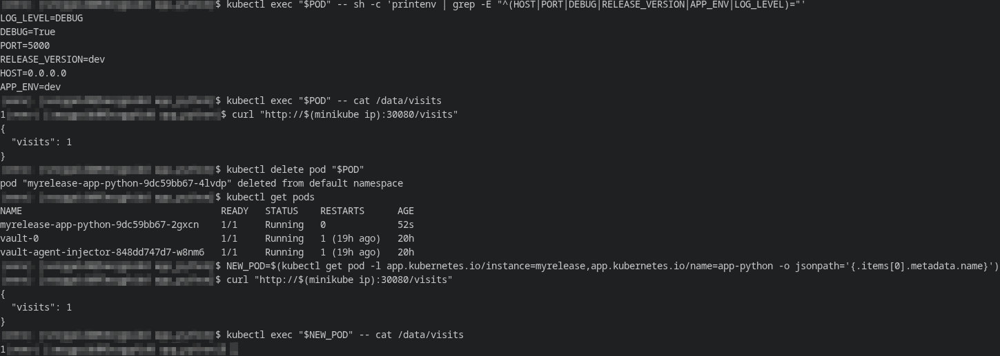
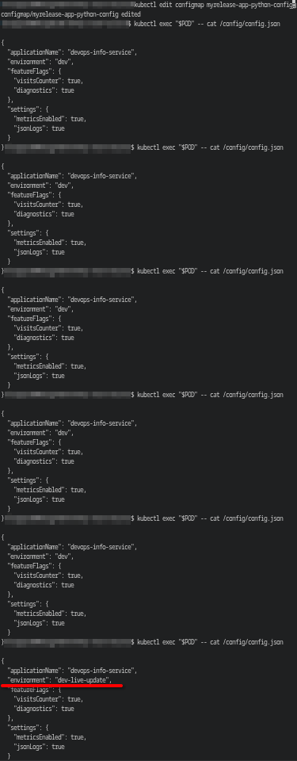
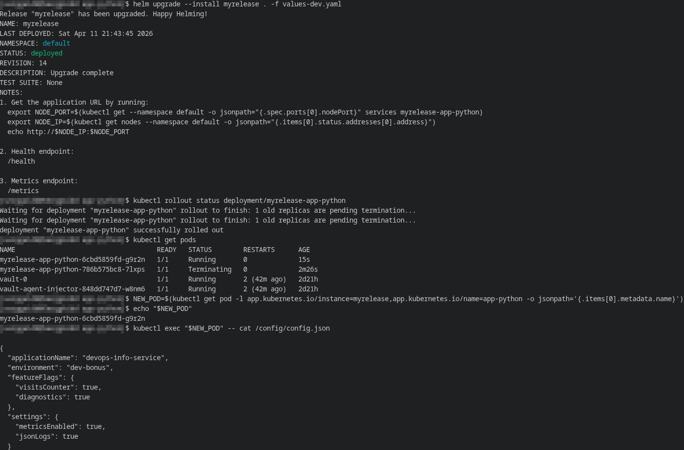

# Lab 12 — ConfigMaps & Persistent Volumes

## 1. Application Changes
### Description of visits counter implementation
A persistent visitor counter logic was added to the Flask application: with each request to the root endpoint `/`, the application reads the current counter value from the file `/data/visits` (if it doesn't exist, it's automatically created with the value `0`), increments it by 1, and saves it back. Helper functions for reading, writing, and incrementing the counter were added to work with it. To ensure correct file updates, process-level locking and atomic writes to a temporary file followed by replacement of the target file are used, reducing the risk of value corruption during concurrent requests.

### New endpoint documentation
A new endpoint, `/visits`, has been added, which returns the current counter value in JSON format. Example response:
```json
{
  "visits": 1
}
```

### Local testing evidence with Docker



---

## 2. ConfigMap Implementation

### ConfigMap template structure
To complete the task, two separate ConfigMaps were implemented, each described by a separate Helm template:

1. **`templates/configmap-file.yaml`** is a ConfigMap template used to pass the `config.json` file into the container. The file's contents are retrieved from `files/config.json` via `.Files.Get` and `tpl`, allowing the configuration to be stored separately from the Kubernetes manifests and values ​​to be substituted from `values.yaml`.
2. **`templates/configmap-env.yaml`** is a ConfigMap template used to pass non-sensitive application startup parameters via environment variables. It contains the `HOST`, `PORT`, `DEBUG`, `RELEASE_VERSION`, `APP_ENV`, and `LOG_LEVEL` keys. These values ​​are then passed to the container via `envFrom`, allowing for centralized management of the application's runtime configuration.

### `config.json` content
The file `files/config.json` contained non-sensitive application parameters:
- application name;
- environment;
- feature flags;
- additional settings.

After rendering for the dev environment, the file inside the pod looks like this:

```json
{
  "applicationName": "devops-info-service",
  "environment": "dev",
  "featureFlags": {
    "visitsCounter": true,
    "diagnostics": true
  },
  "settings": {
    "metricsEnabled": true,
    "jsonLogs": true
  }
}
```

### How ConfigMap is mounted as file
The `config-volume` volume, associated with the File ConfigMap, was added to `deployment.yaml`. This volume is mounted in the container at `/config` in `readOnly` mode, so the file is accessible within the pod as `/config/config.json`.

### How ConfigMap provides environment variables
The second ConfigMap contains environment variables. During deployment, they are included via `envFrom`, allowing the container to automatically obtain the entire set of variables without explicitly listing each key in `env`.

### Verification outputs

**Created ConfigMaps and PVC:**


**Pod status:**


**File content inside pod:**


**Environment variables inside pod:**


---

## 3. Persistent Volume
To store the visit counter, a template `templates/pvc.yaml` was added, creating a `PersistentVolumeClaim` with parameters from `values.yaml`.

### PVC configuration explanation
The PVC is created with a request for 100Mi of disk space. The persistence.storageClass parameter is used, which can be overridden using values. In the current configuration, the value is left blank, so the Minikube cluster's default storage class is used.

### Access modes and storage class discussion
The PVC access mode was set to ReadWriteOnce, which allows the volume to be mounted for writing by one node at a time, as the application runs on a single replica and uses a single counter file.

After applying the chart, the PVC successfully transitioned to the Bound state, and Kubernetes allocated the volume using the standard storage class provided by Minikube.

### Volume mount configuration
To use PVC, a volume named `data-volume` was added to `deployment.yaml`, mounted in the container at the `/data` path (where the `visits` file is saved).

### Persistence test evidence


Before deleting the pod, the counter value was 1. After starting a new pod, the value remained at 1. This confirms that the data is stored on a persistent volume, not in the container's filesystem.

---

## 4. ConfigMap vs Secret

### When to use ConfigMap
ConfigMap should be used for non-sensitive application parameters:

- Application name;
- Environment;
- Feature flags;
- Log levels;
- Normal service operation parameters.


### When to use Secret
Secret should be used for sensitive data:

- logins and passwords;
- API keys;
- tokens;
- certificates and other confidential values.

### Key differences
The main difference lies in their purpose:

- **ConfigMap** is for regular configuration and is used to separate code and startup parameters.
- **Secret** is for sensitive data and should be used instead of ConfigMap for passwords and other secret values.

In this lab, ConfigMap was used for config.json and application environment variables, while Secret remained a separate object for storing credentials from the previous lab.

---

## Bonus — ConfigMap Hot Reload
### Update delay measurement
To verify the default ConfigMap update behavior, I modified the `myrelease-app-python-config` resource using the `kubectl edit configmap myrelease-app-python-config` command. After saving the changes, the `/config/config.json` file in the already running pod was not updated immediately, but rather after a delay of approximately 15 seconds. This confirms that the mounted ConfigMap is updated asynchronously, without re-creating the pod.


### subPath limitation explanation
The ConfigMap is mounted as the `/config` directory, rather than via `subPath`, as this option allows Kubernetes to update the file's contents using the standard mechanism. `subPath` is only appropriate when a fixed path to the file is needed and live updating is not required. It is not suitable for scenarios where automatic updating of the ConfigMap within an already running container is required (the container receives a separate file, and further ConfigMap changes are not automatically updated to it).

### Chosen reload approach implementation
The **pod restart via annotations** approach was chosen as the configuration reload mechanism. To achieve this, the `checksum/config-file` and `checksum/config-env` annotations were added to `templates/deployment.yaml`. Their values ​​are calculated based on `templates/configmap-file.yaml` and `templates/configmap-env.yaml`. When the ConfigMap changes, the checksum changes, Kubernetes detects the pod template change, and creates a new ReplicaSet.

### Evidence of configuration reload working

After the update, the old pod started terminating, a new pod with a different name was created, and a new value, `environment: "dev-bonus"`, appeared in the `/config/config.json` file. This confirms that the checksum annotations worked correctly and the pod was recreated with the updated configuration.