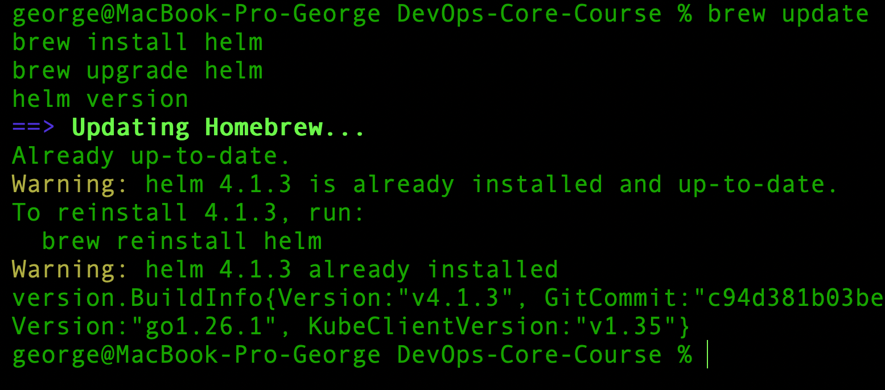
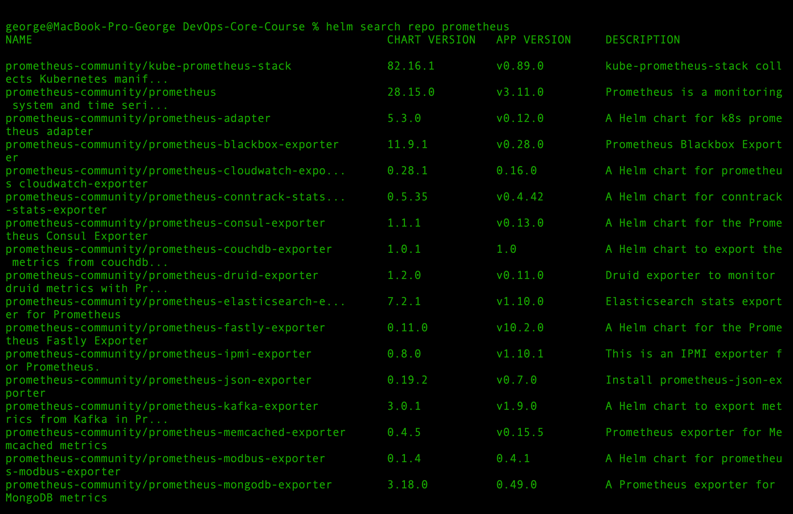
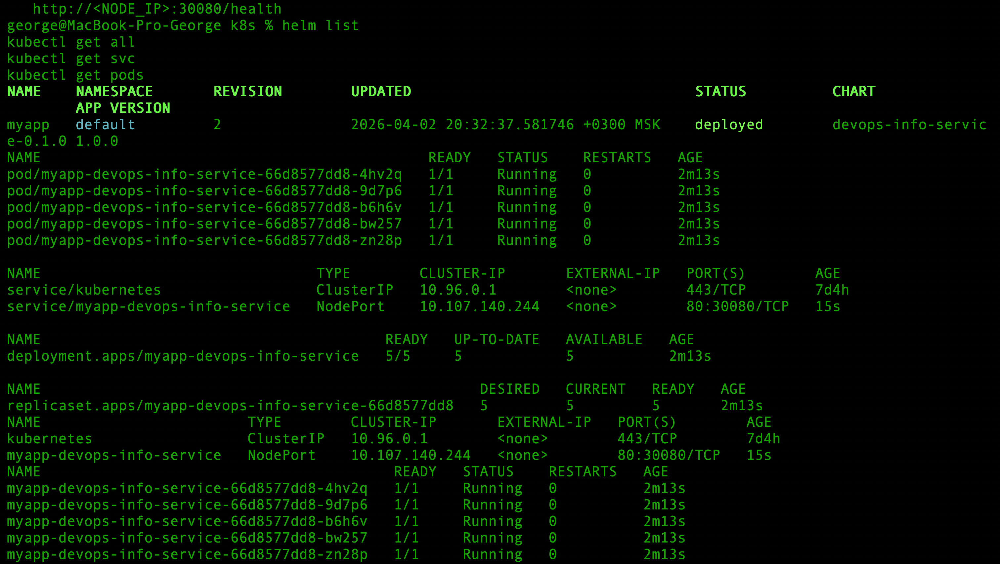
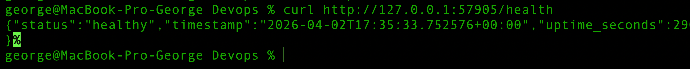
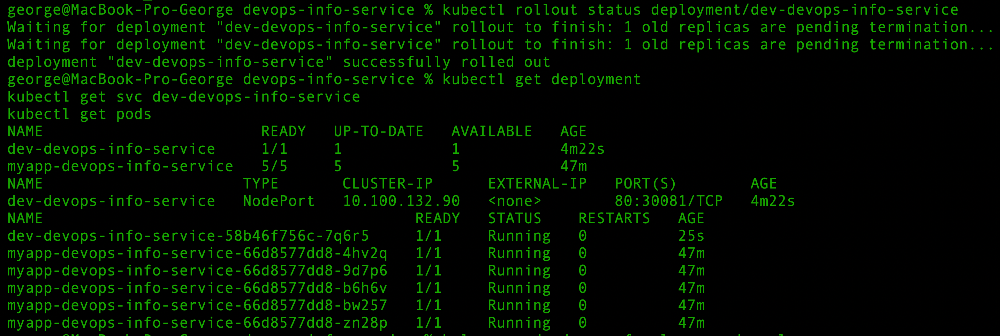
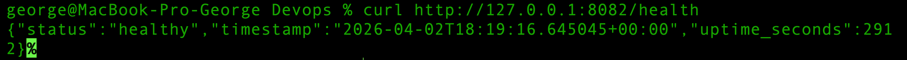
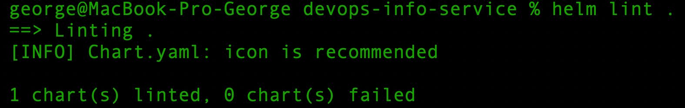
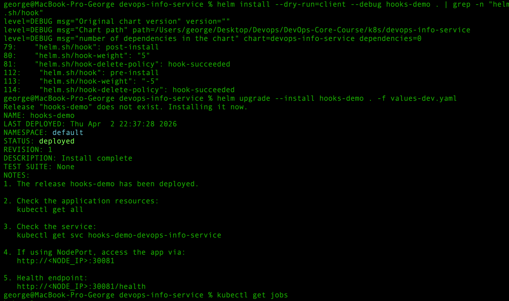
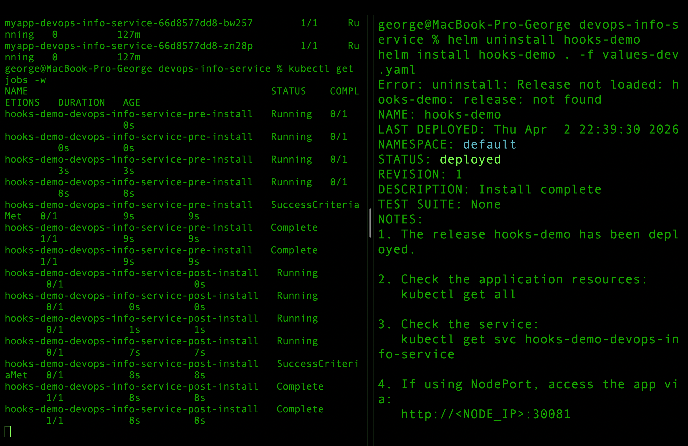
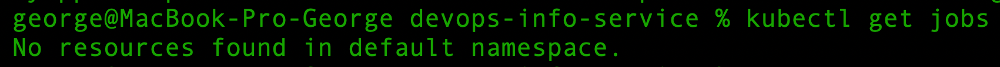

# Lab 10 — Helm Package Manager

# Task 1 — Helm Fundamentals

### Key concepts

* **Chart** — a package of Kubernetes resources
* **Release** — a deployed instance of a chart in a Kubernetes cluster
* **Repository** — a collection of Helm charts

Helm is useful because it provides:

* templating for Kubernetes manifests
* reusable configuration through values files
* versioning and rollback support
* standardized application packaging

## Helm Installation

Helm CLI was installed successfully and verified.

### Command

```bash
brew install helm
helm version
```

### Output



## Adding Public Repositories

Two common public repositories were added: Prometheus Community and Grafana.

### Commands

```bash
helm repo add prometheus-community https://prometheus-community.github.io/helm-charts
helm repo add grafana https://grafana.github.io/helm-charts
helm repo update
helm repo list
```

### Output

```bash
NAME                	URL                                               
prometheus-community	https://prometheus-community.github.io/helm-charts
grafana             	https://grafana.github.io/helm-charts  
```

## Searching Public Charts

A search was performed in the Prometheus repository.

### Command

```bash
helm search repo prometheus
```

### Output



## Inspecting a Public Chart

The Prometheus chart was inspected to understand its structure and metadata.

### Command

```bash
helm show chart prometheus-community/prometheus
```

### Output (brief version)

```yaml
...
apiVersion: v2
name: prometheus
type: application
version: 28.15.0
appVersion: v3.11.0
description: Prometheus is a monitoring system and time series database.
keywords:
  - monitoring
  - prometheus
dependencies:
  - alertmanager
  - kube-state-metrics
  - prometheus-node-exporter
  - prometheus-pushgateway
  ...
```

This output shows that a Helm chart contains metadata such as chart version, application version, description, and dependencies.

## Inspecting Chart Values

The default configuration of the chart was also inspected.

### Command

```bash
helm show values prometheus-community/prometheus
```

### Summary

The chart provides many configurable parameters, including:

* RBAC settings
* image configuration
* service settings
* resource requests and limits
* liveness and readiness probes
* persistent storage settings

This demonstrates how Helm charts separate templates from configuration by using values files.

---

# Task 2 — Create Your Helm Chart

## Chart Structure

The Helm chart is organized as follows:


```text
devops-info-service/
  Chart.yaml
  values.yaml
  values-dev.yaml
  values-prod.yaml
  templates/
    deployment.yaml
    service.yaml
    _helpers.tpl
    hooks/
      pre-install-job.yaml
      post-install-job.yaml
```

Key components:


- `Chart.yaml` — chart metadata
- `values.yaml` — default configuration
- `values-dev.yaml`, `values-prod.yaml` — environment-specific overrides
- `templates/` — Kubernetes manifests with Helm templating
- `_helpers.tpl` — reusable template functions
- `hooks/` — lifecycle hook Jobs


---

## Chart Initialization

A Helm chart named `devops-info-service` was created in the `k8s/` directory:

```bash
helm create devops-info-service
```

The `Chart.yaml` file was updated with relevant metadata such as chart name, version, and description.

## Converting Manifests to Templates

The original Kubernetes manifests were converted into Helm templates:

* `deployment.yml` → `templates/deployment.yaml`
* `service.yml` → `templates/service.yaml`

All static values were replaced with Go template expressions using `.Values`.

## Values Configuration

Configuration was extracted into `values.yaml`, including:

* image repository and tag
* replica count
* service type and ports
* environment variables
* resource requests and limits
* readiness and liveness probes

This allows flexible configuration without modifying templates.

## Helper Templates

Reusable labels and naming conventions were implemented in `_helpers.tpl`, improving consistency across resources.

## Health Checks

Liveness and readiness probes were preserved and made configurable via `values.yaml`. They were not removed or commented out, ensuring proper application monitoring.

## Chart Validation

The chart was validated using:

```bash
helm lint devops-info-service
helm template test devops-info-service
helm install --dry-run=client --debug test-release devops-info-service
```

All checks completed successfully, confirming correct template rendering and configuration.

## Deployment

The chart was deployed to a local Kubernetes cluster:

```bash
helm upgrade --install myapp devops-info-service
```

The deployment created:

* `Deployment/myapp-devops-info-service`
* `Service/myapp-devops-info-service`

## Verification

The deployment was verified using:

```bash
helm list
kubectl get all
kubectl get svc
kubectl get pods
```

### Output



Results:
* Helm release status: **deployed**
* Deployment replicas: **5/5 running**
* Service type: **NodePort (30080)**

Application availability was confirmed:

```bash
curl http://127.0.0.1:<port>/health
```

Output:




## Notes
The initial installation failed due to a NodePort conflict (`30080`) with an existing service from the previous lab. After removing the old resources, the Helm release was deployed successfully.

---

# Task 3 — Multi-Environment Support

## Objective

The goal of this task was to configure the Helm chart for multiple environments using separate values files.

## Environment-Specific Values

Two environment-specific values files were created:

* `values-dev.yaml`
* `values-prod.yaml`

These files override the default `values.yaml` configuration for different deployment scenarios.

## Development Configuration

The development environment was configured with:

* `replicaCount: 1`
* lower CPU and memory requests/limits
* `NodePort` service
* `nodePort: 30081`
* `DEBUG: "true"`
* `RELEASE_VERSION: "dev"`

The dev configuration was first validated with:

```bash
helm install --dry-run=client --debug dev-release . -f values-dev.yaml
```

The rendered output confirmed that the chart used:

* 1 replica
* image tag for development
* reduced resources
* NodePort `30081`

The dev release was then installed:

```bash
helm upgrade --install dev . -f values-dev.yaml
```



Deployment verification showed:
* `1/1` replica ready
* service exposed on `80:30081/TCP`
* pod status `Running`

Application health was confirmed successfully.

## Production Configuration

The production environment was configured with:

* `replicaCount: 3`
* higher CPU and memory requests/limits
* `NodePort` service
* `nodePort: 30082`
* `DEBUG: "false"`
* `RELEASE_VERSION: "prod"`

The existing `dev` release was upgraded using the production values file:

```bash
helm upgrade dev . -f values-prod.yaml
```

After rollout completion, the deployment showed:

* `3 desired | 3 updated | 3 available`
* image `egorlazutkin/devops-info-service:lab2`
* increased resource limits
* `DEBUG=false`
* service exposed on `80:30082/TCP`

## Verification

The environment transition was verified using:

```bash
helm history dev
kubectl describe deployment dev-devops-info-service
kubectl get svc dev-devops-info-service
kubectl get pods
```

The Helm release history confirmed multiple revisions and a successful upgrade from development to production configuration.

The application was also checked after the production upgrade:

```bash
curl http://127.0.0.1:8082/health
```

Output:



---

# Task 4 — Chart Hooks

## Hook Configuration

Two hook-based Jobs were added to the chart:

* `pre-install` hook
* `post-install` hook

They were placed in:

* `templates/hooks/pre-install-job.yaml`
* `templates/hooks/post-install-job.yaml`

Both hooks use proper Helm annotations:

* `helm.sh/hook`
* `helm.sh/hook-weight`
* `helm.sh/hook-delete-policy`

## Hook Behavior

### Pre-install hook

The pre-install Job runs before the main application resources are installed.
It was used to simulate a validation step before deployment.

### Post-install hook

The post-install Job runs after the release is installed.
It was used to simulate a smoke test / post-deployment check.

## Hook Execution Order

Hook execution order was controlled with weights:

* `pre-install` weight: `-5`
* `post-install` weight: `5`

This ensured that the pre-install Job executed first, and the post-install Job executed later.

## Hook Deletion Policy

Both hooks used:

```yaml
helm.sh/hook-delete-policy: hook-succeeded
```

This means successful hook Jobs are automatically removed after completion.

## Validation

The chart was validated with:

```bash
helm lint .
```

Result:



## Dry-Run Verification

Hooks were confirmed in the rendered output using:

```bash
helm install --dry-run=client --debug hooks-demo . | grep -n "helm.sh/hook"
```


The output showed:



* `helm.sh/hook: pre-install`
* `helm.sh/hook-weight: "-5"`
* `helm.sh/hook-delete-policy: hook-succeeded`
* `helm.sh/hook: post-install`
* `helm.sh/hook-weight: "5"`
* `helm.sh/hook-delete-policy: hook-succeeded`

## Hook Execution Verification

A separate release was installed for testing:

```bash
helm upgrade --install hooks-demo . -f values-dev.yaml
```

Hook execution was observed using:

```bash
kubectl get jobs -w
```



Observed sequence:
1. `hooks-demo-devops-info-service-pre-install` started and completed
2. `hooks-demo-devops-info-service-post-install` started and completed

This confirmed that both hooks executed successfully in the correct order.

## Deletion Verification

After hook completion, the following command returned no Jobs:

```bash
kubectl get jobs
```

Output:



Hooks were automatically cleaned up after successful execution, as confirmed by `kubectl get jobs`. This confirmed that the `hook-succeeded` deletion policy worked correctly. 


---

# Operations

## Install

Install a new release:

```bash
helm install myapp devops-info-service
```


Upgrade an existing release with new configuration:

```bash
helm upgrade myapp devops-info-service -f values-prod.yaml
```

## Rollback

Rollback to a previous revision:

```bash
helm rollback myapp 1
```

## Uninstall

Remove the release and all associated resources:

```bash
helm uninstall myapp
```

# Testing & Validation

The chart was validated using standard Helm commands.  
Command outputs and results are provided in previous sections via terminal logs and screenshots.

## Lint

```bash
helm lint devops-info-service
```

Result: no errors (see screenshot above).

## Template Rendering

```bash
helm template test devops-info-service
```

Verified that templates render correctly.

## Dry Run

```bash
helm install --dry-run=client --debug test-release devops-info-service
```

Confirmed correct resource generation before deployment.

## Application Check

```bash
curl http://127.0.0.1:<port>/health
```

The application returned a healthy status, confirming successful deployment.


