# Lab 10 — Helm Package Manager

## 1. Chart Overview
### Chart structure
A Helm chart `app-python` was created, located in the `k8s/app-python` directory, with the following structure:
```text
k8s/app-python/
├── Chart.yaml
├── values.yaml
├── values-dev.yaml
├── values-prod.yaml
└── templates/
    ├── _helpers.tpl
    ├── deployment.yaml
    ├── service.yaml
    ├── NOTES.txt
    └── hooks/
        ├── pre-install-job.yaml
        └── post-install-job.yaml
```
The chart structure was organized according to the standard Helm principle: chart metadata and value files are located at the root, and Kubernetes resource templates are located in the `templates/` directory.

### Key template files

- `Chart.yaml` — chart metadata: name, description, type, chart version, and application version;
- `templates/_helpers.tpl` — auxiliary templates for uniform formation of release names and labels;
- `templates/deployment.yaml` — Deployment template for a Flask application;
- `templates/service.yaml` — Service template with `NodePort` and `LoadBalancer` support;
- `templates/NOTES.txt` — hint after installing chart;
- `templates/hooks/pre-install-job.yaml` — pre-install hook for pre-installation checking;
- `templates/hooks/post-install-job.yaml` — post-install hook for post-installation checking;

### Values organization strategy

The parameters are organized into functional blocks (simplifies chart maintenance and makes changes between environments predictable):

- `image` — container image settings;
- `service` — service type and ports;
- `container` — application port within the container;
- `env` — environment variables;
- `resources` — requests/limits;
- `livenessProbe` / `readinessProbe` — health checks;
- `strategy` — rolling update strategy;
- `hooks` — lifecycle hook parameters;

---

## 2. Configuration Guide

### Important values

#### Base configuration
- `replicaCount` — the number of application replicas;
- `image.repository` — the Docker image repository;
- `image.tag` — the Docker image tag;
- `image.pullPolicy` — the image pull policy;
- `container.port` — the port the application listens on inside the container;
- `service.type` — the Kubernetes Service type (`NodePort` or `LoadBalancer`);
- `service.port` — the service's external port;
- `service.targetPort` — the container port to which traffic is directed;
- `service.nodePort` — a fixed NodePort for the dev configuration;
- `env.host`, `env.port`, `env.debug`, `env.releaseVersion` — application environment variables;
- `resources.requests` / `resources.limits` — CPU and memory;
- `livenessProbe.*` / `readinessProbe.*` — container health check parameters;
- `hooks.*` — hook enablement, weights, and removal policy.

### Environment-specific customization

#### values-dev.yaml
Dev configuration is used for simplified launch and debugging:
- `replicaCount: 1`;
- `image.tag: latest`;
- `service.type: NodePort`;
- reduced requests/limits;
- `DEBUG=True`;
- `RELEASE_VERSION=dev`;
- faster timings of health checks.

#### values-prod.yaml
Prod configuration is used for more realistic deployment:
- `replicaCount: 3`;
- fixed image tag `2026.03.16`;
- `service.type: LoadBalancer`;
- production requests/limits;
- `DEBUG=False`;
- `RELEASE_VERSION=prod`;
- more conservative `livenessProbe` timings.

### Example installations

#### Default installation
```bash
helm install myrelease app-python
```

#### Development installation
```bash
helm install myrelease app-python -f app-python/values-dev.yaml
```

#### Production upgrade
```bash
helm upgrade myrelease app-python -f app-python/values-prod.yaml
```

---

## 3. Hook Implementation

The chart implements two lifecycle hooks in the form of a Kubernetes Job.

### Implemented hooks

#### Pre-install hook (file `templates/hooks/pre-install-job.yaml`):
Purpose:
- Perform pre-installation checks
- Simulate the validation step before installing a release

Annotations:
- `helm.sh/hook: pre-install`
- `helm.sh/hook-weight: "-5"`
- `helm.sh/hook-delete-policy: "hook-succeeded"`

#### Post-install hook (file `templates/hooks/post-install-job.yaml`):
Purpose:
- Perform a post-installation check
- Simulate a smoke check after installing a release

Annotations:
- `helm.sh/hook: post-install`
- `helm.sh/hook-weight: "5"`
- `helm.sh/hook-delete-policy: "hook-succeeded"`

### Hook execution order and weights
The order of execution is determined by the hook type and its weight:
- first, `pre-install` is executed with a weight of `-5`
- after the resources are installed, `post-install` is executed with a weight of `5`

### Deletion policies explanation
Both hooks use the `hook-succeeded` policy, which means that the Job is automatically deleted after successful completion, thus avoiding polluting the namespace with temporary resources.

---

## 4. Installation Evidence

### helm list output
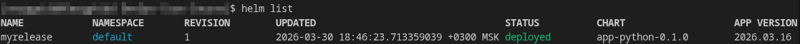

### kubectl get all showing deployed resources
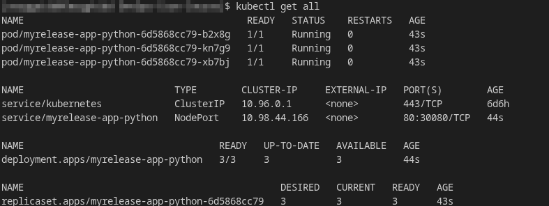

The following were deployed:
- Deployment `myrelease-app-python`
- ReplicaSet `myrelease-app-python-*`
- Service `myrelease-app-python`
- Application Pods in the `Running` state

### Hook execution output (`kubectl get jobs`, `kubectl describe job`)
Lifecycle hooks were verified during the release installation process.

#### Commands used :
- `helm install myrelease app-python`: 

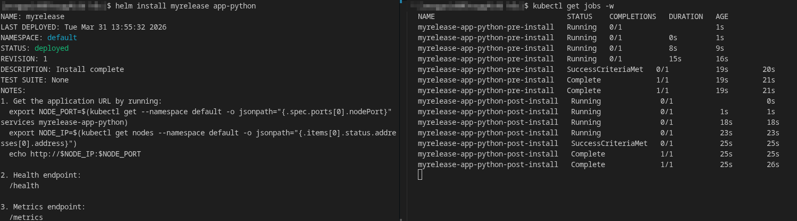
- `helm get hooks myrelease`:

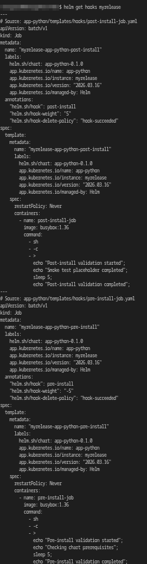
- `kubectl get jobs` and `kubectl describe job`:

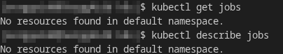

What was confirmed:
- The `pre-install` hook was indeed run before the main installation;
- The `post-install` hook was run after the release was installed;
- Both hooks were registered in the release `myrelease`;
- After successful execution, hook jobs were automatically removed in accordance with the `hook-succeeded` policy;
- After completing the hooks, the `kubectl get jobs` and `kubectl describe job` commands returned `No resources found in default namespace`.

### Different environment deployments (dev vs prod)

To test support for multiple environments, chart was installed with the dev configuration and then upgraded to the prod configuration.

#### Dev deployment (file `app-python/values-dev.yaml`):
Verified:
- `replicaCount: 1`
- `image.tag: latest`
- `service.type: NodePort`
- `DEBUG=True`
- `RELEASE_VERSION=dev`

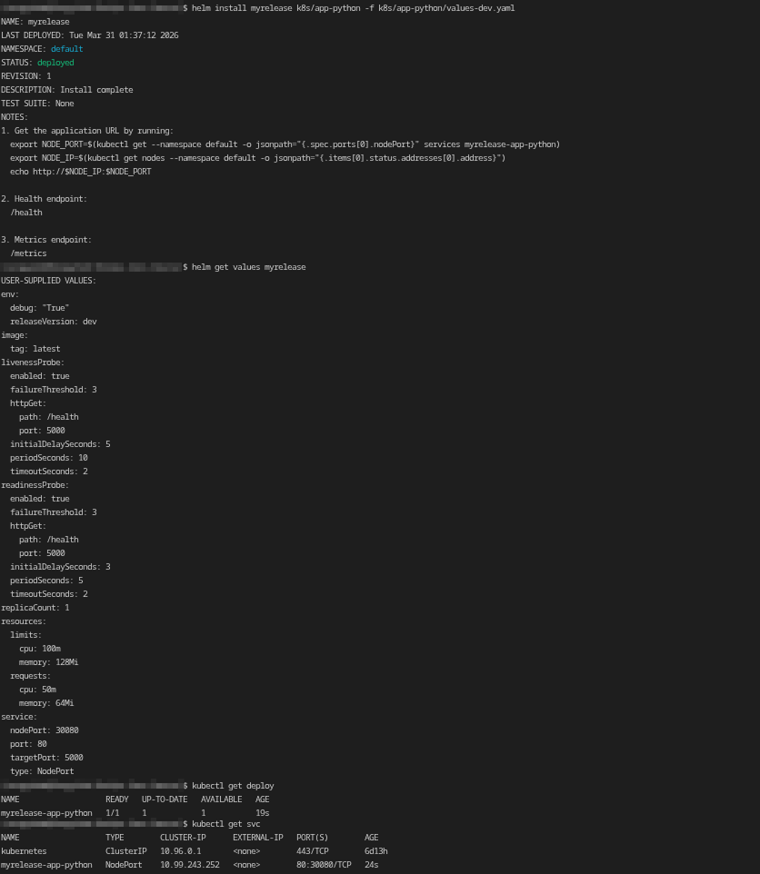

#### Prod deployment (file `app-python/values-prod.yaml`):
Verified:
- `replicaCount: 3`
- `image.tag: 2026.03.16`
- `service.type: LoadBalancer`
- `DEBUG=False`
- `RELEASE_VERSION=prod`
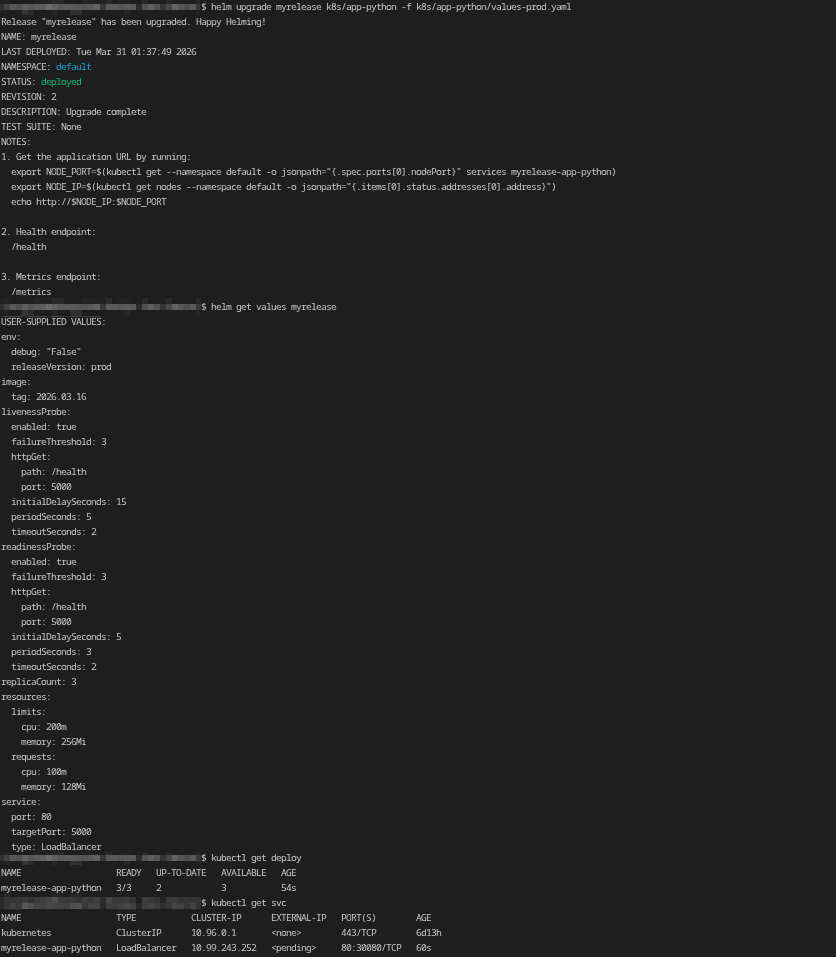

---

## 5. Operations

### Installation commands used
- `helm install myrelease app-python` - install with default values
- `helm install myrelease app-python -f app-python/values-dev.yaml` - install with development values

### How to upgrade a release
```bash
helm upgrade myrelease app-python -f app-python/values-prod.yaml
```

### How to rollback
To roll back a release, view the revision history and rollback to the desired version:
```bash
helm history myrelease
helm rollback myrelease 1
```

### How to uninstall
```bash
helm uninstall myrelease
```

---

## 6. Testing & Validation

### helm lint output
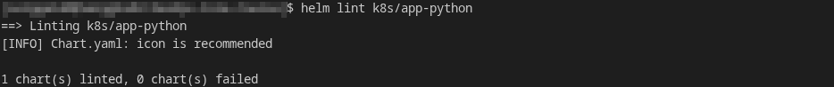

### helm template verification (command `helm template test-release app-python`):
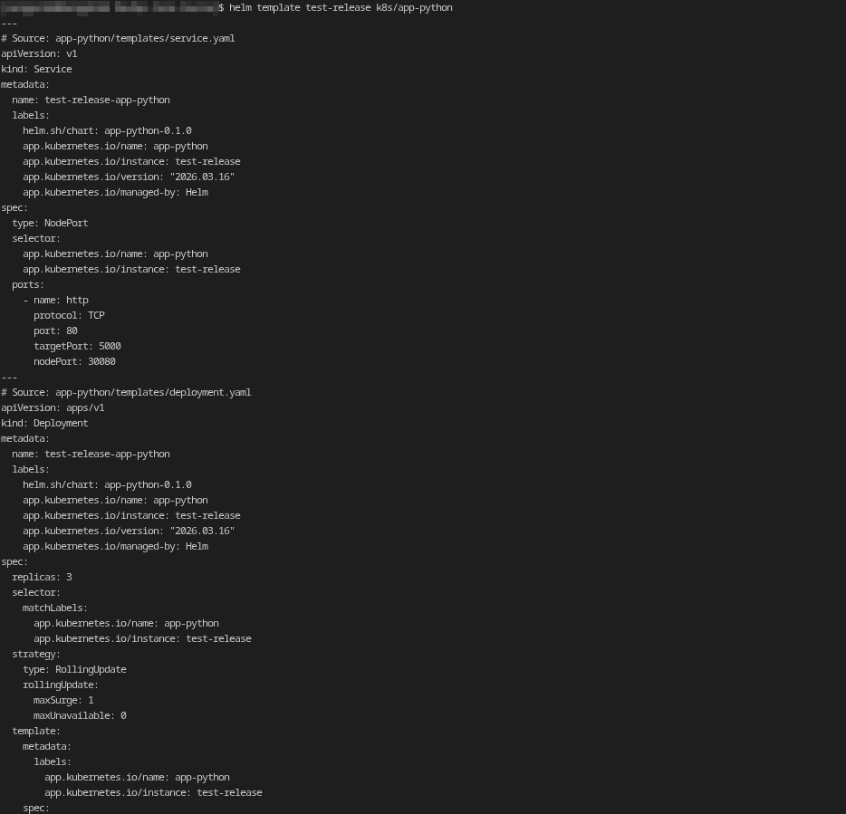
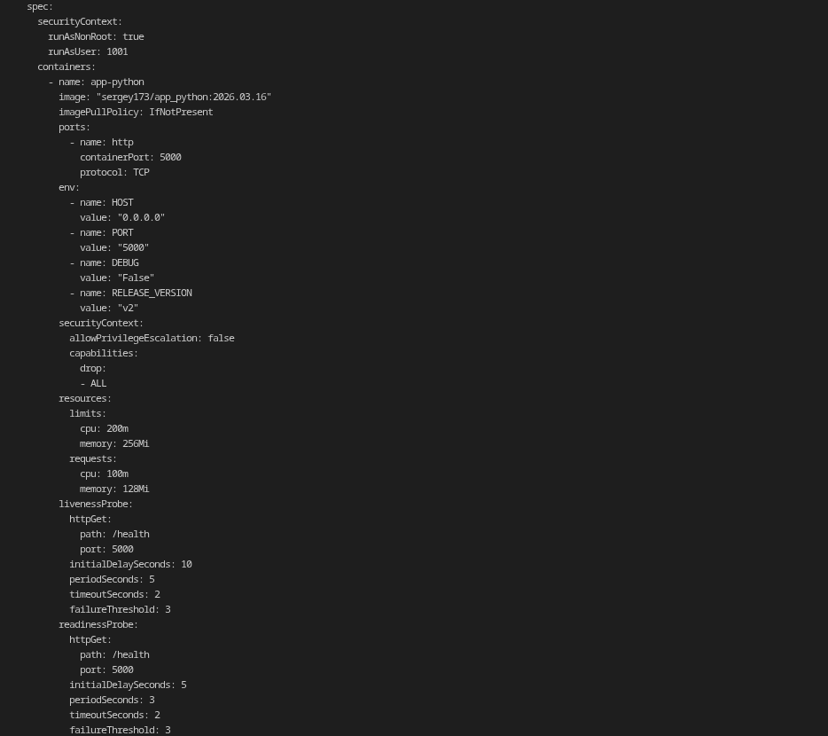

It has been confirmed that the chart renders correctly:
- `Service`;
- `Deployment`;
- `pre-install` hook Job;
- `post-install` hook Job.

### Dry-run output (command `helm install --dry-run=client --debug test-release app-python`)
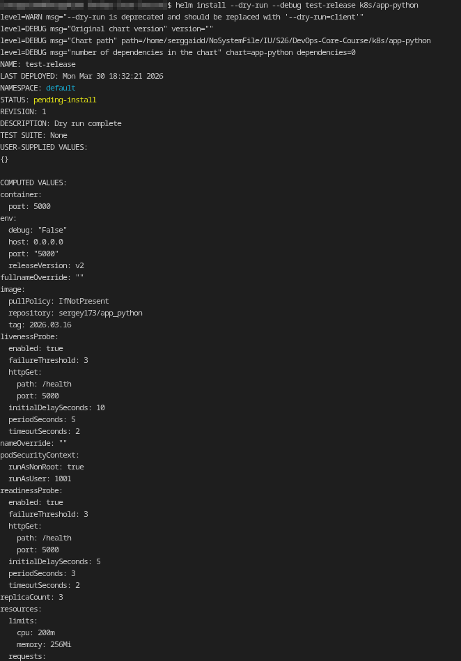
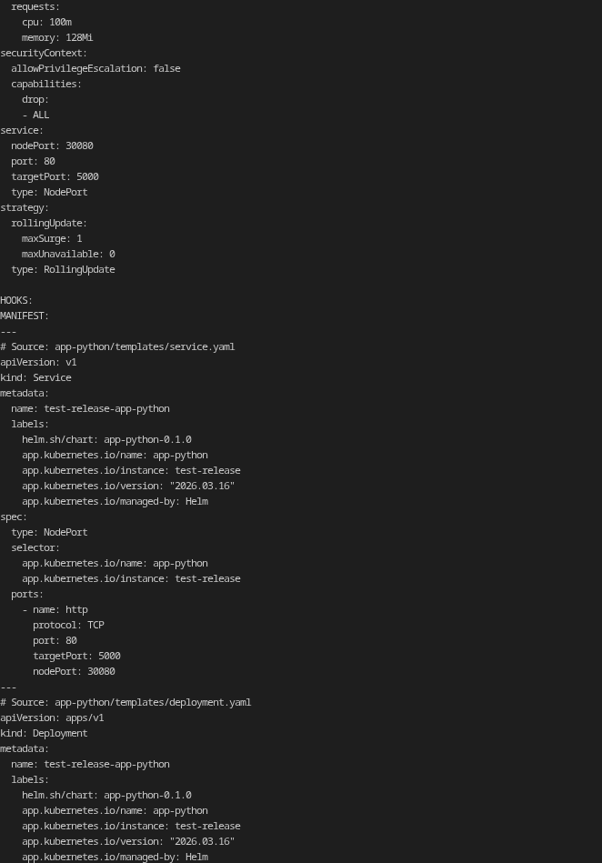
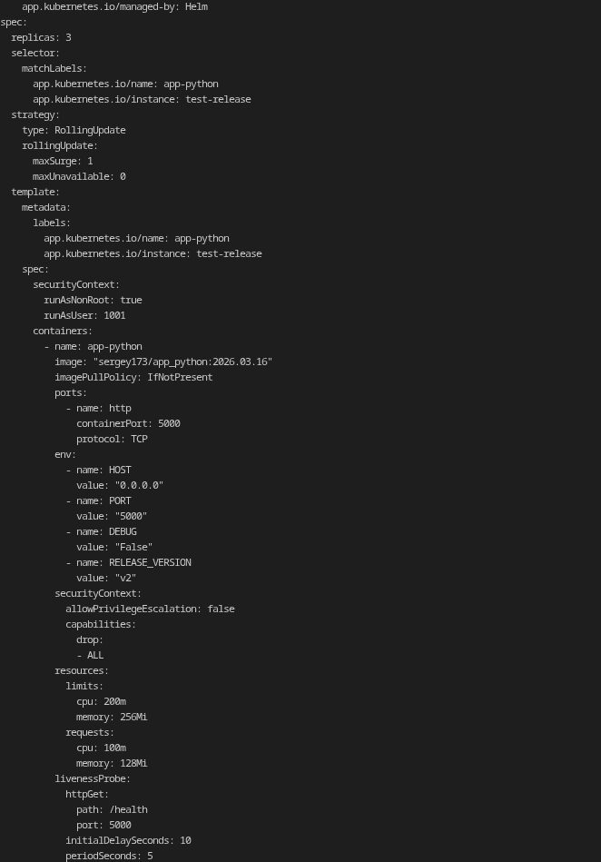
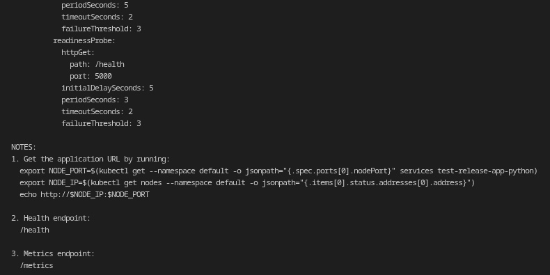

Confirmed:
- Helm correctly recognizes lifecycle hooks
- The `HOOKS:` block is generated correctly
- The resulting manifest matches the expected chart configuration


### Application accessibility verification
To obtain the service address, commands from `NOTES.txt` were used, after which the application availability was checked through the service (endpoints `/`, `/health` and `/metrics`)
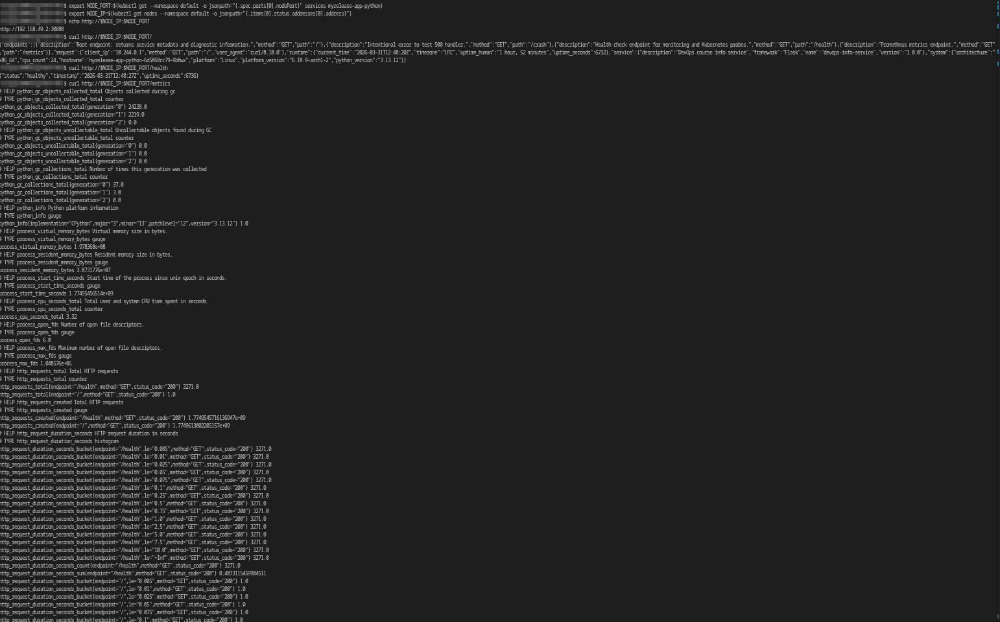

---

Additional artifacts and command execution confirmations (screenshots) that were not requested in Task 5 can be found in `/screenshots/LAB10` in files starting with `add`.

