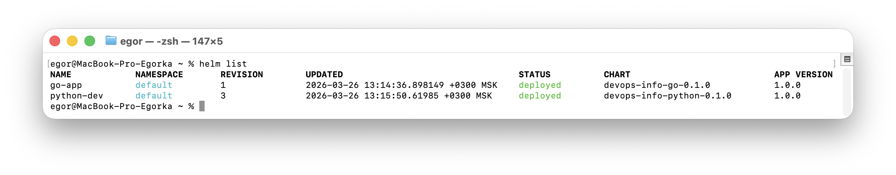
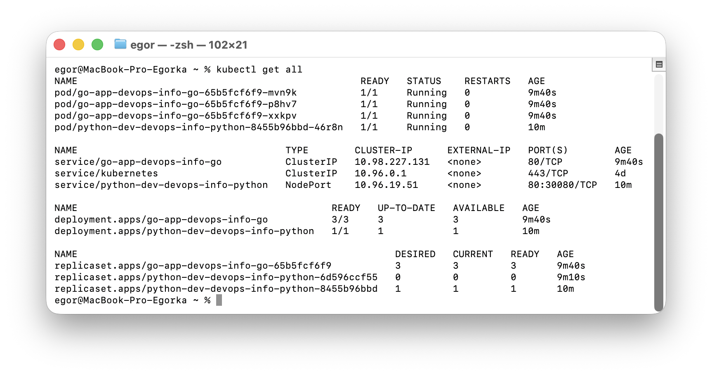
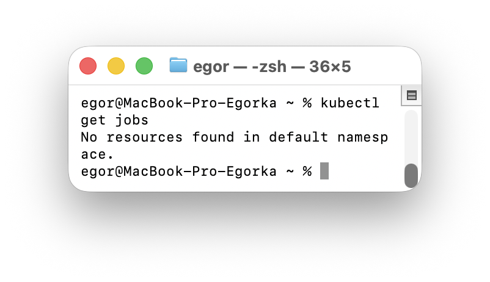
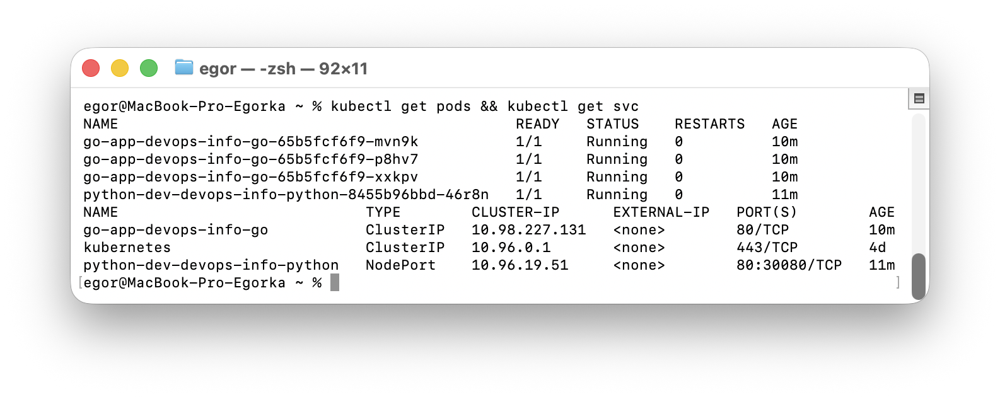
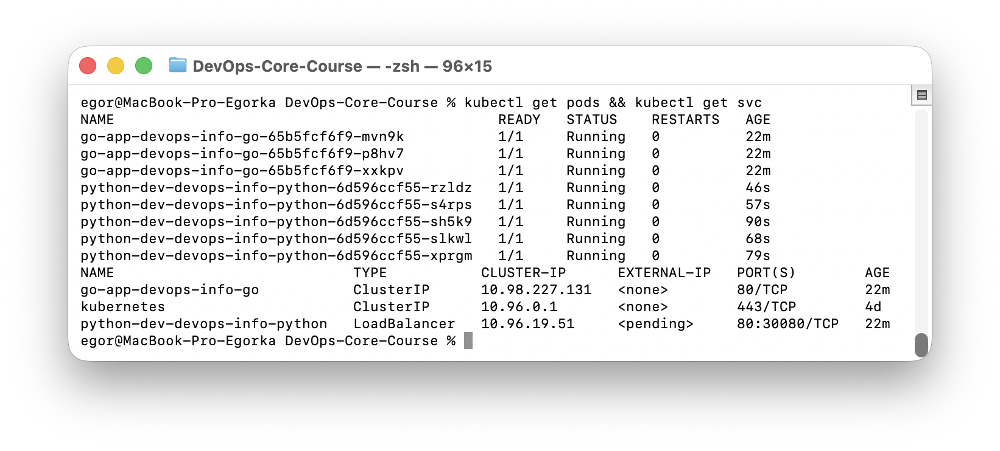
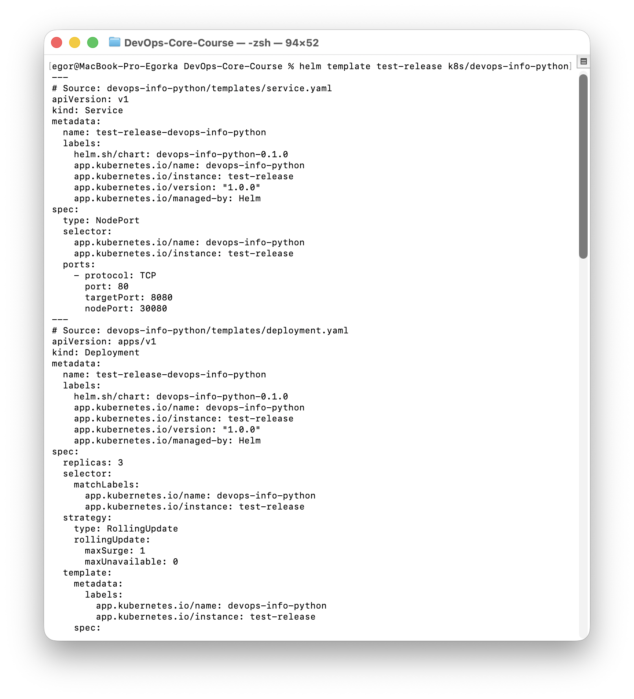
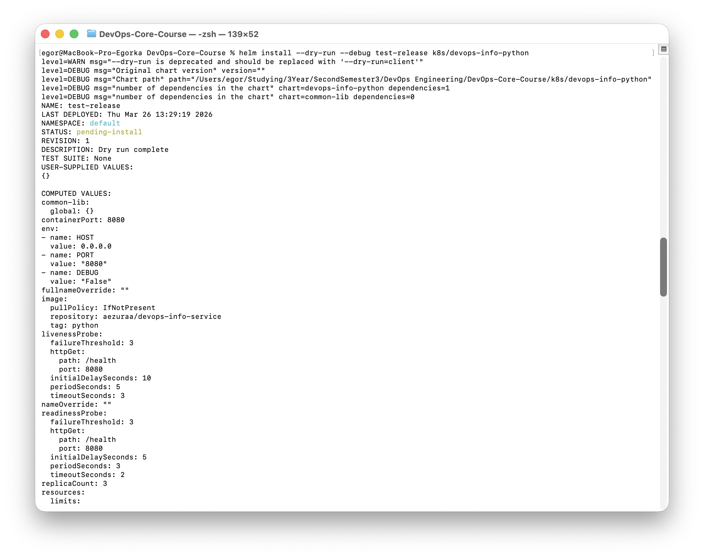
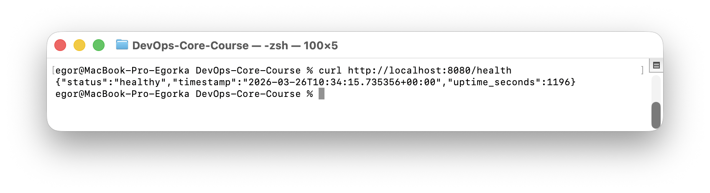
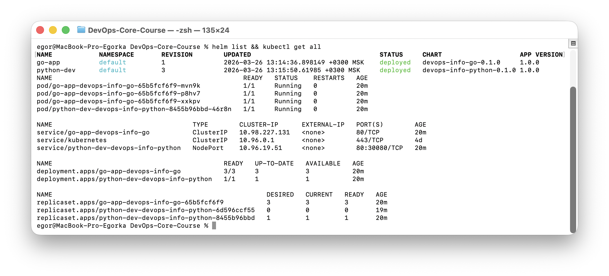

# Lab 10 — Helm Package Manager

## 1. Chart Overview

### Chart Structure

```
k8s/
├── common-lib/                    # Library chart (shared templates)
│   ├── Chart.yaml
│   └── templates/
│       └── _helpers.tpl           # Common name/label/selector helpers
├── devops-info-python/            # Python app chart
│   ├── Chart.yaml
│   ├── values.yaml                # Default values
│   ├── values-dev.yaml            # Dev environment overrides
│   ├── values-prod.yaml           # Prod environment overrides
│   ├── charts/                    # Dependency archives (auto-generated)
│   └── templates/
│       ├── _helpers.tpl           # Re-exports common-lib helpers
│       ├── deployment.yaml
│       ├── service.yaml
│       ├── NOTES.txt
│       └── hooks/
│           ├── pre-install-job.yaml
│           └── post-install-job.yaml
└── devops-info-go/                # Go app chart
    ├── Chart.yaml
    ├── values.yaml
    ├── charts/
    └── templates/
        ├── _helpers.tpl
        ├── deployment.yaml
        ├── service.yaml
        └── NOTES.txt
```

### Key Template Files

| File | Purpose |
|------|---------|
| `_helpers.tpl` | Name generation, labels, selector labels (DRY via common-lib) |
| `deployment.yaml` | Templated Deployment with configurable replicas, image, resources, probes |
| `service.yaml` | Templated Service with configurable type (NodePort/ClusterIP/LoadBalancer) |
| `hooks/pre-install-job.yaml` | Pre-install validation Job |
| `hooks/post-install-job.yaml` | Post-install smoke test Job |
| `NOTES.txt` | Dynamic post-install instructions |

### Values Organization

Values are structured hierarchically:
- `image.*` — repository, tag, pullPolicy
- `service.*` — type, port, targetPort, nodePort
- `resources.*` — CPU/memory requests and limits
- `livenessProbe.*` / `readinessProbe.*` — health check configuration
- `strategy.*` — deployment strategy
- `env` — environment variables list

---

## 2. Configuration Guide

### Important Values

| Value | Default | Description |
|-------|---------|-------------|
| `replicaCount` | 3 | Number of pod replicas |
| `image.repository` | `aezuraa/devops-info-service` | Docker image |
| `image.tag` | `python` | Image tag |
| `image.pullPolicy` | `IfNotPresent` | Pull policy |
| `service.type` | `NodePort` | Service type |
| `service.port` | 80 | Service port |
| `service.targetPort` | 8080 | Container port |
| `resources.limits.cpu` | `200m` | CPU limit |
| `resources.limits.memory` | `256Mi` | Memory limit |
| `livenessProbe.initialDelaySeconds` | 10 | Liveness probe delay |
| `readinessProbe.initialDelaySeconds` | 5 | Readiness probe delay |

### Environment Customization

**Dev** (`values-dev.yaml`): 1 replica, relaxed resources (64Mi/50m), relaxed probe thresholds, NodePort.

**Prod** (`values-prod.yaml`): 5 replicas, higher resources (512Mi/500m), strict probes, LoadBalancer.

### Example Installations

```bash
# Dev environment
helm install python-dev k8s/devops-info-python -f k8s/devops-info-python/values-dev.yaml

# Prod environment
helm install python-prod k8s/devops-info-python -f k8s/devops-info-python/values-prod.yaml

# Override specific value
helm install python-custom k8s/devops-info-python --set replicaCount=10
```

---

## 3. Hook Implementation

### Hooks

| Hook | Type | Weight | Purpose |
|------|------|--------|---------|
| `pre-install-job.yaml` | `pre-install` | `-5` | Environment validation before deployment |
| `post-install-job.yaml` | `post-install` | `5` | Smoke test after deployment |

### Execution Order

1. Pre-install hook (weight -5) runs first — validates environment readiness
2. Main resources (Deployment, Service) are created
3. Post-install hook (weight 5) runs after — performs smoke test

### Deletion Policies

Both hooks use `hook-succeeded` — Jobs are automatically deleted after successful completion. This keeps the cluster clean; only failed hook Jobs remain for debugging.

---

## 4. Installation Evidence

### Helm Version

```
$ helm version
version.BuildInfo{Version:"v4.1.3", ...}
```

### helm list



### kubectl get all



### Hook Execution

Hooks execute during `helm install` and are deleted per `hook-succeeded` policy:



### Dev vs Prod Deployments

**Dev** (1 replica, NodePort):


**Prod** (5 replicas, LoadBalancer):


---

## 5. Operations

### Install

```bash
helm dependency update k8s/devops-info-python
helm install python-dev k8s/devops-info-python -f k8s/devops-info-python/values-dev.yaml
```

### Upgrade

```bash
helm upgrade python-dev k8s/devops-info-python -f k8s/devops-info-python/values-prod.yaml
```

### Rollback

```bash
helm history python-dev
helm rollback python-dev 1
```

### Uninstall

```bash
helm uninstall python-dev
```

---

## 6. Testing & Validation

### helm lint

```
$ helm lint k8s/devops-info-python
==> Linting k8s/devops-info-python
[INFO] Chart.yaml: icon is recommended
1 chart(s) linted, 0 chart(s) failed
```

### helm template

```bash
helm template test-release k8s/devops-info-python
```

Renders all templates locally without connecting to the cluster. Verified: Deployment, Service, and hook Jobs render correctly with proper labels, values substitution, and annotations.



### Dry-run

```bash
helm install --dry-run --debug test-release k8s/devops-info-python
```

<!-- SCREENSHOT: helm_dry_run.png — output of dry-run -->


### Application Accessibility



---

## 7. Library Chart (Bonus)

### Structure

`k8s/common-lib/` — library chart (`type: library` in Chart.yaml), cannot be installed directly.

Contains shared templates in `_helpers.tpl`:
- `common.name` — chart name generation
- `common.fullname` — release-qualified name generation
- `common.chart` — chart name + version string
- `common.labels` — standard Kubernetes labels (chart, name, instance, version, managed-by)
- `common.selectorLabels` — selector labels (name, instance)

### Usage in App Charts

Both `devops-info-python` and `devops-info-go` declare the dependency:

```yaml
dependencies:
  - name: common-lib
    version: 0.1.0
    repository: "file://../common-lib"
```

Templates reference `common.*` helpers directly, eliminating duplication.

### Benefits

- **DRY**: Label/name logic defined once, used everywhere
- **Consistency**: All apps get identical labeling standards
- **Maintainability**: Change label format in one place, all charts update
- **Scalability**: New app charts just add the dependency

### Both Apps Deployed


