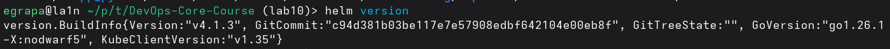
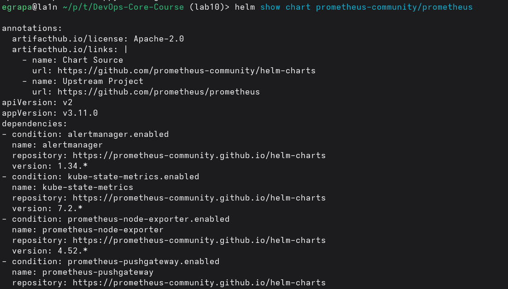
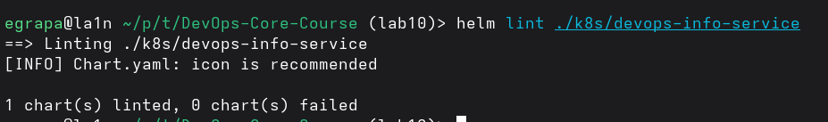
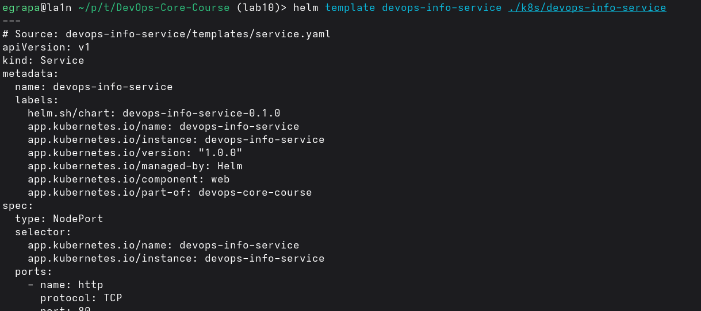
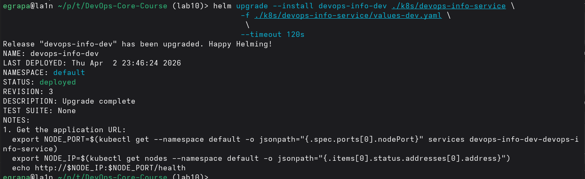

# Lab 10 — Helm Package Manager

## Chart Overview

The Lab 9 static manifests were converted into an application chart at [`k8s/devops-info-service`](/home/egrapa/prog/tmp/DevOps-Core-Course/k8s/devops-info-service). The chart preserves the original deployment behavior by default: 3 replicas, `NodePort` exposure on port `30080`, `/health` readiness and liveness probes, and the same image and resource profile.

Chart structure:

- [`Chart.yaml`](/home/egrapa/prog/tmp/DevOps-Core-Course/k8s/devops-info-service/Chart.yaml) stores chart metadata, versioning, and repository/source information.
- [`values.yaml`](/home/egrapa/prog/tmp/DevOps-Core-Course/k8s/devops-info-service/values.yaml) contains the default configuration that mirrors Lab 9.
- [`values-dev.yaml`](/home/egrapa/prog/tmp/DevOps-Core-Course/k8s/devops-info-service/values-dev.yaml) reduces replicas/resources and keeps `NodePort` for local work.
- [`values-prod.yaml`](/home/egrapa/prog/tmp/DevOps-Core-Course/k8s/devops-info-service/values-prod.yaml) pins a production image tag, keeps 3 replicas, and switches the Service to `LoadBalancer`.
- [`templates/_helpers.tpl`](/home/egrapa/prog/tmp/DevOps-Core-Course/k8s/devops-info-service/templates/_helpers.tpl) centralizes names and labels.
- [`templates/deployment.yaml`](/home/egrapa/prog/tmp/DevOps-Core-Course/k8s/devops-info-service/templates/deployment.yaml) renders the Deployment with templated image, replica count, env vars, resources, rollout strategy, and health probes.
- [`templates/service.yaml`](/home/egrapa/prog/tmp/DevOps-Core-Course/k8s/devops-info-service/templates/service.yaml) renders the Service and only emits `nodePort` when the Service type is `NodePort`.
- [`templates/hooks/pre-install-job.yaml`](/home/egrapa/prog/tmp/DevOps-Core-Course/k8s/devops-info-service/templates/hooks/pre-install-job.yaml) validates critical values before installation.
- [`templates/hooks/post-install-job.yaml`](/home/egrapa/prog/tmp/DevOps-Core-Course/k8s/devops-info-service/templates/hooks/post-install-job.yaml) performs a simple `/health` smoke test after installation.
- [`templates/NOTES.txt`](/home/egrapa/prog/tmp/DevOps-Core-Course/k8s/devops-info-service/templates/NOTES.txt) prints the correct access instructions based on Service type.

Values organization strategy:

- Top-level keys are grouped by concern: image, container, service, strategy, env, resources, probes, and hooks.
- Defaults are safe for local clusters while still matching the previous lab.
- Environment-specific changes are isolated in dedicated override files instead of duplicating the whole chart.

## Configuration Guide

Important values:

- `replicaCount`: desired number of Pods.
- `image.repository`, `image.tag`, `image.pullPolicy`: container image settings.
- `container.port`: internal application port.
- `service.type`, `service.port`, `service.targetPort`, `service.nodePort`: Service exposure controls.
- `resources.requests` and `resources.limits`: CPU and memory reservations and caps.
- `readinessProbe.*` and `livenessProbe.*`: health check paths and timings.
- `hooks.*`: hook enablement, image, weight, and cleanup timing.

Example installations:

```bash
# Default install
helm install devops-info-service ./k8s/devops-info-service

# Development install
helm install devops-info-dev ./k8s/devops-info-service \
  -f ./k8s/devops-info-service/values-dev.yaml

# Production install
helm install devops-info-prod ./k8s/devops-info-service \
  -f ./k8s/devops-info-service/values-prod.yaml

# One-off override
helm install devops-info-custom ./k8s/devops-info-service \
  --set replicaCount=2 \
  --set image.tag=1.0.1
```

Environment profile summary:

- Dev uses 1 replica, smaller CPU and memory settings, and `NodePort`.
- Prod uses a pinned image tag, higher resource reservations, and `LoadBalancer`.

## Hook Implementation

Implemented hooks:

- Pre-install hook: validates that the release has at least one replica and a non-empty image repository before the chart installs core resources.
- Post-install hook: performs a basic HTTP smoke test against `http://<service-name>:<service-port>/health` after the release is created.

Execution order and weights:

- The pre-install Job uses hook weight `-5`, so it runs before other hooks in the same phase.
- The post-install Job uses hook weight `5`, so it runs later in the post-install phase.

Deletion policy:

- Both Jobs use `before-hook-creation,hook-succeeded`.
- `before-hook-creation` removes an older copy before rerunning a hook on upgrade or reinstall.
- `hook-succeeded` cleans up successful hook resources automatically.
- `ttlSecondsAfterFinished` is also set to 60 seconds to let Kubernetes garbage-collect completed Jobs if the cluster supports it.






- ``
- ``
- ``
- ``
- ``
- ``
- ``

## Operations

Installation:

```bash
helm install devops-info-dev ./k8s/devops-info-service -f ./k8s/devops-info-service/values-dev.yaml
```

Upgrade a release:

```bash
helm upgrade devops-info-dev ./k8s/devops-info-service -f ./k8s/devops-info-service/values-prod.yaml
```

Rollback:

```bash
helm history devops-info-dev
helm rollback devops-info-dev 1
```

Uninstall:

```bash
helm uninstall devops-info-dev
```

## Testing And Validation

Validation workflow:

```bash
helm lint ./k8s/devops-info-service
helm template devops-info-service ./k8s/devops-info-service
helm install --dry-run --debug devops-info-service ./k8s/devops-info-service
helm install --dry-run --debug devops-info-service ./k8s/devops-info-service \
  -f ./k8s/devops-info-service/values-prod.yaml
```

Application accessibility verification:

```bash
# NodePort example
kubectl get svc devops-info-dev-devops-info-service
curl http://127.0.0.1:30080/health

# Port-forward alternative
kubectl port-forward svc/devops-info-dev-devops-info-service 8080:80
curl http://127.0.0.1:8080/health
```

Local validation status in this workspace:

- `helm version` cannot be executed because the `helm` binary is not installed here.
- Chart rendering and cluster deployment were therefore not executed locally.
- The chart content was derived directly from the working Lab 9 manifests to minimize drift.

## Lab Commands

Use this sequence to complete the lab and collect evidence.

### 1. Verify Helm

```bash
helm version
helm repo add prometheus-community https://prometheus-community.github.io/helm-charts
helm repo update
helm show chart prometheus-community/prometheus
```

### 2. Validate the chart locally

```bash
helm lint ./k8s/devops-info-service
helm template devops-info-service ./k8s/devops-info-service
helm install --dry-run --debug devops-info-service ./k8s/devops-info-service
helm install --dry-run --debug devops-info-service ./k8s/devops-info-service \
  -f ./k8s/devops-info-service/values-prod.yaml
```

### 3. Install dev environment

```bash
helm install devops-info-dev ./k8s/devops-info-service \
  -f ./k8s/devops-info-service/values-dev.yaml

helm list
kubectl get all
kubectl get jobs
kubectl describe job devops-info-dev-devops-info-service-pre-install
kubectl describe job devops-info-dev-devops-info-service-post-install
kubectl get svc devops-info-dev-devops-info-service
```

### 4. Check application accessibility

If you use `NodePort`:

```bash
curl http://127.0.0.1:30080/health
```

Or with port-forward:

```bash
kubectl port-forward svc/devops-info-dev-devops-info-service 8080:80
curl http://127.0.0.1:8080/health
```

### 5. Upgrade to prod values

```bash
helm upgrade devops-info-dev ./k8s/devops-info-service \
  -f ./k8s/devops-info-service/values-prod.yaml

kubectl get all
kubectl get svc devops-info-dev-devops-info-service
kubectl get deployment devops-info-dev-devops-info-service -o wide
```

### 6. Show release operations

```bash
helm history devops-info-dev
helm rollback devops-info-dev 1
helm upgrade devops-info-dev ./k8s/devops-info-service \
  -f ./k8s/devops-info-service/values-prod.yaml
helm uninstall devops-info-dev
```

### Minimal pass checklist

If you want the smallest command set that still covers the lab requirements, run:

```bash
helm version
helm show chart prometheus-community/prometheus
helm lint ./k8s/devops-info-service
helm template devops-info-service ./k8s/devops-info-service
helm install devops-info-dev ./k8s/devops-info-service -f ./k8s/devops-info-service/values-dev.yaml
helm list
kubectl get all
kubectl get jobs
helm upgrade devops-info-dev ./k8s/devops-info-service -f ./k8s/devops-info-service/values-prod.yaml
kubectl get all
curl http://127.0.0.1:30080/health
```
