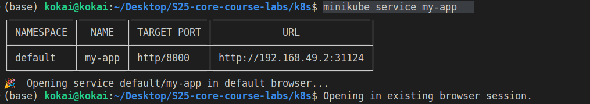
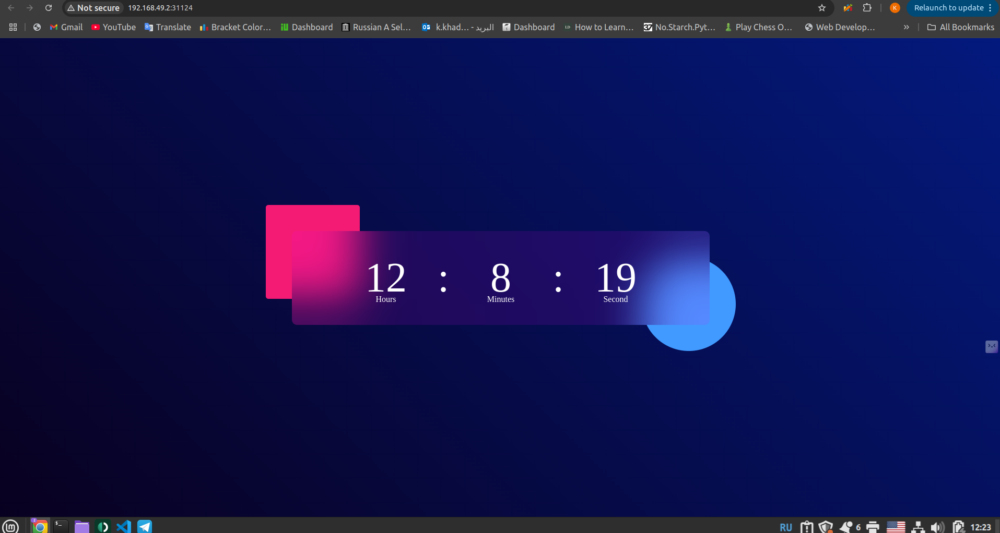
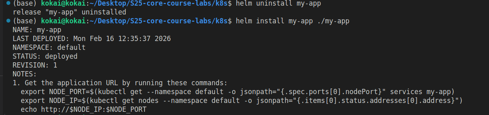
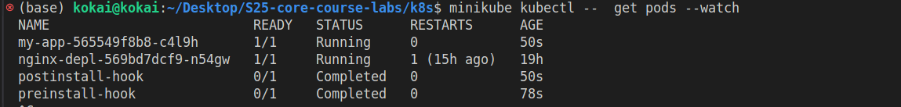
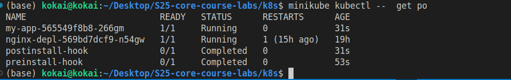

# Helm Deployment Report

## Pods
Output of `kubectl get pods`:
```
 kokai@kokai:~/Desktop/S25-core-course-labs/k8s$ minikube kubectl -- get pods
NAME                          READY   STATUS    RESTARTS      AGE
my-app-565549f8b8-9zf8g       1/1     Running   0             2m23s
nginx-depl-569bd7dcf9-n54gw   1/1     Running   1 (14h ago)   18h
```

## Services

Output of `kubectl get svc`:
```
 kokai@kokai:~/Desktop/S25-core-course-labs/k8s$ minikube kubectl -- get svc
NAME         TYPE        CLUSTER-IP      EXTERNAL-IP   PORT(S)          AGE
kubernetes   ClusterIP   10.96.0.1       <none>        443/TCP          18h
my-app       NodePort    10.103.167.71   <none>        8000:31124/TCP   7m3s
```

Output of `minikube service my-app`



Output of ` helm lint ./my-app`

```
kokai@kokai:~/Desktop/S25-core-course-labs/k8s$ helm lint ./my-app
==> Linting ./my-app
[INFO] Chart.yaml: icon is recommended

1 chart(s) linted, 0 chart(s) failed
```

Output of `helm install --dry-run my-app ./my-app`

```
 kokai@kokai:~/Desktop/S25-core-course-labs/k8s$ helm install --dry-run my-app ./my-app
NAME: my-app
LAST DEPLOYED: Mon Feb 16 12:29:50 2026
NAMESPACE: default
STATUS: pending-install
REVISION: 1
HOOKS:
---
# Source: my-app/templates/postinstall-hook.yaml
apiVersion: v1
kind: Pod
metadata:
  name: postinstall-hook
  annotations:
    "helm.sh/hook": post-install
    "helm.sh/hook-delete-policy": hook-succeeded
spec:
  containers:
  - name: postinstall
    image: busybox
    command: ["sh", "-c", "echo Post-install hook running; sleep 20"]
  restartPolicy: Never
---
# Source: my-app/templates/preinstall-hook.yaml
apiVersion: v1
kind: Pod
metadata:
  name: preinstall-hook
  annotations:
    "helm.sh/hook": pre-install
    "helm.sh/hook-delete-policy": hook-succeeded
spec:
  containers:
  - name: preinstall
    image: busybox
    command: ["sh", "-c", "echo Pre-install hook running; sleep 20"]
  restartPolicy: Never
---
# Source: my-app/templates/tests/test-connection.yaml
apiVersion: v1
kind: Pod
metadata:
  name: "my-app-test-connection"
  labels:
    helm.sh/chart: my-app-0.1.0
    app.kubernetes.io/name: my-app
    app.kubernetes.io/instance: my-app
    app.kubernetes.io/version: "1.16.0"
    app.kubernetes.io/managed-by: Helm
  annotations:
    "helm.sh/hook": test
spec:
  containers:
    - name: wget
      image: busybox
      command: ['wget']
      args: ['my-app:8000']
  restartPolicy: Never
MANIFEST:
---
# Source: my-app/templates/serviceaccount.yaml
apiVersion: v1
kind: ServiceAccount
metadata:
  name: my-app
  labels:
    helm.sh/chart: my-app-0.1.0
    app.kubernetes.io/name: my-app
    app.kubernetes.io/instance: my-app
    app.kubernetes.io/version: "1.16.0"
    app.kubernetes.io/managed-by: Helm
automountServiceAccountToken: true
---
# Source: my-app/templates/service.yaml
apiVersion: v1
kind: Service
metadata:
  name: my-app
  labels:
    helm.sh/chart: my-app-0.1.0
    app.kubernetes.io/name: my-app
    app.kubernetes.io/instance: my-app
    app.kubernetes.io/version: "1.16.0"
    app.kubernetes.io/managed-by: Helm
spec:
  type: NodePort
  ports:
    - port: 8000
      targetPort: http
      protocol: TCP
      name: http
  selector:
    app.kubernetes.io/name: my-app
    app.kubernetes.io/instance: my-app
---
# Source: my-app/templates/deployment.yaml
apiVersion: apps/v1
kind: Deployment
metadata:
  name: my-app
  labels:
    helm.sh/chart: my-app-0.1.0
    app.kubernetes.io/name: my-app
    app.kubernetes.io/instance: my-app
    app.kubernetes.io/version: "1.16.0"
    app.kubernetes.io/managed-by: Helm
spec:
  replicas: 1
  selector:
    matchLabels:
      app.kubernetes.io/name: my-app
      app.kubernetes.io/instance: my-app
  template:
    metadata:
      labels:
        helm.sh/chart: my-app-0.1.0
        app.kubernetes.io/name: my-app
        app.kubernetes.io/instance: my-app
        app.kubernetes.io/version: "1.16.0"
        app.kubernetes.io/managed-by: Helm
    spec:
      serviceAccountName: my-app
      containers:
        - name: my-app
          image: "karamkhaddourpro/my-fastapi-app:latest"
          imagePullPolicy: IfNotPresent
          ports:
            - name: http
              containerPort: 8000
              protocol: TCP
          livenessProbe:
            httpGet:
              path: /
              port: http
          readinessProbe:
            httpGet:
              path: /
              port: http

NOTES:
1. Get the application URL by running these commands:
  export NODE_PORT=$(kubectl get --namespace default -o jsonpath="{.spec.ports[0].nodePort}" services my-app)
  export NODE_IP=$(kubectl get nodes --namespace default -o jsonpath="{.items[0].status.addresses[0].address}")
  echo http://$NODE_IP:$NODE_PORT
```

### Resinstall my-app usuing helm to see the preinstall and postinstall hooks 



Output of ` minikube kubectl --  get pods --watch`



Output of ` minikube kubectl --  get po`



Output of `minikube kubectl -- describe po preinstall-hook`

```
(base) kokai@kokai:~/Desktop/S25-core-course-labs/k8s$ minikube kubectl -- describe po preinstall-hook
Name:             preinstall-hook
Namespace:        default
Priority:         0
Service Account:  default
Node:             minikube/192.168.49.2
Start Time:       Mon, 16 Feb 2026 12:51:01 +0300
Labels:           <none>
Annotations:      helm.sh/hook: pre-install
Status:           Succeeded
IP:               10.244.0.14
IPs:
  IP:  10.244.0.14
Containers:
  pre-install-container:
    Container ID:  docker://50f911e50b55c1413fabeca5a2105c2ee687ba523f72ea8d1e8e37a579268b60
    Image:         busybox
    Image ID:      docker-pullable://busybox@sha256:b3255e7dfbcd10cb367af0d409747d511aeb66dfac98cf30e97e87e4207dd76f
    Port:          <none>
    Host Port:     <none>
    Command:
      sh
      -c
      echo pre-install hook is running && sleep 20
    State:          Terminated
      Reason:       Completed
      Exit Code:    0
      Started:      Mon, 16 Feb 2026 12:51:02 +0300
      Finished:     Mon, 16 Feb 2026 12:51:22 +0300
    Ready:          False
    Restart Count:  0
    Environment:    <none>
    Mounts:
      /var/run/secrets/kubernetes.io/serviceaccount from kube-api-access-2m2mr (ro)
Conditions:
  Type                        Status
  PodReadyToStartContainers   False 
  Initialized                 True 
  Ready                       False 
  ContainersReady             False 
  PodScheduled                True 
Volumes:
  kube-api-access-2m2mr:
    Type:                    Projected (a volume that contains injected data from multiple sources)
    TokenExpirationSeconds:  3607
    ConfigMapName:           kube-root-ca.crt
    Optional:                false
    DownwardAPI:             true
QoS Class:                   BestEffort
Node-Selectors:              <none>
Tolerations:                 node.kubernetes.io/not-ready:NoExecute op=Exists for 300s
                             node.kubernetes.io/unreachable:NoExecute op=Exists for 300s
Events:
  Type    Reason     Age   From               Message
  ----    ------     ----  ----               -------
  Normal  Scheduled  111s  default-scheduler  Successfully assigned default/preinstall-hook to minikube
  Normal  Pulled     111s  kubelet            spec.containers{pre-install-container}: Container image "busybox" already present on machine and can be accessed by the pod
  Normal  Created    111s  kubelet            spec.containers{pre-install-container}: Container created
  Normal  Started    111s  kubelet            spec.containers{pre-install-container}: Container started
(base) kokai@kokai:~/Desktop/S25-core-course-labs/k8s$ 
```

Output of `minikube kubectl -- describe po postinstall-hook`
```
(base) kokai@kokai:~/Desktop/S25-core-course-labs/k8s$ minikube kubectl -- describe po postinstall-hook
Name:             postinstall-hook
Namespace:        default
Priority:         0
Service Account:  default
Node:             minikube/192.168.49.2
Start Time:       Mon, 16 Feb 2026 12:51:23 +0300
Labels:           <none>
Annotations:      helm.sh/hook: post-install
Status:           Succeeded
IP:               10.244.0.16
IPs:
  IP:  10.244.0.16
Containers:
  post-install-container:
    Container ID:  docker://d925fe1cea08ab85ddae8924089053345a39d05dcd6b89a496ea2f74a235947f
    Image:         busybox
    Image ID:      docker-pullable://busybox@sha256:b3255e7dfbcd10cb367af0d409747d511aeb66dfac98cf30e97e87e4207dd76f
    Port:          <none>
    Host Port:     <none>
    Command:
      sh
      -c
      echo post-install hook is running && sleep 20
    State:          Terminated
      Reason:       Completed
      Exit Code:    0
      Started:      Mon, 16 Feb 2026 12:51:26 +0300
      Finished:     Mon, 16 Feb 2026 12:51:46 +0300
    Ready:          False
    Restart Count:  0
    Environment:    <none>
    Mounts:
      /var/run/secrets/kubernetes.io/serviceaccount from kube-api-access-fr9sz (ro)
Conditions:
  Type                        Status
  PodReadyToStartContainers   False 
  Initialized                 True 
  Ready                       False 
  ContainersReady             False 
  PodScheduled                True 
Volumes:
  kube-api-access-fr9sz:
    Type:                    Projected (a volume that contains injected data from multiple sources)
    TokenExpirationSeconds:  3607
    ConfigMapName:           kube-root-ca.crt
    Optional:                false
    DownwardAPI:             true
QoS Class:                   BestEffort
Node-Selectors:              <none>
Tolerations:                 node.kubernetes.io/not-ready:NoExecute op=Exists for 300s
                             node.kubernetes.io/unreachable:NoExecute op=Exists for 300s
Events:
  Type    Reason     Age    From               Message
  ----    ------     ----   ----               -------
  Normal  Scheduled  2m20s  default-scheduler  Successfully assigned default/postinstall-hook to minikube
  Normal  Pulling    2m20s  kubelet            spec.containers{post-install-container}: Pulling image "busybox"
  Normal  Pulled     2m18s  kubelet            spec.containers{post-install-container}: Successfully pulled image "busybox" in 2s (2s including waiting). Image size: 4425286 bytes.
  Normal  Created    2m18s  kubelet            spec.containers{post-install-container}: Container created
  Normal  Started    2m18s  kubelet            spec.containers{post-install-container}: Container started

```