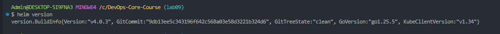
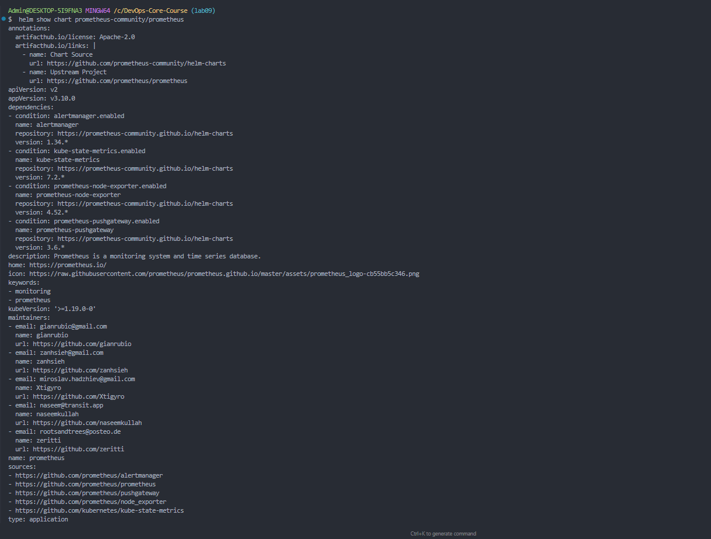
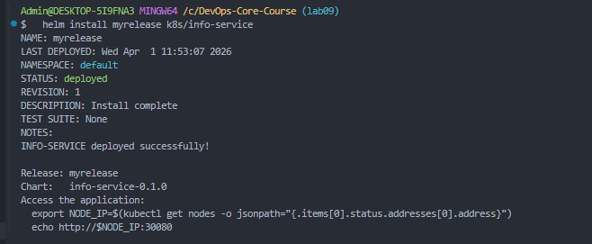
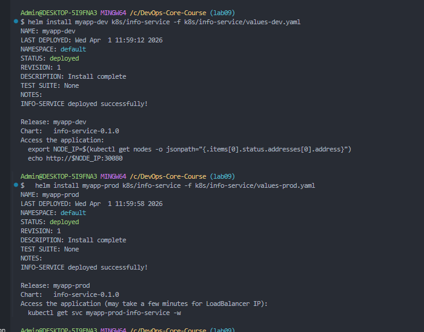
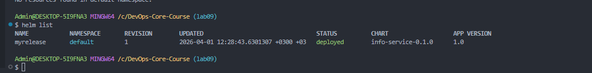
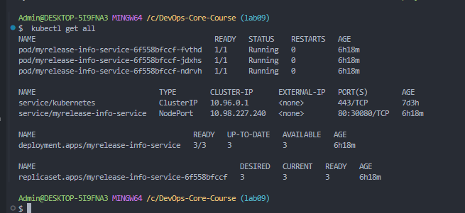

# Helm Chart Documentation — info-service

## 1. Chart Overview

### Chart Structure

```
k8s/info-service/
├── Chart.yaml                          # Chart metadata (name, version, appVersion)
├── values.yaml                         # Default configuration values
├── values-dev.yaml                     # Development environment overrides
├── values-prod.yaml                    # Production environment overrides
└── templates/
    ├── _helpers.tpl                    # Reusable template helpers (names, labels)
    ├── deployment.yaml                 # Kubernetes Deployment template
    ├── service.yaml                    # Kubernetes Service template
    ├── NOTES.txt                       # Post-install usage notes
    └── hooks/
        ├── pre-install-job.yaml        # Pre-install lifecycle hook
        └── post-install-job.yaml       # Post-install lifecycle hook
```

### Key Template Files

- **`_helpers.tpl`** — defines reusable named templates: `info-service.name`, `info-service.fullname`, `info-service.chart`, `info-service.labels`, `info-service.selectorLabels`
- **`deployment.yaml`** — templated Deployment with configurable replicas, image, resources, strategy, and health probes
- **`service.yaml`** — templated Service with configurable type (NodePort/LoadBalancer), ports
- **`NOTES.txt`** — displays access instructions after install depending on service type

### Values Organization

Default values in `values.yaml` provide sensible defaults (3 replicas, NodePort, health probes). Environment-specific overrides in `values-dev.yaml` and `values-prod.yaml` change only what differs.

---

## 2. Configuration Guide

### Important Values

| Value | Default | Description |
|-------|---------|-------------|
| `replicaCount` | 3 | Number of pod replicas |
| `image.repository` | roma3213/info_service | Docker image repository |
| `image.tag` | latest | Docker image tag |
| `image.pullPolicy` | IfNotPresent | Image pull policy |
| `service.type` | NodePort | Service type (NodePort/LoadBalancer) |
| `service.port` | 80 | Service port |
| `service.targetPort` | 5000 | Container port |
| `service.nodePort` | 30080 | NodePort (when type=NodePort) |
| `resources.limits.cpu` | 200m | CPU limit |
| `resources.limits.memory` | 256Mi | Memory limit |
| `resources.requests.cpu` | 100m | CPU request |
| `resources.requests.memory` | 128Mi | Memory request |
| `livenessProbe` | /health:5000 | Liveness probe configuration |
| `readinessProbe` | /health:5000 | Readiness probe configuration |

### Environment Customization

**Development** (`values-dev.yaml`):
- 1 replica, relaxed resources (100m CPU, 128Mi mem), NodePort

**Production** (`values-prod.yaml`):
- 5 replicas, proper resources (500m CPU, 512Mi mem), LoadBalancer

### Example Installations

```bash
# Development
helm install myapp-dev k8s/info-service -f k8s/info-service/values-dev.yaml

# Production
helm install myapp-prod k8s/info-service -f k8s/info-service/values-prod.yaml

# Override specific value
helm install myapp k8s/info-service --set replicaCount=10
```

---

## 3. Hook Implementation

### Implemented Hooks

| Hook | File | Purpose | Weight | Deletion Policy |
|------|------|---------|--------|-----------------|
| `pre-install` | `hooks/pre-install-job.yaml` | Runs validation before installation | -5 | hook-succeeded |
| `post-install` | `hooks/post-install-job.yaml` | Runs smoke test after installation | 5 | hook-succeeded |

### Execution Order

1. **Pre-install** (weight: -5) — runs first, validates environment readiness
2. Kubernetes resources are created (Deployment, Service)
3. **Post-install** (weight: 5) — runs after all resources are ready, validates deployment

### Deletion Policies

Both hooks use `hook-succeeded` policy — Jobs are automatically deleted after successful completion. This keeps the cluster clean and avoids accumulating completed Job resources.

---

## 4. Installation Evidence

### Helm Version



### Exploring Public Charts



### Lint, Template, Dry-Run

Full output: [03-task2-lint-template-dryrun.txt](docs/screenshots/lab10/03-task2-lint-template-dryrun.txt)

### Helm Install



### Dev vs Prod Deployment



### Hooks Verification

Full output: [06-task4-hooks-verify.txt](docs/screenshots/lab10/06-task4-hooks-verify.txt)

### Helm List



### Deployed Resources



---

## 5. Operations

### Installation

```bash
# Default installation
helm install myrelease k8s/info-service

# With environment-specific values
helm install myrelease k8s/info-service -f k8s/info-service/values-prod.yaml
```

### Upgrade

```bash
helm upgrade myrelease k8s/info-service -f k8s/info-service/values-prod.yaml
```

### Rollback

```bash
# View history
helm history myrelease

# Rollback to previous revision
helm rollback myrelease 1
```

### Uninstall

```bash
helm uninstall myrelease
```

---

## 6. Testing & Validation

Lint, template rendering, and dry-run outputs are in: [03-task2-lint-template-dryrun.txt](docs/screenshots/lab10/03-task2-lint-template-dryrun.txt)

### Application Accessibility

```bash
export NODE_IP=$(kubectl get nodes -o jsonpath="{.items[0].status.addresses[0].address}")
echo http://$NODE_IP:30080
```
