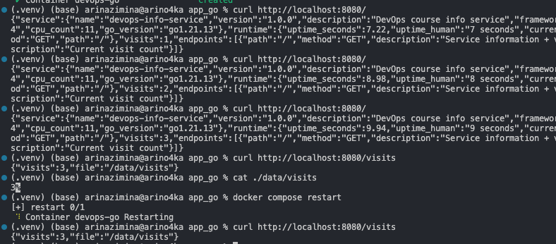
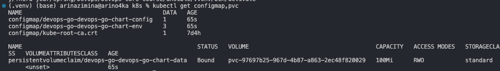
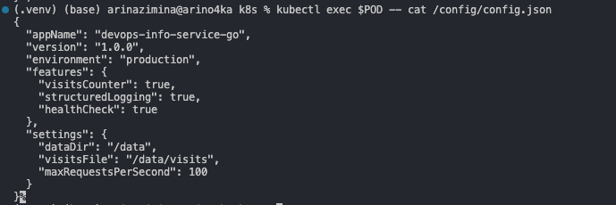
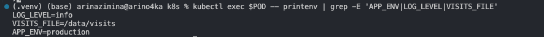
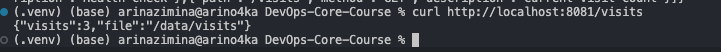
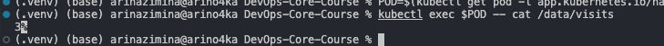
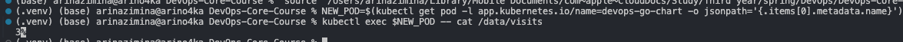
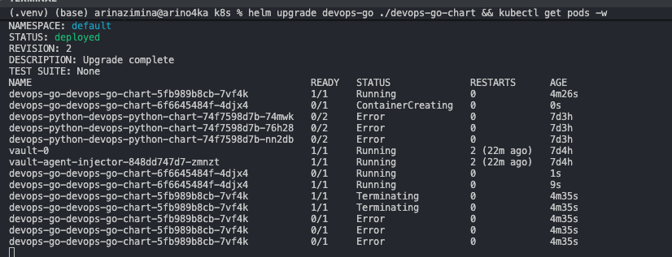
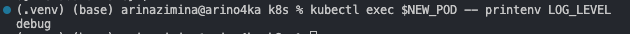

# Lab 12 — ConfigMaps & Persistent Volumes

## 1. Application Changes

### Visits Counter Implementation

The Go application (`app_go/main.go`) was extended with a persistent visit counter:

- **On each `GET /` request:** reads the current count from the file, increments it atomically (mutex-protected), writes it back, and includes the count in the JSON response.
- **On `GET /visits` request:** reads and returns the current count without incrementing.
- **On startup:** if the file doesn't exist, the counter starts from 0 (graceful handling of fresh deployments).
- **Thread safety:** a `sync.Mutex` protects read-increment-write, preventing race conditions under concurrent requests.

**Counter file location:** configurable via `VISITS_FILE` env var, defaults to `/data/visits`.

### New Endpoints

| Endpoint | Method | Description |
|----------|--------|-------------|
| `/` | GET | System info + increments visit counter |
| `/visits` | GET | Returns current visit count |
| `/health` | GET | Health check (unchanged) |

**`GET /visits` response:**
```json
{
  "visits": 42,
  "file": "/data/visits"
}
```

### Local Testing with Docker Compose

`docker-compose.yml` mounts a local directory as the data volume:

```yaml
volumes:
  - ./data:/data
```

**Test procedure:**

```bash
# 1. Build and start the container
cd app_go
docker compose up --build -d

# 2. Access root endpoint multiple times
curl http://localhost:8080/
curl http://localhost:8080/
curl http://localhost:8080/

# 3. Check counter via /visits endpoint
curl http://localhost:8080/visits
# {"visits":3,"file":"/data/visits"}

# 4. Inspect counter file directly on host
cat ./data/visits
# 3

# 5. Restart container to verify persistence
docker compose restart
curl http://localhost:8080/visits
# {"visits":3,"file":"/data/visits"}  <-- counter preserved!
```



---

## 2. ConfigMap Implementation

### File: `k8s/devops-go-chart/files/config.json`

```json
{
  "appName": "devops-info-service-go",
  "version": "1.0.0",
  "environment": "production",
  "features": {
    "visitsCounter": true,
    "structuredLogging": true,
    "healthCheck": true
  },
  "settings": {
    "dataDir": "/data",
    "visitsFile": "/data/visits",
    "maxRequestsPerSecond": 100
  }
}
```

### ConfigMap Template: `k8s/devops-go-chart/templates/configmap.yaml`

Two ConfigMaps are defined in one template file:

**ConfigMap 1 — file mount (`-config`):**
```yaml
apiVersion: v1
kind: ConfigMap
metadata:
  name: <release>-devops-go-chart-config
data:
  config.json: |-
    { ... content of files/config.json ... }
```
Uses `.Files.Get "files/config.json"` to embed the file at chart render time.

**ConfigMap 2 — environment variables (`-env`):**
```yaml
apiVersion: v1
kind: ConfigMap
metadata:
  name: <release>-devops-go-chart-env
data:
  APP_ENV: "production"
  LOG_LEVEL: "info"
  VISITS_FILE: "/data/visits"
```
Values come from `values.yaml` (`environment`, `logLevel`, `persistence.visitsFile`).

### Mounting ConfigMap as a File

In `deployment.yaml`:

```yaml
volumes:
  - name: config-volume
    configMap:
      name: <release>-devops-go-chart-config

containers:
  - volumeMounts:
      - name: config-volume
        mountPath: /config
        readOnly: true
```

The file is available inside the pod at `/config/config.json`.

### ConfigMap as Environment Variables

```yaml
containers:
  - envFrom:
      - configMapRef:
          name: <release>-devops-go-chart-env
```

All keys in the `-env` ConfigMap (`APP_ENV`, `LOG_LEVEL`, `VISITS_FILE`) are injected as environment variables into every container.

### Verification Commands

```bash
# List ConfigMaps and PVC
kubectl get configmap,pvc

# Read config file inside pod
POD=$(kubectl get pod -l app.kubernetes.io/name=devops-go-chart -o jsonpath='{.items[0].metadata.name}')
kubectl exec $POD -- cat /config/config.json

# Check environment variables injected from ConfigMap
kubectl exec $POD -- printenv | grep -E 'APP_ENV|LOG_LEVEL|VISITS_FILE'
```

**Output — `kubectl get configmap,pvc`:**



```
NAME                                        DATA   AGE
configmap/devops-go-devops-go-chart-config  1      65s
configmap/devops-go-devops-go-chart-env     3      65s
configmap/kube-root-ca.crt                  1      7d4h

NAME                                                   STATUS   VOLUME                                     CAPACITY   ACCESS MODES   STORAGECLASS
persistentvolumeclaim/devops-go-devops-go-chart-data   Bound    pvc-97697b25-967d-4b87-a863-2ec48f820029   100Mi      RWO            standard
```

**Output — `kubectl exec $POD -- cat /config/config.json`:**



**Output — `printenv | grep -E 'APP_ENV|LOG_LEVEL|VISITS_FILE'`:**



```
LOG_LEVEL=info
VISITS_FILE=/data/visits
APP_ENV=production
```

---

## 3. Persistent Volume

### PVC Template: `k8s/devops-go-chart/templates/pvc.yaml`

```yaml
apiVersion: v1
kind: PersistentVolumeClaim
metadata:
  name: <release>-devops-go-chart-data
spec:
  accessModes:
    - ReadWriteOnce
  resources:
    requests:
      storage: 100Mi
```

**`values.yaml` persistence section:**
```yaml
persistence:
  enabled: true
  size: 100Mi
  storageClass: ""    # Uses cluster default (standard on Minikube)
  visitsFile: "/data/visits"
```

### Access Modes Discussion

- **`ReadWriteOnce` (RWO):** The volume can be mounted read-write by a single node. Suitable for a single-replica stateful app like this one. Multiple pods on the same node can use it, but pods on different nodes cannot — hence `replicaCount: 1`.
- **`ReadWriteMany` (RWX):** Multiple nodes can mount simultaneously — requires NFS or cloud-native solutions (e.g., AWS EFS). Overkill for a single-file counter.
- **`ReadOnlyMany` (ROX):** Not applicable here since we need to write the counter.

**Storage class:** `""` means Kubernetes uses the cluster's default StorageClass. On Minikube this is `standard`, which provisions `hostPath` volumes automatically.

### Volume Mount in Deployment

```yaml
volumes:
  - name: data-volume
    persistentVolumeClaim:
      claimName: <release>-devops-go-chart-data

containers:
  - volumeMounts:
      - name: data-volume
        mountPath: /data
```

### Persistence Test (Pod Deletion)

```bash
# 1. Check current visit count via /visits endpoint
curl http://localhost:8081/visits
# {"visits":3,"file":"/data/visits"}

# 2. Check counter file inside pod
POD=$(kubectl get pod -l app.kubernetes.io/name=devops-go-chart -o jsonpath='{.items[0].metadata.name}')
kubectl exec $POD -- cat /data/visits
# 3

# 3. Delete the pod (Deployment recreates it automatically)
kubectl delete pod $POD

# 4. Wait for new pod to become ready
kubectl get pods -w

# 5. Get new pod name and verify counter is preserved
NEW_POD=$(kubectl get pod -l app.kubernetes.io/name=devops-go-chart -o jsonpath='{.items[0].metadata.name}')
kubectl exec $NEW_POD -- cat /data/visits
# 3  <-- same value, data survived pod deletion!
```

**Before pod deletion — `curl /visits` (visits = 3):**



**Before pod deletion — `cat /data/visits` inside pod:**



**After pod deletion — `cat /data/visits` in new pod (counter preserved = 3):**



---

## 4. ConfigMap vs Secret

| Aspect | ConfigMap | Secret |
|--------|-----------|--------|
| **Purpose** | Non-sensitive configuration | Sensitive credentials |
| **Data encoding** | Plain text | Base64-encoded (not encrypted by default) |
| **Use when** | App name, env, feature flags, log level, config files | Passwords, API keys, TLS certificates, tokens |
| **Example keys** | `APP_ENV`, `LOG_LEVEL`, `config.json` | `DB_PASSWORD`, `API_KEY`, `tls.crt` |
| **Risk if leaked** | Low — public config values | High — credentials exposed |
| **Encryption at rest** | No (by default) | Optional via `EncryptionConfiguration` |
| **RBAC** | Standard | Can apply stricter RBAC policies |

**Rule of thumb:** if the value would be embarrassing or dangerous if committed to git, use a Secret. Otherwise, a ConfigMap is fine.

---

## Bonus — ConfigMap Hot Reload

### Checksum Annotation Pattern (implemented)

The deployment template adds a checksum annotation in `spec.template.metadata.annotations`:

```yaml
annotations:
  checksum/config: {{ include (print $.Template.BasePath "/configmap.yaml") . | sha256sum }}
```

When the ConfigMap content changes and you run `helm upgrade`, the checksum changes → the pod template changes → Kubernetes performs a rolling restart → pods pick up the new config.

**How to trigger:**
```bash
# Change logLevel to "debug" in values.yaml, then:
helm upgrade devops-go ./devops-go-chart && kubectl get pods -w
# Pods restart automatically because checksum annotation changed
```

**Rolling restart — old pod terminates, new pod starts with updated ConfigMap:**



**New pod has updated env variable `LOG_LEVEL=debug`:**



### Default Update Behavior (without checksum)

When a ConfigMap is mounted as a **directory** (not `subPath`), Kubernetes automatically updates the file inside the pod within ~1–2 minutes (kubelet sync period ~60s + cache TTL). The update does NOT restart the pod.

### subPath Limitation

When using `subPath` in a volumeMount (e.g., to mount a single file instead of the whole directory), Kubernetes copies the file at mount time and does **not** update it when the ConfigMap changes. The file becomes a static copy.

```yaml
# This will NOT auto-update:
volumeMounts:
  - name: config-volume
    mountPath: /config/config.json
    subPath: config.json   # <-- static copy, no hot reload
```

**When to use `subPath`:** when you need to mount a single file into a directory that already has other files (to avoid overwriting them). Accept that it won't auto-update.

**When to avoid `subPath`:** when you want Kubernetes to push ConfigMap updates automatically.
