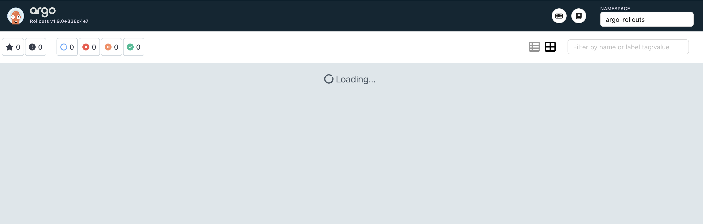
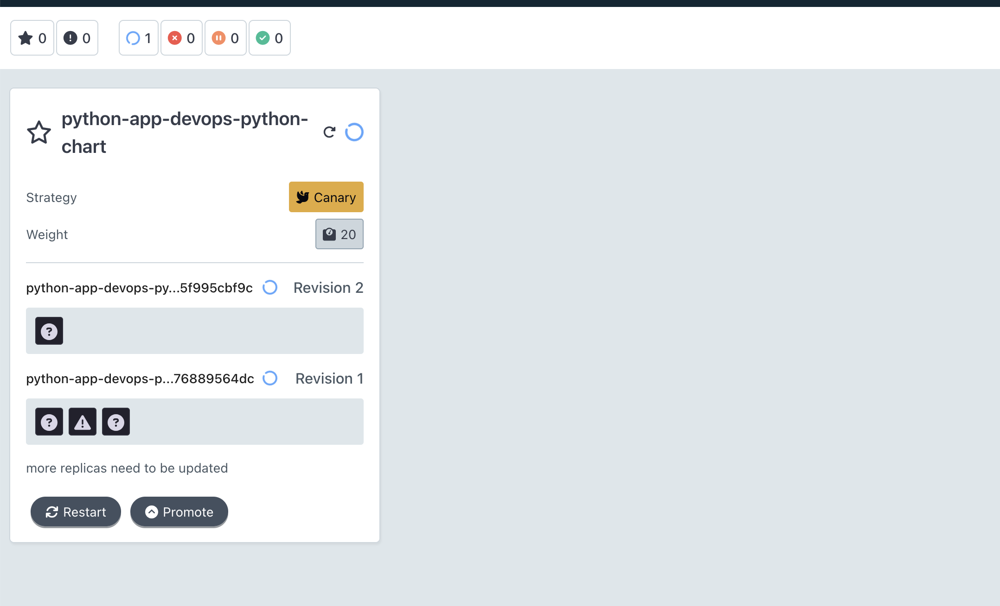
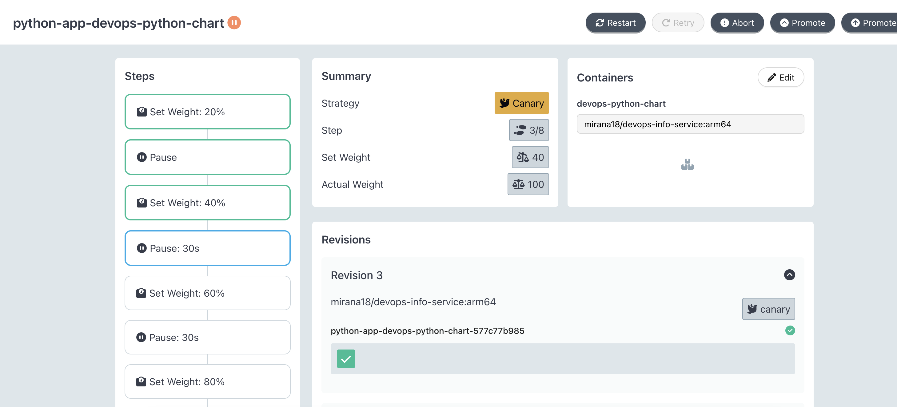
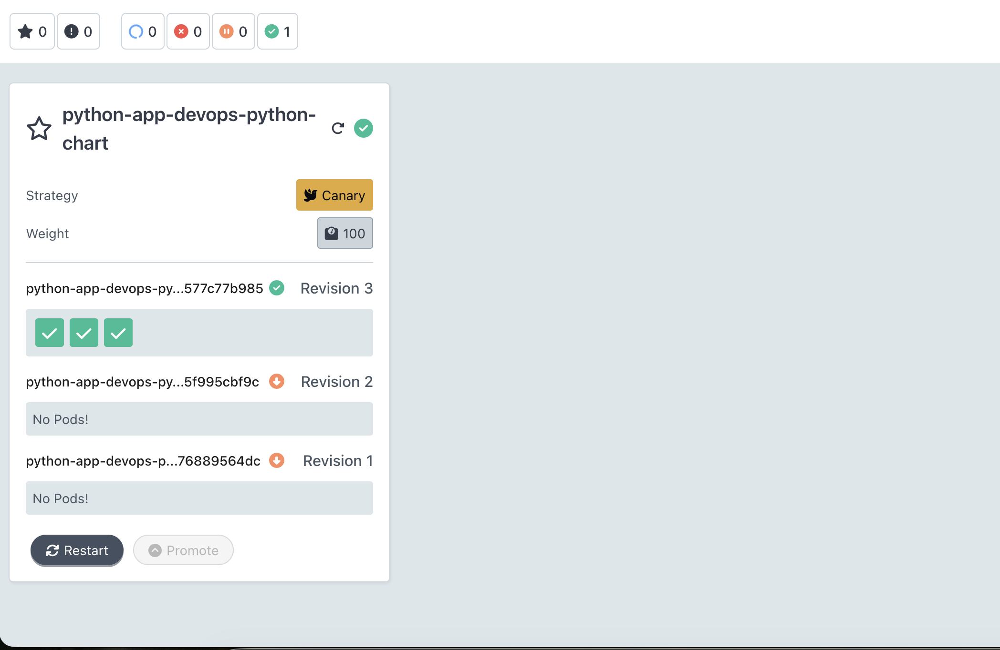
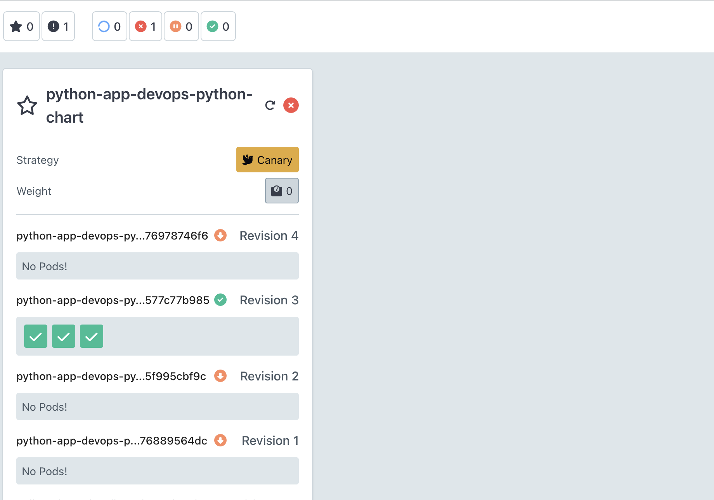
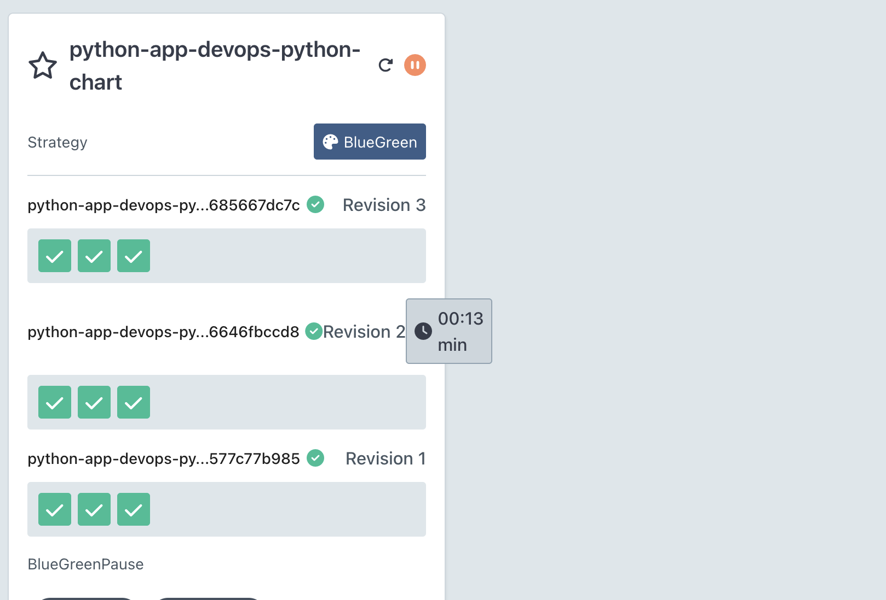
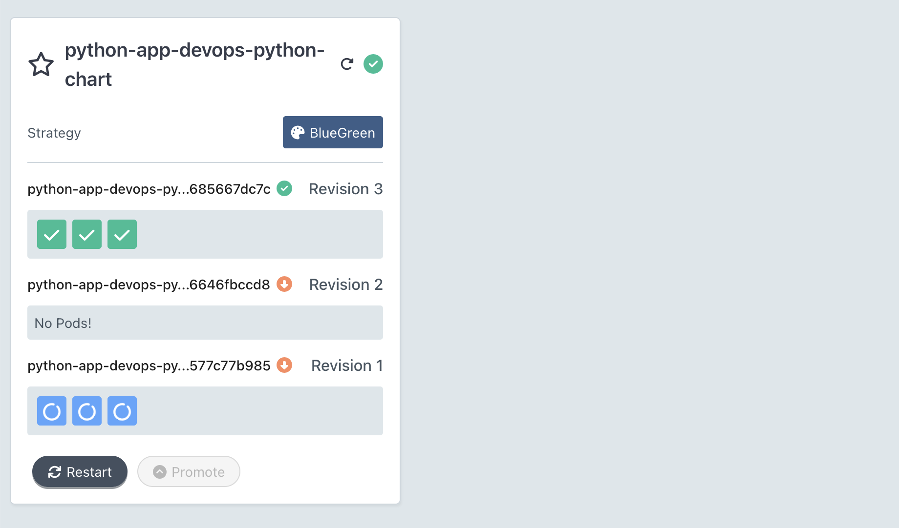

# Lab 14 — Progressive Delivery with Argo Rollouts

## 1. Argo Rollouts Setup

### Installation

```bash
kubectl create namespace argo-rollouts
kubectl apply -n argo-rollouts -f https://github.com/argoproj/argo-rollouts/releases/latest/download/install.yaml
kubectl wait --for=condition=ready pod -l app.kubernetes.io/name=argo-rollouts -n argo-rollouts --timeout=120s
```

Install the kubectl plugin (macOS):

```bash
brew install argoproj/tap/kubectl-argo-rollouts
kubectl argo rollouts version
```

### Dashboard

```bash
kubectl apply -n argo-rollouts -f https://github.com/argoproj/argo-rollouts/releases/latest/download/dashboard-install.yaml
kubectl port-forward svc/argo-rollouts-dashboard -n argo-rollouts 3100:3100
# Open http://localhost:3100
```



### Rollout vs Deployment — Key Differences

| Feature | Deployment | Rollout |
|---------|------------|---------|
| API Group | `apps/v1` | `argoproj.io/v1alpha1` |
| `kind` | `Deployment` | `Rollout` |
| `strategy` | `RollingUpdate` / `Recreate` | `canary` / `blueGreen` |
| Traffic shifting | Not supported | Gradual % steps |
| Manual promotion | Not supported | `kubectl argo rollouts promote` |
| Automatic rollback | Not supported | Based on analysis metrics |
| Dashboard | No | Yes (port 3100) |

A Rollout is a drop-in replacement for a Deployment — the pod template spec is identical, only the `strategy` block changes.

---

## 2. Canary Deployment

### Template

The Rollout manifest lives at `k8s/devops-python-chart/templates/rollout.yaml`. The canary strategy is selected when `rollout.strategy: canary` in `values.yaml` (the default).

Canary steps configured:

```
20% → pause (manual promotion required)
40% → pause 30s (automatic)
60% → pause 30s (automatic)
80% → pause 30s (automatic)
100% (stable)
```

### Deploy

```bash
helm upgrade --install python-app ./k8s/devops-python-chart \
  --set rollout.strategy=canary
```

### Step-by-step Rollout Progression

Trigger a new rollout by changing the image tag:

```bash
helm upgrade python-app ./k8s/devops-python-chart \
  --set image.tag=v2.0.0 --set rollout.strategy=canary

kubectl argo rollouts get rollout python-app -w
```

**Step 1 — Paused at 20% (waiting for manual promotion):**



**Promote past the first pause:**

```bash
kubectl argo rollouts promote python-app
```

**Steps 2–4 — Automatic progression through 40% → 60% → 80%:**



**Final — 100% healthy:**



### Abort Demonstration

```bash
# Start a new rollout, then abort while at 20%:
kubectl argo rollouts abort python-app
```

**Rollout aborted — traffic immediately returns to stable:**



**Observation:** On abort, Argo Rollouts immediately shifts 100% of traffic back to the stable ReplicaSet. The canary pods are scaled to zero but not deleted, allowing a fast retry with `kubectl argo rollouts retry rollout python-app`.

---

## 3. Blue-Green Deployment

### Configure

```bash
helm upgrade python-app ./k8s/devops-python-chart \
  --set rollout.strategy=blueGreen
```

This creates:
- `python-app` service — active (production traffic)
- `python-app-preview` service — preview (new version only)
- `autoPromotionEnabled: false` — manual promotion required

### Preview vs Active

**Blue-green rollout — two ReplicaSets running in parallel:**



```bash
# Test the preview (green) version independently:
kubectl port-forward svc/python-app-preview 8081:80
curl localhost:8081/
```

### Promotion

```bash
kubectl argo rollouts promote python-app
```

**After promotion — green becomes active instantly:**



### Blue-Green vs Canary Comparison

| Aspect | Canary | Blue-Green |
|--------|--------|------------|
| Traffic shifting | Gradual (20→40→60→80→100%) | Instant switch |
| Resource usage | Shared; minimal extra pods | 2× pods during transition |
| Rollback speed | Seconds (weight to 0%) | Instant (service re-pointed) |
| Preview testing | Not isolated | Isolated preview service |
| Best for | High-traffic apps, risk reduction | Fast cutover, QA preview needed |

**Recommendation:**
- Use **Canary** when you want to validate a release under real production traffic with a small blast radius.
- Use **Blue-Green** when you need a clean preview environment before any production traffic hits the new version, or when instant rollback is critical.

---

## 4. CLI Commands Reference

```bash
# List rollouts
kubectl argo rollouts list rollouts

# Watch status
kubectl argo rollouts get rollout <name> -w

# Promote to next step
kubectl argo rollouts promote <name>

# Promote all remaining steps (skip pauses)
kubectl argo rollouts promote --full <name>

# Abort current rollout (returns traffic to stable)
kubectl argo rollouts abort <name>

# Retry an aborted rollout
kubectl argo rollouts retry rollout <name>

# Undo (rollback to previous revision)
kubectl argo rollouts undo <name>

# Set image (triggers new rollout)
kubectl argo rollouts set image <name> <container>=<image>:<tag>

# View rollout history
kubectl argo rollouts history rollout <name>

# Pause / resume a rollout
kubectl argo rollouts pause <name>
kubectl argo rollouts resume <name>
```

---

## 5. Summary

Argo Rollouts provides production-grade progressive delivery on top of Kubernetes. By replacing a `Deployment` with a `Rollout` CRD, you gain:

1. **Canary releases** — gradually shift traffic to a new version while monitoring for errors, with the ability to abort and instantly return to stable.
2. **Blue-Green deployments** — run two full environments in parallel, validate the new version in isolation, then cut over instantly.
3. **Dashboard visibility** — real-time view of traffic weights, step progress, and ReplicaSet states.
4. **Automated analysis** (bonus) — plug in Prometheus or HTTP checks to automatically promote or roll back based on metrics.
