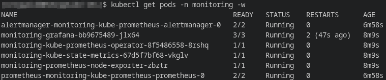
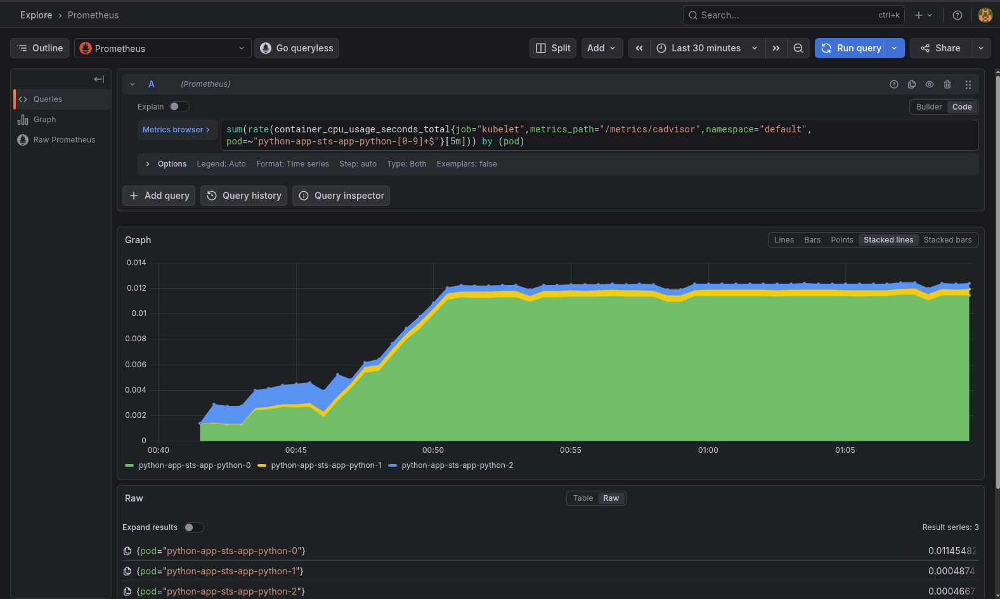
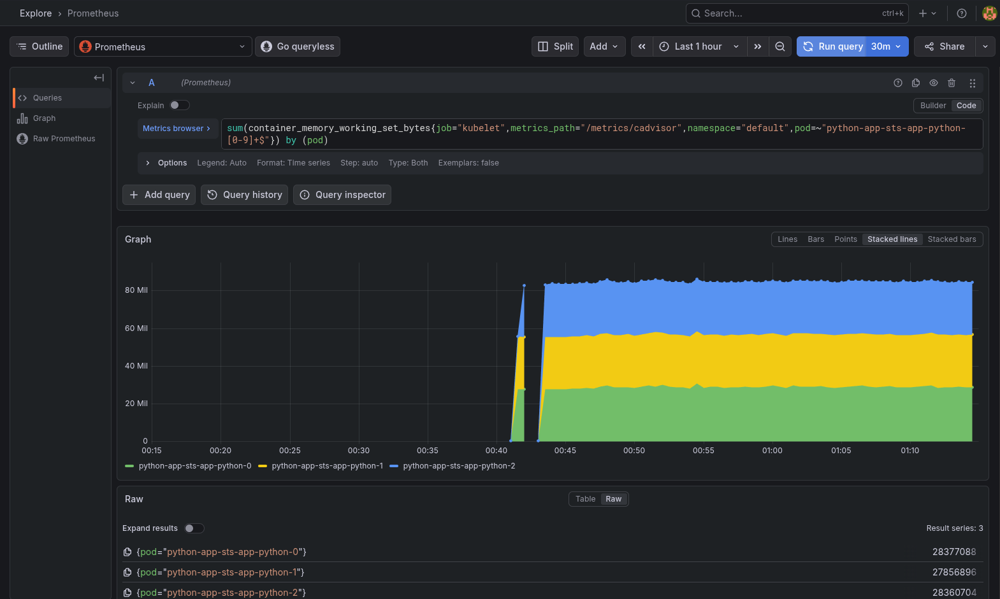
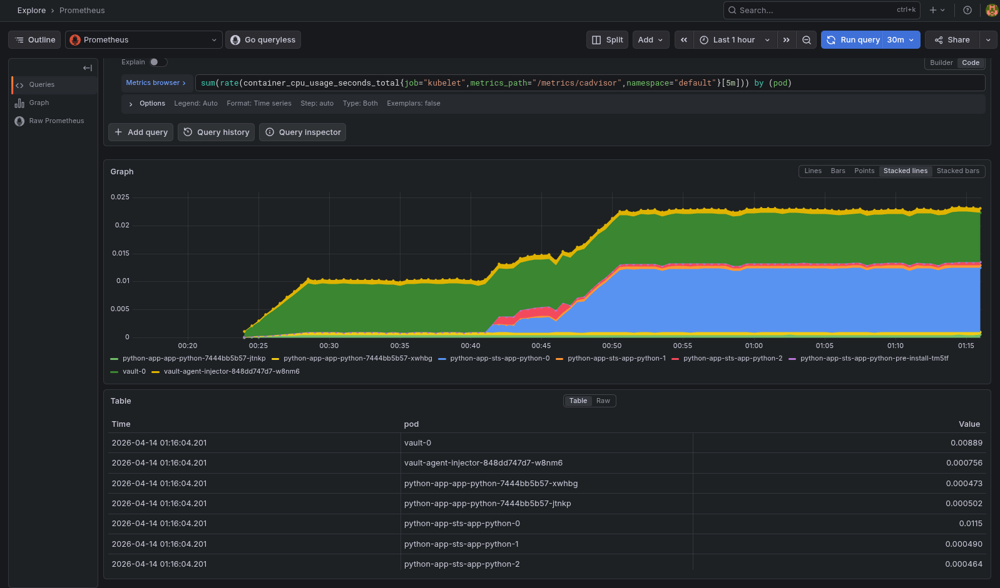
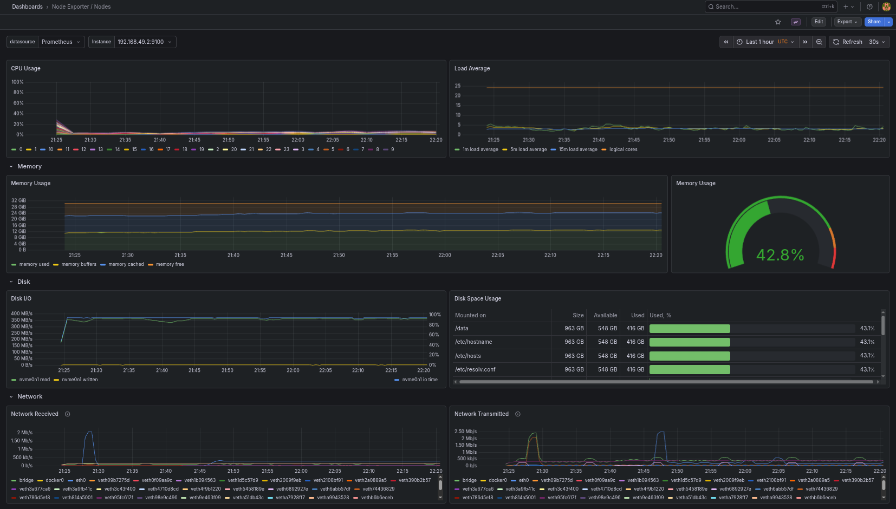
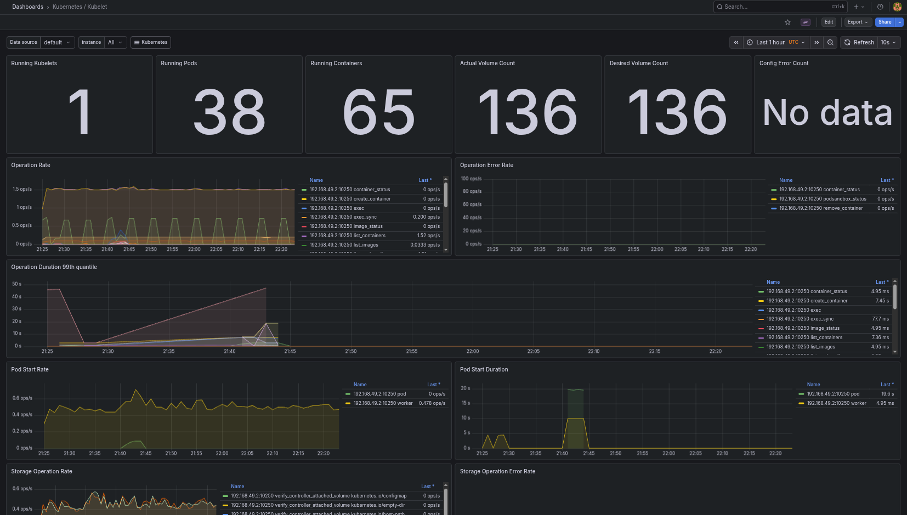
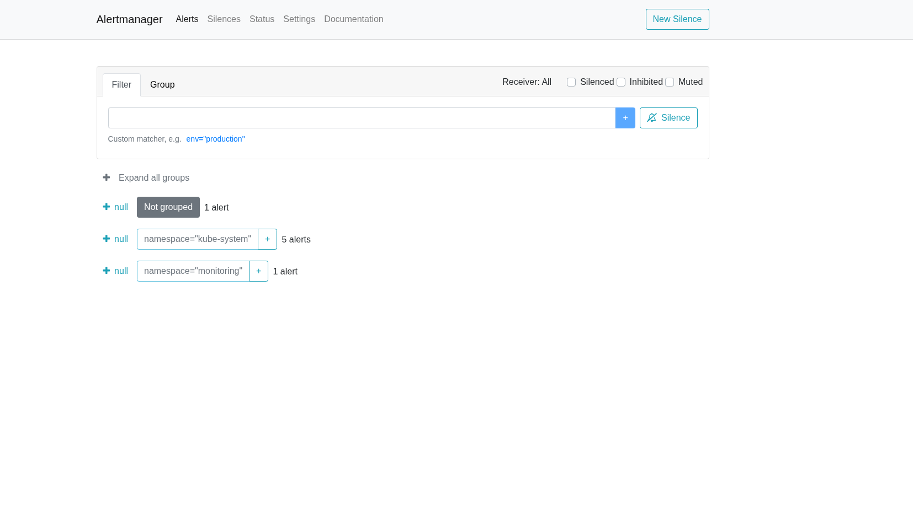
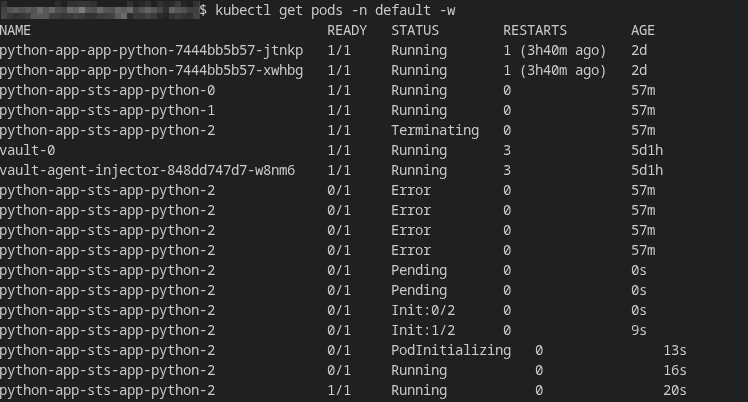
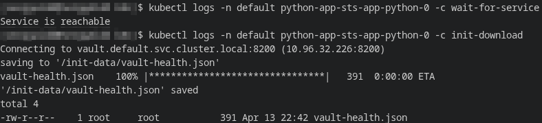
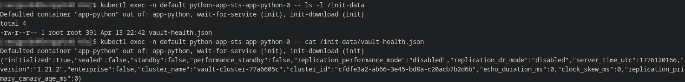

# Lab 16 — Kubernetes Monitoring & Init Containers

## 1. Stack Components
- **Prometheus Operator** - manages monitoring objects in Kubernetes and simplifies the deployment and maintenance of Prometheus, Alertmanager, and related CRDs;
- **Prometheus** - collects and stores metrics in time series format, then enables queries to analyze the state of the cluster and applications;
- **Alertmanager** - receives alerts from Prometheus, groups them, suppresses duplicates, and displays the current status of alerts;
- **Grafana** - used to visualize metrics and view ready-made dashboards for the cluster, nodes, pods, and kubelet;
- **kube-state-metrics** - exports the state of Kubernetes objects as metrics: pod, deployment, StatefulSet, namespace, node, and other control plane entities;
- **node-exporter** - collects metrics of the node itself: CPU, memory, disk and network.

## Installation Evidence


## 2. Dashboard Answers
### Pod Resources
To check the StatefulSet's CPU and memory, direct PromQL queries were used in Grafana Explore, as the standard kube-prometheus workload panels did not display usage metrics correctly in this local environment.



**Queries:**
```promql
sum(rate(container_cpu_usage_seconds_total{job="kubelet",metrics_path="/metrics/cadvisor",namespace="default",pod=~"python-app-sts-app-python-[0-9]+$"}[5m])) by (pod)
sum(container_memory_working_set_bytes{job="kubelet",metrics_path="/metrics/cadvisor",namespace="default",pod=~"python-app-sts-app-python-[0-9]+$"}) by (pod)
```

### Namespace Analysis

To determine which pod used the most and the least CPU in the `default` namespace, the following query was used:
```promql
sum(rate(container_cpu_usage_seconds_total{job="kubelet",metrics_path="/metrics/cadvisor",namespace="default"}[5m])) by (pod)
```
**Based on observation results:**
- pod with *maximum CPU usage*: `python-app-sts-app-python-0`;
- pod with *minimum CPU usage*: `python-app-sts-app-python-2`.

### Node Metrics

The `Node Exporter / Nodes` dashboard was used to view node metrics.
**Observed values:**
- Memory usage: `42.8%`;
- Memory used: approximately `12 GiB`;
- CPU cores: `24`.

### Kubelet

The `Kubernetes / Kubelet` dashboard was used to view the number of managed pods and containers.

**Observed values:**
- Managed pods: `38`;
- Managed containers: `65`.

### Network

While generating HTTP traffic to the application, a network activity check was performed. In this local Minikube environment, pod-level network byte series were not visible via standard kubelet/cAdvisor queries in Grafana Explore, so network activity was confirmed using the `Node Exporter / Nodes` dashboard, where the `Network Received` and `Network Transmitted` panels are visible.

### Alerts

Alertmanager showed `7` active alerts:
- `1` ungrouped alert;
- `5` alerts in `kube-system`;
- `1` alert in `monitoring`.

## 3. Init Containers
### Implementation
Two init containers have been added to the StatefulSet:
- `wait-for-service` — waits for the `vault.default.svc.cluster.local:8200` service to become available before starting the main container;
- `init-download` — downloads a file via `wget` from the Vault health endpoint and saves it to the `emptyDir` shared volume.

The main container mounts the same shared volume at `/init-data`, so it can read the downloaded file after startup.

### Proof of Success
- At pod startup, states `Init:0/2` and `Init:1/2` were observed, confirming that init containers were started sequentially before the main container:

- The container init logs confirm that the dependent service has become available and the file has been successfully downloaded to the shared volume:

- The main container successfully sees and reads the file `/init-data/vault-health.json`, which confirms that the shared volume between the init container and the main container is working correctly:

