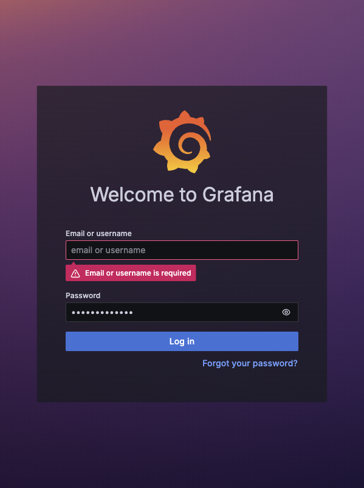
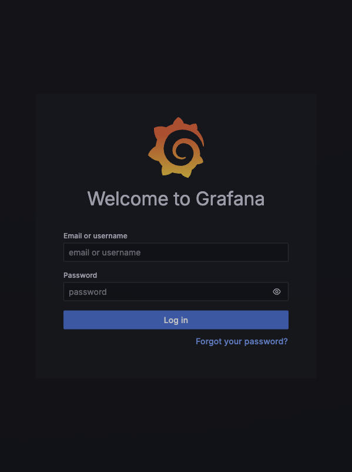

# Lab 16 - Kubernetes Monitoring and Init Containers

## What I built

Lab 16 adds cluster monitoring with kube-prometheus-stack and a concrete init-container demo:

- installed `prometheus-community/kube-prometheus-stack` chart version `65.8.1` in the `monitoring` namespace
- deployed the Python StatefulSet in the `default` namespace using image `devops-info-service-python:lab16`
- enabled a `ServiceMonitor` for the app so Prometheus scrapes `/metrics`
- added reusable chart values for optional init containers, extra volumes, and extra volume mounts
- added `k8s/init-containers.yaml` for the download and wait-for-service init-container patterns
- captured screenshots under `k8s/screenshots/lab16`

## Stack components

| Component | Role |
| --- | --- |
| Prometheus Operator | Watches monitoring CRDs such as `Prometheus`, `Alertmanager`, `ServiceMonitor`, and `PrometheusRule`, then reconciles the actual Pods and config. |
| Prometheus | Scrapes metrics, stores time series, evaluates PromQL, and fires alerting rules. |
| Alertmanager | Receives alerts from Prometheus, groups them, applies inhibition, and routes notifications. |
| Grafana | Provides dashboards for cluster, node, workload, and application metrics. |
| kube-state-metrics | Exposes Kubernetes object state as metrics, such as Deployments, StatefulSets, Pods, PVCs, and Services. |
| node-exporter | Runs on the node and exposes host metrics such as CPU, memory, filesystem, and network usage. |

## Installation

```bash
helm repo add prometheus-community https://prometheus-community.github.io/helm-charts
helm repo update

helm upgrade --install monitoring prometheus-community/kube-prometheus-stack \
  --version 65.8.1 \
  --namespace monitoring \
  --create-namespace \
  --wait --timeout 600s
```

## Monitoring resource verification

```text
$ kubectl get po,svc -n monitoring -o wide
NAME                                                         READY   STATUS    RESTARTS   AGE     IP             NODE                  NOMINATED NODE   READINESS GATES
pod/alertmanager-monitoring-kube-prometheus-alertmanager-0   2/2     Running   0          2m44s   10.244.0.49    lab13-control-plane   <none>           <none>
pod/monitoring-grafana-69db76f9b4-2cph2                      3/3     Running   0          3m8s    10.244.0.47    lab13-control-plane   <none>           <none>
pod/monitoring-kube-prometheus-operator-d5dbb45f9-btvfj      1/1     Running   0          3m8s    10.244.0.48    lab13-control-plane   <none>           <none>
pod/monitoring-kube-state-metrics-75c9d8f7c7-8rvgw           1/1     Running   0          3m8s    10.244.0.46    lab13-control-plane   <none>           <none>
pod/monitoring-prometheus-node-exporter-qmbls                1/1     Running   0          3m8s    192.168.97.2   lab13-control-plane   <none>           <none>
pod/prometheus-monitoring-kube-prometheus-prometheus-0       2/2     Running   0          2m44s   10.244.0.50    lab13-control-plane   <none>           <none>

NAME                                              TYPE        CLUSTER-IP      EXTERNAL-IP   PORT(S)                      AGE     SELECTOR
service/alertmanager-operated                     ClusterIP   None            <none>        9093/TCP,9094/TCP,9094/UDP   2m44s   app.kubernetes.io/name=alertmanager
service/monitoring-grafana                        ClusterIP   10.96.133.138   <none>        80/TCP                       3m9s    app.kubernetes.io/instance=monitoring,app.kubernetes.io/name=grafana
service/monitoring-kube-prometheus-alertmanager   ClusterIP   10.96.80.205    <none>        9093/TCP,8080/TCP            3m9s    alertmanager=monitoring-kube-prometheus-alertmanager,app.kubernetes.io/name=alertmanager
service/monitoring-kube-prometheus-operator       ClusterIP   10.96.139.188   <none>        443/TCP                      3m9s    app=kube-prometheus-stack-operator,release=monitoring
service/monitoring-kube-prometheus-prometheus     ClusterIP   10.96.177.67    <none>        9090/TCP,8080/TCP            3m9s    app.kubernetes.io/name=prometheus,operator.prometheus.io/name=monitoring-kube-prometheus-prometheus
service/monitoring-kube-state-metrics             ClusterIP   10.96.184.36    <none>        8080/TCP                     3m9s    app.kubernetes.io/instance=monitoring,app.kubernetes.io/name=kube-state-metrics
service/monitoring-prometheus-node-exporter       ClusterIP   10.96.225.3     <none>        9100/TCP                     3m9s    app.kubernetes.io/instance=monitoring,app.kubernetes.io/name=prometheus-node-exporter
service/prometheus-operated                       ClusterIP   None            <none>        9090/TCP                     2m44s   app.kubernetes.io/name=prometheus
```

## Application and ServiceMonitor

The app exposes `/metrics` through `prometheus-client`. The chart now renders a `ServiceMonitor` when `serviceMonitor.enabled=true`.

```bash
docker build -t devops-info-service-python:lab16 app_python
kind load docker-image devops-info-service-python:lab16 --name lab13

helm upgrade --install devops-info-service k8s/devops-info-service \
  --namespace default \
  -f k8s/devops-info-service/values-statefulset.yaml \
  --set image.tag=lab16 \
  --set service.nodePort=30087 \
  --set serviceMonitor.enabled=true \
  --wait --timeout 300s
```

```text
$ kubectl get po,sts,svc,pvc,servicemonitor -n default -o wide
NAME                        READY   STATUS    RESTARTS   AGE   IP            NODE                  NOMINATED NODE   READINESS GATES
pod/devops-info-service-0   1/1     Running   0          71s   10.244.0.54   lab13-control-plane   <none>           <none>
pod/devops-info-service-1   1/1     Running   0          61s   10.244.0.56   lab13-control-plane   <none>           <none>
pod/devops-info-service-2   1/1     Running   0          52s   10.244.0.58   lab13-control-plane   <none>           <none>

NAME                                   READY   AGE   CONTAINERS            IMAGES
statefulset.apps/devops-info-service   3/3     71s   devops-info-service   devops-info-service-python:lab16

NAME                                   TYPE        CLUSTER-IP    EXTERNAL-IP   PORT(S)        AGE   SELECTOR
service/devops-info-service            NodePort    10.96.89.80   <none>        80:30087/TCP   71s   app.kubernetes.io/instance=devops-info-service,app.kubernetes.io/name=devops-info-service
service/devops-info-service-headless   ClusterIP   None          <none>        80/TCP         71s   app.kubernetes.io/instance=devops-info-service,app.kubernetes.io/name=devops-info-service
service/kubernetes                     ClusterIP   10.96.0.1     <none>        443/TCP        13d   <none>

NAME                                                      STATUS   VOLUME                                     CAPACITY   ACCESS MODES   STORAGECLASS   VOLUMEATTRIBUTESCLASS   AGE   VOLUMEMODE
persistentvolumeclaim/data-volume-devops-info-service-0   Bound    pvc-d2503b4e-3bed-49ce-8475-08589e39f45e   100Mi      RWO            standard       <unset>                 71s   Filesystem
persistentvolumeclaim/data-volume-devops-info-service-1   Bound    pvc-9f7a9426-5e5b-4949-8119-5f8582d86a05   100Mi      RWO            standard       <unset>                 61s   Filesystem
persistentvolumeclaim/data-volume-devops-info-service-2   Bound    pvc-7099c961-e20f-440e-889a-ef8a521d9579   100Mi      RWO            standard       <unset>                 52s   Filesystem

NAME                                                       AGE
servicemonitor.monitoring.coreos.com/devops-info-service   71s
```

Prometheus target discovery:

```text
$ curl -fsS 'http://127.0.0.1:9090/api/v1/targets?state=active' | jq -r '.data.activeTargets[] | select(.labels.job|test("devops-info-service")) | [.labels.job,.labels.namespace,.labels.pod,.health,.scrapeUrl] | @tsv'
devops-info-service	default	devops-info-service-0	up	http://10.244.0.54:5000/metrics
devops-info-service	default	devops-info-service-1	up	http://10.244.0.56:5000/metrics
devops-info-service	default	devops-info-service-2	up	http://10.244.0.58:5000/metrics
devops-info-service-headless	default	devops-info-service-0	up	http://10.244.0.54:5000/metrics
devops-info-service-headless	default	devops-info-service-1	up	http://10.244.0.56:5000/metrics
devops-info-service-headless	default	devops-info-service-2	up	http://10.244.0.58:5000/metrics
```

Custom metric verification:

```text
$ curl -fsS --get --data-urlencode 'query=sum by (pod) (devops_info_endpoint_calls_total{namespace="default",pod=~"devops-info-service-.*"})' 'http://127.0.0.1:9090/api/v1/query'
devops-info-service-2  79
devops-info-service-0  96
devops-info-service-1  79
```

## Dashboard answers

Screenshots:

- Grafana home: `k8s/screenshots/lab16/grafana-home.png`
- Grafana dashboards list: `k8s/screenshots/lab16/grafana-dashboards.png`
- Prometheus targets: `k8s/screenshots/lab16/prometheus-targets.png`
- Alertmanager alerts: `k8s/screenshots/lab16/alertmanager-alerts.png`





### 1. Pod resources

PromQL:

```promql
sum by (pod) (rate(container_cpu_usage_seconds_total{namespace="default",pod=~"devops-info-service-.*",container!="",image!=""}[2m]))
sum by (pod) (container_memory_working_set_bytes{namespace="default",pod=~"devops-info-service-.*",container!="",image!=""})
```

| Pod | CPU cores | Memory |
| --- | ---: | ---: |
| `devops-info-service-0` | `0.00757` | `37.63 MiB` |
| `devops-info-service-1` | `0.00942` | `26.74 MiB` |
| `devops-info-service-2` | `0.01041` | `26.74 MiB` |

### 2. Namespace CPU analysis

PromQL:

```promql
sum by (pod) (rate(container_cpu_usage_seconds_total{namespace="default",pod!="",container!="",image!=""}[2m]))
```

| Pod | CPU cores |
| --- | ---: |
| `devops-info-service-2` | `0.01042` |
| `devops-info-service-1` | `0.00942` |
| `devops-info-service-0` | `0.00757` |

Highest CPU user in `default`: `devops-info-service-2`.

Lowest CPU user in `default`: `devops-info-service-0`.

### 3. Node metrics

PromQL:

```promql
(1 - (node_memory_MemAvailable_bytes / node_memory_MemTotal_bytes)) * 100
(node_memory_MemTotal_bytes - node_memory_MemAvailable_bytes) / 1024 / 1024
count by (instance) (node_cpu_seconds_total{mode="idle"})
```

| Node exporter instance | Memory used | Memory used MB | CPU cores |
| --- | ---: | ---: | ---: |
| `192.168.97.2:9100` | `43.34%` | `3895.65 MiB` | `11` |

### 4. Kubelet pods and containers

PromQL:

```promql
kubelet_running_pods
kubelet_running_containers
```

| Metric | Value |
| --- | ---: |
| Running pods | `51` |
| Running containers | `55` |
| Created containers | `1` |
| Exited containers | `44` |

### 5. Network traffic

PromQL:

```promql
sum by (pod) (rate(container_network_receive_bytes_total{namespace="default",pod=~"devops-info-service-.*"}[2m]))
sum by (pod) (rate(container_network_transmit_bytes_total{namespace="default",pod=~"devops-info-service-.*"}[2m]))
```

| Pod | Receive bytes per second | Transmit bytes per second |
| --- | ---: | ---: |
| `devops-info-service-0` | `249.45` | `1094.80` |
| `devops-info-service-1` | `227.92` | `887.57` |
| `devops-info-service-2` | `230.44` | `1008.88` |

### 6. Alerts

Alertmanager had `4` active alerts:

```text
InfoInhibitor   none   default      devops-info-service-2
Watchdog        none
InfoInhibitor   none   default      devops-info-service-1
InfoInhibitor   none   kube-system  kindnet-4f84w
```

`Watchdog` is expected in kube-prometheus-stack. The `InfoInhibitor` alerts are informational inhibition helpers.

## Init containers

The standalone manifest is `k8s/init-containers.yaml`.

Apply and verify:

```bash
kubectl apply -f k8s/init-containers.yaml
kubectl wait --for=condition=Available deployment/lab16-dependency -n lab16-init --timeout=180s
kubectl wait --for=condition=Ready pod/lab16-init-demo -n lab16-init --timeout=180s
```

Resource state:

```text
$ kubectl get po,deploy,svc -n lab16-init -o wide
NAME                                    READY   STATUS    RESTARTS   AGE   IP            NODE                  NOMINATED NODE   READINESS GATES
pod/lab16-dependency-786ffd5586-tv5qt   1/1     Running   0          30s   10.244.0.60   lab13-control-plane   <none>           <none>
pod/lab16-init-demo                     1/1     Running   0          30s   10.244.0.61   lab13-control-plane   <none>           <none>

NAME                               READY   UP-TO-DATE   AVAILABLE   AGE   CONTAINERS   IMAGES              SELECTOR
deployment.apps/lab16-dependency   1/1     1            1           30s   nginx        nginx:1.27-alpine   app.kubernetes.io/name=lab16-dependency

NAME                       TYPE        CLUSTER-IP     EXTERNAL-IP   PORT(S)   AGE   SELECTOR
service/lab16-dependency   ClusterIP   10.96.166.25   <none>        80/TCP    30s   app.kubernetes.io/name=lab16-dependency
```

The first init container downloaded `https://example.com` into an `emptyDir` volume:

```text
$ kubectl logs -n lab16-init lab16-init-demo -c init-download
Connecting to example.com (104.20.23.154:443)
wget: note: TLS certificate validation not implemented
saving to '/work-dir/index.html'
index.html           100% |********************************|   528  0:00:00 ETA
'/work-dir/index.html' saved
```

The second init container waited until `http://lab16-dependency` returned a successful response. Because it used quiet `wget`, successful completion produced no log output and allowed the main container to start.

The main container can read the downloaded file from the shared volume:

```text
$ kubectl exec -n lab16-init lab16-init-demo -- sh -c 'ls -l /data/index.html && head -n 3 /data/index.html'
-rw-r--r--    1 root     root           528 May  7 12:54 /data/index.html
<!doctype html><html lang="en"><head><title>Example Domain</title><meta name="viewport" content="width=device-width, initial-scale=1"><style>body{background:#eee;width:60vw;margin:15vh auto;font-family:system-ui,sans-serif}h1{font-size:1.5em}div{opacity:0.8}a:link,a:visited{color:#348}</style></head><body><div><h1>Example Domain</h1><p>This domain is for use in documentation examples without needing permission. Avoid use in operations.</p><p><a href="https://iana.org/domains/example">Learn more</a></p></div></body></html>
```

## Validation

```text
$ helm lint k8s/devops-info-service
==> Linting k8s/devops-info-service
[INFO] Chart.yaml: icon is recommended

1 chart(s) linted, 0 chart(s) failed
```

```text
$ helm template devops-info-service k8s/devops-info-service -f k8s/devops-info-service/values-statefulset.yaml --set image.tag=lab16 --set service.nodePort=30087 --set serviceMonitor.enabled=true --namespace default >/tmp/lab16-rendered.yaml
$ kubectl apply --dry-run=server -f /tmp/lab16-rendered.yaml
serviceaccount/devops-info-service configured (server dry run)
secret/devops-info-service-secret configured (server dry run)
configmap/devops-info-service-config configured (server dry run)
configmap/devops-info-service-env configured (server dry run)
service/devops-info-service-headless configured (server dry run)
service/devops-info-service configured (server dry run)
statefulset.apps/devops-info-service configured (server dry run)
servicemonitor.monitoring.coreos.com/devops-info-service configured (server dry run)
job.batch/devops-info-service-post-install created (server dry run)
job.batch/devops-info-service-pre-install created (server dry run)
```

```text
$ python3 -m pytest app_python/tests
collected 7 items

app_python/tests/test_app.py .......                                     [100%]

7 passed in 0.19s
```
