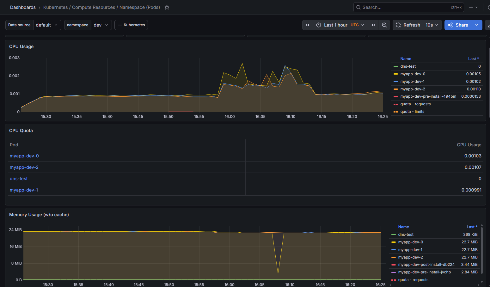
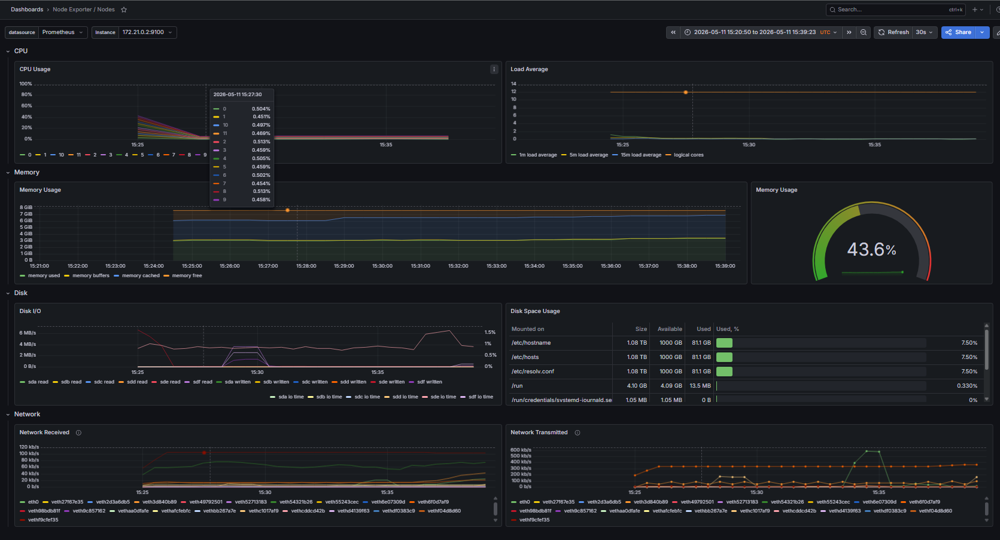
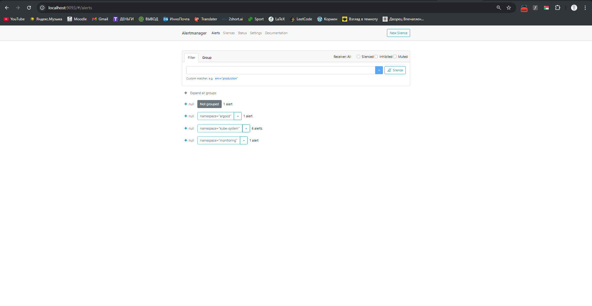

# Lab 16 — Kubernetes Monitoring & Init Containers

---

## 1. Kube-Prometheus Stack

Installed using Helm in `monitoring` namespace.

### Components:

- **Prometheus Operator** — manages Prometheus instances
- **Prometheus** — collects and stores metrics
- **Grafana** — visualization dashboards
- **Alertmanager** — handles alerts
- **kube-state-metrics** — Kubernetes object metrics
- **node-exporter** — node-level metrics

### Verification:

```bash
kubectl get pods -n monitoring
kubectl get svc -n monitoring
````

---

## 2. Grafana Dashboard Exploration

### Access:

```bash
kubectl port-forward svc/monitoring-grafana -n monitoring 3000:80
```

Login:

* admin / prom-operator

---

### 2.1 Pod Resources (StatefulSet)

Namespace: `dev`

📸 Screenshot:


Observations:

* CPU usage ~0.0008–0.0009 per pod
* Memory usage ~23 MiB per pod
* Pods stable and isolated

---

### 2.2 Namespace CPU Analysis

Namespace: `dev`

Observations:

* `myapp-dev-*` pods have consistent low CPU usage
* `dns-test` shows near zero CPU
* No spikes observed

---

### 2.3 Node Metrics

Node: `devops-cluster-control-plane`

📸 Screenshot:


Observations:

* CPU usage low (idle cluster)
* Memory stable usage
* Single node cluster behavior

---

### 2.4 Kubelet Metrics

📸 Screenshot:


Observations:

* 1 kubelet running
* 27 pods managed
* 39 containers active
* stable operation rates

---

### 2.5 Network Traffic

Namespace: `dev`

📸 Screenshot:


Observations:

* small ingress/egress traffic
* mostly internal cluster communication

---

### 2.6 Alerts

Alertmanager:

```bash
kubectl port-forward svc/monitoring-kube-prometheus-alertmanager -n monitoring 9093:9093
```

📸 Screenshot:


Observations:

* No active alerts
* Cluster healthy

---

## 3. Init Containers

### Implementation

Two init containers:

1. **init-download**

   * downloads file using wget
   * stores in shared emptyDir volume

2. **wait-for-service**

   * waits for DNS resolution
   * ensures cluster DNS is ready

---

### Proof of execution:

```bash
kubectl logs myapp-dev-0 -n dev -c init-download
kubectl logs myapp-dev-0 -n dev -c wait-for-service
kubectl exec myapp-dev-0 -n dev -- cat /data/init/index.html
```

---

### Result:

* file successfully downloaded
* DNS resolved correctly
* main container started only after init completed

---

## 4. Conclusion

Kube-Prometheus stack successfully deployed and used for:

* cluster monitoring
* pod resource tracking
* node metrics
* kubelet analysis

Init containers successfully used for:

* pre-start initialization
* dependency waiting
* shared volume setup

Cluster is fully observable and production-ready.