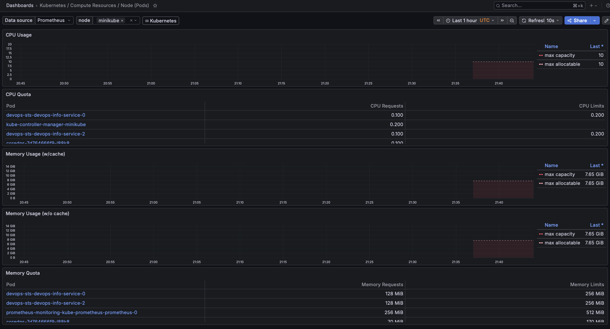
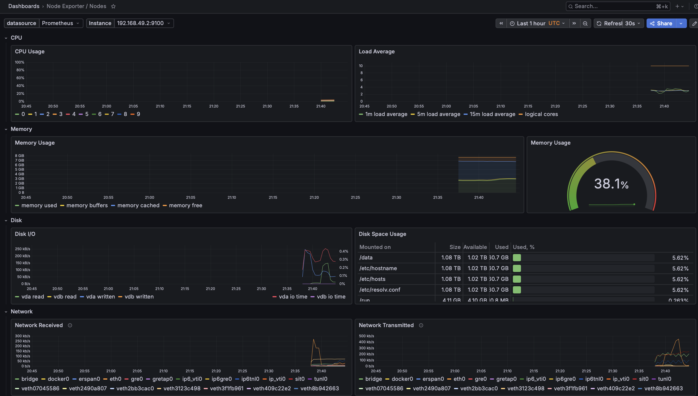
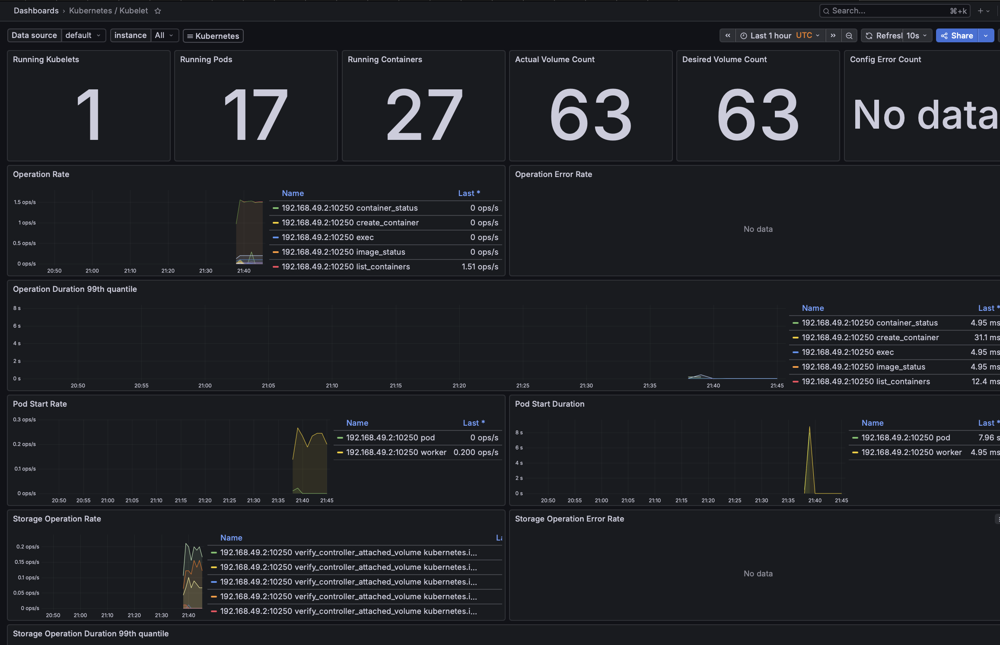
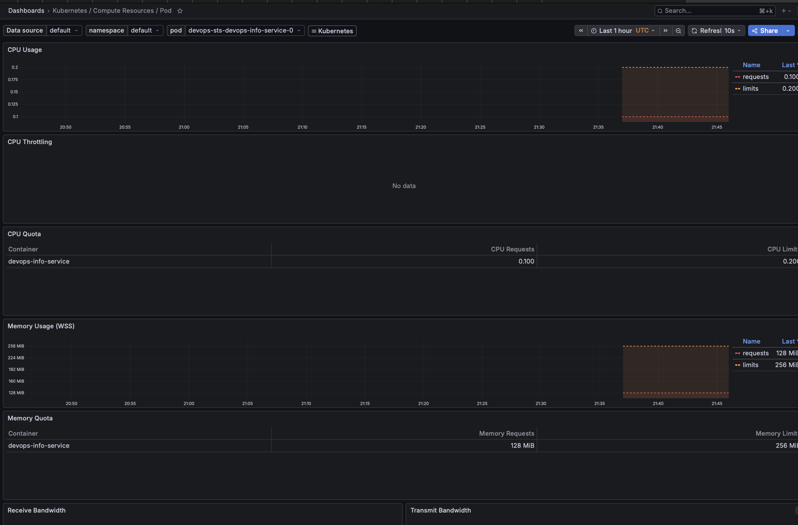

# Lab 16 — Kubernetes Monitoring & Init Containers

## 1. Stack Components

| Component | Role |
|-----------|------|
| **Prometheus Operator** | Manages Prometheus/Alertmanager instances via CRDs (ServiceMonitor, PrometheusRule) |
| **Prometheus** | Scrapes and stores time-series metrics from cluster components and apps |
| **Alertmanager** | Routes alerts from Prometheus to receivers (email, Slack, PagerDuty) |
| **Grafana** | Visualization layer — dashboards over Prometheus data |
| **kube-state-metrics** | Exposes Kubernetes object state as metrics (pod status, deployment replicas, etc.) |
| **node-exporter** | Exposes host-level metrics (CPU, memory, disk, network) per node |

---

## 2. Installation Evidence

```bash
helm install monitoring prometheus-community/kube-prometheus-stack \
  --namespace monitoring \
  --create-namespace \
  --set grafana.adminPassword=admin
```

```
$ kubectl get pods -n monitoring

NAME                                                     READY   STATUS
alertmanager-monitoring-kube-prometheus-alertmanager-0   2/2     Running
monitoring-grafana-5bdbdd45fc-q4k9z                      3/3     Running
monitoring-kube-prometheus-operator-54f68d65b4-wjsnh     1/1     Running
monitoring-kube-state-metrics-5957bd45bc-7fx28           1/1     Running
monitoring-prometheus-node-exporter-2fcff                1/1     Running
prometheus-monitoring-kube-prometheus-prometheus-0       2/2     Running
```

**Access:**
```bash
# Grafana
kubectl port-forward svc/monitoring-grafana -n monitoring 3000:80
# admin / admin

# Prometheus
kubectl port-forward svc/monitoring-kube-prometheus-prometheus -n monitoring 9090:9090

# Alertmanager
kubectl port-forward svc/monitoring-kube-prometheus-alertmanager -n monitoring 9093:9093
```

---

## 3. Grafana Dashboard Exploration

### Q1 — Pod CPU/Memory (default namespace)
**Dashboard: Kubernetes / Compute Resources / Namespace (Pods)**


### Q2 — Node Metrics (memory %, CPU cores)
**Dashboard: Node Exporter / Nodes**


### Q3 — Kubelet (pods/containers count)
**Dashboard: Kubernetes / Kubelet**


### Q4 — StatefulSet Pod Resources
**Dashboard: Kubernetes / Compute Resources / Pod**


StatefulSet pods (`devops-sts-devops-info-service-0/1/2`) show minimal CPU usage (~1m) and ~50Mi memory each — consistent with a lightweight Flask app.

---

## 4. Init Containers

### Manifest: `k8s/init-containers/init-demo.yaml`

Two init containers run before the main app:

**init-download** — downloads a file from the internet:
```yaml
- name: init-download
  image: busybox:1.36
  command: ['sh', '-c', 'wget -O /work-dir/index.html https://example.com']
  volumeMounts:
    - name: workdir
      mountPath: /work-dir
```

**wait-for-service** — waits for DNS to be available:
```yaml
- name: wait-for-service
  image: busybox:1.36
  command:
    - sh
    - -c
    - until nslookup kubernetes.default.svc.cluster.local; do sleep 2; done
```

### Execution evidence

```
$ kubectl get pod init-demo
NAME        READY   STATUS    RESTARTS   AGE
init-demo   1/1     Running   0          19s

$ kubectl logs init-demo -c init-download
Downloading example page...
Connecting to example.com (104.20.23.154:443)
saving to '/work-dir/index.html'
index.html  100% | 528  0:00:00 ETA
Download complete. File size: 528 bytes

$ kubectl exec init-demo -- sh -c 'wc -c < /data/index.html'
528
```

Pod lifecycle: `Init:0/2` → `Init:1/2` → `PodInitializing` → `Running`

---

## Bonus — ServiceMonitor

App already has `/metrics` endpoint (prometheus-client, from Lab 8).

ServiceMonitor created to scrape it:

```yaml
apiVersion: monitoring.coreos.com/v1
kind: ServiceMonitor
metadata:
  name: devops-sts-devops-info-service
  labels:
    release: monitoring
spec:
  selector:
    matchLabels:
      app.kubernetes.io/name: devops-info-service
  endpoints:
    - port: http
      path: /metrics
      interval: 15s
```

```
$ kubectl get servicemonitor
NAME                             AGE
devops-sts-devops-info-service   22s
```

Prometheus automatically discovers and scrapes `/metrics` every 15s via the ServiceMonitor CRD.
