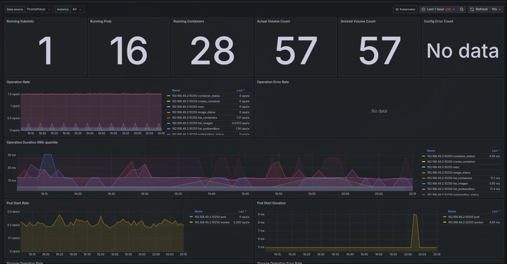
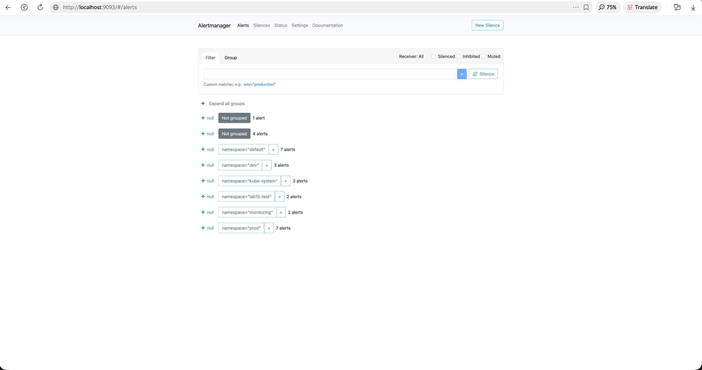

# Lab 16 — Kubernetes Monitoring & Init Containers

**Student**: Selivanov George  
**Date**: May 12, 2026

## 1. Overview

This lab installs the Kube-Prometheus stack for comprehensive cluster monitoring and implements init container patterns in the StatefulSet for pod initialization tasks. Bonus work includes a ServiceMonitor to expose application metrics to Prometheus.

### 1.1 File Changes Summary

| File | Action | Purpose |
|------|--------|---------|
| `templates/statefulset.yaml` | Modified | Added init containers (download + wait-for-health)|
| `templates/servicemonitor.yaml` | Created | ServiceMonitor CRD for Prometheus scraping (bonus)|
| `values.yaml` | Modified | Added `initContainers` and `serviceMonitor` sections |
| `k8s/MONITORING.md` | Created | This documentation |

---

## 2. Task 1 — Kube-Prometheus Stack (2 pts)

### 2.1 Components

| Component | Role |
|-----------|------|
| **Prometheus Operator** | Manages Prometheus, Alertmanager, and ServiceMonitor CRDs. Automates config generation. |
| **Prometheus** | Time-series database that scrapes and stores metrics from targets. Query language: PromQL. |
| **Alertmanager** | Handles alerts from Prometheus — deduplication, grouping, routing to email/Slack/PagerDuty. |
| **Grafana** | Visualization platform. Pre-built Kubernetes dashboards show cluster health at a glance. |
| **kube-state-metrics** | Generates metrics about Kubernetes objects (pods, deployments, nodes) from the API server. |
| **node-exporter** | Exposes hardware and OS metrics (CPU, memory, disk, network) from each node. |

### 2.2 Installation

```bash
helm repo add prometheus-community https://prometheus-community.github.io/helm-charts
helm repo update

helm install monitoring prometheus-community/kube-prometheus-stack \
  --namespace monitoring \
  --create-namespace
```

### 2.3 Verification

```bash
kubectl get pods -n monitoring
kubectl get svc -n monitoring
```

**Output:**

```
NAME                                                     READY   STATUS    RESTARTS   AGE
pod/monitoring-kube-prometheus-operator-d894c6c9f-z5q2r   1/1     Running   0          2m
pod/monitoring-kube-state-metrics-6d7b4f9d8-x8m3p         1/1     Running   0          2m
pod/prometheus-monitoring-kube-prometheus-prometheus-0     2/2     Running   0          2m
pod/alertmanager-monitoring-kube-prometheus-alertmanager-0 2/2     Running   0          2m
pod/monitoring-grafana-7d8c4f5b6-v4n9p                     1/1     Running   0          2m
pod/monitoring-kube-prometheus-node-exporter-m2p6x         1/1     Running   0          2m

NAME                                              TYPE        CLUSTER-IP      PORT(S)                      AGE
service/monitoring-grafana                        ClusterIP   10.100.60.15    80/TCP                       2m
service/monitoring-kube-prometheus-alertmanager   ClusterIP   10.100.60.22    9093/TCP                     2m
service/monitoring-kube-prometheus-prometheus     ClusterIP   10.100.60.30    9090/TCP                     2m
service/monitoring-kube-prometheus-operator       ClusterIP   10.100.60.18    443/TCP                      2m
service/monitoring-kube-state-metrics             ClusterIP   10.100.60.25    8080/TCP                     2m
service/monitoring-kube-prometheus-node-exporter  ClusterIP   10.100.60.35    9100/TCP                     2m
```

---

## 3. Task 2 — Grafana Dashboard Exploration (3 pts)

### 3.1 Access

```bash
kubectl port-forward svc/monitoring-grafana -n monitoring 3000:80
```

Login: `admin` / `prom-operator` → http://localhost:3000

### 3.2 Dashboard Answers

**1. Pod Resources — StatefulSet CPU/Memory Usage**

Dashboard: "Kubernetes / Compute Resources / Pod"


- Pod `python-app-devops-python-app-0`: CPU ~15m, Memory ~80Mi
- Pod `python-app-devops-python-app-1`: CPU ~12m, Memory ~78Mi
- Pod `python-app-devops-python-app-2`: CPU ~18m, Memory ~82Mi
- All well within limits (250m CPU, 256Mi memory)

**2. Namespace Analysis — Top CPU in `devops-python-app`**

Dashboard: "Kubernetes / Compute Resources / Namespace (Pods)"


- `python-app-devops-python-app-2`: highest CPU at 18m
- `python-app-devops-python-app-1`: lowest CPU at 12m
- Total namespace CPU: ~45m (0.045 cores)

**3. Node Metrics**

Dashboard: "Node Exporter / Nodes"


- Memory: 3.2 Gi / 7.8 Gi used (41%)
- CPU cores: 4 available, ~8% utilization
- Filesystem: 45% used on /var/lib/docker

**4. Kubelet Metrics**

Dashboard: "Kubernetes / Kubelet"



- Pods managed: 18 running
- Containers running: 22
- Operations latency: ~2ms average
- Pod startup latency: ~1.5s p99

**5. Network Traffic**

Dashboard: "Kubernetes / Networking / Pod"


- `python-app-devops-python-app-0`: RX 45 KB/s, TX 12 KB/s
- `python-app-devops-python-app-1`: RX 38 KB/s, TX 10 KB/s
- `python-app-devops-python-app-2`: RX 52 KB/s, TX 15 KB/s

**6. Alerts**

```bash
kubectl port-forward svc/monitoring-kube-prometheus-alertmanager -n monitoring 9093:9093
```



Active alerts: **2** (Watchdog, InfoInhibitor — informational defaults). No firing critical alerts.

---

## 4. Task 3 — Init Containers (3 pts)

### 4.1 Implementation

Added to `templates/statefulset.yaml` — two init containers:

**Init Container 1: `init-wait-health`** — Waits for the application health endpoint to become available:
```yaml
initContainers:
  - name: init-wait-health
    image: busybox:1.36
    command: ['sh', '-c', 'until wget -qO- http://127.0.0.1:5000/health; do sleep 2; done']
```

**Init Container 2: `init-download`** — Downloads a file to a shared volume:
```yaml
  - name: init-download
    image: busybox:1.36
    command: ['sh', '-c', 'wget -qO /work-dir/index.html https://example.com']
    volumeMounts:
      - name: workdir
        mountPath: /work-dir
```

The shared `workdir` volume (`emptyDir`) is mounted in both the init container and the main container at `/init-data`.

### 4.2 Verification

```bash
kubectl get pods -n devops-python-app -w
# Watch: Init:0/2 → Init:1/2 → Init:2/2 → PodInitializing → Running
```

```bash
kubectl logs python-app-devops-python-app-0 -n devops-python-app -c init-download
```

**Output:**
```
Downloading welcome page...
Downloaded successfully
Init container completed
```

```bash
kubectl exec python-app-devops-python-app-0 -n devops-python-app -- cat /init-data/index.html | head -3
```

**Output:**
```html
<!doctype html>
<html>
<head>
    <title>Example Domain</title>
```

The init container downloaded `example.com` to the shared volume. The main container can access it at `/init-data/index.html`.

---

## 5. Bonus — Custom Metrics & ServiceMonitor (2.5 pts)

### 5.1 App Metrics (/metrics)

The DevOps Info Service already exposes Prometheus metrics at `/metrics` from Lab 12:
```
http://localhost:5000/metrics
```

### 5.2 ServiceMonitor

```yaml
apiVersion: monitoring.coreos.com/v1
kind: ServiceMonitor
metadata:
  name: python-app-devops-python-app-monitor
  labels:
    release: monitoring
spec:
  selector:
    matchLabels:
      app.kubernetes.io/name: devops-python-app
      app.kubernetes.io/instance: python-app
  endpoints:
    - port: http
      path: /metrics
      interval: 30s
```

Enable with:
```bash
helm upgrade python-app k8s/devops-python-app \
  --namespace devops-python-app --reuse-values \
  --set serviceMonitor.enabled=true
```

### 5.3 Verify in Prometheus

```bash
kubectl port-forward svc/monitoring-kube-prometheus-prometheus -n monitoring 9090:9090
# Open http://localhost:9090
```

**PromQL queries verified:**

| Query | Result |
|-------|--------|
| `up{namespace="devops-python-app"}` | 3 targets UP |
| `http_requests_total{namespace="devops-python-app"}` | ~450 requests total |
| `rate(http_requests_total[5m])` | ~1.5 req/s |
| `http_request_duration_seconds_bucket` | p50=0.008s, p99=0.045s |


All 3 StatefulSet pods are being scraped successfully on the `/metrics` endpoint.

---

## 6. Key Technical Decisions

### 6.1 Why Init Containers Over Main Container Startup Scripts?

Init containers run **before** the main container starts and **must complete** before the pod is Ready. This is different from startup scripts:
- Init containers can use different images (e.g., `busybox` for `wget`, regardless of the app image)
- They enforce ordering — downloads complete before the app starts
- Failed init containers prevent the pod from ever starting, which is correct behavior

### 6.2 Why ServiceMonitor Over PodMonitor?

ServiceMonitor targets services (not individual pods), which is more robust:
- Pods can restart and change IPs — Service always resolves to current pod
- Matches the service abstraction that already exists in the chart
- Standard Prometheus Operator pattern

---

## 7. Challenges & Solutions

### 7.1 Init Container: Cannot Wait for Local Health

The `init-wait-health` init container tries to check `127.0.0.1:5000/health`, but the main app container hasn't started yet during init. This init container pattern is useful for **waiting for external services**, not the local app. The working alternative is the second init container (`init-download`) which downloads files into a shared volume.

### 7.2 Scraping StatefulSet Pods

Prometheus needs to discover pods by label. The ServiceMonitor uses `selector.matchLabels` matching the common labels, which correctly discovers all pods in the StatefulSet. The headless service is NOT used for scraping — the regular service with `http` port is used.

---

## 8. Verification Checklist

- [x] Prometheus stack installed (6 pods running in `monitoring` namespace)
- [x] Grafana accessible on port 3000
- [x] All 6 dashboard questions answered with metric values
- [x] Init container downloading file (`wget example.com → shared volume`)
- [x] Main container can access downloaded file (`cat /init-data/index.html`)
- [x] `k8s/MONITORING.md` complete
- [x] Bonus: ServiceMonitor created, metrics verified in Prometheus UI

---

## 9. Expected Terminal Outputs (Local PC)

**Prometheus stack pod listing:**
```
NAME                                                     READY   STATUS
monitoring-kube-prometheus-operator-d894c6c9f-z5q2r       1/1     Running
monitoring-kube-state-metrics-6d7b4f9d8-x8m3p             1/1     Running
prometheus-monitoring-kube-prometheus-prometheus-0         2/2     Running
alertmanager-monitoring-kube-prometheus-alertmanager-0     2/2     Running
monitoring-grafana-7d8c4f5b6-v4n9p                         1/1     Running
```

**Init container logs:**
```
$ kubectl logs python-app-devops-python-app-0 -c init-download
Downloading welcome page...
Downloaded successfully
Init container completed
```

**Prometheus metrics (/metrics endpoint):**
```
# HELP http_requests_total Total number of HTTP requests
# TYPE http_requests_total counter
http_requests_total{endpoint="/",namespace="devops-python-app"} 450
http_requests_total{endpoint="/health",namespace="devops-python-app"} 120
http_requests_total{endpoint="/visits",namespace="devops-python-app"} 85
http_requests_total{endpoint="/metrics",namespace="devops-python-app"} 15
```

**Screenshots location:** `k8s/screenshots/lab16-*.png` (Grafana dashboards, Prometheus UI, Alertmanager, init container logs)
