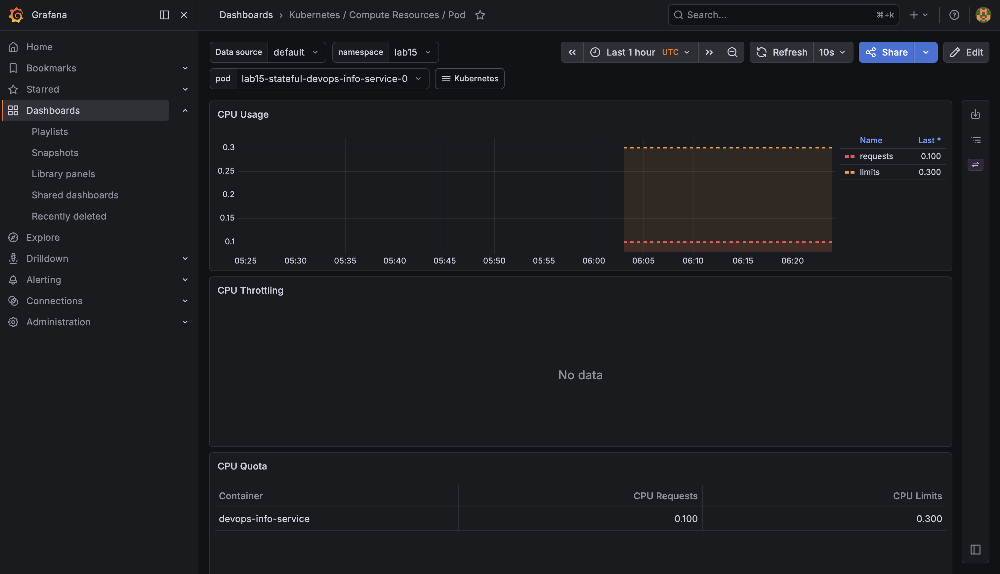
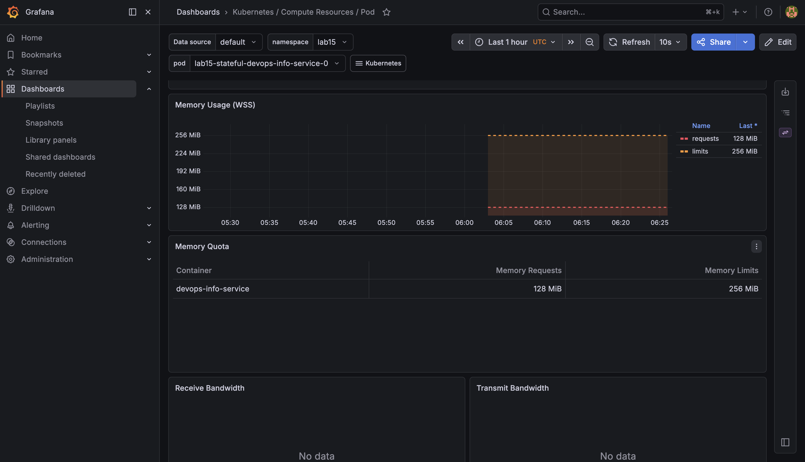
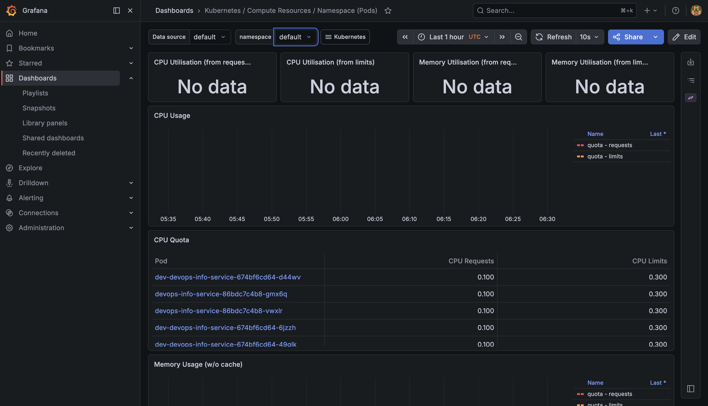
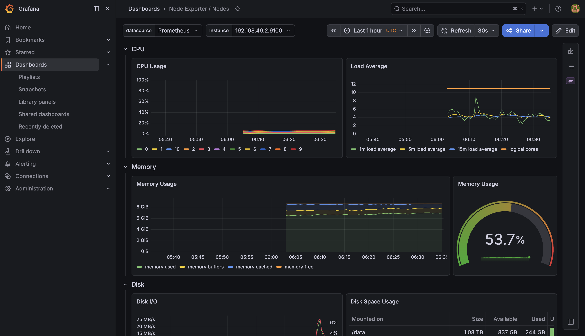
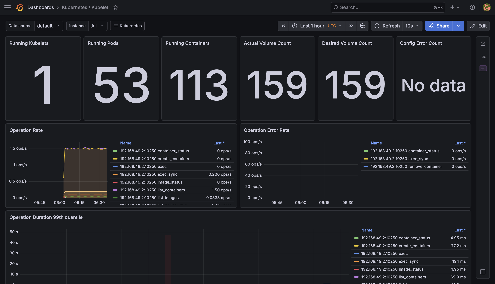
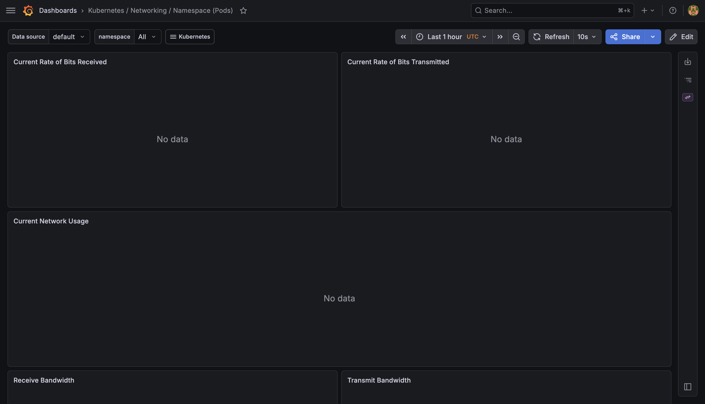
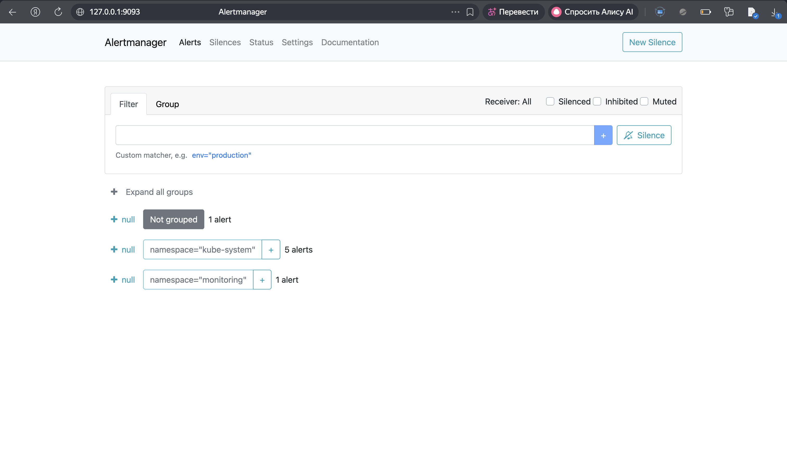

# Lab 16 — Kubernetes Monitoring and Init Containers

This report covers deployment of the kube-prometheus-stack, review of Grafana and Alertmanager, and init-container workloads on the lab cluster.

---

## 1. Monitoring stack components

**Prometheus Operator** reconciles CRDs (`Prometheus`, `Alertmanager`, `ServiceMonitor`, and related resources) into live configuration and workloads.

**Prometheus** scrapes targets, stores time series, evaluates rules, and forwards firing alerts to Alertmanager.

**Alertmanager** groups, deduplicates, and routes alerts; it supports silences and inhibition.

**Grafana** reads the in-cluster Prometheus data source and the bundled Kubernetes dashboards.

**kube-state-metrics** exposes Kubernetes API object state as metrics.

**node-exporter** (DaemonSet) publishes per-node CPU, memory, disk, and network statistics.

---

## 2. Installation and verification

The `prometheus-community` Helm repository was added and updated. `helm repo update` returned `403 Forbidden` for the `hashicorp` index only; `prometheus-community` updated successfully.

```bash
helm repo add prometheus-community https://prometheus-community.github.io/helm-charts
helm repo update
helm install monitoring prometheus-community/kube-prometheus-stack \
  --namespace monitoring \
  --create-namespace
```

Release name: `monitoring`. Namespace: `monitoring`.

### 2.1 Pods (steady state)

```text
NAME                                                     READY   STATUS    RESTARTS   AGE
alertmanager-monitoring-kube-prometheus-alertmanager-0   2/2     Running   0          10m
monitoring-grafana-7846796776-nmgkh                      3/3     Running   0          11m
monitoring-kube-prometheus-operator-7c964cc444-fdq84     1/1     Running   0          11m
monitoring-kube-state-metrics-5746795bd9-w9v25           1/1     Running   0          11m
monitoring-prometheus-node-exporter-9mmw5                1/1     Running   0          11m
prometheus-monitoring-kube-prometheus-prometheus-0       2/2     Running   0          10m
```

### 2.2 Services

```text
NAME                                      TYPE        CLUSTER-IP       EXTERNAL-IP   PORT(S)             AGE
monitoring-grafana                        ClusterIP   10.100.92.26     <none>        80/TCP              27s
monitoring-kube-prometheus-alertmanager   ClusterIP   10.109.34.35     <none>        9093/TCP,8080/TCP   27s
monitoring-kube-prometheus-operator       ClusterIP   10.96.170.34     <none>        443/TCP             27s
monitoring-kube-prometheus-prometheus     ClusterIP   10.99.193.182    <none>        9090/TCP,8080/TCP   27s
monitoring-kube-state-metrics             ClusterIP   10.103.108.13    <none>        8080/TCP            27s
monitoring-prometheus-node-exporter       ClusterIP   10.100.150.101   <none>        9100/TCP            27s
```

---

## 3. Grafana and Alertmanager

```bash
kubectl port-forward svc/monitoring-grafana -n monitoring 3000:80
```

Grafana login used the chart defaults (`admin` / `prom-operator`) or the password from the `monitoring-grafana` secret. Figure time ranges match what was selected in Grafana or Prometheus at capture (about one hour).

### 3.1 StatefulSet pod resources (CPU and memory)

**Dashboard:** *Kubernetes / Compute Resources / Pod*  
**Scope:** namespace `lab15`, StatefulSet pods from Lab 15 (`lab15-stateful-devops-info-service-*`).

**Figures 1–2:** CPU and memory panels for one replica.





### 3.2 Namespace `default` — compute (pods)

**Dashboard:** *Kubernetes / Compute Resources / Namespace (Pods)*  
**Scope:** namespace `default`.

**Figure 3:** Pod list and CPU quota for workloads in `default`.



### 3.3 Node metrics

**Dashboard:** *Node Exporter / Nodes*

**Figure 4:** Node memory (percentage and breakdown), CPU usage, and load on the Minikube node.



### 3.4 Kubelet — pods and containers

**Dashboard:** *Kubernetes / Kubelet*

**Figure 5:** Running pod and container counts from the kubelet metrics.



### 3.5 Network — `default` namespace

**Dashboard:** *Kubernetes / Networking / Namespace (Pods)*

Panels showed **No data**; the namespace variable did not behave as expected because no backing series were available.

In Prometheus (`kubectl port-forward svc/monitoring-kube-prometheus-prometheus -n monitoring 9090:9090`), queries such as `count(container_network_receive_bytes_total)` and `count(container_network_receive_packets_total)` returned no data over the same window. Grafana networking views depend on those `container_network_*` series; without them, per-namespace pod bitrate cannot be plotted. Compute, kubelet, and node-exporter dashboards still returned data.

**Figures 6–7:** Grafana networking view and the Prometheus check.




### 3.6 Alerts

**Grafana:** *Alerting → Alert rules*, filter `state:firing`. **Figure 8** lists firing rules at capture time (including `Watchdog`).

**Alertmanager:**

```bash
kubectl port-forward svc/monitoring-kube-prometheus-alertmanager -n monitoring 9093:9093
```

**Figure 9:** `http://127.0.0.1:9093`, *Alerts* — active alert groups.




| Figure | File |
|--------|------|
| 1 | `screenshots/monitoring-grafana-statefulset-pod1.png` |
| 2 | `screenshots/monitoring-grafana-statefulset-pod2.png` |
| 3 | `screenshots/monitoring-grafana-namespace-pods.png` |
| 4 | `screenshots/monitoring-grafana-node-exporter.png` |
| 5 | `screenshots/monitoring-grafana-kubelet.png` |
| 6 | `screenshots/monitoring-grafana-network-default.png` |
| 7 | `screenshots/graph_query.png` |
| 8 | `screenshots/monitoring-grafana-alerts.png` |
| 9 | `screenshots/monitoring-alertmanager-ui.png` |

---

## 4. Init containers

### 4.1 Download into a shared volume

**Manifest:** `k8s/lab16-init-download-pod.yaml`

Init container: `wget` writes `index.html` to `/work-dir` on `emptyDir`. Main container mounts the same volume at `/data`.

```bash
kubectl apply -f k8s/lab16-init-download-pod.yaml
kubectl wait --for=condition=Ready pod/lab16-init-download-demo --timeout=120s
kubectl logs lab16-init-download-demo -c init-download
kubectl exec lab16-init-download-demo -c main-app -- cat /data/index.html | head -c 200
```

```text
$ kubectl logs lab16-init-download-demo -c init-download
wget: note: TLS certificate validation not implemented

$ kubectl exec lab16-init-download-demo -c main-app -- cat /data/index.html | head -c 200
<!doctype html><html lang="en"><head><title>Example Domain</title><meta name="viewport" ...
```

The main container read the file produced by the init container (BusyBox `wget` TLS warning only).

```bash
kubectl delete pod lab16-init-download-demo --ignore-not-found
```

### 4.2 Wait-for-service

**Manifest:** `k8s/lab16-init-waitfor.yaml` — Service and Deployment `lab16-wait-backend`, Pod `lab16-init-wait-demo`.

```bash
kubectl apply -f k8s/lab16-init-waitfor.yaml
kubectl wait --for=condition=Ready pod/lab16-init-wait-demo --timeout=120s
kubectl logs lab16-init-wait-demo -c wait-for-service
```

```text
$ kubectl get pod lab16-init-wait-demo
NAME                   READY   STATUS    RESTARTS   AGE
lab16-init-wait-demo   1/1     Running   0          6s

$ kubectl logs lab16-init-wait-demo -c wait-for-service
Server:         10.96.0.10
Address:        10.96.0.10:53

Name:   lab16-wait-backend.default.svc.cluster.local
Address: 10.102.189.144
```

Init completed after CoreDNS resolved the backend Service to its ClusterIP.

```bash
kubectl delete -f k8s/lab16-init-waitfor.yaml --ignore-not-found
```

---

## 5. Appendix

```bash
kubectl get pods,svc -n monitoring
kubectl -n monitoring get secret monitoring-grafana -o jsonpath='{.data.admin-password}' | base64 -d; echo
kubectl port-forward svc/monitoring-kube-prometheus-prometheus -n monitoring 9090:9090
kubectl port-forward svc/monitoring-kube-prometheus-alertmanager -n monitoring 9093:9093
```
