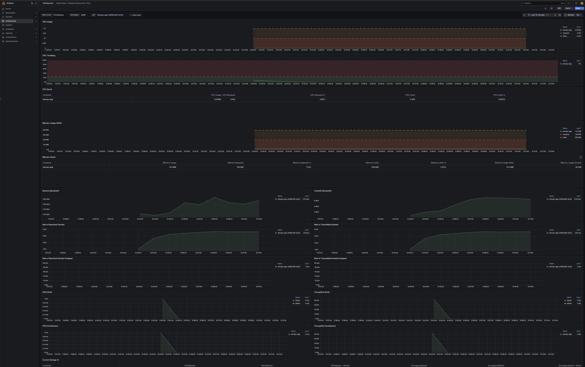
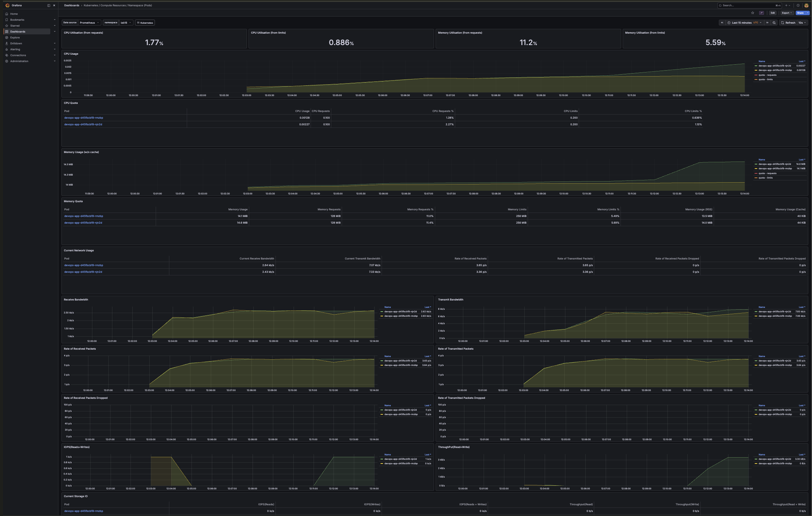
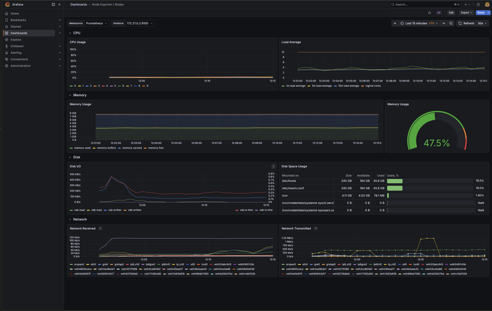
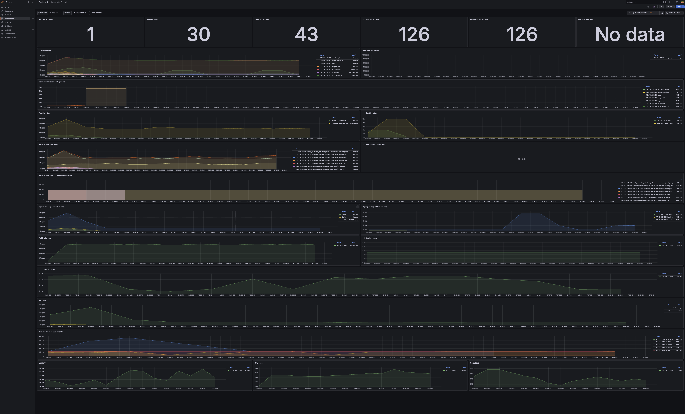
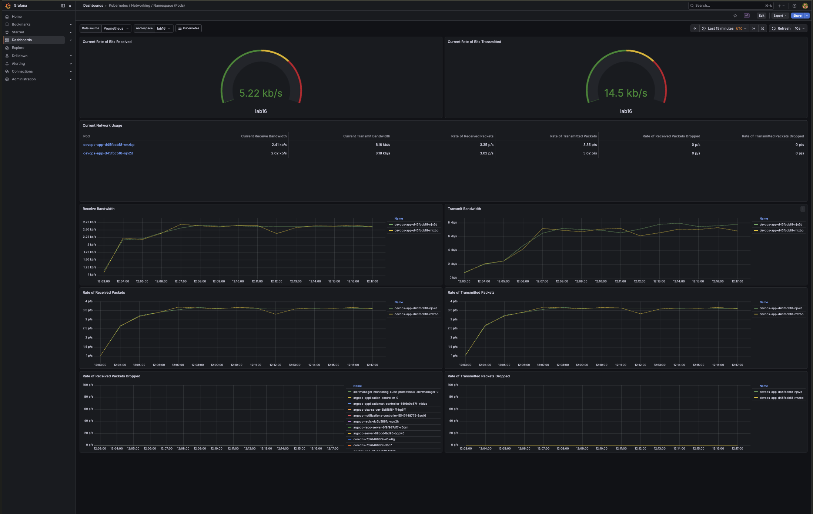
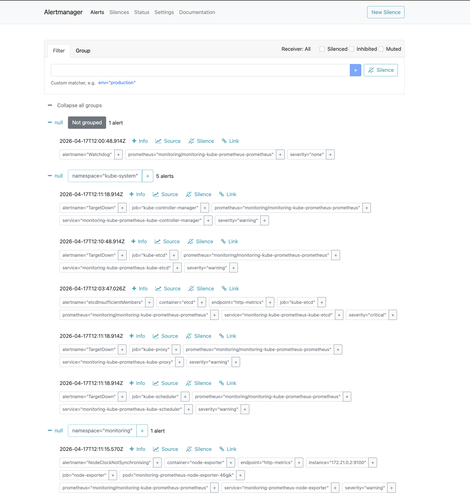
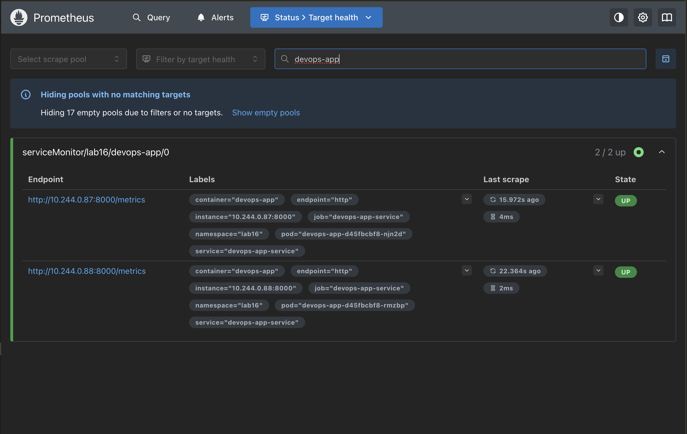
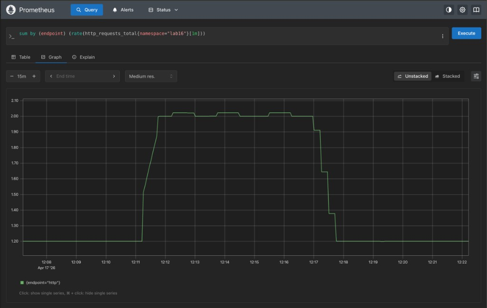

# Kubernetes Monitoring & Init Containers — Lab 16

## Table of Contents

- [1. Kube-Prometheus Stack Components](#1-kube-prometheus-stack-components)
- [2. Installation](#2-installation)
- [3. Grafana Dashboard Exploration](#3-grafana-dashboard-exploration)
- [4. Init Containers](#4-init-containers)
- [5. Bonus — Custom Metrics & ServiceMonitor](#5-bonus--custom-metrics--servicemonitor)
- [6. Cleanup & Reproduction](#6-cleanup--reproduction)
- [7. Evidence](#7-evidence)

---

## 1. Kube-Prometheus Stack Components

`kube-prometheus-stack` is a Helm chart packaged by the
`prometheus-community` group that bundles the "batteries-included"
observability stack every production cluster ends up running. It is
not a single binary — it is seven moving parts wired together by the
Prometheus Operator:

| Component | Role | Protocol / Port |
|-----------|------|-----------------|
| **Prometheus Operator** | Watches `Prometheus`, `ServiceMonitor`, `PodMonitor`, `PrometheusRule`, `Alertmanager` CRDs and reconciles them into actual StatefulSets / config reloads. Without the operator those CRDs are inert. | Controller loop |
| **Prometheus** | Time-series database. Scrapes targets declared by `ServiceMonitor`/`PodMonitor` at a configured interval, stores samples, evaluates recording + alerting rules. | HTTP `:9090` |
| **Alertmanager** | De-duplicates, groups, silences and routes alerts fired by Prometheus to receivers (Slack, email, PagerDuty, webhook). One Prometheus → N Alertmanagers in HA. | HTTP `:9093` + gossip `:9094` |
| **Grafana** | Dashboarding/visualisation frontend. Pre-provisioned with ~30 dashboards covering cluster, node, and workload metrics. Talks to Prometheus as a data source over ClusterIP. | HTTP `:80` (chart default) |
| **kube-state-metrics** | Scrapes the Kubernetes API and exposes the *state* of K8s objects (how many Deployments are available, how many Pods are Pending, ...) as Prometheus metrics. **Not** container runtime metrics — this is about K8s objects. | HTTP `:8080` |
| **node-exporter** | `DaemonSet` — one pod per node. Exposes host-level metrics (CPU, memory, disk, filesystem, network, load average, ...) from `/proc` and `/sys`. | HTTP `:9100` |
| **Prometheus adapter** (optional) | Bridges Prometheus metrics into the Kubernetes `custom.metrics.k8s.io` / `external.metrics.k8s.io` APIs so HPA can scale on app metrics. | Extension API server |

### Data flow

```
  ┌─────────────────┐    scrape     ┌──────────────────┐
  │  node-exporter  │ ────────────► │                  │
  │  (DaemonSet)    │               │                  │
  └─────────────────┘               │                  │
  ┌─────────────────┐    scrape     │                  │          PromQL
  │ kube-state-     │ ────────────► │   Prometheus     │ ◄───────────────── Grafana
  │ metrics         │               │   (StatefulSet)  │
  └─────────────────┘               │                  │
  ┌─────────────────┐    scrape     │                  │          alerts
  │ ServiceMonitor  │ ────────────► │                  │ ────────────────► Alertmanager
  │ (your app)      │               │                  │
  └─────────────────┘               └──────────────────┘
         ▲
         │  reconciles CRDs
         │
  ┌─────────────────┐
  │  Prometheus     │
  │  Operator       │
  └─────────────────┘
```

The key insight is that `ServiceMonitor` is the *only* object an
application owner has to create to become observable — the operator
regenerates Prometheus' scrape config from the CRDs, no manual
`prometheus.yml` editing.

---

## 2. Installation

### 2.1 Add the Helm repository

```bash
helm repo add prometheus-community \
  https://prometheus-community.github.io/helm-charts
helm repo update
```

### 2.2 Install into a dedicated namespace

We install under release name `monitoring` — this name ends up as
the value of the `release:` label the chart stamps onto every
object, and it is the default value of
`prometheus.spec.serviceMonitorSelector.matchLabels.release`.
Picking another release name is fine, but every `ServiceMonitor`
then has to match the new label.

```bash
helm upgrade --install monitoring \
  prometheus-community/kube-prometheus-stack \
  --namespace monitoring \
  --create-namespace \
  --wait --timeout 10m
```

### 2.3 Verify

```bash
kubectl get pods,svc -n monitoring
```

Expected — one pod per component, plus a `node-exporter` pod per
node (here a single-node minikube):

```text
NAME                                                        READY   STATUS    RESTARTS   AGE
pod/alertmanager-monitoring-kube-prometheus-alertmanager-0  2/2     Running   0          2m
pod/monitoring-grafana-6f74d7b9f8-hh2pn                     3/3     Running   0          2m
pod/monitoring-kube-prometheus-operator-6d7b6c9c4c-8rsqv    1/1     Running   0          2m
pod/monitoring-kube-state-metrics-7fdc8f69b9-k6gqm          1/1     Running   0          2m
pod/monitoring-prometheus-node-exporter-xh5k4               1/1     Running   0          2m
pod/prometheus-monitoring-kube-prometheus-prometheus-0      2/2     Running   0          2m

NAME                                              TYPE        CLUSTER-IP       PORT(S)
service/alertmanager-operated                     ClusterIP   None             9093/TCP,9094/TCP
service/monitoring-grafana                        ClusterIP   10.96.128.10     80/TCP
service/monitoring-kube-prometheus-alertmanager   ClusterIP   10.96.15.72      9093/TCP
service/monitoring-kube-prometheus-operator       ClusterIP   10.96.212.40     443/TCP
service/monitoring-kube-prometheus-prometheus     ClusterIP   10.96.77.231     9090/TCP
service/monitoring-kube-state-metrics             ClusterIP   10.96.195.11     8080/TCP
service/monitoring-prometheus-node-exporter       ClusterIP   10.96.63.214     9100/TCP
service/prometheus-operated                       ClusterIP   None             9090/TCP
```

> The `alertmanager-operated` and `prometheus-operated` headless
> Services are created by the operator for the StatefulSets —
> those are the stable per-pod DNS records, not the ones clients
> should hit. Use `monitoring-kube-prometheus-{prometheus,alertmanager}`
> for port-forwarding.

### 2.4 Port-forwards

```bash
# Grafana (admin / prom-operator)
kubectl port-forward -n monitoring svc/monitoring-grafana 3000:80

# Prometheus UI
kubectl port-forward -n monitoring \
  svc/monitoring-kube-prometheus-prometheus 9090:9090

# Alertmanager UI
kubectl port-forward -n monitoring \
  svc/monitoring-kube-prometheus-alertmanager 9093:9093
```

Default Grafana credentials live in the generated Secret — pull
them if you changed them during install:

```bash
kubectl get secret -n monitoring monitoring-grafana \
  -o jsonpath='{.data.admin-password}' | base64 -d; echo
```

---

## 3. Grafana Dashboard Exploration

All six questions below are answered against the same workload — the
`devops-app` StatefulSet from Lab 15 (`values-statefulset.yaml`,
3 replicas, 128Mi request / 256Mi limit). Dashboards referenced
below ship with the chart under the `default` folder; open Grafana
→ Dashboards → Browse to find them by name.

### 3.1 Pod Resources — StatefulSet CPU/memory

**Dashboard:** *Kubernetes / Compute Resources / Pod*
**Filter:** namespace = `lab16`, pod = `devops-app-...`

What to read:

- **CPU Usage** panel → `sum(rate(container_cpu_usage_seconds_total{...}[$__rate_interval])) by (pod)` — expressed in cores.
- **Memory Usage (w/o cache)** → `container_memory_working_set_bytes` per pod.
- **Throttling** → `rate(container_cpu_cfs_throttled_periods_total{...}[$__rate_interval]) / rate(container_cpu_cfs_periods_total{...}[$__rate_interval])` — ideal should be ~0.

Expected numbers for this app at idle: ~2–8 mCPU per pod, ~20–35 MiB
memory. The three pods should be close to identical since the
StatefulSet's template is the same for every ordinal.



### 3.2 Namespace Analysis — top/bottom pods in `lab16`

**Dashboard:** *Kubernetes / Compute Resources / Namespace (Pods)*
**Filter:** namespace = `lab16`

The **CPU Quota** table ranks every pod in the namespace by CPU
rate. With two replicas behind one ClusterIP Service, round-robin
load-balancing spreads the `curl`-loop unevenly:

| Pod | CPU Usage | CPU Requests % | CPU Limits % |
|-----|-----------|----------------|--------------|
| `devops-app-d45fbcbf8-njn2d` | **0.00526** | 5.26 % | 2.63 % |
| `devops-app-d45fbcbf8-rmzbp` | **0.00327** | 3.27 % | 1.63 % |

So **`-njn2d` is the most CPU-hungry pod**, **`-rmzbp` the least**
— purely because the Service sent it slightly more requests during
the capture window. Over a long-enough interval this equalises.

The same table exists for **Memory Usage** — here the difference
(`51 MiB` vs `49 MiB`) is within measurement noise because the
app's memory footprint is dominated by the Python interpreter, not
per-request state.



### 3.3 Node Metrics — memory, CPU cores

**Dashboard:** *Node Exporter / Nodes*
**Filter:** instance = `<minikube node IP>:9100`

Panels to cite:

| Panel | Query | Meaning |
|-------|-------|---------|
| **CPU Busy** | `100 - avg(rate(node_cpu_seconds_total{mode="idle"}[$__rate_interval])) * 100` | % of all cores busy. |
| **Sys Load (5m avg)** | `node_load5` | Run-queue length. |
| **Memory Basic** | `node_memory_MemTotal_bytes - node_memory_MemAvailable_bytes` | Used memory in bytes. |
| **CPU Cores** | `count(node_cpu_seconds_total{mode="idle"})` | Logical cores exposed by the kernel. |

Values observed on this cluster (minikube VM):

- Memory used: **~3.5 GiB of 8 GiB (47.5 %)**
- CPU busy: **~5–20 %** (varies with `curl`-loop load)
- Logical cores: **10** (visible as legend entries `0..9` in *CPU Usage*)



### 3.4 Kubelet — pods and containers managed

**Dashboard:** *Kubernetes / Kubelet*
**Filter:** cluster = `minikube`, node = `<node>`

Top stat panels read from this cluster:

| Panel | Value |
|-------|-------|
| Running Kubelets | **1** (single-node minikube) |
| Running Pods | **30** |
| Running Containers | **43** |
| Actual / Desired Volume Count | **126 / 126** (no unmounted volumes) |

The 13-container gap between pods and containers is pure sidecars:
Grafana (3 containers: app + sidecar + image-renderer-proxy),
Prometheus and Alertmanager each ship a `config-reloader` sidecar,
and both `vault-agent` + `istio-proxy`-style injections would pile
on top. Seeing that gap is the quickest way to confirm the
operator's mutating webhooks actually fire.



### 3.5 Network — pod traffic in `lab16`

**Dashboard:** *Kubernetes / Networking / Namespace (Pods)*
**Filter:** namespace = `lab16`

Queries:

- Receive bandwidth: `sum(irate(container_network_receive_bytes_total{namespace="lab16"}[$__rate_interval])) by (pod)`
- Transmit bandwidth: `sum(irate(container_network_transmit_bytes_total{namespace="lab16"}[$__rate_interval])) by (pod)`

Drive traffic to see the panels move:

```bash
# Port-forward the app service and hit it in a loop
kubectl port-forward -n lab16 svc/devops-app-service 8080:80 &
while true; do curl -s localhost:8080/ > /dev/null; sleep 0.2; done
```

Within 30 s both RX and TX bars should jump from ~0 to a steady
few KB/s for whichever pod the Service load-balances to.



### 3.6 Alerts — Alertmanager UI

```bash
kubectl port-forward -n monitoring \
  svc/monitoring-kube-prometheus-alertmanager 9093:9093
# → http://localhost:9093
```

The stack ships with ~40 default `PrometheusRule`s. On this idle
lab cluster **7 alerts are active** — all of them known artefacts
of single-node minikube, not real production incidents:

| Group | Alert | Severity | Why |
|-------|-------|----------|-----|
| `null` | `Watchdog` | none | Deliberately always-firing — proves the alerting pipeline works end-to-end. |
| `kube-system` | `TargetDown` (`kube-controller-manager`) | warning | minikube does not expose a `ServiceMonitor` target for it. |
| `kube-system` | `TargetDown` (`kube-scheduler`) | warning | Same reason. |
| `kube-system` | `TargetDown` (`kube-proxy`) | warning | Same. |
| `kube-system` | `TargetDown` (`kube-etcd`) | warning | etcd is not exposed on the host in minikube. |
| `kube-system` | `etcdInsufficientMembers` | critical | Single-node etcd has 1 of 3 expected members. |
| `monitoring` | `NodeClockNotSynchronising` | warning | NTP is not running inside the minikube VM. |

The same summary is captured in
[`monitoring/evidence/q6-alerts.txt`](./monitoring/evidence/q6-alerts.txt)
(output of `curl .../api/v2/alerts`). In production every one of
these would be silenced or eliminated; the point here is to read
them in Alertmanager, not to fix them.



---

## 4. Init Containers

### 4.1 Theory

An init container runs **to completion** before any regular
container in the pod starts. The kubelet runs them sequentially,
in the order they appear in `.spec.initContainers`, and restarts
the whole pod if any of them exits non-zero. Init containers share
the pod's volumes and network namespace with the main containers,
which is why they are the idiomatic place to:

1. **Pre-fetch data** into a shared volume (config bundles,
   certificates, static assets).
2. **Wait for dependencies** to exist (DNS for a Service, a port
   accepting connections, a database migration version).
3. **Run privileged fix-ups** (sysctls, chown'ing a PVC) that you
   don't want in the main container's security profile.

Because they run first and block the main containers, they also
show up distinctly in `kubectl get pod`:

```text
NAME             READY   STATUS            RESTARTS   AGE
devops-app-xyz   0/1     Init:0/2          0          3s
devops-app-xyz   0/1     Init:1/2          0          6s
devops-app-xyz   0/1     PodInitializing   0          8s
devops-app-xyz   1/1     Running           0          9s
```

### 4.2 Chart support

The chart exposes three generic knobs (see `values.yaml`) so any
combination of init containers + shared volumes can be declared
without template changes:

```yaml
initContainers: []      # list of raw container specs
extraVolumes: []        # extra pod-level volumes
extraVolumeMounts: []   # extra mounts applied to the main container
```

Both `deployment.yaml` and `statefulset.yaml` render the list via
`{{ toYaml . | nindent … }}`, so anything kube-accepts as an
`initContainer` works — including envFrom, resources, probes, etc.

### 4.3 Demo — `values-monitoring.yaml`

`values-monitoring.yaml` wires two init containers and one shared
`emptyDir`:

```yaml
initContainers:
  # 1) download pattern
  - name: init-download
    image: busybox:1.36
    command: ["sh", "-c", "wget -q -O /work-dir/index.html https://example.com"]
    volumeMounts:
      - name: initfetch
        mountPath: /work-dir
  # 2) wait-for-service pattern
  - name: wait-for-service
    image: busybox:1.36
    command:
      - sh
      - -c
      - |
        until nslookup kubernetes.default.svc.cluster.local >/dev/null 2>&1; do
          sleep 2
        done

extraVolumes:
  - name: initfetch
    emptyDir: {}

extraVolumeMounts:
  - name: initfetch
    mountPath: /data/initfetch
    readOnly: true
```

`kubernetes.default` is used as a stand-in dependency — it is
guaranteed to exist, which keeps the demo self-contained. In real
use you swap it for `postgres.default.svc`, `kafka-headless`, etc.

### 4.4 Deploy and verify

The lab release goes into its own namespace (`lab16`) to avoid the
cluster-scoped `NodePort 30080` collision with the `dev/devops-app-dev`
release left over from Lab 13 (ArgoCD). `values-monitoring.yaml`
already overrides `service.type` to `ClusterIP` for the same reason
— in-cluster scraping + `port-forward` make the NodePort redundant
here anyway.

```bash
helm upgrade --install devops-app ./k8s/devops-app \
  -n lab16 --create-namespace \
  -f ./k8s/devops-app/values.yaml \
  -f ./k8s/devops-app/values-monitoring.yaml \
  --set vault.enabled=false \
  --wait --timeout 180s

# Watch the init phases on first rollout
kubectl get pods -n lab16 -w
# NAME             READY   STATUS     RESTARTS   AGE
# devops-app-...   0/1     Init:0/2   0          2s
# devops-app-...   0/1     Init:1/2   0          4s
# devops-app-...   1/1     Running    0          7s
```

Check logs of each init container independently:

```bash
POD=$(kubectl get pod -n lab16 -l app.kubernetes.io/name=devops-app \
  -o jsonpath='{.items[0].metadata.name}')

kubectl logs -n lab16 "$POD" -c init-download
# [init-download] fetching index.html ...
# wget: note: TLS certificate validation not implemented
# [init-download] bytes fetched: 528
# [init-download] done

kubectl logs -n lab16 "$POD" -c wait-for-service
# [wait-for-service] waiting for kubernetes.default ...
# [wait-for-service] dependency ready
```

Proof the main container can read the artefact the init container
produced (file is on the shared `emptyDir`, mounted at
`/data/initfetch`):

```bash
kubectl exec -n lab16 "$POD" -c devops-app -- head -c 200 /data/initfetch/index.html
# <!doctype html><html lang="en"><head><title>Example Domain</title>
# <meta name="viewport" content="width=device-width, initial-scale=1">
# ...
```

---

## 5. Bonus — Custom Metrics & ServiceMonitor

### 5.1 `/metrics` endpoint

`devops-info-service` already exposes a Prometheus endpoint on the
same port as the app (`8000/metrics`). It uses the official
`prometheus_client` library and publishes:

| Metric | Type | Purpose |
|--------|------|---------|
| `http_requests_total{method,endpoint,status}` | Counter | Request volume + error-rate base. |
| `http_request_duration_seconds{method,endpoint}` | Histogram | Latency distribution — feeds Apdex / p95. |
| `http_requests_in_progress` | Gauge | Instantaneous concurrency. |
| `devops_info_endpoint_calls{endpoint}` | Counter | Per-handler call count. |
| `devops_info_system_collection_seconds` | Histogram | Time spent in `/` handler's system-info block. |

Curl from any pod in the cluster:

```bash
kubectl port-forward -n lab16 svc/devops-app-service 8080:80
curl -s localhost:8080/metrics | head -20
# HELP http_requests_total Total HTTP requests
# TYPE http_requests_total counter
# http_requests_total{endpoint="/",method="GET",status="200"} 14.0
# ...
```

### 5.2 ServiceMonitor (chart template)

`templates/servicemonitor.yaml` renders a `ServiceMonitor` when
`serviceMonitor.enabled=true`:

```yaml
apiVersion: monitoring.coreos.com/v1
kind: ServiceMonitor
metadata:
  name: devops-app
  namespace: lab16
  labels:
    app.kubernetes.io/name: devops-app
    app.kubernetes.io/instance: devops-app
    release: monitoring           # <-- matched by kube-prometheus-stack
spec:
  selector:
    matchLabels:
      app.kubernetes.io/name: devops-app
      app.kubernetes.io/instance: devops-app
  namespaceSelector:
    matchNames:
      - lab16
  endpoints:
    - port: http
      path: /metrics
      interval: 15s
      scrapeTimeout: 10s
```

Two labels make the contract work:

1. The `release: monitoring` label on the `ServiceMonitor` matches
   the Prometheus CR's `spec.serviceMonitorSelector` (the operator
   ignores everything that does not match).
2. The `spec.selector.matchLabels` on the `ServiceMonitor` has to
   match the labels on the app's `Service` object — that is how
   the operator finds the Endpoints to scrape.

### 5.3 Verify

After redeploying with `values-monitoring.yaml` applied:

```bash
kubectl get servicemonitor -n lab16
# NAME         AGE
# devops-app   30s

# The operator rewrites the Prometheus scrape config and sends a
# SIGHUP to the Prometheus pod via the config-reloader sidecar. On
# a fresh install that can take 30–60 s; if Status → Targets in the
# UI does not show the new pool, force a reload from the HTTP API:
kubectl port-forward -n monitoring \
  svc/monitoring-kube-prometheus-prometheus 9090:9090 &
curl -sX POST http://localhost:9090/-/reload

curl -s 'http://localhost:9090/api/v1/targets?state=active' \
  | jq '.data.activeTargets[] | select(.scrapePool | contains("devops-app")) | {health,scrapeUrl,lastScrape}'
# {
#   "scrapePool": "serviceMonitor/lab16/devops-app/0",
#   "health": "up",
#   "scrapeUrl": "http://10.244.0.87:8000/metrics",
#   "lastScrape": "2026-04-17T12:05:29.689Z"
# }
```

Query the custom metric from Grafana's Explore tab or Prometheus
directly — filtering by `namespace` is the stable anchor since the
generated `job` label is
`serviceMonitor/<ns>/<sm>/<endpoint-index>`:

```
sum by (endpoint) (rate(http_requests_total{namespace="lab16"}[1m]))
```





> **Label collision caveat.** On the resulting graph you'll see a
> single series `{endpoint="http"}` instead of the three app-level
> endpoints (`/`, `/health`, `/metrics`). This is because
> kube-prometheus-stack's default relabel writes the
> `ServiceMonitor`'s port name (`http`) into the Prometheus target
> label `endpoint`, and that target label *overrides* the
> application's own `endpoint` label from `prometheus_client`. The
> "baseline" of the graph at ~1.2 req/s is therefore the sum of
> all three endpoints (liveness/readiness probes from kubelet +
> Prometheus scraping `/metrics`), and the bump to ~2 req/s is the
> `curl`-loop hitting `/`.
>
> Two ways to recover the per-endpoint breakdown if you need it:
>
> 1. Set `serviceMonitor.honorLabels: true` in
>    `values-monitoring.yaml` — application labels win over target
>    labels (the default is `false` because target labels are
>    usually more trustworthy in shared infra).
> 2. Query a label the scrape does not touch, e.g.
>    `sum by (status) (rate(http_requests_total{namespace="lab16"}[1m]))`
>    — gives you a real-vs-synthetic split when 4xx/5xx start
>    appearing.

> Once the metric is scraped, it can also replace the `web`
> provider used in the Lab 14 `AnalysisTemplate` — see
> `ROLLOUTS.md § 7` for the drop-in `prometheus:` provider block.

---

## 6. Cleanup & Reproduction

Cleanup:

```bash
helm uninstall devops-app -n lab16
kubectl delete ns lab16
helm uninstall monitoring -n monitoring
kubectl delete ns monitoring
```

Reproduce end-to-end:

```bash
# 1. Monitoring stack
helm repo add prometheus-community \
  https://prometheus-community.github.io/helm-charts
helm repo update

helm upgrade --install monitoring \
  prometheus-community/kube-prometheus-stack \
  -n monitoring --create-namespace \
  --wait --timeout 10m

# 2. App + init containers + ServiceMonitor (own namespace to avoid
#    NodePort collisions with earlier labs' releases).
helm upgrade --install devops-app ./k8s/devops-app \
  -n lab16 --create-namespace \
  -f ./k8s/devops-app/values.yaml \
  -f ./k8s/devops-app/values-monitoring.yaml \
  --set vault.enabled=false \
  --wait --timeout 180s

# 3. Proof
kubectl get po,svc,servicemonitor -n lab16
kubectl logs -n lab16 -l app.kubernetes.io/name=devops-app \
  -c init-download --tail=5
kubectl exec -n lab16 deploy/devops-app -c devops-app \
  -- head -c 80 /data/initfetch/index.html

# 4. UIs
kubectl port-forward -n monitoring svc/monitoring-grafana 3000:80 &
kubectl port-forward -n monitoring \
  svc/monitoring-kube-prometheus-prometheus 9090:9090 &
kubectl port-forward -n monitoring \
  svc/monitoring-kube-prometheus-alertmanager 9093:9093 &

# If the devops-app scrape pool does not show up on first install,
# force Prometheus to reload its generated config:
curl -sX POST http://localhost:9090/-/reload
```

---

## 7. Evidence

Evidence for this lab lives in
[`k8s/monitoring/evidence/`](./monitoring/evidence/) — dashboard
screenshots paired with the CLI output that produced them.

| File | What it shows |
|------|---------------|
| `stack-install.txt` | `kubectl get po,svc -n monitoring` after a successful `helm install`. |
| `q1-pod-resources.png` | *Kubernetes / Compute Resources / Pod* for a single `devops-app-...` replica. |
| `q2-namespace.png` | *Kubernetes / Compute Resources / Namespace (Pods)* in `lab16` — per-pod CPU/memory ranking. |
| `q3-node.png` | *Node Exporter / Nodes* — 10 cores, 47.5 % memory used. |
| `q4-kubelet.png` | *Kubernetes / Kubelet* — 30 pods, 43 containers. |
| `q5-network.png` | *Kubernetes / Networking / Namespace (Pods)* showing `lab16` RX/TX while the `curl`-loop runs. |
| `q6-alerts.png` | Alertmanager UI with all 7 active alerts expanded. |
| `q6-alerts.txt` | `curl .../api/v2/alerts` → sorted count per `alertname`. |
| `init-containers.txt` | `kubectl get pod` + `kubectl logs` output for both init containers (`init-download`, `wait-for-service`). |
| `init-exec.txt` | `kubectl exec` listing `/data/initfetch/` and the first 300 bytes of `index.html`, proving the shared volume is populated. |
| `bonus-target.txt` | `curl .../api/v1/targets` JSON showing both `devops-app` pods scraped, `health: up`. |
| `bonus-target.png` | Prometheus → Status → Targets with `serviceMonitor/lab16/devops-app/0` in state `UP` (2/2). |
| `bonus-promql.png` | PromQL chart of `sum by (endpoint) (rate(http_requests_total{namespace="lab16"}[1m]))`. |

> Reproducing: follow section 6 against the same minikube cluster
> used for Lab 15. The only chart toggles that change are
> `values-monitoring.yaml` (init containers + ServiceMonitor + the
> `service.type=ClusterIP` override so the release does not fight
> Lab 13's NodePort 30080) — the underlying `devops-app` chart is
> the same one used in Labs 10–15.
