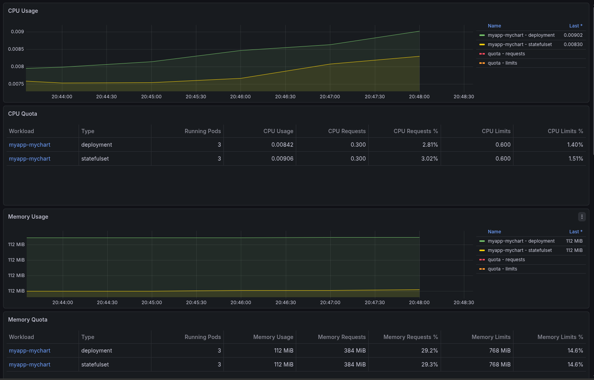
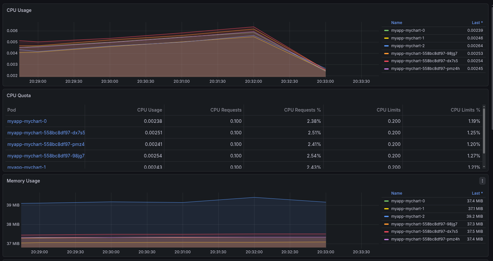
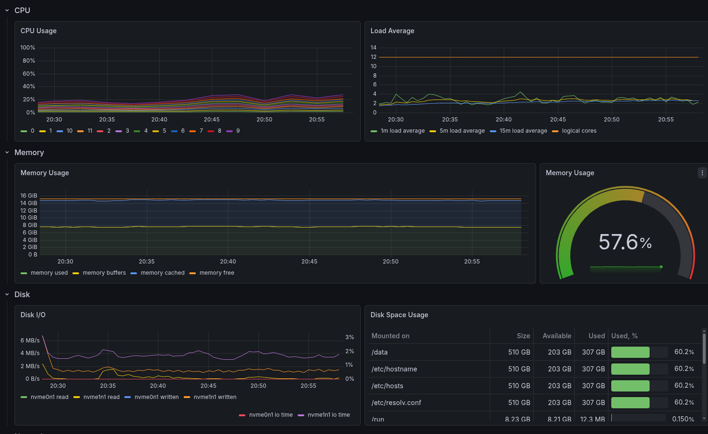
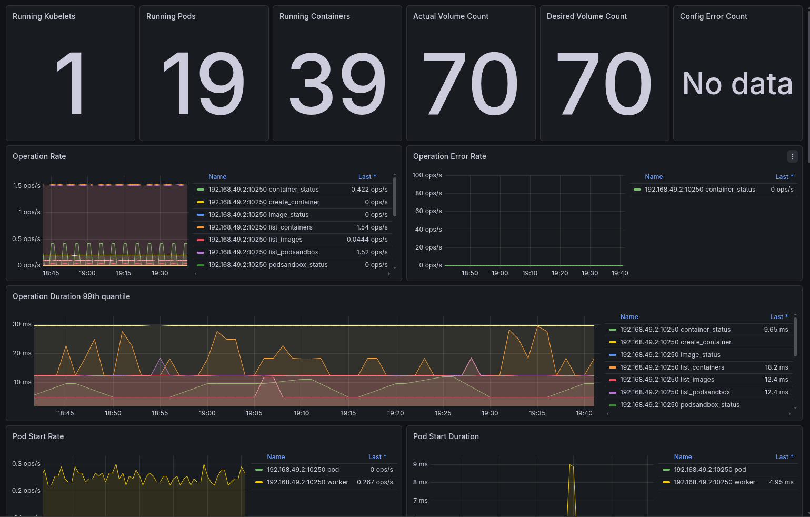
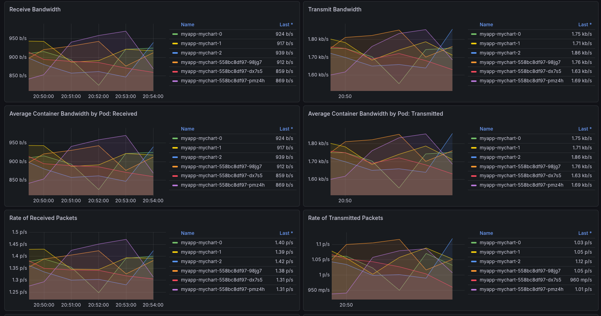
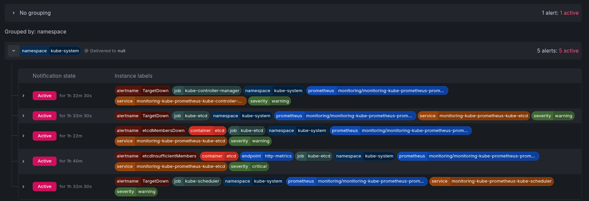

# Lab 16

## Stack Components

| Component | Description |
| ----------- | ----------- |
| **Prometheus Operator** | A Kubernetes operator that simplifies deploying and managing Prometheus instances. It uses custom resources to configure Prometheus, service discovery, and alert routing automatically. |
| **Prometheus** | An open-source metrics database and monitoring system. It collects time-series data from applications and infrastructure, stores it, and provides a query language (PromQL) to analyze it. |
| **Alertmanager** | Handles alerts generated by Prometheus. It groups, deduplicates, and routes alerts to appropriate destinations like email, Slack, or PagerDuty. |
| **Grafana** | A visualization platform that displays metrics and logs through dashboards. It connects to Prometheus and other data sources to create interactive, customizable charts and graphs. |
| **kube-state-metrics** | Exposes Kubernetes object metrics (pods, deployments, nodes, etc.) as Prometheus metrics. It provides visibility into the state of your cluster resources. |
| **node-exporter** | Collects hardware and OS-level metrics from servers (CPU, memory, disk, network). Prometheus scrapes these metrics for infrastructure monitoring. |

## Installation Evidence - kubectl get po,svc -n monitoring

```bash
kubectl get po,svc -n monitoring
NAME                                                         READY   STATUS    RESTARTS   AGE
pod/alertmanager-monitoring-kube-prometheus-alertmanager-0   2/2     Running   0          86m
pod/monitoring-grafana-7977b4bb8c-9mtz6                      3/3     Running   0          87m
pod/monitoring-kube-prometheus-operator-85495f4cf8-njh4p     1/1     Running   0          87m
pod/monitoring-kube-state-metrics-5746795bd9-fb8gl           1/1     Running   0          87m
pod/monitoring-prometheus-node-exporter-khrvb                1/1     Running   0          87m
pod/prometheus-monitoring-kube-prometheus-prometheus-0       2/2     Running   0          86m

NAME                                              TYPE        CLUSTER-IP       EXTERNAL-IP   PORT(S)                      AGE
service/alertmanager-operated                     ClusterIP   None             <none>        9093/TCP,9094/TCP,9094/UDP   86m
service/monitoring-grafana                        ClusterIP   10.101.120.12    <none>        80/TCP                       87m
service/monitoring-kube-prometheus-alertmanager   ClusterIP   10.103.214.32    <none>        9093/TCP,8080/TCP            87m
service/monitoring-kube-prometheus-operator       ClusterIP   10.106.66.56     <none>        443/TCP                      87m
service/monitoring-kube-prometheus-prometheus     ClusterIP   10.107.211.165   <none>        9090/TCP,8080/TCP            87m
service/monitoring-kube-state-metrics             ClusterIP   10.98.195.128    <none>        8080/TCP                     87m
service/monitoring-prometheus-node-exporter       ClusterIP   10.101.152.77    <none>        9100/TCP                     87m
service/prometheus-operated                       ClusterIP   None             <none>        9090/TCP                     86m
```

## Dashboard Answers

### Pod Resources: CPU/memory usage of your StatefulSet

- For statesful workload: cpu requests 0.300, cpu limits: 0.600, actual usage: 0.00915
- Memory usage: 112 MiB



### Namespace Analysis: Which pods use most/least CPU in default namespace?



Pod: myapp-mychart-2 uses most cpu
Pod: myapp-mychart-1 uses least cpu

### Node Metrics: Memory usage (% and MB), CPU cores

- 57% of memory used, 7.55 Gib, 12 cpu cores


### Kubelet: How many pods/containers managed?

- 19 pods and 39 containers.



### Network: Traffic for pods in default namespace

- Described on screenshot


### Alerts: How many active alerts? Check Alertmanager UI

- 5 active alerts



Init Containers - Implementation and proof of success

My configuration starts two containers before application container will start. - Init containers.
First container downloads file and puts it to a shared volume.
Second container checks is service resolvable (dns lookup), if not - retries in 2 seconds.

```bash
 kubectl get pods -w
NAME                              READY   STATUS    RESTARTS   AGE
myapp-mychart-pre-install-pwtfl   1/1     Running   0          3s
myapp-mychart-pre-install-pwtfl   0/1     Completed   0          12s
myapp-mychart-pre-install-pwtfl   0/1     Completed   0          13s
myapp-mychart-pre-install-pwtfl   0/1     Completed   0          14s
myapp-mychart-pre-install-pwtfl   0/1     Completed   0          14s
myapp-mychart-pre-install-pwtfl   0/1     Completed   0          14s
myapp-mychart-558bc8df97-9tv2m    0/1     Pending     0          0s
myapp-mychart-558bc8df97-9tv2m    0/1     Pending     0          0s
myapp-mychart-558bc8df97-lx9ql    0/1     Pending     0          0s
myapp-mychart-558bc8df97-b98kq    0/1     Pending     0          0s
myapp-mychart-0                   0/1     Pending     0          0s
myapp-mychart-558bc8df97-lx9ql    0/1     Pending     0          0s
myapp-mychart-558bc8df97-b98kq    0/1     Pending     0          0s
myapp-mychart-0                   0/1     Pending     0          0s
myapp-mychart-558bc8df97-9tv2m    0/1     ContainerCreating   0          0s
myapp-mychart-558bc8df97-lx9ql    0/1     ContainerCreating   0          0s
myapp-mychart-post-install-ztmpm   0/1     Pending             0          0s
myapp-mychart-558bc8df97-b98kq     0/1     ContainerCreating   0          0s
myapp-mychart-post-install-ztmpm   0/1     Pending             0          0s
myapp-mychart-0                    0/1     Init:0/2            0          0s
myapp-mychart-post-install-ztmpm   0/1     ContainerCreating   0          0s
myapp-mychart-0                    0/1     Init:0/2            0          1s
myapp-mychart-558bc8df97-9tv2m     0/1     Running             0          2s
myapp-mychart-558bc8df97-b98kq     0/1     Running             0          2s
myapp-mychart-0                    0/1     Init:1/2            0          2s
myapp-mychart-558bc8df97-lx9ql     0/1     Running             0          2s
myapp-mychart-post-install-ztmpm   1/1     Running             0          3s
myapp-mychart-0                    0/1     PodInitializing     0          3s
myapp-mychart-0                    0/1     Running             0          4s
myapp-mychart-558bc8df97-lx9ql     1/1     Running             0          13s
myapp-mychart-558bc8df97-b98kq     1/1     Running             0          13s
myapp-mychart-558bc8df97-9tv2m     1/1     Running             0          13s
myapp-mychart-post-install-ztmpm   0/1     Completed           0          13s
myapp-mychart-0                    1/1     Running             0          14s
myapp-mychart-1                    0/1     Pending             0          0s
myapp-mychart-1                    0/1     Pending             0          0s
myapp-mychart-1                    0/1     Init:0/2            0          0s
myapp-mychart-post-install-ztmpm   0/1     Completed           0          14s
myapp-mychart-1                    0/1     Init:1/2            0          1s
myapp-mychart-post-install-ztmpm   0/1     Completed           0          15s
myapp-mychart-post-install-ztmpm   0/1     Completed           0          15s
myapp-mychart-post-install-ztmpm   0/1     Completed           0          15s
myapp-mychart-1                    0/1     PodInitializing     0          2s
myapp-mychart-1                    0/1     Running             0          3s
myapp-mychart-1                    1/1     Running             0          14s
myapp-mychart-2                    0/1     Pending             0          0s
myapp-mychart-2                    0/1     Pending             0          0s
myapp-mychart-2                    0/1     Init:0/2            0          0s
myapp-mychart-2                    0/1     Init:1/2            0          1s
myapp-mychart-2                    0/1     PodInitializing     0          2s
myapp-mychart-2                    0/1     Running             0          3s
myapp-mychart-2                    1/1     Running             0          14s


kubectl logs myapp-mychart-0 -c init-download
Connecting to ru.cristalix.pe (45.10.244.221:80)
saving to '/work-dir/index.json'
index.json           100% |********************************| 55254  0:00:00 ETA
'/work-dir/index.json' saved

kubectl exec myapp-mychart-0 -- head -n10 /loaded-data/index.json
Defaulted container "mychart" out of: mychart, init-download (init), wait-for-service (init)
[
  {
    "id": 1,
    "name": "\u0410\u043d\u0433\u0435\u043b\u044c\u0441\u043a\u0438\u0435 \u043a\u0440\u044b\u043b\u044c\u044f",
    "type": "wings",
    "price": 999,
    "rarity": "common",
    "item_id": "11064",
    "available": true,
    "variants": [
```
