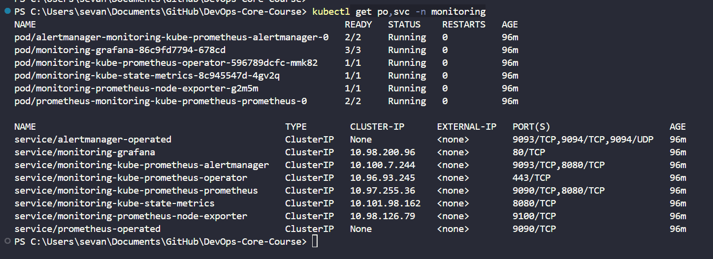
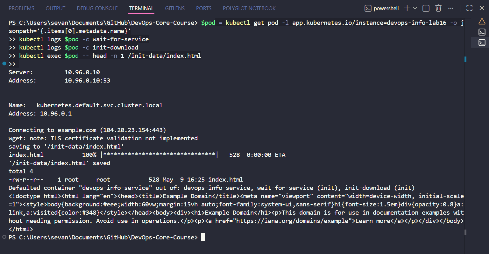
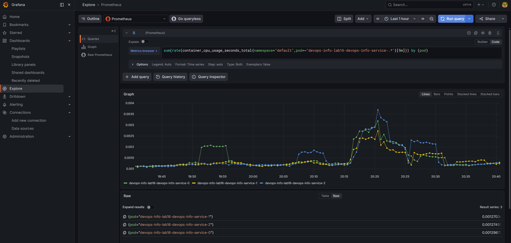
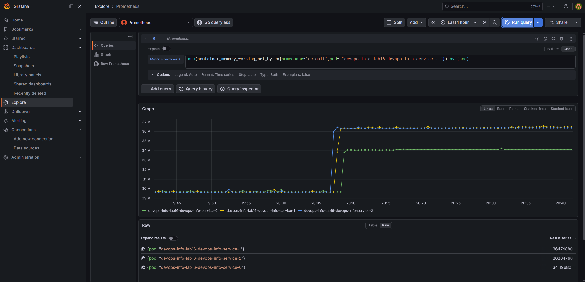
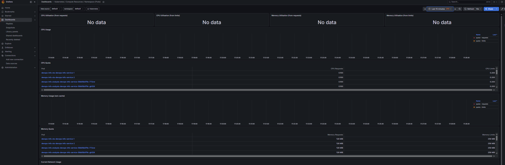
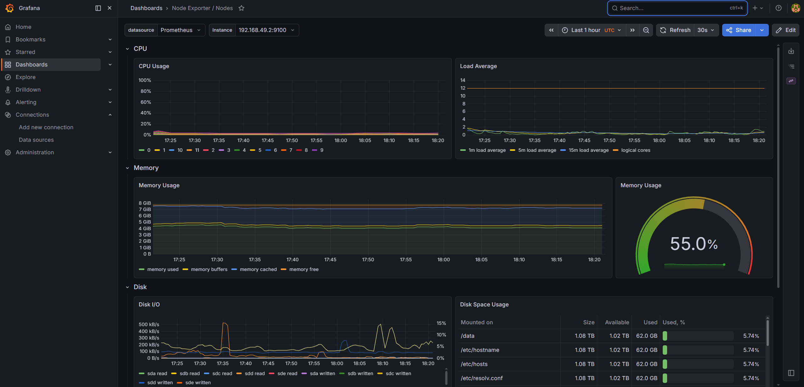
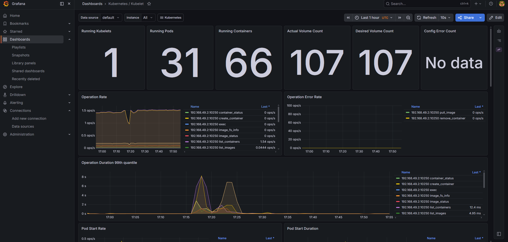
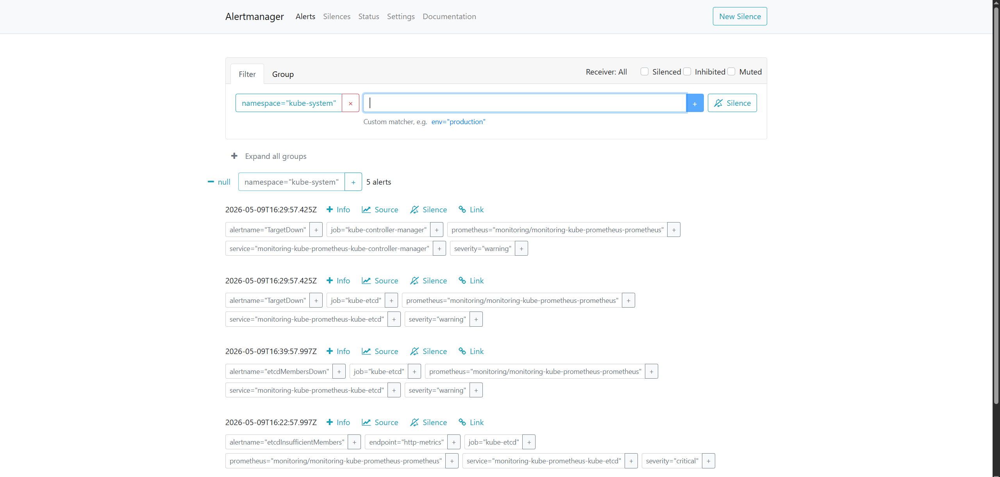
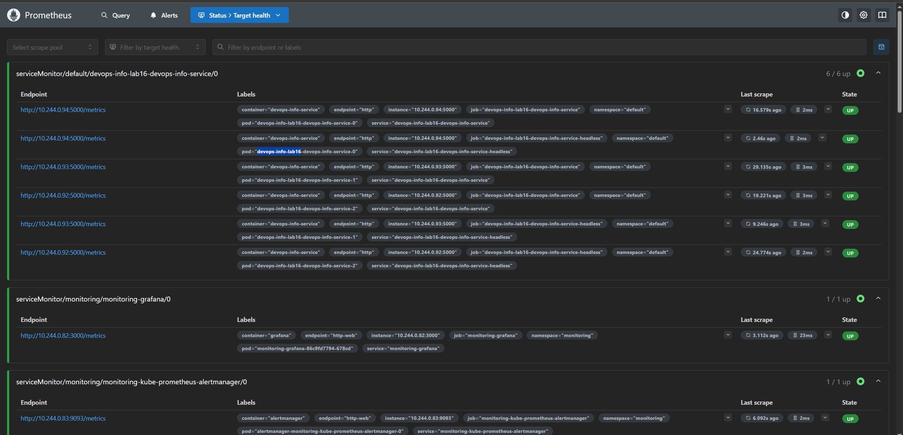
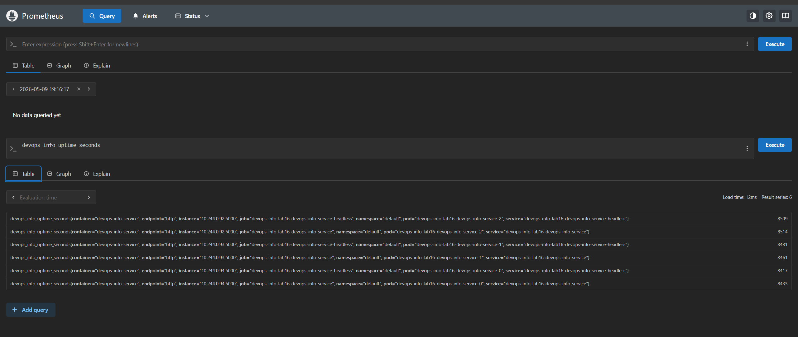

# Lab 16 - Kubernetes Monitoring and Init Containers

Date: 2026-05-09

This lab installs the Kubernetes monitoring stack, checks Grafana dashboards, tests init containers, and adds custom Prometheus metrics for the application.

## 1. Monitoring Stack

I installed `kube-prometheus-stack` with Helm in the `monitoring` namespace.

Commands:

```bash
helm repo add prometheus-community https://prometheus-community.github.io/helm-charts
helm repo update prometheus-community

helm upgrade --install monitoring prometheus-community/kube-prometheus-stack \
  --namespace monitoring \
  --create-namespace \
  --wait

kubectl get po,svc -n monitoring
```

Result:

- Alertmanager is running.
- Grafana is running.
- Prometheus Operator is running.
- Prometheus is running.
- kube-state-metrics is running.
- node-exporter is running.

Screenshot:



## 2. Stack Components

| Component | What it does |
| --- | --- |
| Prometheus Operator | Creates and manages Prometheus, Alertmanager, and ServiceMonitor resources. |
| Prometheus | Collects metrics and lets us query them with PromQL. |
| Alertmanager | Shows and groups active alerts from Prometheus. |
| Grafana | Shows dashboards for Kubernetes, nodes, pods, and the app. |
| kube-state-metrics | Exposes Kubernetes object state as metrics. |
| node-exporter | Exposes node CPU, memory, disk, and network metrics. |

## 3. Lab Application Deployment

I built the local image and deployed the app as a StatefulSet.

Commands:

```bash
minikube image build -t devops-info-service:lab16 ./Lab-1/app_python

helm upgrade --install devops-info-lab16 ./k8s/devops-info-service \
  -f ./k8s/devops-info-service/values-lab16.yaml \
  --wait
```

The lab values file enables:

- StatefulSet mode.
- A `wait-for-service` init container.
- An `init-download` init container.
- A `ServiceMonitor` for Prometheus.

## 4. Init Containers

The pod has two init containers:

- `wait-for-service` waits until `kubernetes.default.svc.cluster.local` is available in DNS.
- `init-download` downloads `https://example.com` into `/init-data/index.html`.

The main container can read the file from the shared `emptyDir` volume.

Commands used:

```powershell
$pod = kubectl get pod -l app.kubernetes.io/instance=devops-info-lab16 -o jsonpath='{.items[0].metadata.name}'
kubectl logs $pod -c wait-for-service
kubectl logs $pod -c init-download
kubectl exec $pod -- head -n 1 /init-data/index.html
```

Screenshot:



## 5. Grafana Dashboard Answers

### StatefulSet CPU Usage

Query:

```promql
sum(rate(container_cpu_usage_seconds_total{namespace="default",pod=~"devops-info-lab16-devops-info-service-.*"}[5m])) by (pod)
```

Result: all three StatefulSet pods are visible:

- `devops-info-lab16-devops-info-service-0`
- `devops-info-lab16-devops-info-service-1`
- `devops-info-lab16-devops-info-service-2`

Screenshot:



### StatefulSet Memory Usage

Query:

```promql
sum(container_memory_working_set_bytes{namespace="default",pod=~"devops-info-lab16-devops-info-service-.*"}) by (pod)
```

Result: all three StatefulSet pods use about 34-36 MiB of memory.

Screenshot:



### Default Namespace Analysis

The `default` namespace dashboard shows pod CPU and memory requests/limits. Some usage panels show `No data` in this Minikube setup, so I also used Prometheus queries for real CPU and memory usage.

Screenshot:



### Node Metrics

Dashboard: `Node Exporter / Nodes`

Observed values:

- Node instance: `192.168.49.2:9100`
- Memory usage: about `55.0%`
- Logical CPU cores: `12`
- Disk metrics are also visible.

Screenshot:



### Kubelet Metrics

Dashboard: `Kubernetes / Kubelet`

Observed values:

- Running kubelets: `1`
- Running pods: `31`
- Running containers: `66`

Screenshot:



### Network Metrics

The namespace network panel did not show matching data in this Minikube/cAdvisor setup. Other dashboards and Prometheus queries worked correctly.

## 6. Alerts

I opened Alertmanager with port-forwarding:

```bash
kubectl port-forward svc/monitoring-kube-prometheus-alertmanager -n monitoring 9093:9093
```

Alertmanager showed active alerts in the `kube-system` namespace. Examples:

- `TargetDown`
- `etcdMembersDown`
- `etcdInsufficientMembers`

Screenshot:



## 7. Bonus: Custom Metrics and ServiceMonitor

I added a `/metrics` endpoint to the Flask app using `prometheus-client`.

Custom metrics:

- `devops_info_http_requests_total`
- `devops_info_visits_total`
- `devops_info_uptime_seconds`

The Helm chart also has a `ServiceMonitor` template. It is enabled in `values-lab16.yaml`.

Prometheus target result:

- `serviceMonitor/default/devops-info-lab16-devops-info-service/0`
- `6 / 6 up`
- All `/metrics` endpoints are `UP`.

Screenshot:



Prometheus query:

```promql
devops_info_uptime_seconds
```

Result: Prometheus returns metrics for all three lab16 pods.

Screenshot:



## 8. Summary

The monitoring stack is installed and working. Grafana shows Kubernetes and node dashboards. Init containers work correctly. The app exposes Prometheus metrics, and Prometheus scrapes them through a ServiceMonitor.
