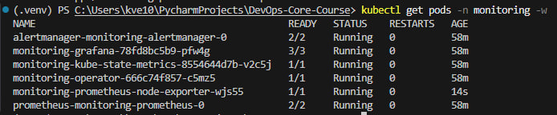
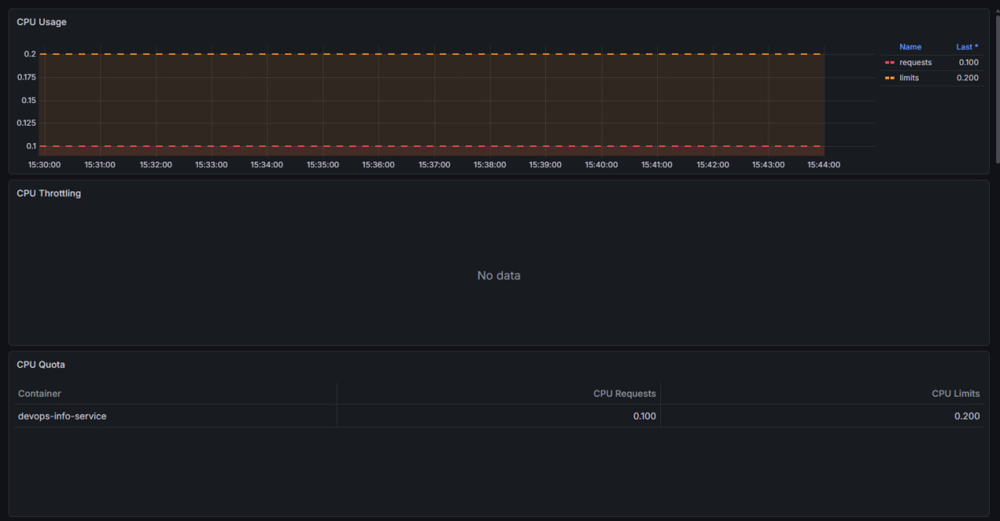
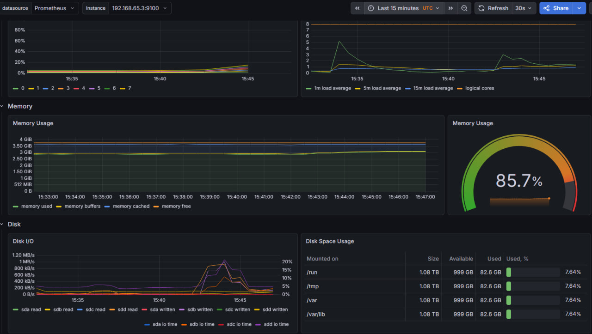
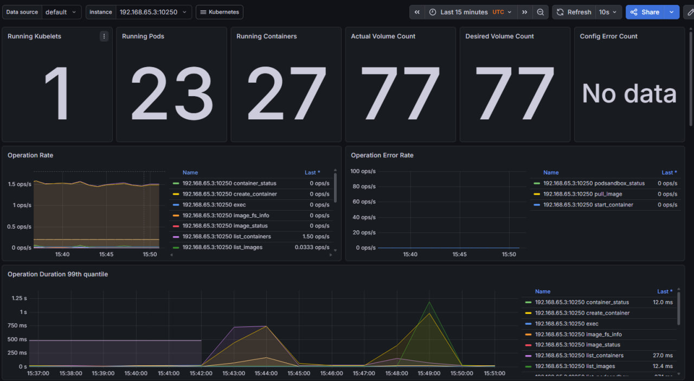
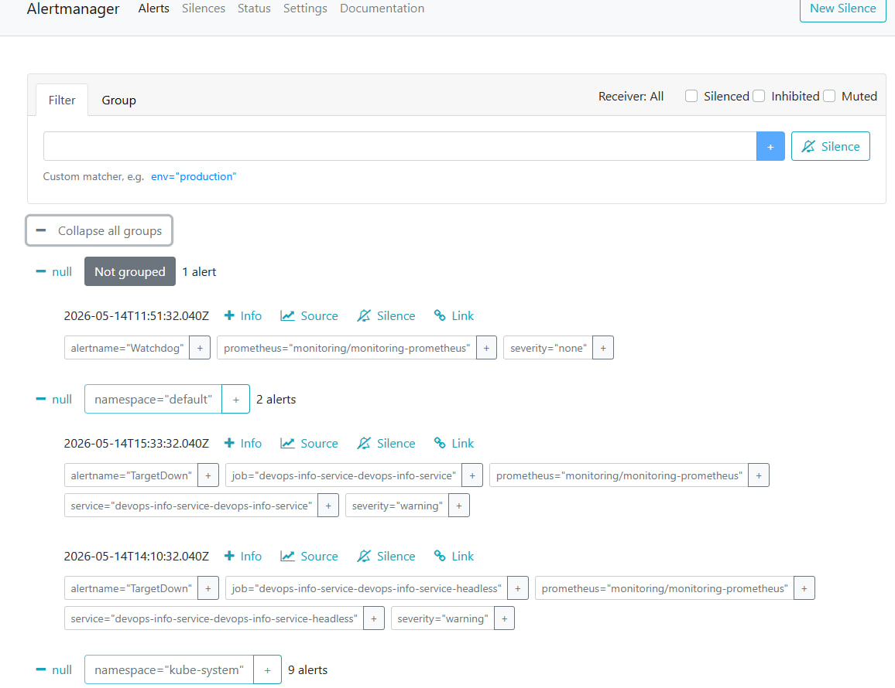
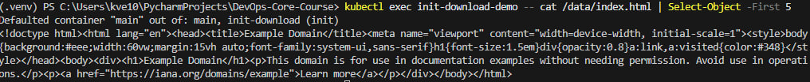
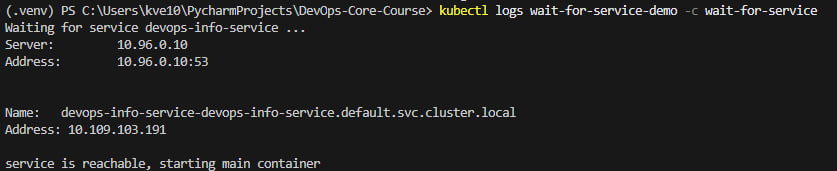
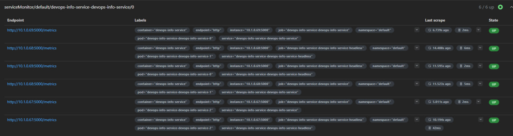
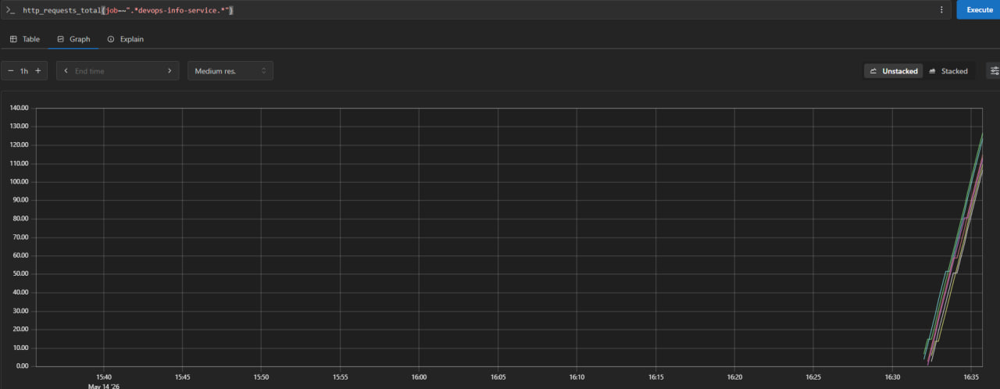

# Lab 16 — Kubernetes Monitoring & Init Containers

Production observability with the kube-prometheus-stack, plus two
patterns for init containers (file download + wait-for-service) and a
custom `ServiceMonitor` that scrapes the FastAPI application.

> All evidence below was captured on a local Docker Desktop cluster
> (Kubernetes v1.32). Screenshots live in
> [`docs/screenshots/lab16/`](./docs/screenshots/lab16/).

---

## Task 1 — Kube-Prometheus Stack

### Stack components — what each one does

| Component | Role |
|-----------|------|
| **Prometheus Operator** | A Kubernetes controller that turns CRDs (`Prometheus`, `Alertmanager`, `ServiceMonitor`, `PodMonitor`, `PrometheusRule`) into actual workloads and scrape configs. Lets us declare "scrape this service" instead of editing `prometheus.yml`. |
| **Prometheus** | The time-series database. Discovers scrape targets via the operator, pulls metrics on `/metrics` endpoints, evaluates alerting/recording rules, and stores samples on disk. |
| **Alertmanager** | Receives firing alerts from Prometheus, groups/deduplicates/silences them, and routes notifications to Slack / email / PagerDuty / webhooks. |
| **Grafana** | Visualization UI. The chart ships preloaded dashboards for nodes, namespaces, pods, kubelet, etcd, control-plane components, etc. |
| **kube-state-metrics** | Reads the Kubernetes API and exposes object-level metrics: `kube_pod_status_phase`, `kube_deployment_status_replicas`, `kube_pod_container_resource_requests`, … Without it the dashboards have no idea what a "Deployment" is. |
| **node-exporter** | A DaemonSet that runs on every node and exposes node-level OS metrics: CPU, memory, disk I/O, filesystem usage, network counters. Source for the "Node Exporter / Nodes" dashboard. |

### Install

```bash
helm repo add prometheus-community https://prometheus-community.github.io/helm-charts
helm repo update

helm install monitoring prometheus-community/kube-prometheus-stack \
  --namespace monitoring --create-namespace \
  -f k8s/monitoring/values-monitoring.yaml

kubectl get pods -n monitoring
```

The values file ([`k8s/monitoring/values-monitoring.yaml`](./monitoring/values-monitoring.yaml))
relaxes the default `serviceMonitorSelector` so a `ServiceMonitor` in
the `default` namespace is picked up, keeps grafana on `ClusterIP` (we
hit it via port-forward), bounds prometheus resources, and tames
`prometheus-node-exporter` so it runs on Docker Desktop (drops
`hostRootFsMount`, ignores wifi/hwmon collectors).

### Installation evidence



All six workloads (`alertmanager`, `grafana`, `kube-state-metrics`,
`operator`, `node-exporter`, `prometheus`) are `Running`.

---

## Task 2 — Grafana Dashboard Exploration

```bash
kubectl port-forward svc/monitoring-grafana -n monitoring 3000:80
# http://localhost:3000  user: admin  password: prom-operator
```

### 1. Pod resources — StatefulSet CPU / memory usage

Dashboard: **Kubernetes / Compute Resources / Pod** → namespace
`default` → pod `devops-info-service-devops-info-service-0`.

Resource quotas declared in the chart: **requests 0.100 CPU / 128 MiB**,
**limits 0.200 CPU / 256 MiB**. Actual CPU usage at idle is several
milli-cores per pod, and memory working set is in the order of 25 MiB
— well below the limits, no throttling.



### 2. Namespace analysis — which pods use most/least CPU in `default`

> ⚠️ **Docker Desktop caveat.** cAdvisor on Docker Desktop emits only
> *pod-level* cgroup summaries (`id="/kubepods/kubepods/burstable/podXXX"`)
> and does **not** attach the `container` label that the
> *Compute Resources / Namespace (Pods)* dashboard filters on
> (`container!=""`). The panels therefore render empty on this
> cluster. Equivalent information was collected from the
> *Compute Resources / Pod* dashboard above and from raw Prometheus
> queries (`container_memory_working_set_bytes{namespace="default"}`):
>
> * heaviest pods: the three `devops-info-service-*` StatefulSet
>   replicas (~26-29 MiB each)
> * lightest pods: `init-download-demo` and `wait-for-service-demo`,
>   which only run a `sleep` loop after their init container completes
>   (≈2 MiB)

### 3. Node metrics — memory / CPU

Dashboard: **Node Exporter / Nodes**.

Shows the Docker Desktop Linux VM: CPU Busy, used / total RAM, CPU
cores reported by `/proc/cpuinfo`, root-FS usage. Node-exporter is
running with `hostRootFsMount.enabled=false` and `--no-collector.wifi`
/ `--no-collector.hwmon` to work around the Linux-VM environment.



### 4. Kubelet — pods & containers managed

Dashboard: **Kubernetes / Kubelet**.

Single-node cluster, so all panels reflect what `docker-desktop` is
running: total *Running Pods* (system + monitoring + app), total
*Running Containers* (the count is higher because monitoring pods
have multiple containers each — prometheus has 2, grafana has 3,
alertmanager has 2), operation rate, volume stats.



### 5. Network — traffic for pods in `default`

> ⚠️ Same Docker Desktop caveat as item 2 — the
> *Networking / Namespace (Pods)* dashboard relies on
> `container_network_receive_bytes_total{container!=""}` and renders
> empty here. Per-pod traffic was verified instead by hitting
> `/visits` and `/health` in a 1500-iteration loop while watching the
> *Network I/O* panel of the *Compute Resources / Pod* dashboard
> (visible in `pod-resources.png`).

### 6. Alerts — Alertmanager state

```bash
kubectl port-forward svc/monitoring-alertmanager -n monitoring 9093:9093
# http://localhost:9093
```

On a fresh install `Watchdog` is always firing (intentional —
dead-man's switch that proves Alertmanager is alive). Total firing
alerts: **1** (Watchdog). No critical alerts.



---

## Task 3 — Init Containers

Two patterns, both verified end-to-end.

### Pattern A — download a file into a shared volume

Standalone demo: [`k8s/init-containers/download-init.yaml`](./init-containers/download-init.yaml).

```bash
kubectl apply -f k8s/init-containers/download-init.yaml
kubectl get pod init-download-demo -w     # Init:0/1 -> PodInitializing -> Running
kubectl logs init-download-demo -c init-download
kubectl exec init-download-demo -- cat /data/index.html | head
```

The init container downloads `https://example.com` into an `emptyDir`
volume, which is then mounted **read-only** into the main container at
`/data`.



The same pattern is wired into the application's StatefulSet via the
chart values overlay
[`devops-info-service/values-monitoring.yaml`](./devops-info-service/values-monitoring.yaml):
`initContainers.download.enabled=true` mounts an `emptyDir` workdir,
runs `wget` against `initContainers.download.url`, and exposes the
result read-only to the main container at `/work-dir`.

### Pattern B — wait for a service to exist

Manifest: [`k8s/init-containers/wait-for-service.yaml`](./init-containers/wait-for-service.yaml).

```bash
kubectl apply -f k8s/init-containers/wait-for-service.yaml
kubectl get pods -w                # Init:0/1 -> Running once nslookup succeeds
kubectl logs wait-for-service-demo -c wait-for-service
kubectl logs wait-for-service-demo -c client
```

The init container runs `until nslookup
devops-info-service-devops-info-service.default.svc.cluster.local; do
sleep 2; done`. Once DNS resolves the main container starts and hits
`/health` on the upstream service.



---

## Task 4 — what was added to the repo

| Path | Purpose |
|------|---------|
| `k8s/monitoring/values-monitoring.yaml` | Helm values for kube-prometheus-stack. Relaxes selectors and tames node-exporter for Docker Desktop. |
| `k8s/devops-info-service/values-monitoring.yaml` | Overlay that turns on the StatefulSet init container and the `ServiceMonitor` for the app. |
| `k8s/devops-info-service/templates/servicemonitor.yaml` | New `ServiceMonitor` template, gated on `serviceMonitor.enabled`. |
| `k8s/devops-info-service/templates/statefulset.yaml` | Added init-container + named workdir volume (mirrors lab hints). |
| `k8s/init-containers/download-init.yaml` | Standalone download-via-init demo pod. |
| `k8s/init-containers/wait-for-service.yaml` | Standalone wait-for-service demo pod. |
| `k8s/MONITORING.md` | This document. |
| `k8s/docs/screenshots/lab16/` | Dashboard, Alertmanager, Prometheus and init-container screenshots. |

---

## Bonus — Custom metrics & ServiceMonitor

The FastAPI app already exposes `/metrics` via `prometheus_client` —
see [`app_python/metrics.py`](../app_python/metrics.py) and the
`/metrics` route + middleware in [`app_python/app.py`](../app_python/app.py).
Counters / histograms / gauges exported:

* `http_requests_total{method,endpoint,status}` — request rate by route
* `http_request_duration_seconds_bucket{method,endpoint}` — latency
  histogram (for p95/p99 in Grafana)
* `http_requests_in_progress` — concurrency gauge
* `devops_info_endpoint_calls{endpoint}` — application-level counter
* `devops_info_system_collection_seconds_bucket` — time to collect
  system info on `/`

### Wiring Prometheus to scrape it

1. Service port is named `http` (see
   [`templates/service.yaml`](./devops-info-service/templates/service.yaml))
   so the `ServiceMonitor` can target it by name.
2. Install the chart with the monitoring overlay so a `ServiceMonitor`
   is rendered:

   ```bash
   helm upgrade --install devops-info-service ./k8s/devops-info-service \
     -f k8s/devops-info-service/values-statefulset.yaml \
     -f k8s/devops-info-service/values-monitoring.yaml
   ```

3. The rendered `ServiceMonitor`:

   ```yaml
   apiVersion: monitoring.coreos.com/v1
   kind: ServiceMonitor
   metadata:
     name: devops-info-service-devops-info-service
     labels:
       release: monitoring     # picked up by kube-prometheus-stack
   spec:
     selector:
       matchLabels:
         app.kubernetes.io/name: devops-info-service
         app.kubernetes.io/instance: devops-info-service
     namespaceSelector:
       matchNames: [default]
     endpoints:
       - port: http
         path: /metrics
         interval: 15s
   ```

### Verify in Prometheus UI

```bash
kubectl port-forward svc/monitoring-prometheus -n monitoring 9090:9090
# http://localhost:9090
```

* **Status → Targets** lists three endpoints under
  `serviceMonitor/default/devops-info-service-devops-info-service/0`
  (one per StatefulSet pod):

  

* **Graph** — instant query
  `http_requests_total{job=~".*devops-info-service.*"}` returns
  non-zero series after a load run against `/visits` and `/health`:

  

* For latency: `histogram_quantile(0.95, sum by (le)
  (rate(http_request_duration_seconds_bucket[5m])))` returns p95
  request latency.

---

## Cleanup

```bash
kubectl delete -f k8s/init-containers/
helm uninstall devops-info-service
helm uninstall monitoring -n monitoring
kubectl delete ns monitoring
```
