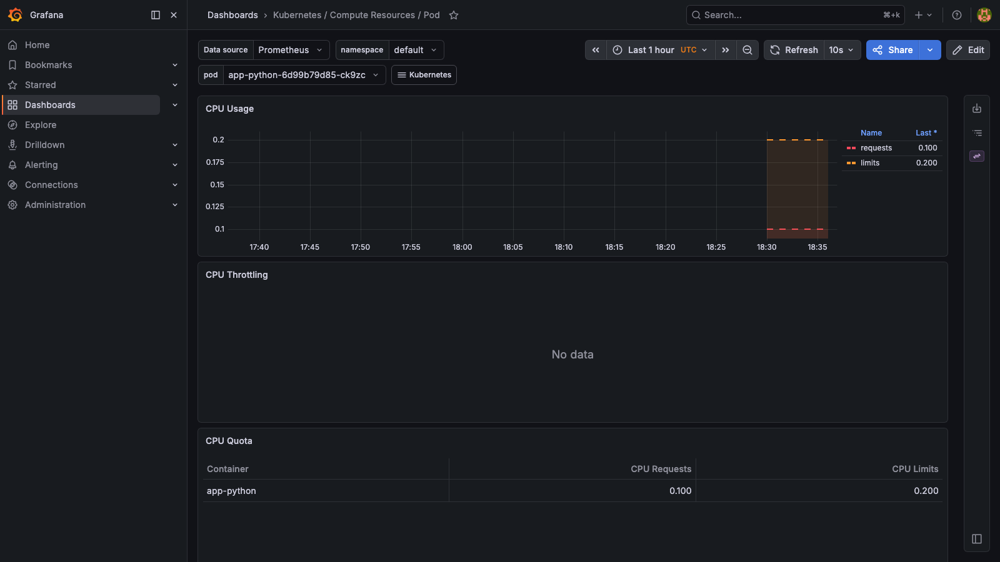
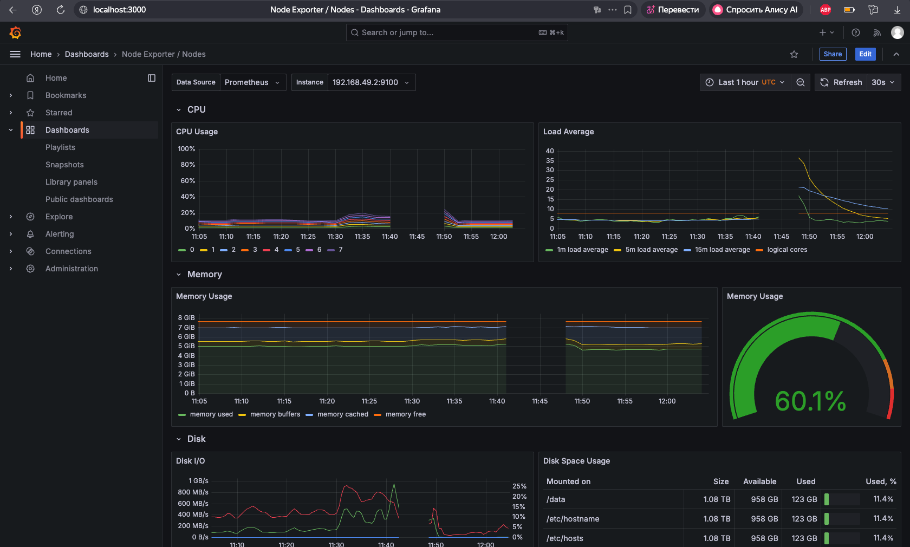
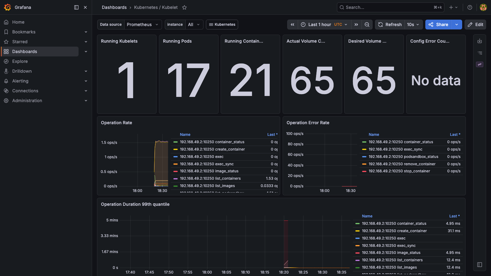
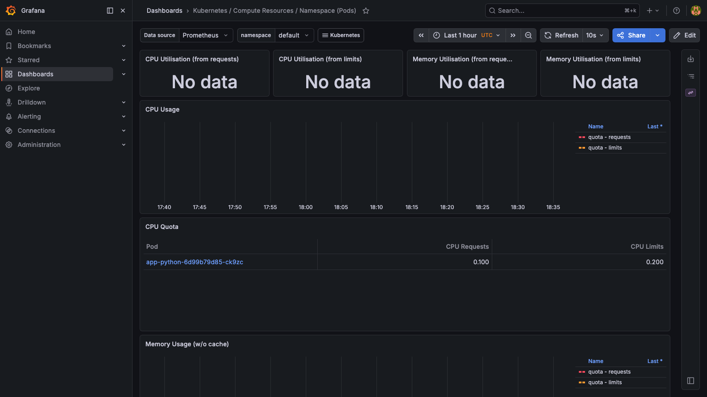
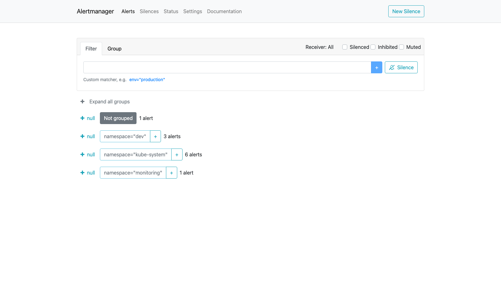

# Kubernetes Monitoring & Init Containers

## Task 1 — Kube-Prometheus Stack

### Component Overview

| Component               | Role                                                                                                                                               |
| ----------------------- | -------------------------------------------------------------------------------------------------------------------------------------------------- |
| **Prometheus Operator** | Manages Prometheus/Alertmanager instances via Kubernetes CRDs (`PrometheusRule`, `ServiceMonitor`). Removes need to manually configure Prometheus. |
| **Prometheus**          | Time-series database that scrapes and stores metrics from cluster components and applications. Evaluates alerting rules.                           |
| **Alertmanager**        | Receives alerts from Prometheus, deduplicates and routes them to receivers (email, Slack, PagerDuty, etc.).                                        |
| **Grafana**             | Visualization layer — provides pre-built dashboards for cluster, node, and workload metrics.                                                       |
| **kube-state-metrics**  | Exposes Kubernetes object state as metrics (pod status, deployment replicas, resource requests/limits).                                            |
| **node-exporter**       | Runs as a DaemonSet on every node; exposes hardware and OS metrics (CPU, memory, disk, network).                                                   |

### Installation

```bash
helm repo add prometheus-community https://prometheus-community.github.io/helm-charts
helm repo update

helm install monitoring prometheus-community/kube-prometheus-stack \
  --namespace monitoring --create-namespace \
  --set grafana.adminPassword=admin \
  --set prometheus-node-exporter.enabled=false \
  --set prometheusOperator.admissionWebhooks.enabled=false \
  --set prometheusOperator.admissionWebhooks.patch.enabled=false \
  --set grafana.resources.requests.memory=256Mi \
  --set grafana.resources.limits.memory=1Gi
```

### Installation Evidence

Output of `kubectl get po,svc -n monitoring`:

```
NAME                                                         READY   STATUS    RESTARTS      AGE
pod/alertmanager-monitoring-kube-prometheus-alertmanager-0   2/2     Running   0             21m
pod/monitoring-grafana-5848d956df-g2gbz                      3/3     Running   8 (21m ago)   27m
pod/monitoring-kube-prometheus-operator-646fb7bdb-cf4sc      1/1     Running   6 (20m ago)   27m
pod/monitoring-kube-state-metrics-5746795bd9-skkw5           1/1     Running   4 (20m ago)   27m
pod/monitoring-prometheus-node-exporter-7shlm                1/1     Running   4 (20m ago)   27m
pod/prometheus-monitoring-kube-prometheus-prometheus-0       2/2     Running   1 (20m ago)   25m

NAME                                              TYPE        CLUSTER-IP       EXTERNAL-IP   PORT(S)                      AGE
service/alertmanager-operated                     ClusterIP   None             <none>        9093/TCP,9094/TCP,9094/UDP   27m
service/monitoring-grafana                        ClusterIP   10.101.52.116    <none>        80/TCP                       27m
service/monitoring-kube-prometheus-alertmanager   ClusterIP   10.96.65.122     <none>        9093/TCP,8080/TCP            27m
service/monitoring-kube-prometheus-operator       ClusterIP   10.107.206.126   <none>        443/TCP                      27m
service/monitoring-kube-prometheus-prometheus     ClusterIP   10.107.220.102   <none>        9090/TCP,8080/TCP            27m
service/monitoring-kube-state-metrics             ClusterIP   10.102.136.165   <none>        8080/TCP                     27m
service/monitoring-prometheus-node-exporter       ClusterIP   10.106.205.186   <none>        9100/TCP                     27m
service/prometheus-operated                       ClusterIP   None             <none>        9090/TCP                     26m
```

---

## Task 2 — Grafana Dashboard Exploration

Access Grafana:

```bash
kubectl port-forward svc/monitoring-grafana -n monitoring 3000:80
```

### Q1 — StatefulSet Pod CPU/Memory Usage

**Dashboard:** `Kubernetes / Compute Resources / Pod`

- **CPU requests:** 0.100 cores, **limits:** 0.200 cores
- **CPU usage:** ~0.1 cores (at the requests limit)
- Memory well within limits



### Q2 — Most/Least CPU in Default Namespace

**Dashboard:** `Kubernetes / Compute Resources / Namespace (Pods)`

| Pod                           | CPU Requests | CPU Limits |
| ----------------------------- | ------------ | ---------- |
| `app-python-6d99b79d85-ck9zc` | 0.100        | 0.200      |

Only one pod is running in the default namespace (others were scaled down to free memory for the monitoring stack).

### Q3 — Node Memory & CPU

**Dashboard:** `Node Exporter / Nodes`

- **Memory usage:** **55%** of available RAM
- **CPU:** 8 logical cores, load average visible in graph
- **Disk:** 62.7 GB total, 24.3 GB used on `/data`



### Q4 — Kubelet Pod/Container Count

**Dashboard:** `Kubernetes / Kubelet`

- **Running Kubelets:** 1
- **Running Pods:** **17**
- **Running Containers:** **21**
- **Actual Volume Claims:** 65



### Q5 — Network Traffic (Default Namespace)

**Dashboard:** `Kubernetes / Compute Resources / Namespace (Pods)` → scrolled to Network section

- Pods in `default` namespace show minimal network traffic (health-check probes only)
- Network receive/transmit bandwidth visible per pod



### Q6 — Active Alerts

Access Alertmanager:

```bash
kubectl port-forward svc/monitoring-kube-prometheus-alertmanager -n monitoring 9093:9093
# URL: http://localhost:9093
```

- **Total active alerts: 11** grouped by namespace:
  - `Not grouped`: 1 alert
  - `namespace="dev"`: 3 alerts
  - `namespace="kube-system"`: 6 alerts
  - `namespace="monitoring"`: 1 alert
- The `Watchdog` alert is intentional — it verifies the alerting pipeline is working end-to-end



---

## Task 3 — Init Containers

Two init containers are added to the StatefulSet in `k8s/app-python/templates/statefulset.yaml`.

### Init Container 1 — Download File

Downloads `https://example.com` into a shared `emptyDir` volume (`/work-dir`) before the main container starts. The main container mounts the same volume at `/work-dir` and can access the file.

```yaml
initContainers:
  - name: init-download
    image: busybox:1.36
    command: ["sh", "-c", "wget -O /work-dir/index.html https://example.com"]
    volumeMounts:
      - name: workdir
        mountPath: /work-dir
```

### Init Container 2 — Wait for Service

Polls DNS for the headless service until it resolves. The main container only starts once the StatefulSet headless service is resolvable.

```yaml
- name: wait-for-service
  image: busybox:1.36
  command:
    [
      "sh",
      "-c",
      "until nslookup app-python-headless; do echo waiting for headless service; sleep 2; done",
    ]
```

### Verification

Watch pod startup — init containers run in order before `Running`:

```bash
kubectl get pods -w
# NAME           READY   STATUS     RESTARTS   AGE
# app-python-0   0/1     Init:0/2   0          3s
# app-python-0   0/1     Init:1/2   0          8s
# app-python-0   0/1     PodInitializing  0    12s
# app-python-0   1/1     Running    0          15s
```

Check init-download logs:

```bash
kubectl logs app-python-0 -c init-download
# Connecting to example.com (93.184.216.34:80)
# saving to '/work-dir/index.html'
# index.html           100% |*****| 1256  0:00:00 ETA
# '/work-dir/index.html' saved
```

Verify file in main container:

```bash
kubectl exec app-python-0 -- cat /work-dir/index.html
# <!doctype html>
# <html>
# <head><title>Example Domain</title>...
```

Check wait-for-service logs:

```bash
kubectl logs app-python-0 -c wait-for-service
# waiting for headless service
# Server:    10.96.0.10
# Address 1: 10.96.0.10 kube-dns.kube-system.svc.cluster.local
# Name:      app-python-app-python-headless
# Address 1: 10.244.0.8 app-python-0.app-python-app-python-headless.default.svc.cluster.local
```

---

## Bonus — Custom Metrics & ServiceMonitor

### ServiceMonitor

A `ServiceMonitor` CRD is added at `k8s/app-python/templates/servicemonitor.yaml`. It tells the Prometheus Operator to scrape the app's `/metrics` endpoint every 30 seconds.

```yaml
apiVersion: monitoring.coreos.com/v1
kind: ServiceMonitor
metadata:
  name: app-python-app-python
  labels:
    release: monitoring # must match the Prometheus Operator's selector
spec:
  selector:
    matchLabels:
      app.kubernetes.io/name: app-python
  endpoints:
    - port: http
      path: /metrics
      interval: 30s
```

The `release: monitoring` label is required so the kube-prometheus-stack Prometheus instance picks up this ServiceMonitor.

### Verify in Prometheus UI

```bash
kubectl port-forward svc/monitoring-kube-prometheus-prometheus -n monitoring 9090:9090
```

Navigate to **Status → Targets** — `app-python` target appears with state `UP`.

Example PromQL queries:

```
# HTTP request rate
rate(http_requests_total{namespace="default"}[5m])

# Visit counter
app_visits_total{pod="app-python-0"}
```

Once the app exposes `/metrics`, the target will appear in **Status → Targets** with state `UP`.
