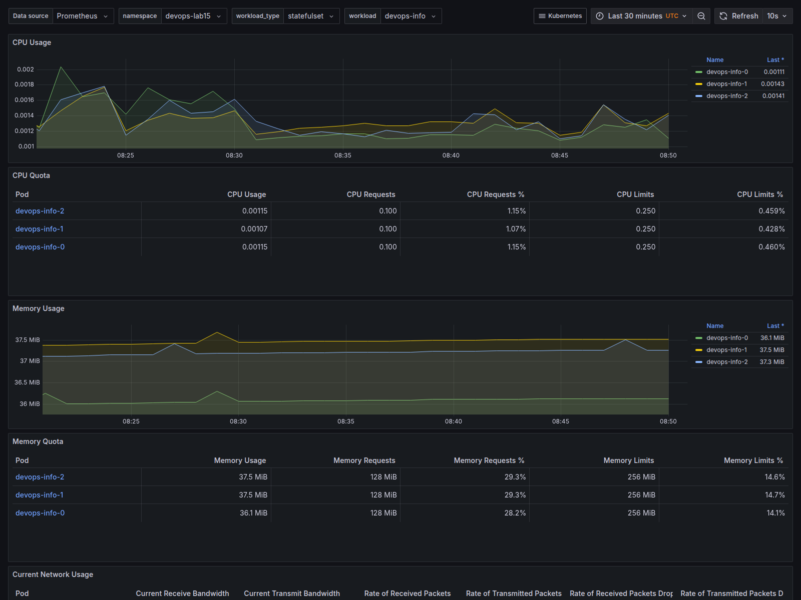
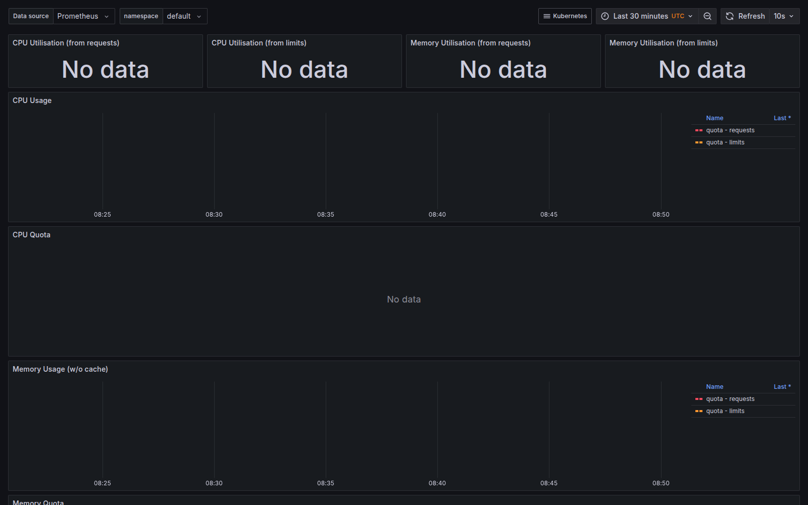
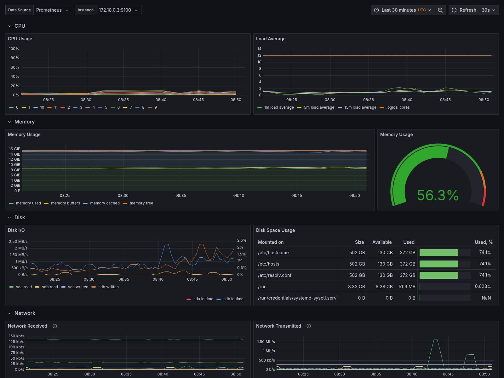
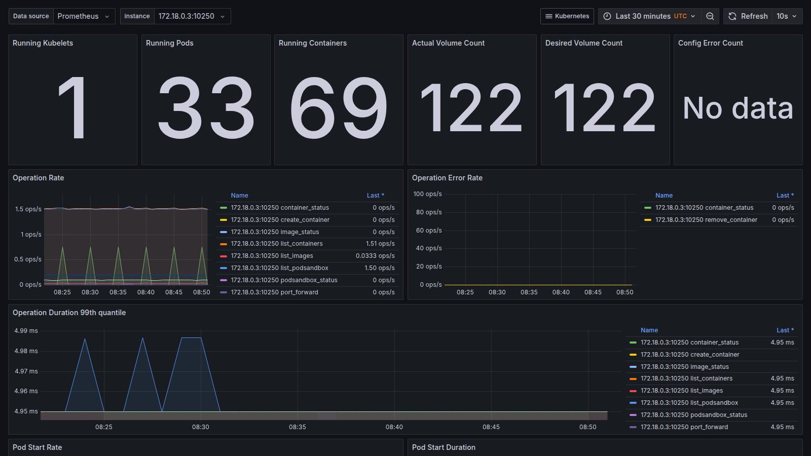
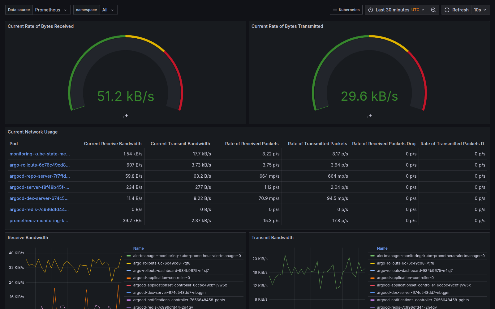
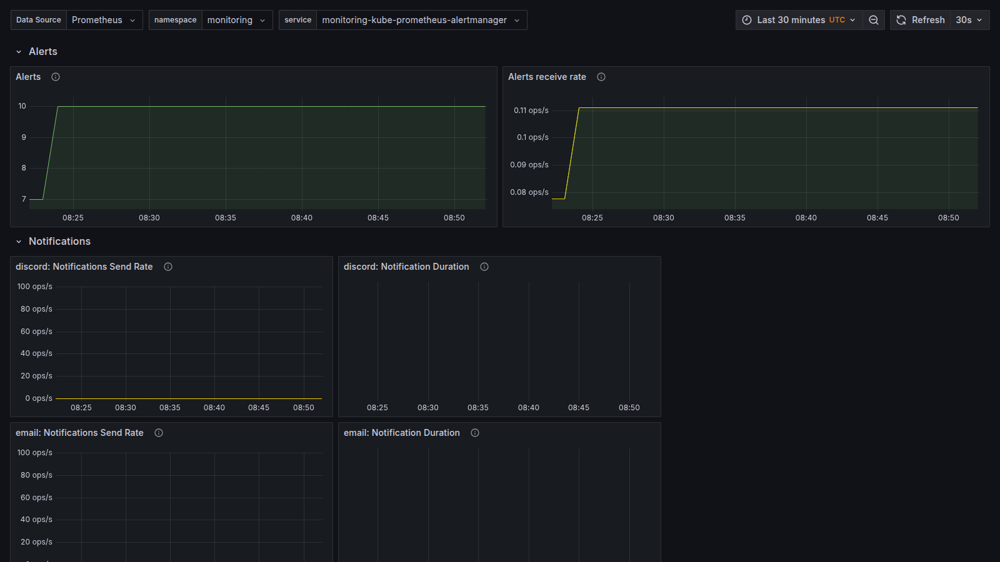

# Lab 16 - Kubernetes Monitoring

Validated on `2026-05-13` and `2026-05-14` with:

- Kubernetes context: `kind-lab13`
- Kubernetes node: `lab13-control-plane`, Kubernetes `v1.35.0`
- Helm: `v4.1.3`
- Helm release: `monitoring`
- Chart: `prometheus-community/kube-prometheus-stack`
- Chart version: `65.8.1`
- App version: `v0.77.2`
- Namespace: `monitoring`
- Init container namespace: `lab16`

## Task 1 - Kube-Prometheus Stack

### Stack Components

| Component | Role in the monitoring stack |
|---|---|
| Prometheus Operator | Kubernetes controller that manages monitoring CRDs such as `Prometheus`, `Alertmanager`, `ServiceMonitor`, `PodMonitor`, and `PrometheusRule`. It reconciles those resources into StatefulSets, services, generated scrape configuration, and rule files so the stack can be managed declaratively. |
| Prometheus | Time-series metrics database and query engine. It discovers scrape targets, pulls metrics over HTTP, stores samples with labels and timestamps, evaluates PromQL queries, and sends firing alerts to Alertmanager. |
| Alertmanager | Receives alerts from Prometheus and handles deduplication, grouping, silencing, inhibition, and routing to notification receivers. |
| Grafana | Dashboard and exploration UI for metrics. In this stack it is preconfigured with Prometheus as a data source and Kubernetes dashboards from the chart. |
| kube-state-metrics | Exposes Kubernetes API object state as Prometheus metrics, such as pod phases, deployment replica state, labels, annotations, and readiness conditions. |
| node-exporter | DaemonSet that exposes host-level hardware, kernel, CPU, memory, filesystem, and network metrics from each Linux node on port `9100`. |

### Documentation Followed

- kube-prometheus-stack chart: https://github.com/prometheus-community/helm-charts/tree/main/charts/kube-prometheus-stack
- Prometheus Operator overview: https://github.com/prometheus-operator/prometheus-operator
- Prometheus overview: https://prometheus.io/docs/introduction/overview/
- Alertmanager docs: https://prometheus.io/docs/alerting/latest/alertmanager/
- Grafana docs: https://grafana.com/docs/grafana/latest/introduction/
- kube-state-metrics docs: https://kubernetes.io/docs/concepts/cluster-administration/kube-state-metrics/
- node-exporter docs: https://prometheus.io/docs/guides/node-exporter/

### Installation Commands

```bash
helm repo add prometheus-community https://prometheus-community.github.io/helm-charts --force-update
helm repo update

helm install monitoring prometheus-community/kube-prometheus-stack \
  --namespace monitoring \
  --create-namespace \
  --version 65.8.1
```

### Helm Release Evidence

```text
$ helm list -n monitoring
NAME      	NAMESPACE 	REVISION	UPDATED                               	STATUS  	CHART                       	APP VERSION
monitoring	monitoring	1       	2026-05-13 11:05:59.69323171 +0300 MSK	deployed	kube-prometheus-stack-65.8.1	v0.77.2
```

### Pod Verification

```text
$ kubectl get pods -n monitoring
NAME                                                     READY   STATUS    RESTARTS   AGE
alertmanager-monitoring-kube-prometheus-alertmanager-0   2/2     Running   0          107s
monitoring-grafana-69db76f9b4-hrgbf                      3/3     Running   0          2m8s
monitoring-kube-prometheus-operator-d5dbb45f9-g2zmw      1/1     Running   0          2m8s
monitoring-kube-state-metrics-75c9d8f7c7-zjdfz           1/1     Running   0          2m8s
monitoring-prometheus-node-exporter-4swdb                1/1     Running   0          2m9s
prometheus-monitoring-kube-prometheus-prometheus-0       2/2     Running   0          106s
```

### Installation Evidence

```text
$ kubectl get po,svc -n monitoring
NAME                                                         READY   STATUS    RESTARTS   AGE
pod/alertmanager-monitoring-kube-prometheus-alertmanager-0   2/2     Running   0          107s
pod/monitoring-grafana-69db76f9b4-hrgbf                      3/3     Running   0          2m8s
pod/monitoring-kube-prometheus-operator-d5dbb45f9-g2zmw      1/1     Running   0          2m8s
pod/monitoring-kube-state-metrics-75c9d8f7c7-zjdfz           1/1     Running   0          2m8s
pod/monitoring-prometheus-node-exporter-4swdb                1/1     Running   0          2m9s
pod/prometheus-monitoring-kube-prometheus-prometheus-0       2/2     Running   0          106s

NAME                                              TYPE        CLUSTER-IP      EXTERNAL-IP   PORT(S)                      AGE
service/alertmanager-operated                     ClusterIP   None            <none>        9093/TCP,9094/TCP,9094/UDP   107s
service/monitoring-grafana                        ClusterIP   10.96.10.223    <none>        80/TCP                       2m10s
service/monitoring-kube-prometheus-alertmanager   ClusterIP   10.96.187.150   <none>        9093/TCP,8080/TCP            2m10s
service/monitoring-kube-prometheus-operator       ClusterIP   10.96.117.66    <none>        443/TCP                      2m10s
service/monitoring-kube-prometheus-prometheus     ClusterIP   10.96.132.87    <none>        9090/TCP,8080/TCP            2m10s
service/monitoring-kube-state-metrics             ClusterIP   10.96.81.176    <none>        8080/TCP                     2m10s
service/monitoring-prometheus-node-exporter       ClusterIP   10.96.125.106   <none>        9100/TCP                     2m10s
service/prometheus-operated                       ClusterIP   None            <none>        9090/TCP                     106s
```

### CRD Verification

```text
$ kubectl get crd servicemonitors.monitoring.coreos.com prometheuses.monitoring.coreos.com alertmanagers.monitoring.coreos.com prometheusrules.monitoring.coreos.com
NAME                                    CREATED AT
servicemonitors.monitoring.coreos.com   2026-05-13T08:05:58Z
prometheuses.monitoring.coreos.com      2026-05-13T08:05:57Z
alertmanagers.monitoring.coreos.com     2026-05-13T08:05:56Z
prometheusrules.monitoring.coreos.com   2026-05-13T08:05:58Z
```

## Task 2 - Grafana Dashboard Exploration

### Access Commands

```bash
kubectl port-forward svc/monitoring-grafana -n monitoring 3000:80
kubectl port-forward svc/monitoring-kube-prometheus-alertmanager -n monitoring 9093:9093
kubectl port-forward svc/monitoring-kube-prometheus-prometheus -n monitoring 9090:9090
```

Grafana credentials:

- Username: `admin`
- Password: `prom-operator`

### Dashboards Used

| Question | Dashboard |
|---|---|
| StatefulSet CPU and memory | `Kubernetes / Compute Resources / Workload` |
| Default namespace pod CPU | `Kubernetes / Compute Resources / Namespace (Pods)` |
| Node metrics | `Node Exporter / Nodes` |
| Kubelet pod/container count | `Kubernetes / Kubelet` |
| Pod network traffic | `Kubernetes / Networking / Namespace (Pods)` |
| Alerts | `Alertmanager / Overview` and Alertmanager UI |

### Dashboard Answers

| # | Question | Answer |
|---|---|---|
| 1 | CPU/memory usage of the StatefulSet | StatefulSet `devops-info` in namespace `devops-lab15` has 3 pods. Snapshot values: `devops-info-0` uses about `0.00127` CPU cores and `36.13 MiB`; `devops-info-1` uses about `0.00136` CPU cores and `37.53 MiB`; `devops-info-2` uses about `0.00140` CPU cores and `37.26 MiB`. Total usage is about `0.00403` CPU cores and `110.92 MiB`. |
| 2 | Which pods use most/least CPU in `default` namespace? | `default` has no pods, so there is no most/least CPU consumer. `kubectl get pods -n default` returned `No resources found in default namespace.` |
| 3 | Node memory usage and CPU cores | Node exporter instance `172.18.0.3:9100` reports about `55.31%` memory usage, about `8770.66 MiB` used from `15886.93 MiB` total, and `12` logical CPU cores. Current CPU usage during the snapshot was about `8.90%`. |
| 4 | How many pods/containers are managed by kubelet? | Kubelet instance `172.18.0.3:10250` reports `33` pods. The dashboard's `Running Containers` stat reports `69` across kubelet container states; the state breakdown is `37` running, `31` exited, and `1` created. The current pod container spec count from kube-state-metrics is `37`. |
| 5 | Network traffic for pods in `default` namespace | `default` has no pods, so Prometheus returns no receive/transmit pod network series for that namespace. The Grafana networking dashboard cannot keep `default` selected because there are no `default` namespace pod network metrics; the saved network screenshot shows the same dashboard with available namespace data. |
| 6 | How many active alerts? | Prometheus and Alertmanager both show `10` active/firing alerts: `Watchdog`, `etcdInsufficientMembers`, `etcdMembersDown`, `TargetDown` for `kube-etcd`, `TargetDown` for `kube-controller-manager`, `TargetDown` for `kube-proxy`, `TargetDown` for `kube-scheduler`, `KubeControllerManagerDown`, `KubeProxyDown`, and `KubeSchedulerDown`. |

### Screenshots

StatefulSet workload resources:



Default namespace pod resources:



Node exporter metrics:



Kubelet metrics:



Networking dashboard:



Alertmanager overview:



### Query Evidence

StatefulSet CPU and memory:

```text
$ curl -sG --data-urlencode 'query=sum(node_namespace_pod_container:container_cpu_usage_seconds_total:sum_irate{namespace="devops-lab15"} * on(namespace,pod) group_left(workload,workload_type) namespace_workload_pod:kube_pod_owner:relabel{namespace="devops-lab15",workload="devops-info",workload_type="statefulset"}) by (pod)' http://127.0.0.1:9090/api/v1/query
devops-info-0: 0.0012704270282027138 CPU cores
devops-info-1: 0.0013592730137294738 CPU cores
devops-info-2: 0.0014025191208666243 CPU cores

$ curl -sG --data-urlencode 'query=sum(container_memory_working_set_bytes{namespace="devops-lab15",container!="",image!=""} * on(namespace,pod) group_left(workload,workload_type) namespace_workload_pod:kube_pod_owner:relabel{namespace="devops-lab15",workload="devops-info",workload_type="statefulset"}) by (pod) / 1024 / 1024' http://127.0.0.1:9090/api/v1/query
devops-info-0: 36.12890625 MiB
devops-info-1: 37.52734375 MiB
devops-info-2: 37.26171875 MiB
```

Default namespace:

```text
$ kubectl get pods -n default
No resources found in default namespace.

$ curl -sG --data-urlencode 'query=sum by (pod) (node_namespace_pod_container:container_cpu_usage_seconds_total:sum_irate{namespace="default"})' http://127.0.0.1:9090/api/v1/query
result: []

$ curl -sG --data-urlencode 'query=sum by (pod) (rate(container_network_receive_bytes_total{namespace="default",pod!=""}[5m]))' http://127.0.0.1:9090/api/v1/query
result: []

$ curl -sG --data-urlencode 'query=sum by (pod) (rate(container_network_transmit_bytes_total{namespace="default",pod!=""}[5m]))' http://127.0.0.1:9090/api/v1/query
result: []
```

Node and kubelet:

```text
Node memory usage: 55.3137835608321%
Node memory used: 8770.65625 MiB
Node memory total: 15886.93359375 MiB
Node CPU cores: 12
Node CPU usage: about 8.90%

Kubelet running pods: 33
Kubelet containers by dashboard sum: 69
Kubelet container states: created=1, exited=31, running=37
Pod container specs from kube-state-metrics: 37
```

Alerts:

```text
$ curl -sG --data-urlencode 'query=count(ALERTS{alertstate="firing"})' http://127.0.0.1:9090/api/v1/query
10

$ curl -sS http://127.0.0.1:9093/api/v2/alerts
10 active alerts with status.state="active"
```

## Task 3 - Init Containers

### Implementation

Manifest: [k8s/lab16-init-containers.yml](/home/eugene/IU/DevOps/DevOps-Core-Course/k8s/lab16-init-containers.yml)

Documentation followed:

- Kubernetes init containers: https://kubernetes.io/docs/concepts/workloads/pods/init-containers/

Implemented resources:

| Resource | Purpose |
|---|---|
| `Namespace/lab16` | Isolates Task 3 demo resources from the rest of the cluster. |
| `Pod/init-download-demo` | Uses init container `init-download` to download `https://example.com` into an `emptyDir`, then mounts the same volume into the main container at `/data`. |
| `Deployment/lab16-ready-app` | Runs a tiny BusyBox HTTP server that represents the service dependency. |
| `Service/lab16-ready-service` | Stable DNS/service endpoint used by the wait-for-service init container. |
| `Pod/wait-for-service-demo` | Uses init container `wait-for-service` to wait for DNS and HTTP readiness of `lab16-ready-service` before the main container starts. |

Applied with:

```bash
kubectl apply -f k8s/lab16-init-containers.yml
kubectl wait --for=condition=Ready pod/init-download-demo -n lab16 --timeout=180s
kubectl wait --for=condition=Ready pod/wait-for-service-demo -n lab16 --timeout=180s
kubectl wait --for=condition=Available deployment/lab16-ready-app -n lab16 --timeout=180s
```

### Runtime Status

```text
$ kubectl get pods,svc -n lab16
NAME                                   READY   STATUS    RESTARTS   AGE
pod/init-download-demo                 1/1     Running   0          9m48s
pod/lab16-ready-app-8445b7cd97-lcbkh   1/1     Running   0          9m48s
pod/wait-for-service-demo              1/1     Running   0          9m48s

NAME                          TYPE        CLUSTER-IP    EXTERNAL-IP   PORT(S)   AGE
service/lab16-ready-service   ClusterIP   10.96.22.88   <none>        80/TCP    9m48s
```

Init container completion:

```text
$ kubectl get pod init-download-demo -n lab16 -o jsonpath='{.status.initContainerStatuses[0].name} {.status.initContainerStatuses[0].state.terminated.reason} {.status.initContainerStatuses[0].state.terminated.exitCode}'
init-download Completed 0

$ kubectl get pod wait-for-service-demo -n lab16 -o jsonpath='{.status.initContainerStatuses[0].name} {.status.initContainerStatuses[0].state.terminated.reason} {.status.initContainerStatuses[0].state.terminated.exitCode}'
wait-for-service Completed 0
```

### Basic Init Container Proof

Init container log:

```text
$ kubectl logs init-download-demo -n lab16 -c init-download
Connecting to example.com (172.66.147.243:443)
wget: note: TLS certificate validation not implemented
saving to '/work-dir/index.html'
index.html           100% |********************************|   528  0:00:00 ETA
'/work-dir/index.html' saved
```

Main container reading the shared volume:

```text
$ kubectl exec init-download-demo -n lab16 -- sh -c 'ls -l /data && grep -o "Example Domain" /data/index.html && cat /data/status.txt'
Defaulted container "main-app" out of: main-app, init-download (init)
total 8
-rw-r--r--    1 root     root           528 May 13 22:35 index.html
-rw-r--r--    1 root     root            61 May 13 22:35 status.txt
Example Domain
Example Domain
downloaded by init container at Wed May 13 22:35:08 UTC 2026
```

This proves the init container wrote to the `emptyDir` and the main container read the same mounted volume.

### Wait-for-Service Proof

Dependency service and backend:

```text
$ kubectl get deployment lab16-ready-app -n lab16 -o wide
NAME              READY   UP-TO-DATE   AVAILABLE   AGE     CONTAINERS   IMAGES         SELECTOR
lab16-ready-app   1/1     1            1           9m48s   http         busybox:1.36   app=lab16-ready-app
```

Wait init container log:

```text
$ kubectl logs wait-for-service-demo -n lab16 -c wait-for-service
Server:		10.96.0.10
Address:	10.96.0.10:53

Name:	lab16-ready-service.lab16.svc.cluster.local
Address: 10.96.22.88
```

Main container reading data downloaded only after the dependency was reachable:

```text
$ kubectl exec wait-for-service-demo -n lab16 -- sh -c 'ls -l /data && cat /data/dependency.html && cat /data/status.txt'
Defaulted container "main-app" out of: main-app, wait-for-service (init)
total 8
-rw-r--r--    1 root     root            23 May 13 22:35 dependency.html
-rw-r--r--    1 root     root            20 May 13 22:35 status.txt
lab16 dependency ready
dependency is ready
```

This proves the main container started only after the init container resolved `lab16-ready-service.lab16.svc.cluster.local` and successfully downloaded from it.

## Task 4 - Documentation

This file completes the required Lab 16 documentation:

| Requirement | Location |
|---|---|
| Stack component descriptions | Task 1, `Stack Components` |
| Installation evidence | Task 1, `Helm Release Evidence`, `Pod Verification`, and `Installation Evidence` |
| Dashboard answers | Task 2, `Dashboard Answers` |
| Screenshots | Task 2, `Screenshots`, stored in `k8s/monitoring/screenshots/` |
| Init container implementation | Task 3, `Implementation`, with manifest `k8s/lab16-init-containers.yml` |
| Init container proof | Task 3, runtime status, logs, and `kubectl exec` evidence |
