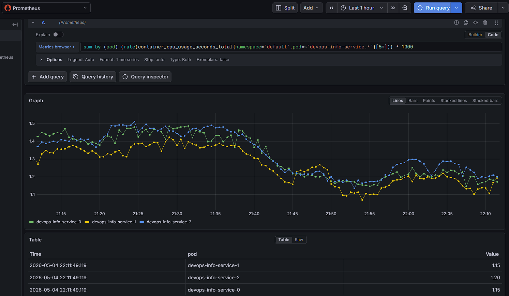
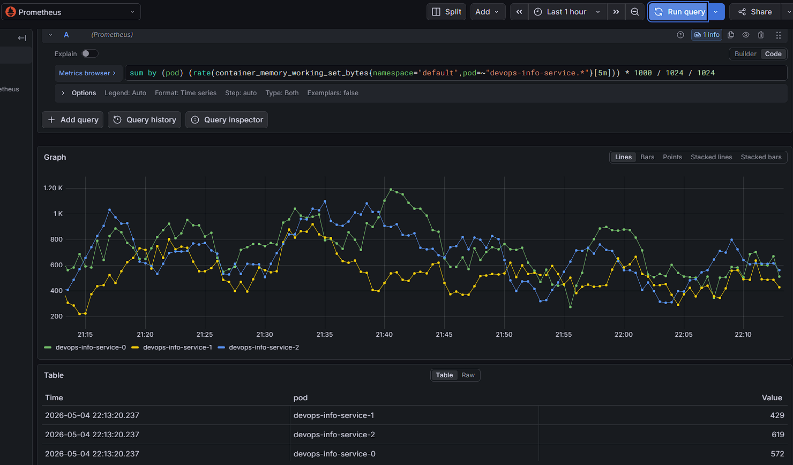
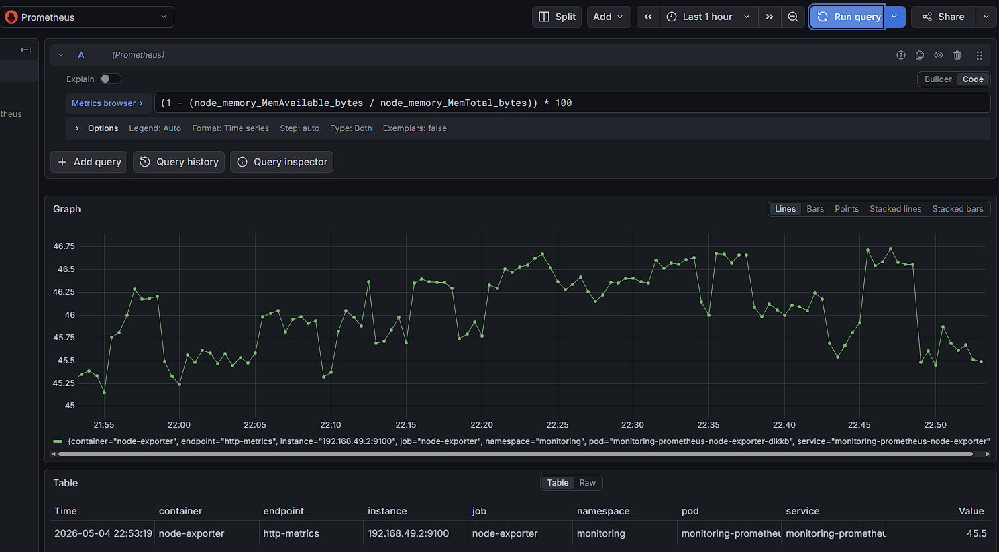
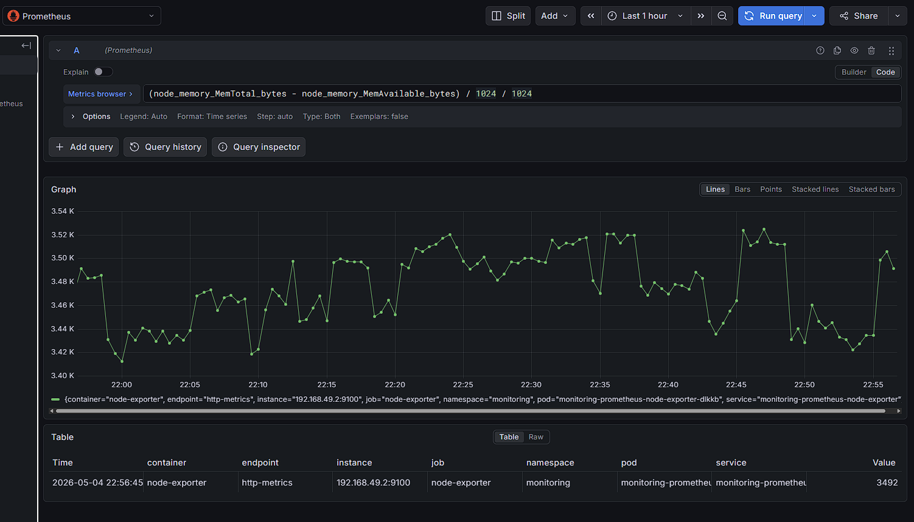
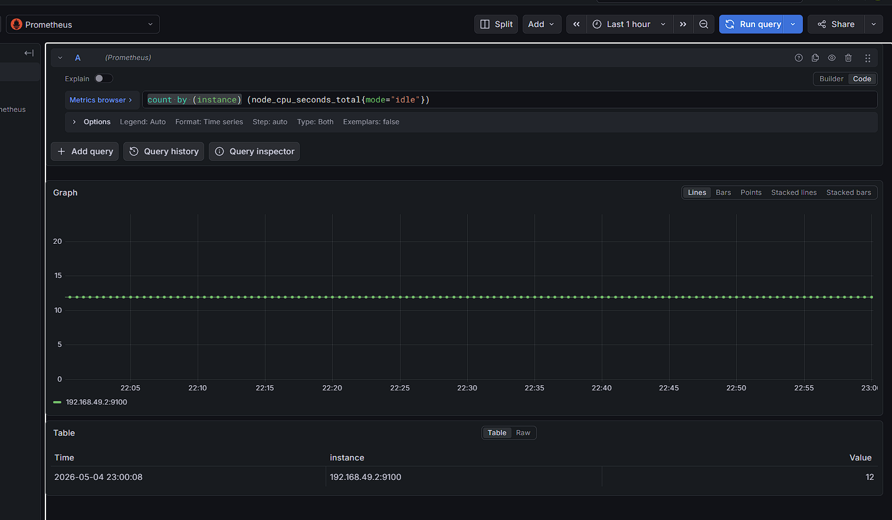
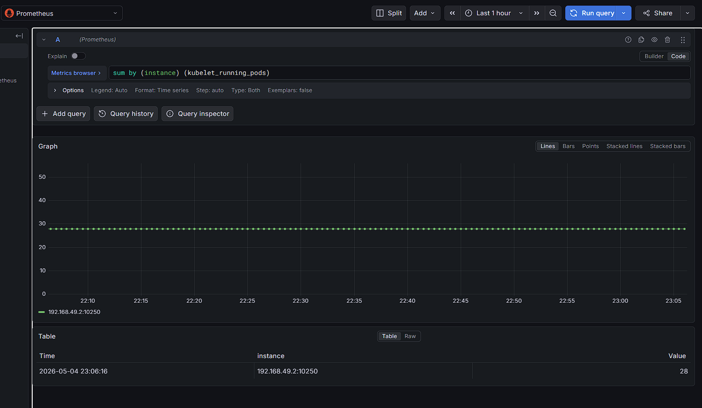
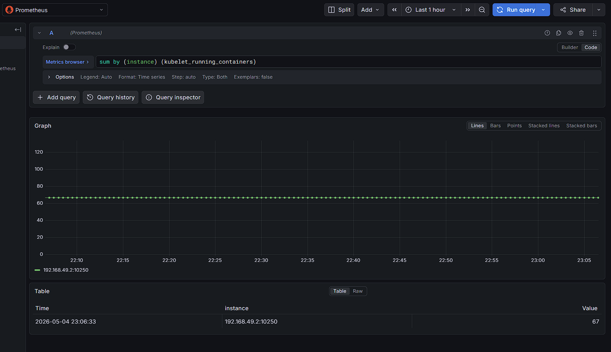

# Lab 16 — Kubernetes Monitoring & Init Containers

## Stack Components

- **Prometheus Operator** — manages Prometheus/Alertmanager CRDs and reconciles their configs.
- **Prometheus** — scrapes metrics and stores time-series data.
- **Alertmanager** — groups and routes alerts from Prometheus.
- **Grafana** — dashboards and visualization for metrics.
- **kube-state-metrics** — exposes Kubernetes object state metrics.
- **node-exporter** — exposes node OS/hardware metrics (CPU, RAM, disk, network).

## Installation Evidence - kubectl get po,svc -n monitoring

```bash
andpe@chale:/mnt/g/DevOps/DevOps-Core-Course$ kubectl get po,svc -n monitoring
NAME                                                         READY   STATUS    RESTARTS      AGE
pod/alertmanager-monitoring-kube-prometheus-alertmanager-0   2/2     Running   2 (90s ago)   2d
pod/monitoring-grafana-7b94bfd7fc-gtfzv                      3/3     Running   3 (90s ago)   2d
pod/monitoring-kube-prometheus-operator-685594d8b8-kjlrx     1/1     Running   2 (90s ago)   2d
pod/monitoring-kube-state-metrics-67d5f7bf68-czfp7           1/1     Running   1 (91s ago)   2d
pod/monitoring-prometheus-node-exporter-dlkkb                1/1     Running   1 (90s ago)   2d
pod/prometheus-monitoring-kube-prometheus-prometheus-0       2/2     Running   2 (90s ago)   2d

NAME                                              TYPE        CLUSTER-IP       EXTERNAL-IP   PORT(S)                      AGE
service/alertmanager-operated                     ClusterIP   None             <none>        9093/TCP,9094/TCP,9094/UDP   2d
service/monitoring-grafana                        ClusterIP   10.108.225.19    <none>        80/TCP                       2d
service/monitoring-kube-prometheus-alertmanager   ClusterIP   10.101.11.228    <none>        9093/TCP,8080/TCP            2d
service/monitoring-kube-prometheus-operator       ClusterIP   10.103.157.178   <none>        443/TCP                      2d
service/monitoring-kube-prometheus-prometheus     ClusterIP   10.100.175.123   <none>        9090/TCP,8080/TCP            2d
service/monitoring-kube-state-metrics             ClusterIP   10.97.65.227     <none>        8080/TCP                     2d
service/monitoring-prometheus-node-exporter       ClusterIP   10.105.60.32     <none>        9100/TCP                     2d
service/prometheus-operated                       ClusterIP   None             <none>        9090/TCP                     2d
```

## Dashboard Answers

### Pod Resources: CPU/memory usage of your StatefulSet




### Namespace Analysis: Which pods use most/least CPU in default namespace?


### Node Metrics: Memory usage (% and MB), CPU cores





### Kubelet: How many pods/containers managed?




### Network: Traffic for pods in default namespace

There was no data about it.

### Alerts: How many active alerts? Check Alertmanager UI


## Init Containers

### Download init container

```bash
andpe@chale:/mnt/g/DevOps/DevOps-Core-Course$ kubectl logs devops-info-service-0 -c init-download
Connecting to example.com (8.47.69.0:443)
wget: note: TLS certificate validation not implemented
saving to '/data/index.html'
index.html           100% |********************************|   528  0:00:00 ETA
'/data/index.html' saved

andpe@chale:/mnt/g/DevOps/DevOps-Core-Course$ kubectl exec devops-info-service-0 -- cat /data/index.html
Defaulted container "devops-info-service" out of: devops-info-service, init-download (init)
<!doctype html><html lang="en"><head><title>Example Domain</title><meta name="viewport" content="width=device-width, initial-scale=1"><style>body{background:#eee;width:60vw;margin:15vh auto;font-family:system-ui,sans-serif}h1{font-size:1.5em}div{opacity:0.8}a:link,a:visited{color:#348}</style></head><body><div><h1>Example Domain</h1><p>This domain is for use in documentation examples without needing permission. Avoid use in operations.</p><p><a href="https://iana.org/domains/example">Learn more</a></p></div></body></html>
```

### Wait-for-service init container

```bash
andpe@chale:/mnt/g/DevOps/DevOps-Core-Course$ kubectl logs devops-info-service-2 -c wait-for-service
Server:         10.96.0.10
Address:        10.96.0.10:53

Name:   kubernetes.default.svc.cluster.local
Address: 10.96.0.1
```