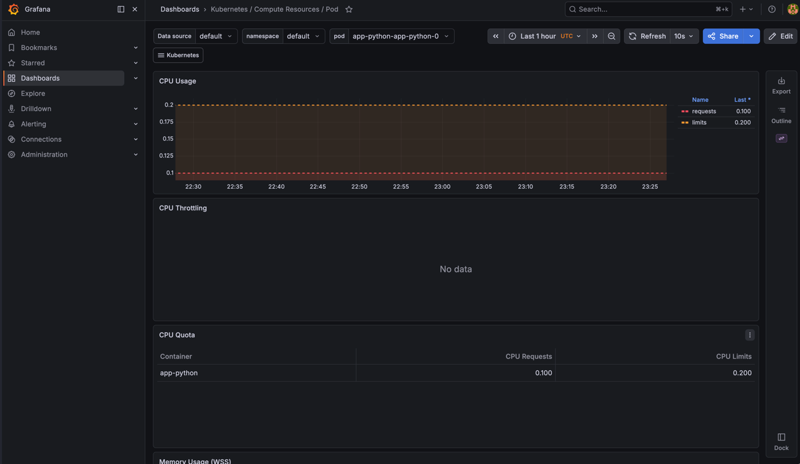
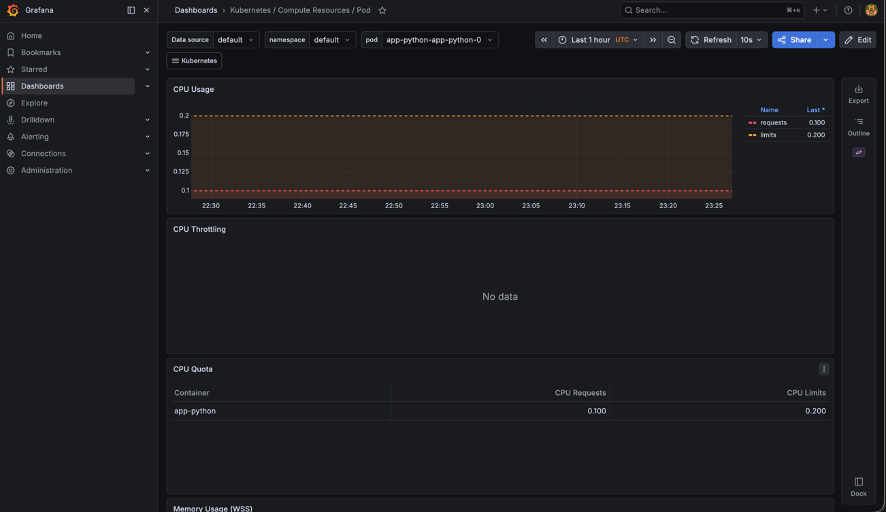
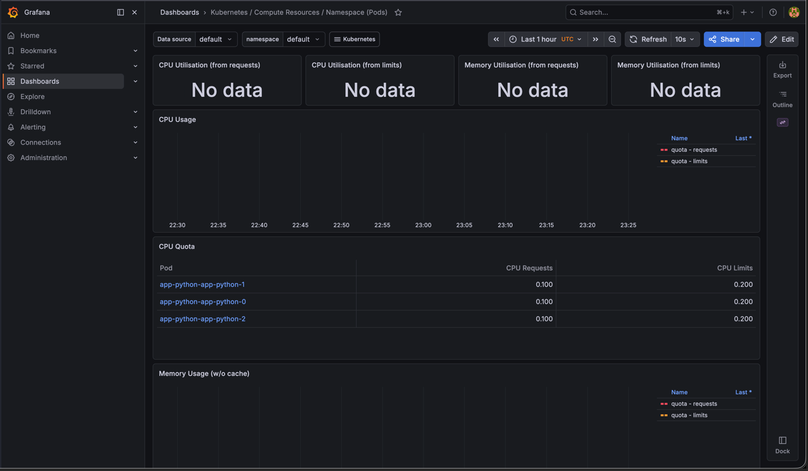
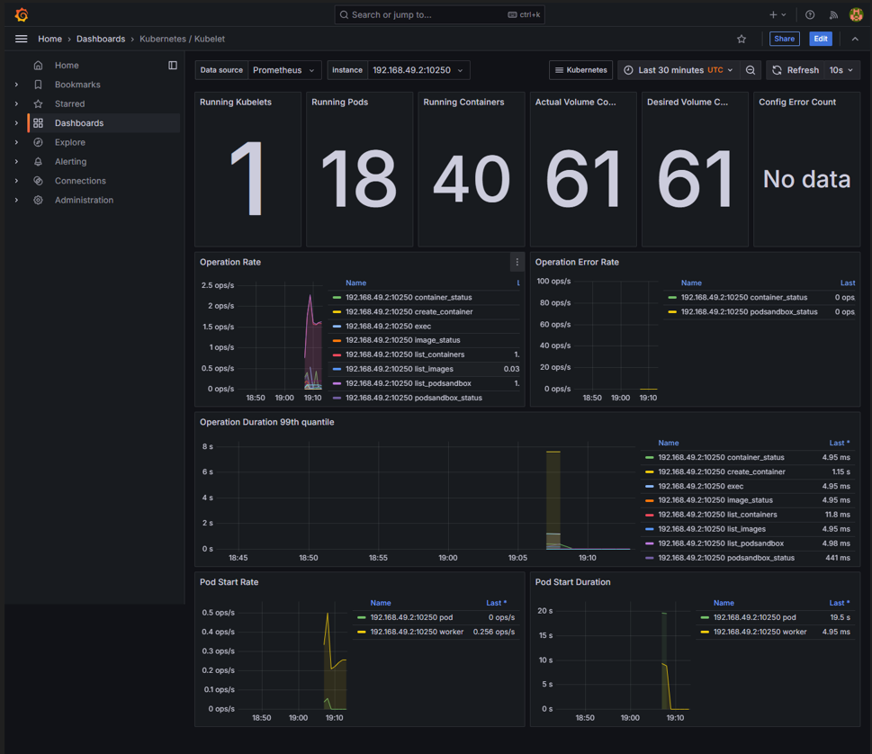

# Lab 16 — Kubernetes Monitoring & Init Containers

## 1. Kube-Prometheus Stack

### Компоненты

| Компонент | Роль |
|-----------|------|
| **Prometheus Operator** | Управляет жизненным циклом Prometheus и Alertmanager через CRD (`ServiceMonitor`, `PrometheusRule`). Позволяет описывать конфигурацию мониторинга декларативно в Kubernetes |
| **Prometheus** | Time-series база данных. Периодически (pull-модель) опрашивает `/metrics` эндпоинты приложений и системных компонентов, хранит метрики и выполняет запросы на языке PromQL |
| **Alertmanager** | Получает алерты от Prometheus, дедуплицирует их, применяет маршрутизацию и отправляет уведомления (Slack, email, PagerDuty и др.) |
| **Grafana** | Платформа визуализации. Подключается к Prometheus как data source и отображает метрики в виде дашбордов с графиками, таблицами и алертами |
| **kube-state-metrics** | Экспортирует метрики о состоянии объектов Kubernetes (Deployment, Pod, StatefulSet, Node и др.) — то, что не видно из cAdvisor. Например: `kube_pod_status_phase`, `kube_statefulset_replicas` |
| **node-exporter** | Запускается на каждой ноде как DaemonSet. Экспортирует метрики оборудования и ОС: CPU, память, диск, сеть. Используется в дашбордах "Node Exporter / Nodes" |

### Установка

```bash
helm repo add prometheus-community https://prometheus-community.github.io/helm-charts
helm repo update

helm install monitoring prometheus-community/kube-prometheus-stack \
  --namespace monitoring \
  --create-namespace

kubectl get pods -n monitoring
```

После установки в namespace `monitoring` запущены поды:
- `monitoring-grafana-*`
- `monitoring-kube-prometheus-alertmanager-*`
- `monitoring-kube-prometheus-operator-*`
- `monitoring-kube-prometheus-prometheus-*`
- `monitoring-kube-state-metrics-*`
- `monitoring-prometheus-node-exporter-*` (на каждой ноде)

---

## 2. Grafana Dashboard Exploration

### Доступ к Grafana

```bash
kubectl port-forward svc/monitoring-grafana -n monitoring 3000:80
# http://localhost:3000
# Login: admin / prom-operator
```

### Доступ к Alertmanager

```bash
kubectl port-forward svc/monitoring-kube-prometheus-alertmanager -n monitoring 9093:9093
# http://localhost:9093
```

### Ответы на вопросы

**1. CPU/Memory usage StatefulSet**

Дашборд: `Kubernetes / Compute Resources / Pod`
Фильтр: namespace=`default`, pod=`app-python-app-python-0`

На скриншоте видно, что для контейнера `app-python` заданы лимиты и requests:
- CPU request: `0.100` core (`100m`)
- CPU limit: `0.200` core (`200m`)

Эти значения соответствуют ресурсам из Helm values. Memory usage находится ниже на том же dashboard.





**2. Потребление CPU по подам в namespace default**

Дашборд: `Kubernetes / Compute Resources / Namespace (Pods)`
Фильтр: namespace=`default`

Таблица показывает три pod StatefulSet:
- `app-python-app-python-0`
- `app-python-app-python-1`
- `app-python-app-python-2`

Для каждого pod указан CPU request `0.100` core и CPU limit `0.200` core. На панелях utilization в момент снятия скриншота отображалось `No data`, но quota-таблица подтверждает, что kube-state-metrics видит pod и их resource requests/limits.



**3. Метрики ноды**

Дашборд: `Node Exporter / Nodes`

Отображает для каждой ноды:
- Использование памяти (в % и МБ)
- Количество CPU-ядер
- Нагрузку на диск и сеть

**4. Kubelet — количество подов и контейнеров**

Дашборд: `Kubernetes / Kubelet`

На скриншоте для kubelet `192.168.49.2:10250` отображается:
- Running Kubelets: `1`
- Running Pods: `18`
- Running Containers: `40`
- Actual Volume Count: `61`
- Desired Volume Count: `61`

Панель `Running Pods` показывает текущее число подов под управлением kubelet на ноде. Панель `Running Containers` показывает количество контейнеров, включая служебные и init containers.



**5. Сетевой трафик подов в namespace default**

Дашборд: `Kubernetes / Networking / Namespace (Pods)`
Фильтр: namespace=`default`

Показывает входящий и исходящий трафик (bytes/s) для каждого пода.

**6. Активные алерты в Alertmanager**

Alertmanager доступен на `http://localhost:9093`. На вкладке **Alerts** отображается список активных алертов с severity и описанием. В стандартной установке kube-prometheus-stack уже включены правила — например, `Watchdog` (тестовый алерт, всегда активен), алерты на низкий дисковый ресурс, высокое потребление памяти и др.

---

## 3. Init Containers

### Концепция

Init containers выполняются **до** старта основного контейнера, последовательно. Основной контейнер запускается только после того, как все init containers завершились с кодом выхода 0. Они используются для:
- Предварительной загрузки файлов/конфигов
- Ожидания готовности зависимых сервисов
- Инициализации данных

Init containers имеют доступ к тем же томам, что и основной контейнер, что позволяет передавать данные между ними.

### Реализация

Оба init containers добавлены в StatefulSet через `k8s/info-service/templates/statefulset.yaml` и включаются флагом `initContainers.enabled: true` в values.
URL для загрузки и сервис ожидания вынесены в values:

```yaml
initContainers:
  enabled: true
  downloadUrl: "http://example.com"
  waitForService: ""
```

Если `waitForService` не задан, Helm подставляет headless service текущего StatefulSet.

#### Init container 1 — Загрузка файла

```yaml
- name: init-download
  image: busybox:1.36
  command:
    - sh
    - -c
    - wget -O /work-dir/index.html "http://example.com" && echo "Download complete"
  volumeMounts:
  - name: workdir
    mountPath: /work-dir
```

Загружает HTML-страницу с `example.com` в том `workdir` (emptyDir). Основной контейнер монтирует тот же том в `/init-data` и получает доступ к файлу `/init-data/index.html`.

#### Init container 2 — Ожидание сервиса

```yaml
- name: wait-for-service
  image: busybox:1.36
  command:
    - sh
    - -c
    - |
      until nslookup app-python-app-python-headless; do
        echo "Waiting for app-python-app-python-headless..."
        sleep 2
      done
```

Опрашивает DNS через `nslookup` каждые 2 секунды, пока Headless Service не станет доступен. Гарантирует, что основной контейнер не стартует раньше, чем сервис зарегистрирован в DNS кластера.

#### Общий том (emptyDir)

```yaml
volumes:
- name: workdir
  emptyDir: {}
```

`emptyDir` существует всё время жизни пода. Данные, записанные init container, доступны основному контейнеру.

### Установка и проверка

```bash
helm upgrade --install app-python ./k8s/info-service \
  -f ./k8s/info-service/values.yaml \
  -f ./k8s/info-service/values-statefulset.yaml

# Наблюдение за прогрессом init containers
kubectl get pods -w

# Логи init container загрузки
kubectl logs app-python-app-python-0 -c init-download

# Логи init container ожидания сервиса
kubectl logs app-python-app-python-0 -c wait-for-service

# Проверка что файл доступен в основном контейнере
kubectl exec app-python-app-python-0 -- cat /init-data/index.html
```

Пока init containers работают, под находится в статусе `Init:0/2` → `Init:1/2` → `Running`.

---

## Файловая структура

```
k8s/
├── info-service/
│   ├── values.yaml                   # initContainers.enabled: false по умолчанию
│   ├── values-statefulset.yaml       # initContainers.enabled: true
│   └── templates/
│       └── statefulset.yaml          # init containers добавлены при enabled: true
├── docs/screenshots/lab16/
│   ├── 01-pod-cpu-usage.png
│   ├── 02-pod-cpu-quota.png
│   ├── 03-namespace-pods-resources.png
│   └── 04-kubelet-dashboard.png
└── MONITORING.md                     # эта документация
```

---

## Ссылки

