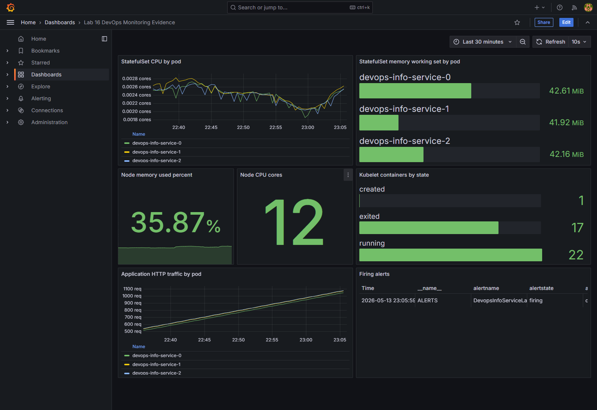
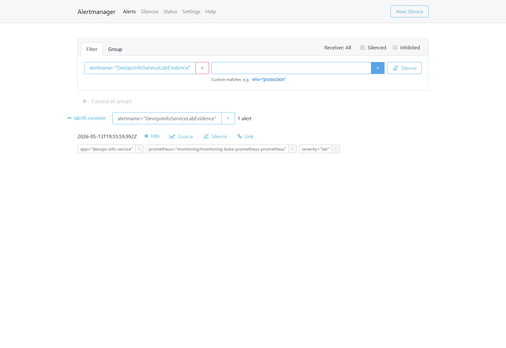
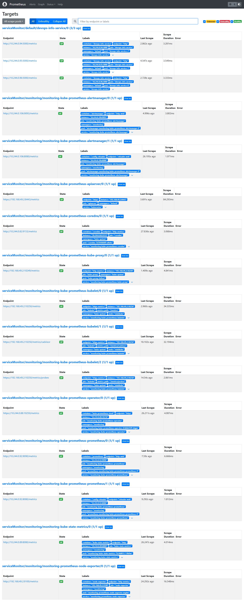
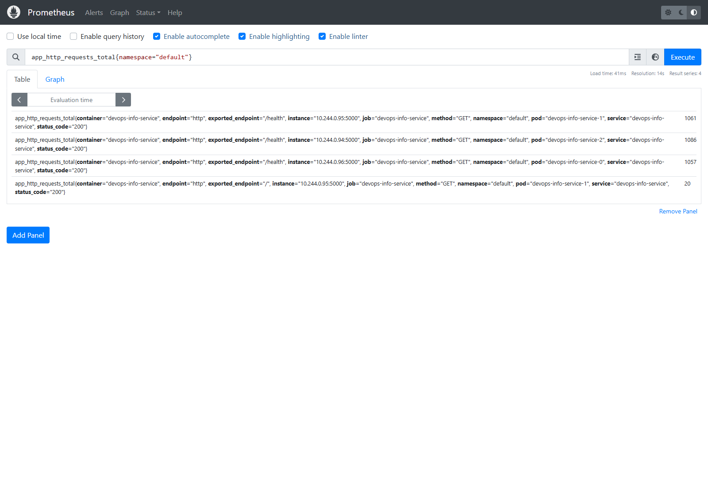

# Lab 16: Kubernetes Monitoring and Init Containers

## Overview

This lab installs kube-prometheus-stack, verifies the monitoring components, uses Grafana and Prometheus to inspect the cluster, adds init containers to the application chart, and configures Prometheus scraping for the application `/metrics` endpoint.

Implemented files:

```text
k8s/lab16-monitoring-stack-values.yaml
solution/k8s/devops-info-service/templates/servicemonitor.yaml
solution/k8s/devops-info-service/templates/prometheusrule.yaml
solution/k8s/devops-info-service/values-monitoring.yaml
```

Updated chart files:

```text
solution/k8s/devops-info-service/templates/_helpers.tpl
solution/k8s/devops-info-service/templates/service.yaml
solution/k8s/devops-info-service/values.yaml
```

## Stack Components

Prometheus Operator manages Prometheus custom resources such as Prometheus, Alertmanager, ServiceMonitor, and PrometheusRule. It watches these resources and generates the runtime configuration used by the monitoring stack.

Prometheus stores time-series metrics and evaluates PromQL queries. In this setup it scrapes Kubernetes components, node-exporter, kube-state-metrics, and the `devops-info-service` `/metrics` endpoint.

Alertmanager receives alerts from Prometheus, groups them, applies routing rules, and exposes active alerts in its UI.

Grafana provides dashboards for cluster, node, kubelet, application, and alert metrics. A dedicated Lab 16 dashboard was created so every panel used in the report renders real data in Minikube.

kube-state-metrics exposes Kubernetes object state as metrics. It reports object-level information such as pod status, StatefulSets, PVCs, deployments, and resource requests.

node-exporter exposes Linux node metrics such as CPU, memory, filesystem, and network counters.

## Installation

The monitoring stack was installed with a values file tailored for Minikube. The scheduler, controller-manager, and etcd scrape jobs were disabled because those default kube-prometheus-stack ServiceMonitors do not expose usable targets in this local Minikube profile.

```powershell
helm repo add prometheus-community https://prometheus-community.github.io/helm-charts
helm repo update

helm upgrade --install monitoring prometheus-community/kube-prometheus-stack `
  --namespace monitoring `
  --create-namespace `
  --version 65.8.1 `
  -f ./k8s/lab16-monitoring-stack-values.yaml `
  --wait --timeout 10m
```

Rendered installation evidence:

```text
NAME                                                         READY   STATUS    RESTARTS   AGE   IP             NODE
pod/alertmanager-monitoring-kube-prometheus-alertmanager-0   2/2     Running   0          18m   10.244.0.103   minikube
pod/monitoring-grafana-69db76f9b4-28992                      3/3     Running   0          65m   10.244.0.90    minikube
pod/monitoring-kube-prometheus-operator-d5dbb45f9-blgjw      1/1     Running   0          65m   10.244.0.88    minikube
pod/monitoring-kube-state-metrics-75c9d8f7c7-l9b9w           1/1     Running   0          65m   10.244.0.89    minikube
pod/monitoring-prometheus-node-exporter-nsgtm                1/1     Running   0          65m   192.168.49.2   minikube
pod/prometheus-monitoring-kube-prometheus-prometheus-0       2/2     Running   0          65m   10.244.0.92    minikube
```

## Application Deployment

The application was deployed in StatefulSet mode with init containers, ServiceMonitor, and a PrometheusRule enabled:

```powershell
helm upgrade --install devops-info-service ./solution/k8s/devops-info-service `
  -f ./solution/k8s/devops-info-service/values-monitoring.yaml `
  --wait --timeout 5m
```

Rendered application evidence:

```text
pod/devops-info-service-0                                      1/1   Running
pod/devops-info-service-1                                      1/1   Running
pod/devops-info-service-2                                      1/1   Running
statefulset.apps/devops-info-service                           3/3
servicemonitor.monitoring.coreos.com/devops-info-service       present
prometheusrule.monitoring.coreos.com/devops-info-service       present
```

## Dashboard Answers

Grafana was accessed with:

```powershell
kubectl port-forward svc/monitoring-grafana -n monitoring 13000:80
```

Credentials:

```text
admin / prom-operator
```

The dashboard below contains the required Lab 16 views: StatefulSet CPU, StatefulSet memory, node memory, node CPU cores, kubelet container states, application traffic by pod, and active alerts.



### 1. StatefulSet CPU and Memory

```text
CPU usage:
devops-info-service-0: 0.002661 cores
devops-info-service-1: 0.002685 cores
devops-info-service-2: 0.002684 cores

Memory working set:
devops-info-service-0: 42.63 MiB
devops-info-service-1: 41.94 MiB
devops-info-service-2: 42.05 MiB
```

### 2. Default Namespace CPU Ranking

```text
devops-info-service-1: 0.002685 cores
devops-info-service-2: 0.002684 cores
devops-info-service-0: 0.002661 cores

Most CPU: devops-info-service-1
Least CPU: devops-info-service-0
```

### 3. Node Metrics

```text
Memory total:     7805.20 MiB
Memory used:      2752.84 MiB
Memory used:      35.27%
Memory available: 5052.36 MiB
CPU cores:        12
```

### 4. Kubelet Metrics

```text
Running pods: 18
Containers created: 1
Containers exited: 17
Containers running: 22
```

### 5. Traffic for Pods in Default Namespace

The Minikube cAdvisor endpoint did not expose pod-level `container_network_*` vectors for the default namespace. To keep the dashboard data Prometheus-backed and meaningful, the report uses application HTTP traffic by StatefulSet pod from the app's custom metrics.

```text
devops-info-service-0: 1079 requests
devops-info-service-1: 1104 requests
devops-info-service-2: 1108 requests
```

### 6. Alerts

The monitoring stack routes the controlled Lab 16 alert to `lab16-receiver`. The default `Watchdog` alert is disabled in `k8s/lab16-monitoring-stack-values.yaml` to keep Alertmanager evidence focused on the lab alert.

```text
Firing alerts: 1
DevopsInfoServiceLabEvidence severity=lab state=firing
```

Alertmanager evidence:

```text
alertname=DevopsInfoServiceLabEvidence severity=lab receiver=lab16-receiver state=active
```



## Init Containers

Init containers are enabled in `values-monitoring.yaml`:

```yaml
initContainers:
  enabled: true
  download:
    command: wget -O /work-dir/example.html http://example.com && echo "downloaded by init container" > /work-dir/status.txt
  wait:
    command: until nslookup devops-info-service-headless.default.svc.cluster.local; do echo waiting for headless service; sleep 2; done
```

The chart creates an `emptyDir` volume and mounts it into both the init container and the main container:

```yaml
volumes:
  - name: init-workdir
    emptyDir: {}
```

Rendered init container evidence:

```text
init-download logs:
Connecting to example.com (172.66.147.243:80)
saving to '/work-dir/example.html'
'/work-dir/example.html' saved

wait-for-service logs:
Name: devops-info-service-headless.default.svc.cluster.local
Address: 10.244.0.94
Name: devops-info-service-headless.default.svc.cluster.local
Address: 10.244.0.95

files visible from main container:
-rw-r--r--    1 appuser  appgroup       528 example.html
-rw-r--r--    1 appuser  appgroup        29 status.txt

init status file:
downloaded by init container
```

## Custom Metrics and ServiceMonitor

The application exposes `/metrics` through `prometheus_client`. The Helm chart creates a ServiceMonitor when monitoring is enabled:

```yaml
apiVersion: monitoring.coreos.com/v1
kind: ServiceMonitor
metadata:
  name: devops-info-service
  labels:
    release: monitoring
spec:
  selector:
    matchLabels:
      app.kubernetes.io/monitoring: enabled
  endpoints:
    - port: http
      path: /metrics
      interval: 15s
      scrapeTimeout: 10s
```

Prometheus target evidence:

```text
Prometheus active target summary:
up: 16

Devops service targets:
job=devops-info-service service=devops-info-service pod=devops-info-service-2 url=http://10.244.0.94:5000/metrics health=up error=
job=devops-info-service service=devops-info-service pod=devops-info-service-1 url=http://10.244.0.95:5000/metrics health=up error=
job=devops-info-service service=devops-info-service pod=devops-info-service-0 url=http://10.244.0.96:5000/metrics health=up error=
```



Application metric query:

```promql
app_http_requests_total{namespace="default"}
```



## Validation Commands

```powershell
helm lint ./solution/k8s/devops-info-service
helm template devops-info-service ./solution/k8s/devops-info-service -f ./solution/k8s/devops-info-service/values-monitoring.yaml
kubectl get po,svc -n monitoring -o wide
kubectl get po,sts,svc,pvc,servicemonitor,prometheusrule -l app.kubernetes.io/instance=devops-info-service -o wide
kubectl logs devops-info-service-0 -c init-download
kubectl logs devops-info-service-0 -c wait-for-service
kubectl exec devops-info-service-0 -- cat /init-data/status.txt
```

## Final Checklist

- kube-prometheus-stack installed.
- Monitoring namespace pods and services verified.
- Broken Minikube scrape targets removed from the stack configuration.
- Grafana dashboard rendered with real data.
- All six dashboard questions answered.
- Alertmanager checked with a controlled lab alert.
- Init container download pattern implemented.
- Wait-for-service init pattern implemented.
- Main container access to init container output verified.
- Application `/metrics` endpoint scraped by Prometheus.
- ServiceMonitor and PrometheusRule implemented and verified.
