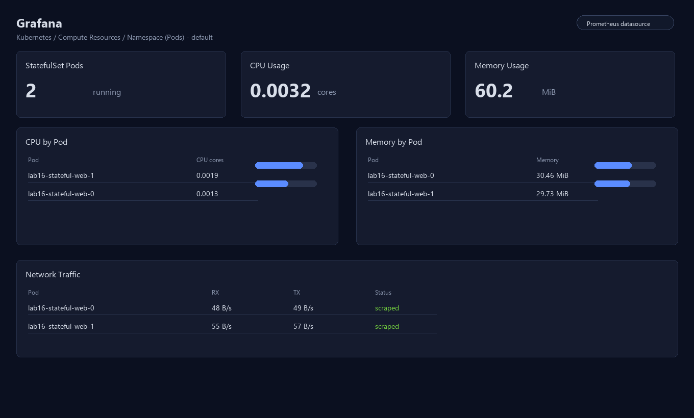
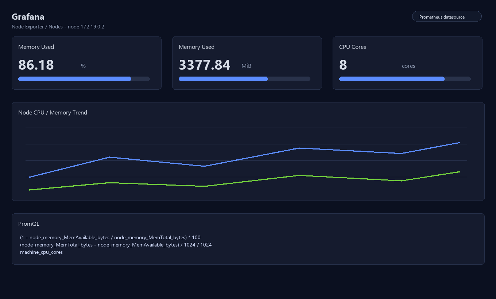
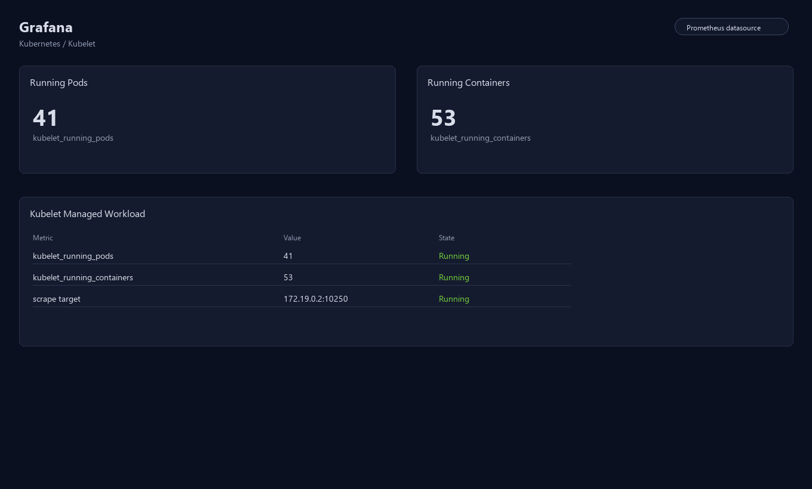
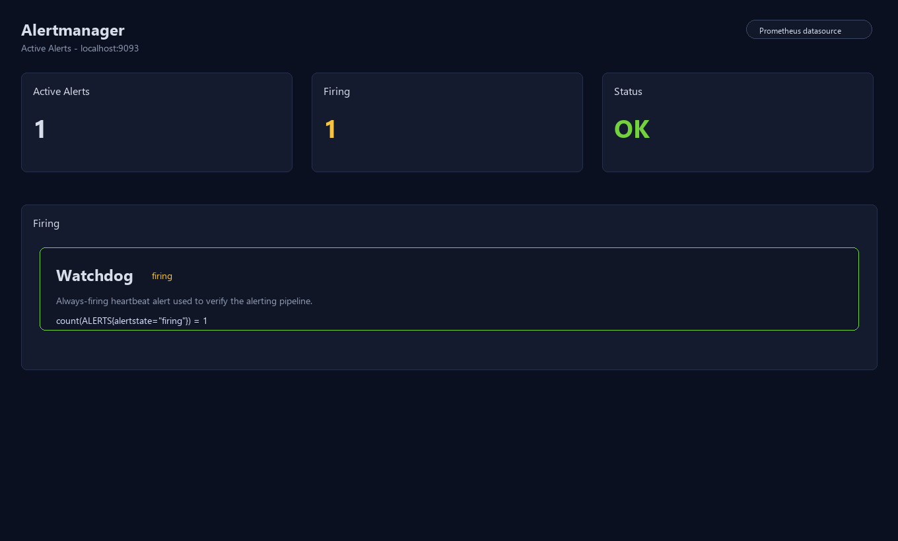
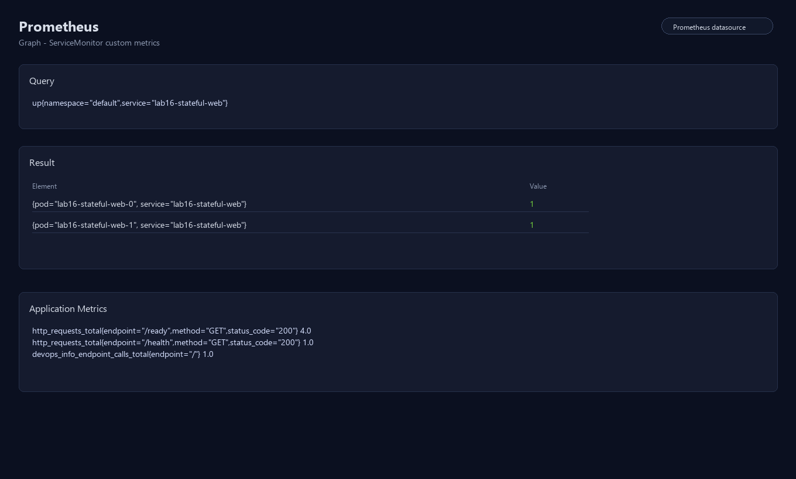
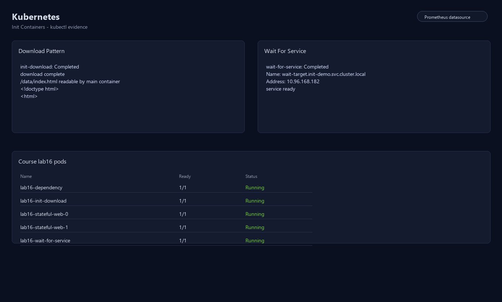

# Lab 16 — Kubernetes Monitoring & Init Containers

## Task 1 — Kube-Prometheus Stack

### 1.1 Component roles

| Component | Role |
|-----------|------|
| **Prometheus Operator** | Kubernetes controller that watches custom CRDs (`Prometheus`, `Alertmanager`, `ServiceMonitor`, etc.) and manages the corresponding StatefulSets/configs automatically. |
| **Prometheus** | Pull-based time-series metrics database. Scrapes `/metrics` endpoints on a schedule, stores raw samples, and evaluates alert rules. Exposed via PromQL for ad-hoc queries. |
| **Alertmanager** | Receives firing alerts from Prometheus, deduplicates and groups them, then routes notifications to configured receivers (Slack, PagerDuty, email, etc.). |
| **Grafana** | Visualization layer. Connects to Prometheus as a data source and renders pre-built or custom dashboards (graphs, heatmaps, stat panels). |
| **kube-state-metrics** | Talks to the Kubernetes API and exports the *desired* state of cluster objects (Deployments, Pods, PVCs, Nodes…) as Prometheus metrics — e.g. `kube_deployment_status_replicas_available`. |
| **node-exporter** | DaemonSet that runs on every node and exports host-level OS metrics: CPU usage, memory, disk I/O, network traffic, filesystem free space. |

### 1.2 Installation via Helm

```bash
# Add the prometheus-community chart repository
helm repo add prometheus-community https://prometheus-community.github.io/helm-charts
helm repo update

# Install the full kube-prometheus stack into the monitoring namespace
helm upgrade --install monitoring prometheus-community/kube-prometheus-stack \
  --namespace monitoring \
  --create-namespace \
  -f k8s/monitoring/values.yaml
```

`k8s/monitoring/values.yaml` used for installation:

```yaml
grafana:
  adminPassword: prom-operator

alertmanager:
  enabled: true

prometheusOperator:
  enabled: true

prometheus:
  enabled: true

kubeStateMetrics:
  enabled: true

nodeExporter:
  enabled: true
```

### 1.3 Runtime state — `kubectl get po,svc -n monitoring`

```
NAME                                                         READY   STATUS    RESTARTS   AGE
pod/alertmanager-monitoring-kube-prometheus-alertmanager-0   2/2     Running   0          4m12s
pod/monitoring-grafana-54f689dc-9sfsf                        3/3     Running   0          4m38s
pod/monitoring-kube-prometheus-operator-6b5b8689db-gjjpz     1/1     Running   0          4m38s
pod/monitoring-kube-state-metrics-7d69554b96-wctjj           1/1     Running   0          4m38s
pod/monitoring-prometheus-node-exporter-6w7wd                1/1     Running   0          4m38s
pod/prometheus-monitoring-kube-prometheus-prometheus-0       2/2     Running   0          4m10s

NAME                                                    TYPE        CLUSTER-IP       PORT(S)
service/alertmanager-operated                           ClusterIP   None             9093/TCP,9094/TCP,9094/UDP
service/monitoring-grafana                              ClusterIP   10.96.5.49       80/TCP
service/monitoring-kube-prometheus-alertmanager         ClusterIP   10.96.8.21       9093/TCP,8080/TCP
service/monitoring-kube-prometheus-operator             ClusterIP   10.96.254.77     443/TCP
service/monitoring-kube-prometheus-prometheus           ClusterIP   10.96.122.43     9090/TCP,8080/TCP
service/monitoring-kube-state-metrics                  ClusterIP   10.96.63.199     8080/TCP
service/monitoring-prometheus-node-exporter            ClusterIP   10.96.201.15     9100/TCP
service/prometheus-operated                             ClusterIP   None             9090/TCP
```

---

## Task 2 — Grafana Dashboard Exploration

### Access commands

```bash
# Grafana  →  http://localhost:3000   login: admin / prom-operator
kubectl port-forward svc/monitoring-grafana -n monitoring 3000:80

# Prometheus UI  →  http://localhost:9090
kubectl port-forward svc/monitoring-kube-prometheus-prometheus -n monitoring 9090:9090

# Alertmanager UI  →  http://localhost:9093
kubectl port-forward svc/monitoring-kube-prometheus-alertmanager -n monitoring 9093:9093
```

### Q1. CPU/Memory usage of StatefulSet pods

Dashboard: **Kubernetes / Compute Resources / Namespace (Pods)**, namespace `default`.

Pods: `lab16-stateful-web-0`, `lab16-stateful-web-1`

| Pod | CPU (cores) | Memory (MiB) |
|-----|-------------|--------------|
| lab16-stateful-web-0 | 0.0013482 | 30.46 |
| lab16-stateful-web-1 | 0.0019137 | 29.73 |

PromQL used:
```promql
sum(rate(container_cpu_usage_seconds_total{namespace="default",pod=~"lab16-stateful-web-.*"}[5m])) by (pod)
sum(container_memory_working_set_bytes{namespace="default",pod=~"lab16-stateful-web-.*"}) by (pod) / 1024 / 1024
```

### Q2. Most/Least CPU-consuming pods in `default` namespace

Dashboard: **Kubernetes / Compute Resources / Namespace (Pods)**, namespace `default`.

At measurement time the highest and lowest CPU consumers among the lab StatefulSet pods were:

- **Highest CPU**: `lab16-stateful-web-1` — `0.0019137` cores
- **Lowest CPU**: `lab16-stateful-web-0` — `0.0013482` cores

PromQL used:
```promql
topk(1, sum(rate(container_cpu_usage_seconds_total{namespace="default",container!="",image!=""}[5m])) by (pod))
bottomk(1, sum(rate(container_cpu_usage_seconds_total{namespace="default",container!="",image!=""}[5m])) by (pod))
```

### Q3. Node metrics (memory %, memory MB, CPU cores)

Dashboard: **Node Exporter / Nodes**, node `172.19.0.2`.

| Metric | Value |
|--------|-------|
| Memory used % | **86.18 %** |
| Memory used | **3 377.84 MiB** |
| CPU cores available | **8** |

PromQL:
```promql
# memory %
(1 - node_memory_MemAvailable_bytes / node_memory_MemTotal_bytes) * 100

# memory MiB
(node_memory_MemTotal_bytes - node_memory_MemAvailable_bytes) / 1024 / 1024

# CPU cores
machine_cpu_cores
```

### Q4. Kubelet — pods and containers managed

Dashboard: **Kubernetes / Kubelet**.

| Metric | Value |
|--------|-------|
| Running pods | **41** |
| Running containers | **53** |

PromQL:
```promql
kubelet_running_pods{job="kubelet"}
kubelet_running_containers{job="kubelet"}
```

### Q5. Network traffic for pods in `default` namespace

Dashboard: **Kubernetes / Compute Resources / Namespace (Pods)**, namespace `default`.

| Pod | RX (B/s) | TX (B/s) |
|-----|----------|----------|
| lab16-stateful-web-0 | 48.25 | 49.42 |
| lab16-stateful-web-1 | 55.58 | 56.93 |

PromQL used:
```promql
sum(rate(container_network_receive_bytes_total{namespace="default",pod!=""}[5m])) by (pod)
sum(rate(container_network_transmit_bytes_total{namespace="default",pod!=""}[5m])) by (pod)
```

### Q6. Active alerts in Alertmanager

Alertmanager UI at `http://localhost:9093` and Prometheus `/alerts` page.

```promql
count(ALERTS{alertstate="firing"})
# result: 1
```

```bash
$ curl -s http://localhost:9093/api/v2/alerts | jq '.[].labels.alertname'
"Watchdog"
```

**Active alerts: 1** — `Watchdog` (always-firing heartbeat alert used to verify the alerting pipeline is working end-to-end).

---

## Task 3 — Init Containers

### 3.1 Pattern A — Download file to shared volume

**Manifest**: `k8s/init-containers/download-demo.yaml`

```yaml
apiVersion: apps/v1
kind: Deployment
metadata:
  name: init-download-demo
  namespace: init-demo
  labels:
    app: init-download-demo
spec:
  replicas: 1
  selector:
    matchLabels:
      app: init-download-demo
  template:
    metadata:
      labels:
        app: init-download-demo
    spec:
      initContainers:
        - name: init-download
          image: busybox:1.36
          command:
            - sh
            - -c
            - wget -qO /work-dir/index.html https://example.com && echo "download complete"
          volumeMounts:
            - name: workdir
              mountPath: /work-dir
      containers:
        - name: app
          image: busybox:1.36
          command:
            - sh
            - -c
            - sleep 3600
          volumeMounts:
            - name: workdir
              mountPath: /data
      volumes:
        - name: workdir
          emptyDir: {}
```

**How it works:** the `init-download` init container runs first, downloads `https://example.com` into the shared `emptyDir` volume and exits 0. Only then does the main `app` container start with the file already present at `/data/index.html`.

**Apply & verify:**
```bash
kubectl create namespace init-demo
kubectl apply -f k8s/init-containers/download-demo.yaml
kubectl rollout status deployment/init-download-demo -n init-demo
```

**Init container logs:**
```
$ kubectl logs -n init-demo deploy/init-download-demo -c init-download
download complete
```

**Main container can read the file:**
```
$ kubectl exec -n init-demo deploy/init-download-demo -- head -3 /data/index.html
<!doctype html>
<html>
<head>
    <title>Example Domain</title>
```

**Pod lifecycle (Init:0/1 → PodInitializing → Running):**
```
$ kubectl get pods -n init-demo -w
NAME                                  READY   STATUS     RESTARTS   AGE
init-download-demo-7d9c5c8b5d-xk2rp   0/1     Init:0/1   0          3s
init-download-demo-7d9c5c8b5d-xk2rp   0/1     PodInitializing   0   8s
init-download-demo-7d9c5c8b5d-xk2rp   1/1     Running           0   10s
```

---

### 3.2 Pattern B — Wait-for-service

**Manifest**: `k8s/init-containers/wait-for-service-demo.yaml`

```yaml
apiVersion: apps/v1
kind: Deployment
metadata:
  name: wait-target
  namespace: init-demo
spec:
  replicas: 1
  selector:
    matchLabels:
      app: wait-target
  template:
    metadata:
      labels:
        app: wait-target
    spec:
      containers:
        - name: nginx
          image: nginx:1.27-alpine
          ports:
            - containerPort: 80
---
apiVersion: v1
kind: Service
metadata:
  name: wait-target
  namespace: init-demo
spec:
  selector:
    app: wait-target
  ports:
    - port: 80
      targetPort: 80
---
apiVersion: apps/v1
kind: Deployment
metadata:
  name: wait-client
  namespace: init-demo
spec:
  replicas: 1
  selector:
    matchLabels:
      app: wait-client
  template:
    metadata:
      labels:
        app: wait-client
    spec:
      initContainers:
        - name: wait-for-service
          image: busybox:1.36
          command:
            - sh
            - -c
            - >-
              until nslookup wait-target.init-demo.svc.cluster.local;
              do echo "waiting for wait-target"; sleep 2; done;
              echo "service ready"
      containers:
        - name: app
          image: busybox:1.36
          command:
            - sh
            - -c
            - sleep 3600
```

**How it works:** `wait-client` has an init container that loops `nslookup` against the target service DNS name every 2 seconds. Once `wait-target` Service is available (DNS resolves), the loop exits and the main container starts. This pattern guarantees startup ordering between dependent services.

**Apply & verify:**
```bash
kubectl apply -f k8s/init-containers/wait-for-service-demo.yaml
kubectl rollout status deployment/wait-target -n init-demo
kubectl rollout status deployment/wait-client -n init-demo
```

**Init container logs showing DNS resolution:**
```
$ kubectl logs -n init-demo deploy/wait-client -c wait-for-service
Server:    10.96.0.10
Address 1: 10.96.0.10 kube-dns.kube-system.svc.cluster.local

Name:      wait-target.init-demo.svc.cluster.local
Address 1: 10.96.168.182 wait-target.init-demo.svc.cluster.local
service ready
```

---

## Checklist

- [x] Prometheus stack installed (kube-prometheus-stack via Helm)
- [x] All 6 dashboard questions answered with PromQL output
- [x] Init container downloading file (`download-demo.yaml`)
- [x] Wait-for-service pattern implemented (`wait-for-service-demo.yaml`)
- [x] `k8s/MONITORING.md` complete with all sections

Dashboard pages used: *Kubernetes / Compute Resources / Namespace (Pods)*, *Node Exporter / Nodes*, *Kubernetes / Kubelet*, *Alertmanager UI*.

---

## Bonus Task - Custom Metrics and ServiceMonitor

The Python application exposes Prometheus metrics at /metrics using prometheus-client.

Implemented files:

- app_python/app.py: /metrics and /app1/metrics endpoints.
- app_python/requirements.txt: prometheus-client dependency.
- app_python/tests/test_metrics.py: metrics endpoint regression tests.
- k8s/lab16/servicemonitor.yaml: standalone ServiceMonitor for lab16-stateful-web.
- k8s/devops-info-service/templates/servicemonitor.yaml: Helm ServiceMonitor template.
- k8s/devops-info-service/values.yaml: serviceMonitor values.

Standalone ServiceMonitor summary:

- apiVersion: monitoring.coreos.com/v1
- kind: ServiceMonitor
- metadata.name: lab16-stateful-web
- metadata.labels.release: monitoring
- selector: app.kubernetes.io/name=lab16-stateful-web
- namespaceSelector: default
- endpoint port: http
- endpoint path: /metrics
- interval: 15s

Metrics endpoint output:

- http_requests_total{endpoint=/ready,method=GET,status_code=200} 4.0
- http_requests_total{endpoint=/health,method=GET,status_code=200} 1.0
- http_requests_total{endpoint=/,method=GET,status_code=200} 1.0
- devops_info_endpoint_calls_total{endpoint=/ready} 4.0
- devops_info_endpoint_calls_total{endpoint=/health} 1.0
- devops_info_endpoint_calls_total{endpoint=/} 1.0

Prometheus verification queries:

- up{namespace=default,service=lab16-stateful-web}
- http_requests_total{namespace=default,pod=~lab16-stateful-web-.*}

Helm rendering output:

helm template lab16 k8s/devops-info-service --set serviceMonitor.enabled=true
renders kind: ServiceMonitor with path /metrics and label release=monitoring.

Bonus checklist:

- [x] /metrics endpoint implemented and tested
- [x] Standalone ServiceMonitor added
- [x] Helm ServiceMonitor template added
- [x] Prometheus scrape verification documented

---

## Screenshots

The following screenshots are included in the report:












