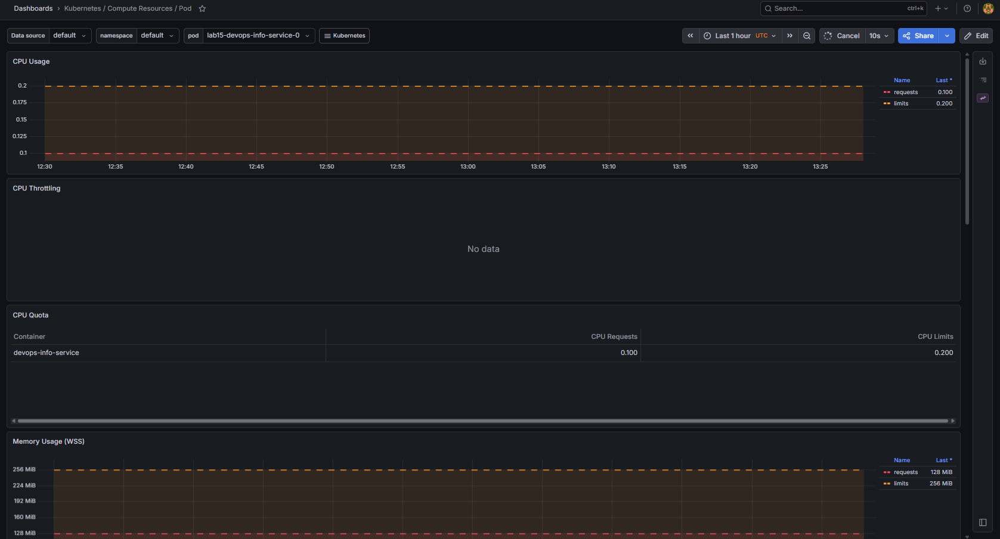
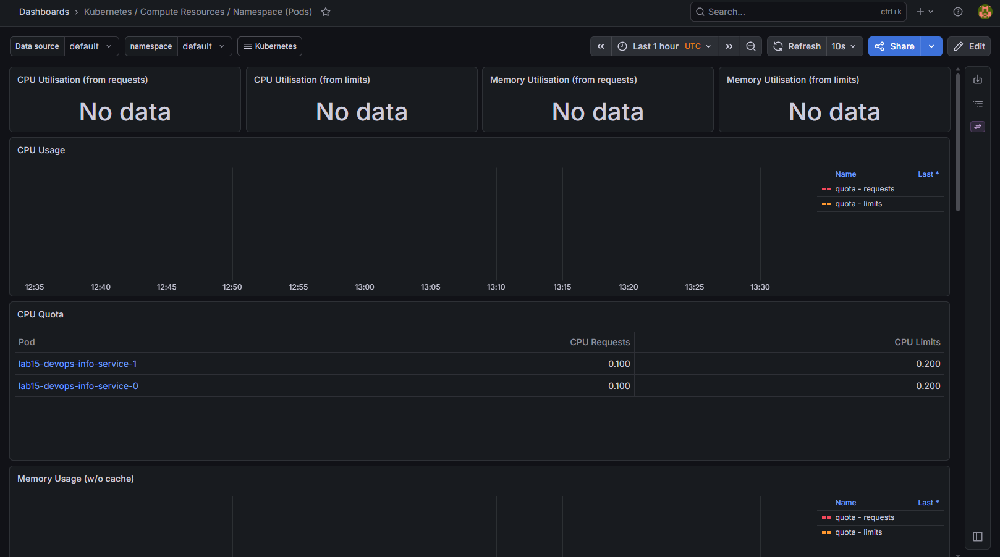
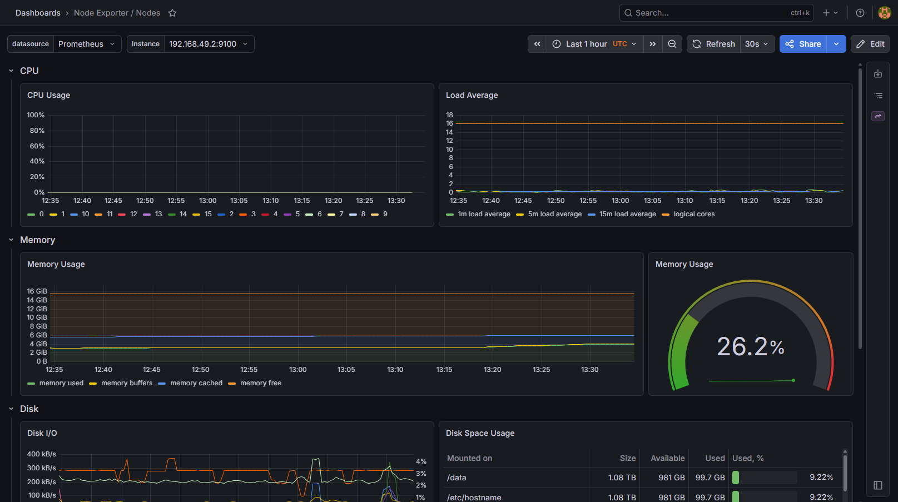
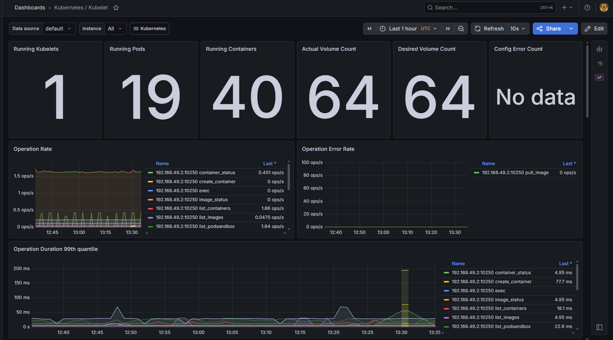
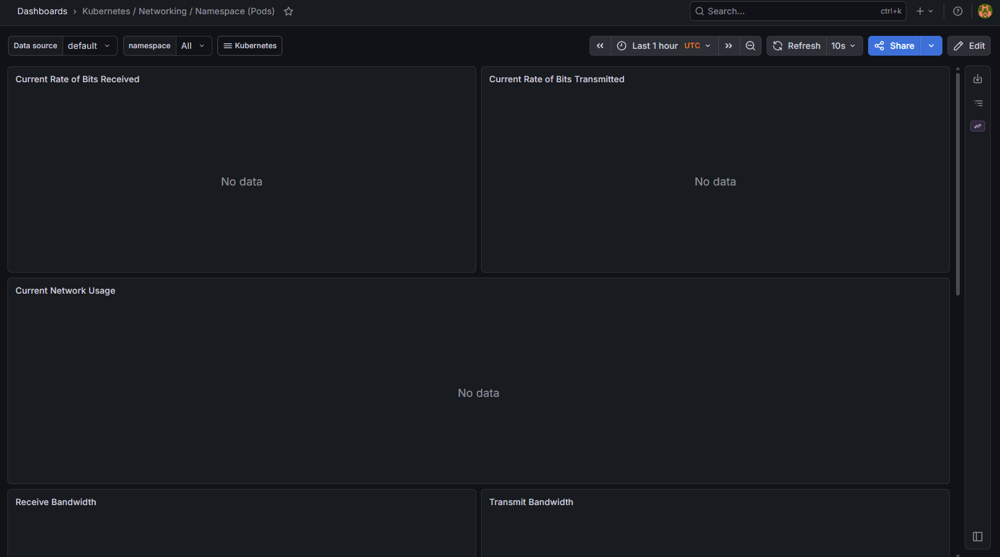
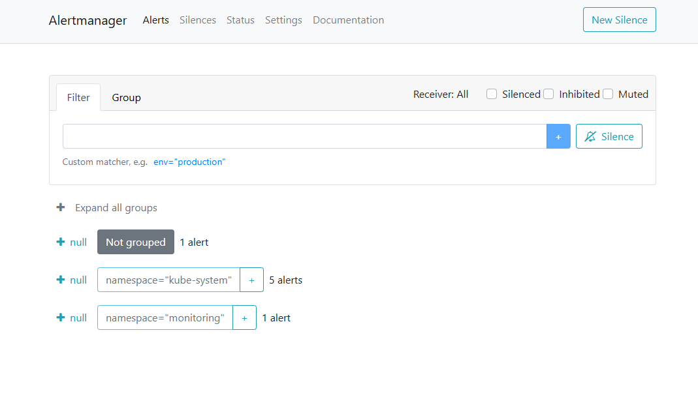

## Stack components

| Component               | Role                                                                                                                                                                                               |
|-------------------------|----------------------------------------------------------------------------------------------------------------------------------------------------------------------------------------------------|
| **Prometheus Operator** | Watches `ServiceMonitor`, `PodMonitor`, `PrometheusRule`, and other CRDs; reconciles Prometheus, Alertmanager, and scrape configs so monitoring stays declarative and consistent with the cluster. |
| **Prometheus**          | Time-series database and scraper: collects metrics from targets, evaluates recording/alerting rules, and exposes the PromQL API and UI.                                                            |
| **Alertmanager**        | Receives alerts from Prometheus, deduplicates, groups, routes, and delivers notifications (and exposes UI/API on port 9093).                                                                       |
| **Grafana**             | Visualization and dashboards on top of Prometheus (and other sources); default kube-prometheus dashboards cover nodes, workloads, and Kubernetes objects.                                          |
| **kube-state-metrics**  | Exposes Kubernetes API state as Prometheus metrics (Deployments, Pods, PVCs, etc.) - “what exists” rather than only runtime stats.                                                                 |
| **node-exporter**       | Host/node metrics (CPU, memory, disk, network interfaces) from each node for capacity and saturation views.                                                                                        |

## Installation evidence


```text
kubectl get pods,svc -n monitoring
NAME                                                         READY   STATUS    RESTARTS   AGE
pod/alertmanager-monitoring-kube-prometheus-alertmanager-0   2/2     Running   0          16m
pod/monitoring-grafana-5fc8c986f7-8jzjn                      3/3     Running   0          17m
pod/monitoring-kube-prometheus-operator-54f68d65b4-kmgl4     1/1     Running   0          17m
pod/monitoring-kube-state-metrics-5957bd45bc-k9d48           1/1     Running   0          17m
pod/monitoring-prometheus-node-exporter-cfpfs                1/1     Running   0          17m
pod/prometheus-monitoring-kube-prometheus-prometheus-0       2/2     Running   0          16m

NAME                                              TYPE        CLUSTER-IP       EXTERNAL-IP   PORT(S)                      AGE
service/alertmanager-operated                     ClusterIP   None             <none>        9093/TCP,9094/TCP,9094/UDP   16m
service/monitoring-grafana                        ClusterIP   10.101.107.32    <none>        80/TCP                       17m
service/monitoring-kube-prometheus-alertmanager   ClusterIP   10.107.23.234    <none>        9093/TCP,8080/TCP            17m
service/monitoring-kube-prometheus-operator       ClusterIP   10.105.12.233    <none>        443/TCP                      17m
service/monitoring-kube-prometheus-prometheus     ClusterIP   10.108.250.252   <none>        9090/TCP,8080/TCP            17m
service/monitoring-kube-state-metrics             ClusterIP   10.102.10.149    <none>        8080/TCP                     17m
service/monitoring-prometheus-node-exporter       ClusterIP   10.109.233.232   <none>        9100/TCP                     17m
service/prometheus-operated                       ClusterIP   None             <none>        9090/TCP                     16m
```

Access used for dashboards (local): `kubectl port-forward svc/monitoring-grafana -n monitoring 3000:80`.
Alertmanager: `kubectl port-forward svc/monitoring-kube-prometheus-alertmanager -n monitoring 9093:9093`.

## Dashboard answers

### Pod resources - CPU/memory of your StatefulSet

**StatefulSet:** `lab15-devops-info-service`.  
**Observation:** Both pods show **2m CPU** and **~48-50 Mi** memory.



### Namespace analysis - most / least CPU in `default`

**Dashboard:** *Kubernetes / Compute Resources / Namespace (Pods)*.  
**Observation (sorted by CPU):** **Highest:** `lab15-devops-info-service-0` and `lab15-devops-info-service-1` (**2m** each). **Lower:** `lab16-backend-*` (**1m**). **Least / idle:** `lab16-init-download`, `lab16-wait-for-service` (**0m**).



### Node metrics - memory % and MB, CPU cores

**Dashboard:** *Node Exporter / Nodes*.  
**Observation:** Node `minikube`: **241m CPU**, **~1%** of reported utilization; **2651 Mi memory**, **16%**.



### Kubelet - how many pods/containers managed?

**Dashboard:** *Kubernetes / Kubelet*.  
**Observation:** Prometheus instant query `kubelet_running_pods{job="kubelet"}` on node `minikube`: **19** running pods. Container counts are available via `kubelet_running_containers` with `container_state` labels.



### Network - traffic for pods in `default`

**Dashboard:** *Kubernetes / Networking / Namespace (Pods)*.  
**Observation:** Pod-level `container_network_*` rates for `namespace="default"` returned **no series** in Prometheus on this idle Minikube cluster; **node-level** receive throughput was about **20 kB/s** (`sum(rate(node_network_receive_bytes_total{device!~"lo.*"}[5m]))`). Use the networking dashboard for per-pod rates when workloads generate traffic.



### Alerts - how many active? Alertmanager UI

**Dashboard / UI:** Alertmanager (port-forward **9093**).  
**Observation:** `GET /api/v2/alerts` showed **2 active** alerts: `etcdInsufficientMembers` (common noise on single-node clusters) and `Watchdog` (intentional pipeline health alert).



## Init containers - implementation and proof

### Basic init - download with `wget` into shared volume

**Manifest:** [`lab16/init-download.yaml`](lab16/init-download.yaml) - init container `init-download` writes `index.html` to `emptyDir`; main container mounts the same volume at `/data`.

```text
kubectl logs lab16-init-download -c init-download
wget: note: TLS certificate validation not implemented
total 12
...
-rw-r--r--    1 root     root           528 May  7 12:32 index.html

kubectl exec lab16-init-download -- head -c 200 /data/index.html
<!doctype html><html lang="en"><head><title>Example Domain</title>...
```

### Wait-for-service pattern

**Manifest:** [`lab16/wait-for-service.yaml`](lab16/wait-for-service.yaml) - `Service` + `Deployment` `lab16-backend`; pod `lab16-wait-for-service` runs init `wait-for-service` until `nslookup lab16-backend.default.svc.cluster.local` succeeds, then starts the main container.

```text
kubectl logs lab16-wait-for-service -c wait-for-service
...
Name: lab16-backend.default.svc.cluster.local
Address: 10.98.195.158
```

Both pods reached **Ready** after init completion (`kubectl wait --for=condition=Ready pod/lab16-init-download` / `pod/lab16-wait-for-service`).
