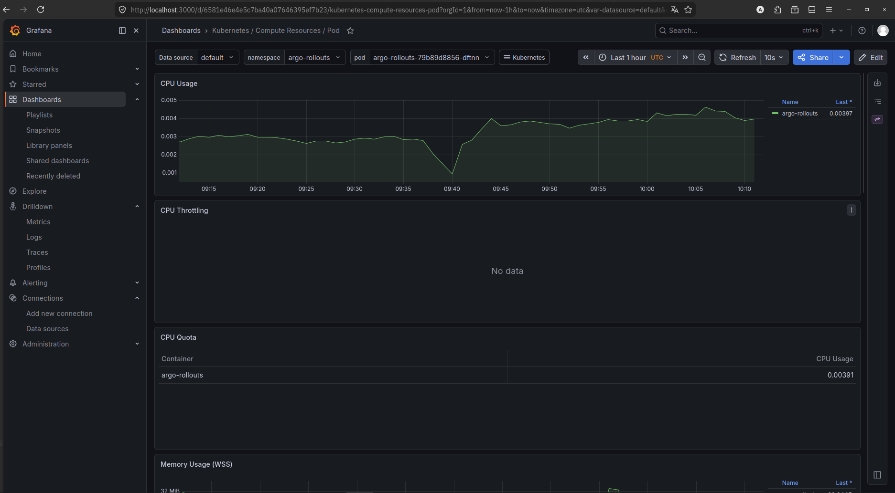
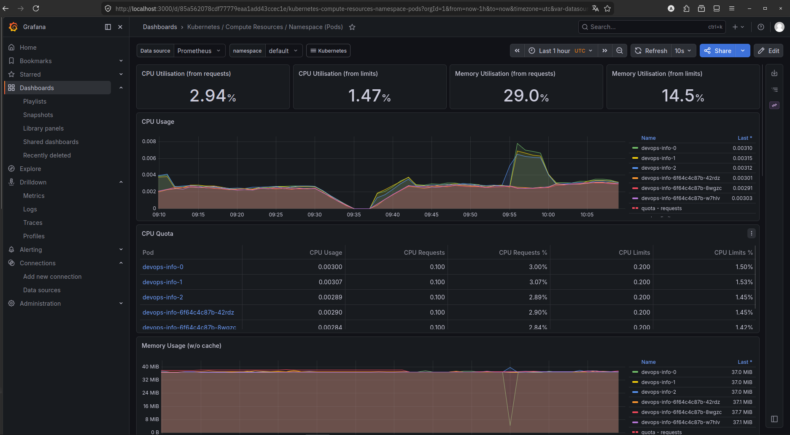
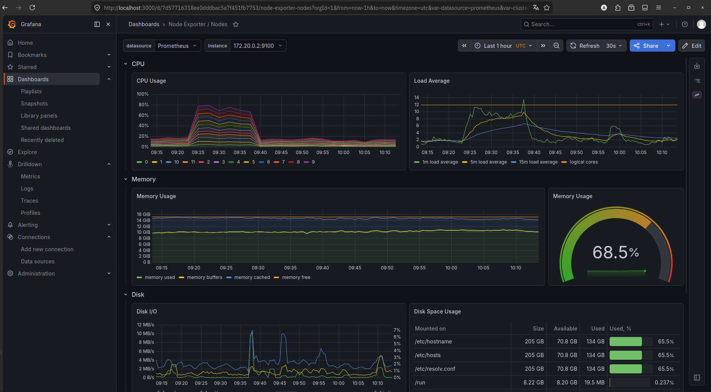
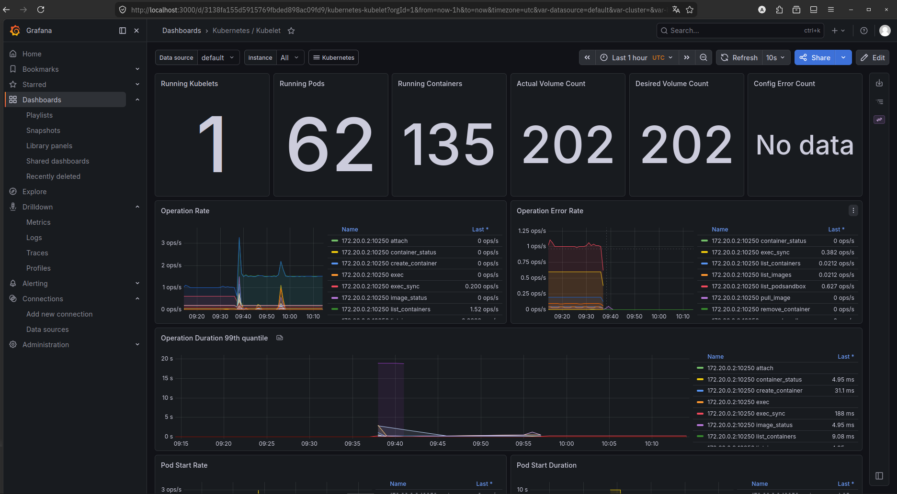
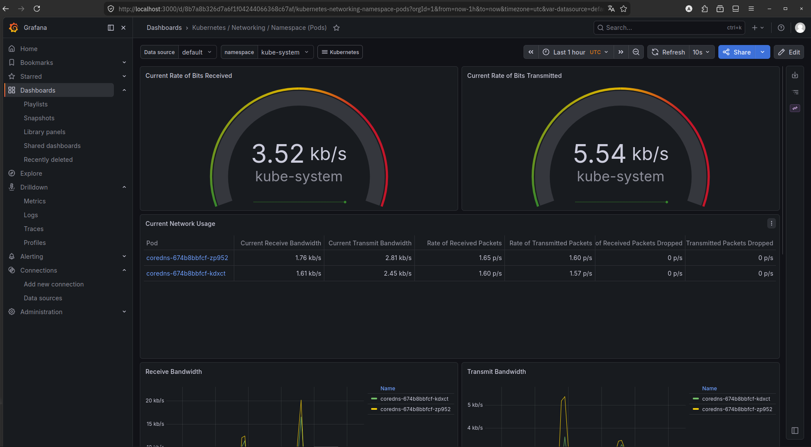
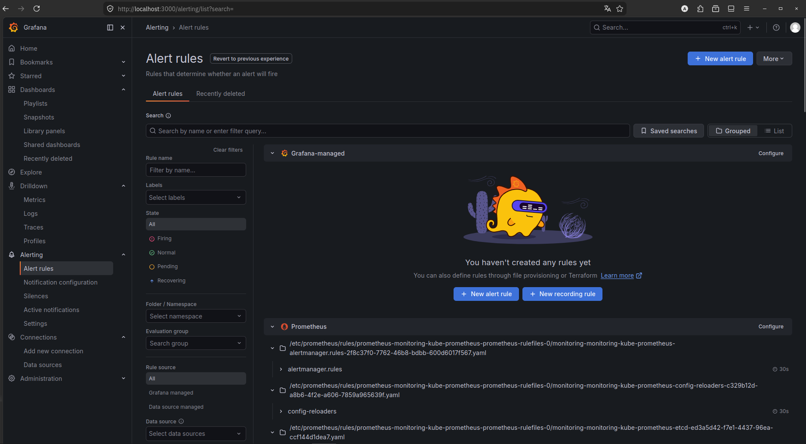
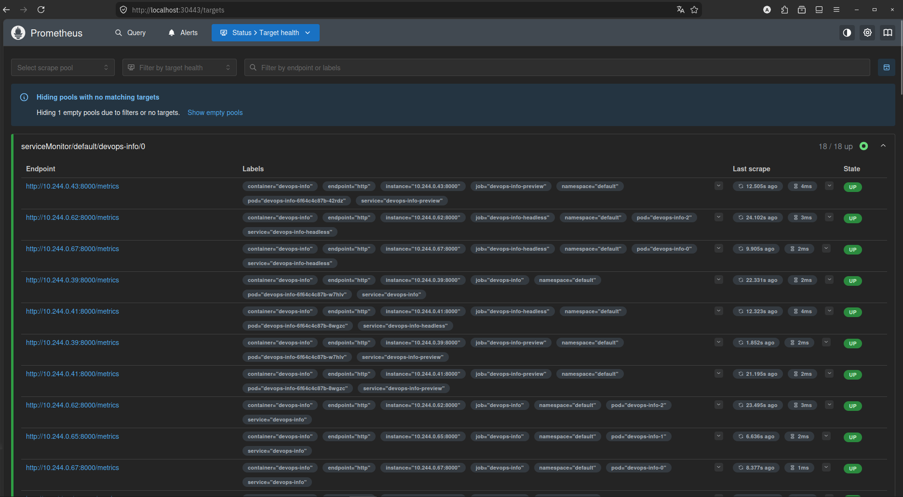

# Lab 16: Monitoring StatefulSets (Final Report)

## Scope
This report covers the Lab 16 requirements for monitoring a StatefulSet using kube-prometheus-stack.

Monitored stack:
- Prometheus
- Grafana
- Alertmanager
- kube-state-metrics
- node-exporter

Application monitored:
- StatefulSet: devops-info
- Namespace: default
- Metrics endpoint: /metrics

---

## Task 1. Stack Components

- **Prometheus** collects metrics from Kubernetes objects and application endpoints, stores them as time-series, and evaluates alert rules.
- **Grafana** visualizes metrics with dashboards, allowing inspection of CPU, memory, network, pod, and node behavior.
- **Alertmanager** groups and routes alerts from Prometheus, so notifications can be managed or silenced.
- **kube-state-metrics** exposes Kubernetes object state (pods, deployments, StatefulSets, PVCs) as Prometheus metrics.
- **node-exporter** exposes node-level metrics such as CPU, memory, filesystem, and network for the host.

---

## Task 2. Grafana Dashboard Answers (6 questions)

### 1) Pod Resources
Dashboard: Kubernetes / Compute Resources / Pod



Answer:
- This dashboard shows CPU and memory utilization for devops-info pods.
- It proves Prometheus is scraping pod metrics for the StatefulSet.

### 2) Namespace Analysis
Dashboard: Kubernetes / Compute Resources / Namespace (Pods)



Answer:
- This dashboard shows the top CPU/memory consuming pods in the selected namespace.
- It confirms devops-info pods are visible among namespace resource consumers.

### 3) Node Metrics
Dashboard: Node Exporter / Nodes



Answer:
- This dashboard shows node-level memory usage and CPU cores.
- It proves node-exporter metrics are available for the cluster node.

### 4) Kubelet Statistics
Dashboard: Kubernetes / Kubelet



Answer:
- This dashboard shows kubelet-managed pod and container statistics.
- It confirms kubelet metrics are being collected for the cluster.

### 5) Network Traffic
Dashboard: Kubernetes / Networking / Namespace (Pods)



Answer:
- This dashboard shows network traffic for pods in the selected namespace.
- It confirms network metrics are available for devops-info-related pods.

### 6) Alert Status
Grafana: Alerting -> Alert rules



Answer:
- The screenshot shows active alert rules in the Grafana alerting view.
- In this single-node kind environment, default infrastructure alerts (etcd/TargetDown/Watchdog) can fire.
- These infrastructure alerts are separate from devops-info application monitoring.

---

## Installation Evidence

Prometheus stack installation evidence from `kubectl get po,svc -n monitoring`:

```bash
NAME                                                         READY   STATUS      RESTARTS      AGE
pod/alertmanager-monitoring-kube-prometheus-alertmanager-0   2/2     Running     2 (51m ago)   84m
pod/monitoring-grafana-cc696f5b9-sgbzh                       3/3     Running     0             43m
pod/monitoring-kube-prometheus-operator-7c964cc444-nm8vf     1/1     Running     2 (51m ago)   85m
pod/monitoring-kube-state-metrics-5746795bd9-xrgjg           1/1     Running     1 (51m ago)   85m
pod/monitoring-prometheus-node-exporter-5gbst                1/1     Running     1 (51m ago)   85m
pod/prometheus-monitoring-kube-prometheus-prometheus-0       2/2     Running     2 (51m ago)   84m

NAME                                              TYPE        CLUSTER-IP      PORT(S)
service/monitoring-grafana                        NodePort    10.96.201.42    80:30300/TCP
service/monitoring-kube-prometheus-alertmanager   ClusterIP   10.96.122.253   9093/TCP,8080/TCP
service/monitoring-kube-prometheus-operator       ClusterIP   10.96.95.184    443/TCP
service/monitoring-kube-prometheus-prometheus     NodePort    10.96.78.228    9090:30443/TCP,8080:30445/TCP
service/monitoring-kube-state-metrics             ClusterIP   10.96.153.89    8080/TCP
service/monitoring-prometheus-node-exporter       ClusterIP   10.96.139.34    9100/TCP
```

---


---

## Task 3. Init Containers — Implementation and Proof

Implemented init containers in `k8s/devops-info/templates/statefulset.yaml`:

- `init-wait-service`
  - wait-for-service pattern
  - checks `monitoring-grafana.monitoring.svc.cluster.local:80`
- `init-download-file`
  - download-file pattern
  - saves `/data/bootstrap.html` to persistent volume

Verification commands and proof:

```bash
$ kubectl -n monitoring logs monitoring-devops-info-0 -c init-wait-service
Init: waiting for monitoring-grafana.monitoring.svc.cluster.local:80
Init: service is reachable

$ kubectl -n monitoring logs monitoring-devops-info-0 -c init-download-file
Init: downloading bootstrap file
-rw-r--r--    1 root     root       57.3K May  6 10:29 /data/bootstrap.html

$ kubectl -n monitoring exec monitoring-devops-info-0 -c devops-info -- ls -lh /data/bootstrap.html
-rw-r--r-- 1 root root 58K May  6 10:29 /data/bootstrap.html
```

These outputs prove both the wait-for-service and download-file init container patterns succeeded.

---

## Bonus Task: Prometheus Targets

## ServiceMonitor and Prometheus Scrape

A ServiceMonitor was created for the devops-info service.
It is configured to scrape `/metrics` every 30 seconds with a 10s timeout.
This ensures Prometheus discovers all devops-info replicas.


The Prometheus targets page shows devops-info replicas as UP and confirms scraping is active.



---

## Checklist

- [x] Prometheus stack installed
- [x] All 6 dashboard questions answered
- [x] Screenshots included
- [x] Init container downloading file
- [x] Wait-for-service pattern implemented
- [x] k8s/MONITORING.md complete

