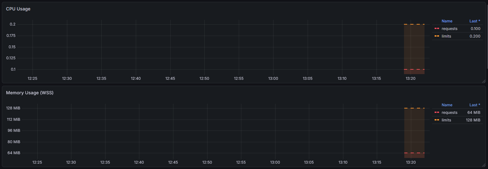
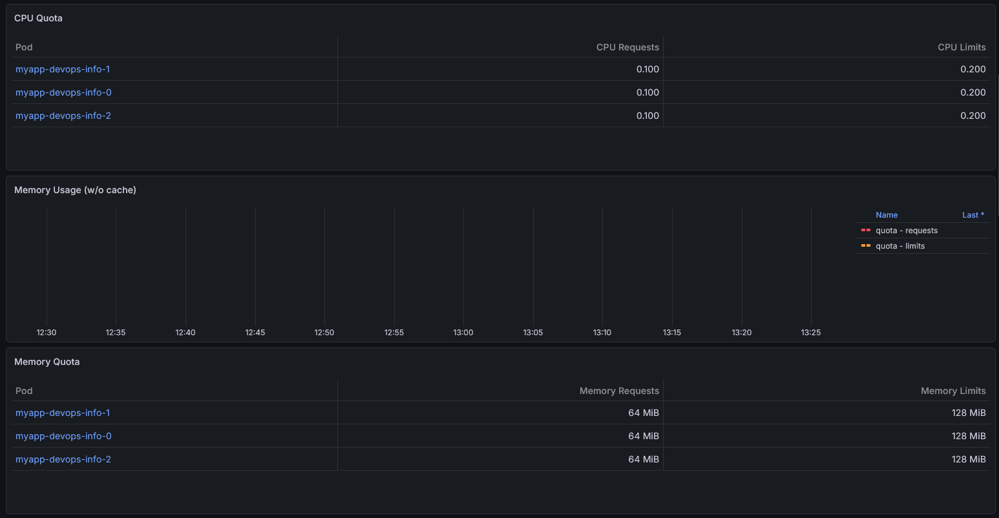
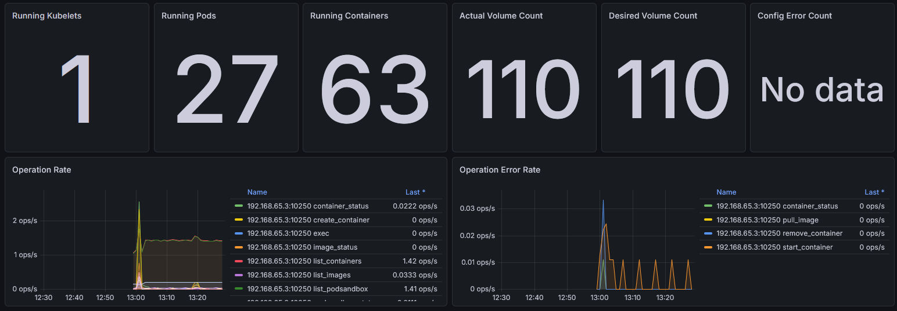
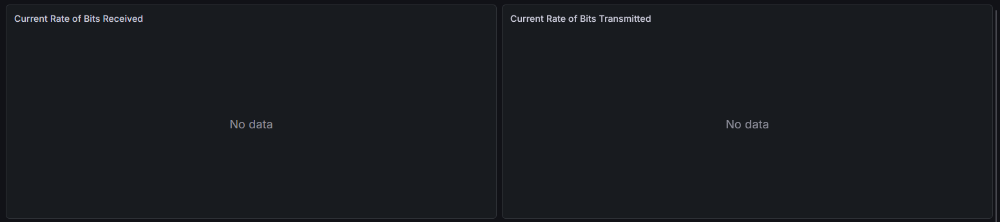

# Lab 16

## 1. Stack Components

Monitoring stack includes:

- Prometheus - scrapes and stores metrics
- Alertmanager - sends alerts from Prometheus
- Prometheus Operator - manages Prometheus and Alertmanager
- Grafana - dashboard manager for scraped logs and metrics

## 2. Installation Evidence

```bash
$ kubectl get po,svc -n monitoring
NAME                                                         READY   STATUS             RESTARTS         AGE
pod/alertmanager-monitoring-kube-prometheus-alertmanager-0   2/2     Running            2 (25m ago)      28m
pod/monitoring-grafana-97cb67894-przkj                       3/3     Running            3 (25m ago)      29m
pod/monitoring-kube-prometheus-operator-7fdc7f994c-kxt4r     1/1     Running            1 (25m ago)      29m
pod/monitoring-kube-state-metrics-676c88cc4-zr2mm            1/1     Running            1 (25m ago)      29m
pod/monitoring-prometheus-node-exporter-w2w9h                1/1     Running            1 (25m ago)      29m
pod/prometheus-monitoring-kube-prometheus-prometheus-0       2/2     Running            2 (25m ago)      28m

NAME                                              TYPE        CLUSTER-IP      EXTERNAL-IP   PORT(S)                      AGE
service/alertmanager-operated                     ClusterIP   None            <none>        9093/TCP,9094/TCP,9094/UDP   28m
service/monitoring-grafana                        ClusterIP   10.107.8.60     <none>        80/TCP                       29m
service/monitoring-kube-prometheus-alertmanager   ClusterIP   10.107.97.211   <none>        9093/TCP,8080/TCP            29m
service/monitoring-kube-prometheus-operator       ClusterIP   10.99.240.13    <none>        443/TCP                      29m
service/monitoring-kube-prometheus-prometheus     ClusterIP   10.109.239.13   <none>        9090/TCP,8080/TCP            29m
service/monitoring-kube-state-metrics             ClusterIP   10.108.114.27   <none>        8080/TCP                     29m
service/monitoring-prometheus-node-exporter       ClusterIP   10.108.30.244   <none>        9100/TCP                     29m
service/prometheus-operated                       ClusterIP   None            <none>        9090/TCP                     28m
```

## 3. Dashboard Answers

Pod Resources:


Namespace Analysis:
All pods have same cpu and memory usage.

Node Metrics:


Kubelet:


Network:


Alerts:


## 4. Init Containers

For chart `init-containers` was implemented 2 `initContainer`s: init-download and wait-for-service.

Evidence:

```bash
$ kubectl get pods -w
NAME              READY   STATUS     RESTARTS   AGE
init-containers   0/1     Init:0/2   0          3s
init-containers   0/1     Init:1/2   0          4s
init-containers   0/1     PodInitializing   0          4s
init-containers   1/1     Running           0          6s


$ kubectl logs init-containers -c init-download
Connecting to example.com (8.47.69.0:443)
wget: note: TLS certificate validation not implemented
saving to '/work-dir/index.html'
index.html           100% |********************************|   528  0:00:00 ETA
'/work-dir/index.html' saved

$ kubectl exec init-containers -- cat /data/index.html
Defaulted container "main-app" out of: main-app, init-download (init), wait-for-service (init)
<!doctype html><html lang="en"><head><title>Example Domain</title><meta name="viewport" content="width=device-width, initial-scale=1"><style>body{background:#eee;width:60vw;margin:15vh auto;font-family:system-ui,sans-serif}h1{font-size:1.5em}div{opacity:0.8}a:link,a:visited{color:#348}</style></head><body><div><h1>Example Domain</h1><p>This domain is for use in documentation examples without needing permission. Avoid use in operations.</p><p><a href="https://iana.org/domains/example">Learn more</a></p></div></body></html>
```
