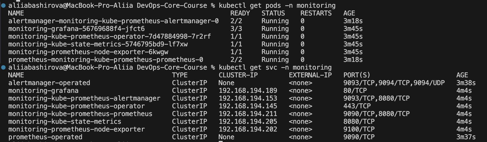
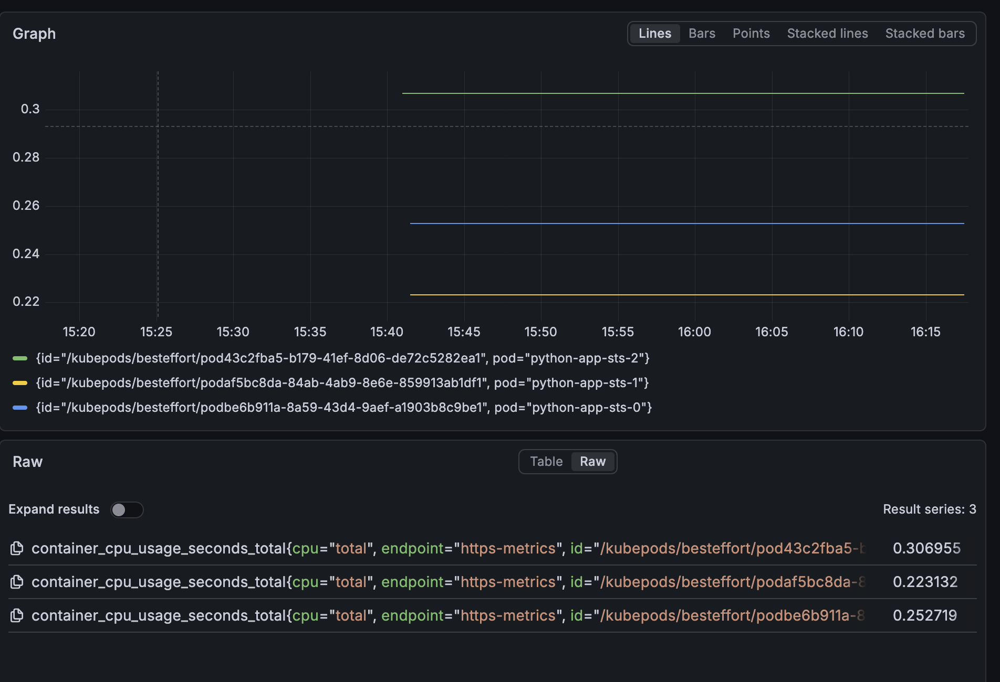
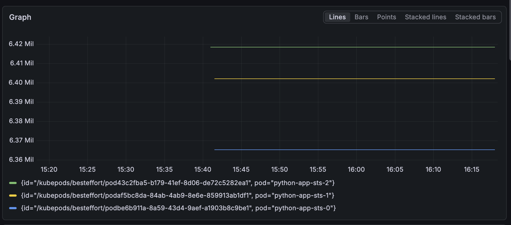
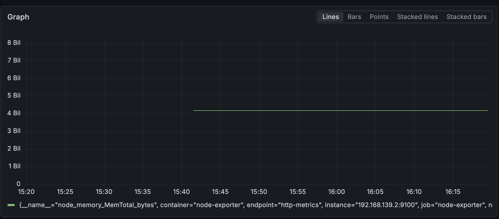
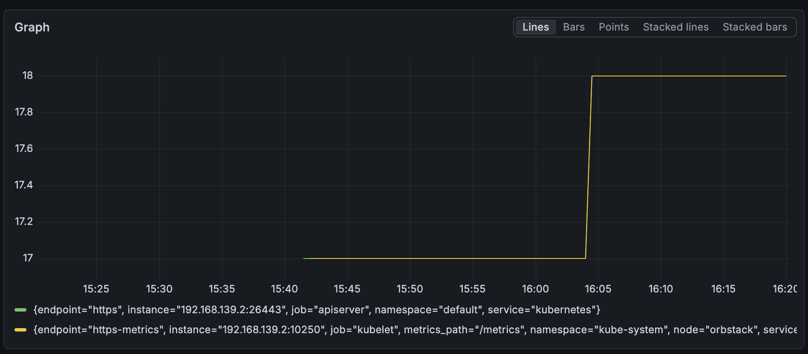
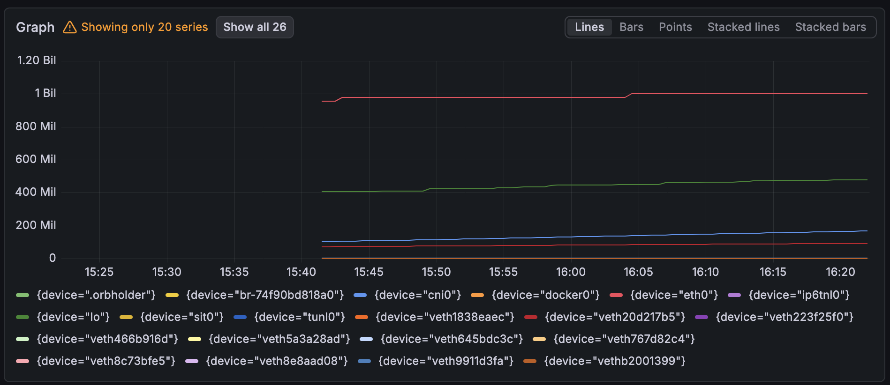
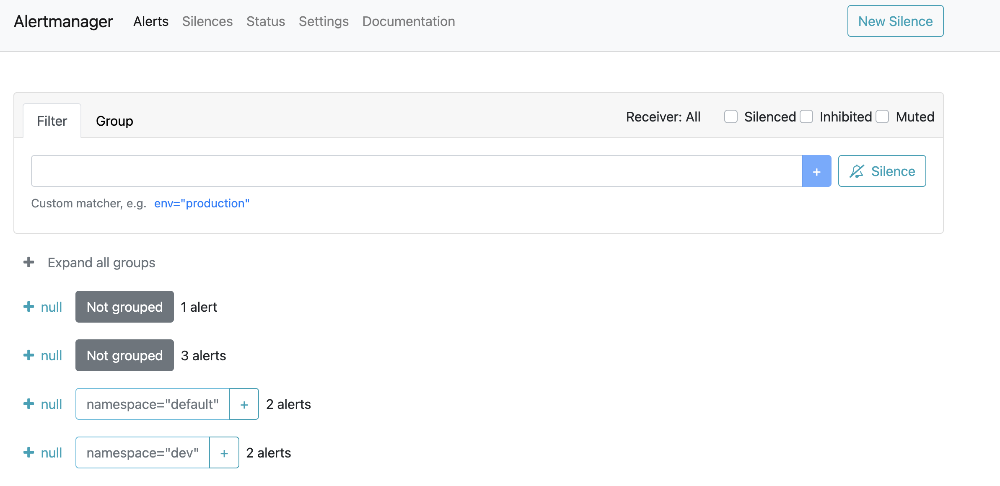
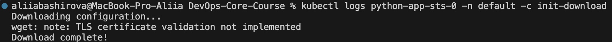
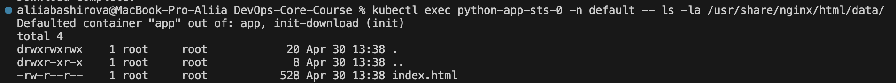
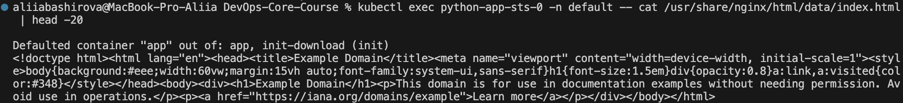

# Lab 16 — Kubernetes Monitoring & Init Containers

## Task 1 — Kube-Prometheus Stack Components

### Component Roles

| Component | Role |
|-----------|------|
| **Prometheus Operator** | Manages Prometheus instances, ServiceMonitors, and Alertmanagers as Kubernetes CRDs |
| **Prometheus** | Collects metrics from configured targets, stores time-series data, evaluates alert rules |
| **Alertmanager** | Handles alerts: deduplication, grouping, silencing, and routing to receivers (email, Slack, etc.) |
| **Grafana** | Provides visualization and dashboards for metrics from Prometheus and other data sources |
| **kube-state-metrics** | Exposes Kubernetes object state metrics (deployments, pods, nodes, etc.) |
| **node-exporter** | Exports node/hardware metrics (CPU, memory, disk, network) from each cluster node |

### Installation Verification


## Task 2 — Grafana Dashboard Answers
### 1. Pod Resources (StatefulSet)

CPU usage is near 0 as pods are idle.

### 2. Memory usage


### 3. Node Memory


### 4. Kubelet Metrics


### 5. Network Traffic


### 6. Active Alerts


## Task 3 — Init Containers
### Implementation 1: File Download Pattern
StatefulSet with init container:
```yaml
apiVersion: apps/v1
kind: StatefulSet
metadata:
  name: python-app-sts
spec:
  replicas: 3
  selector:
    matchLabels:
      app: python-app-sts
  template:
    spec:
      initContainers:
      - name: init-download
        image: busybox:1.36
        command:
        - sh
        - -c
        - |
          echo "Downloading configuration..."
          wget -q -O /work-dir/index.html https://www.example.com
          echo "Download complete!"
        volumeMounts:
        - name: workdir
          mountPath: /work-dir
      containers:
      - name: app
        image: nginx:alpine
        volumeMounts:
        - name: workdir
          mountPath: /usr/share/nginx/html/data
      volumes:
      - name: workdir
        emptyDir: {}
```

### Verification







### Implementation 2: Wait-for-Service Pattern

```yaml
initContainers:
- name: wait-for-service
  image: busybox:1.36
  command:
  - sh
  - -c
  - |
    echo "Waiting for service..."
    until nslookup python-app-sts-headless; do
      echo "Service not ready, waiting..."
      sleep 2
    done
    echo "Service is ready!"
```

### Pod Startup Sequence

```bash
$ kubectl get pods -n default -w
NAME               READY   STATUS        RESTARTS   AGE
python-app-sts-0   0/1     Init:0/1      0          18s
python-app-sts-0   0/1     PodInitializing   0      32s
python-app-sts-0   1/1     Running           0      34s
python-app-sts-1   0/1     Init:0/1          0      6s
python-app-sts-1   1/1     Running           0      9s
python-app-sts-2   0/1     Init:0/1          0      4s
python-app-sts-2   1/1     Running           0      7s
```


