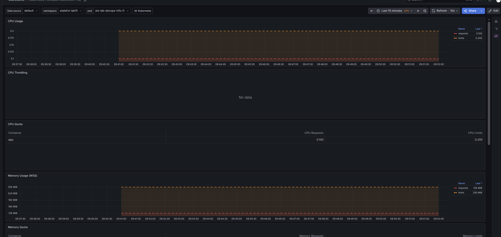
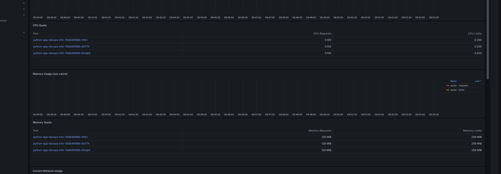
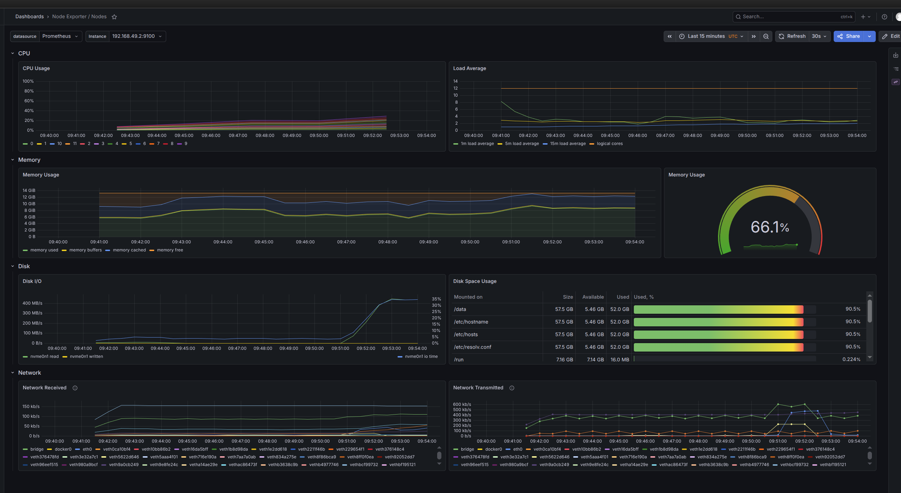
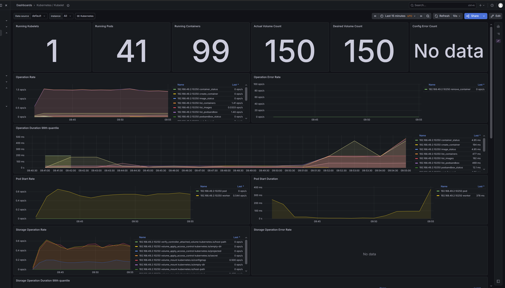
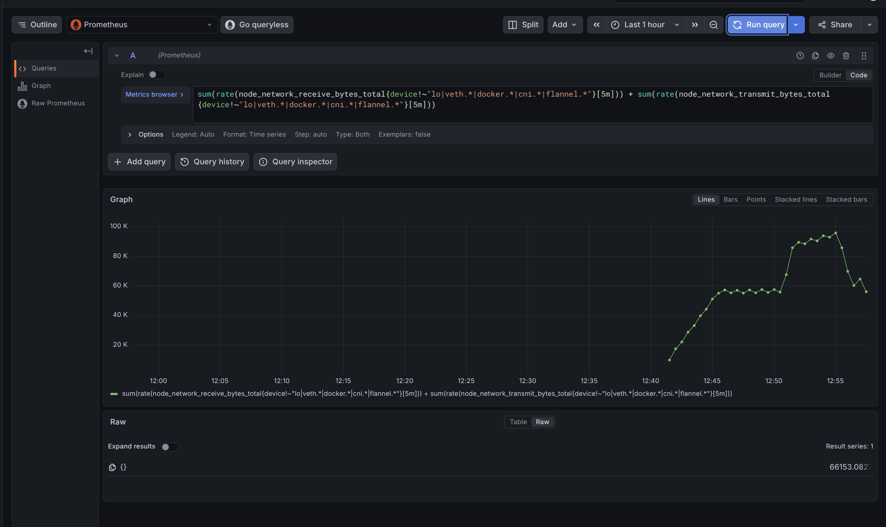
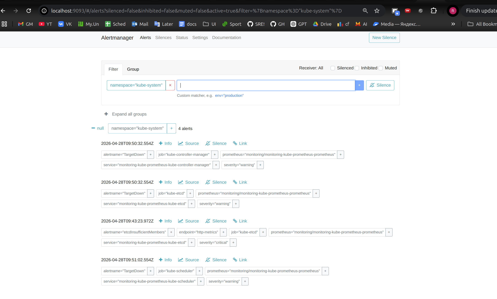

# LAB16 - Kubernetes Monitoring & Init Containers

Cluster: `minikube`  
Monitoring namespace: `monitoring`  
Init-container demo namespace: `lab16-init`

## 1. Monitoring Stack Components

- **Prometheus Operator**: Kubernetes controller that manages Prometheus/Alertmanager CRDs and keeps monitoring resources reconciled.
- **Prometheus**: Collects and stores time-series metrics from cluster targets, then serves PromQL queries.
- **Alertmanager**: Receives alerts from Prometheus, groups/deduplicates them, and exposes active alert state.
- **Grafana**: Visualization layer for dashboards and ad-hoc exploration over Prometheus data.
- **kube-state-metrics**: Exposes Kubernetes object state metrics (deployments, pods, replicas, etc.).
- **node-exporter**: Exposes host-level metrics (CPU, memory, filesystem, network) from cluster nodes.

## 2. Installation Evidence

### Helm repository and release

```bash
helm repo add prometheus-community https://prometheus-community.github.io/helm-charts
helm repo update
helm install monitoring prometheus-community/kube-prometheus-stack \
  --namespace monitoring \
  --create-namespace \
  --set grafana.adminUser=admin \
  --set grafana.adminPassword=prom-operator
```

Verification:

```bash
helm repo list
helm list -n monitoring
helm get values monitoring -n monitoring
kubectl get po,svc -n monitoring
```

Output snapshot:

```text
NAME                 URL
prometheus-community https://prometheus-community.github.io/helm-charts

NAME       NAMESPACE  STATUS    CHART                        APP VERSION
monitoring monitoring deployed  kube-prometheus-stack-84.2.1 v0.90.1

USER-SUPPLIED VALUES:
grafana:
  adminPassword: 
  adminUser: 

NAME                                                         READY   STATUS
pod/alertmanager-monitoring-kube-prometheus-alertmanager-0   2/2     Running
pod/monitoring-grafana-868c6df9fb-z5hwk                      3/3     Running
pod/monitoring-kube-prometheus-operator-f867cbb4d-r86p9      1/1     Running
pod/monitoring-kube-state-metrics-7d69554b96-qmw5w           1/1     Running
pod/monitoring-prometheus-node-exporter-xxtq5                1/1     Running
pod/prometheus-monitoring-kube-prometheus-prometheus-0       2/2     Running
```

## 3. Dashboard / Metrics Answers

Access commands:

```bash
kubectl port-forward svc/monitoring-grafana -n monitoring 3000:80
kubectl port-forward svc/monitoring-kube-prometheus-prometheus -n monitoring 9090:9090
kubectl port-forward svc/monitoring-kube-prometheus-alertmanager -n monitoring 9093:9093
```


### Q1. Pod resources (StatefulSet in `stateful-lab15`)

CPU rate (cores/sec):

- `sts-lab-devops-info-0`: `0.0006950680958640365`
- `sts-lab-devops-info-1`: `0.0006748024581909095`
- `sts-lab-devops-info-2`: `0.0006808088430811384`

Memory usage (MiB):

- `sts-lab-devops-info-0`: `28.2734375`
- `sts-lab-devops-info-1`: `33.26171875`
- `sts-lab-devops-info-2`: `28.23046875`

### Q2. Namespace analysis (`default`) - most/least CPU pod

- Most CPU: `python-app-devops-info-78d646f88b-8d774` = `0.0006211711921228798`
- Least CPU: `python-app-devops-info-78d646f88b-6mqb9` = `0.0005967756257481096`

### Q3. Node metrics

- Memory usage percent: `68.24978218598885%`
- Memory usage: `9320.6328125 MiB`
- CPU cores: `12`

### Q4. Kubelet managed resources

- Running pods: `41`
- Running containers: `94`

### Q5. Network traffic for pods in `default`

- Direct pod-level query (`container_network_*` for `namespace="default"`) returned no data on this cluster.
- Fallback node traffic (rx+tx, filtered interfaces): `56188.9858851329 bytes/sec`.

### Q6. Active alerts (Alertmanager)

- Active alerts total: `5`
- Alert names:
  - `TargetDown` (3)
  - `etcdInsufficientMembers` (1)
  - `Watchdog` (1)

### Screenshots








## 4. Init Containers

Manifest file:

- `k8s/lab16/init-containers.yaml`

It contains:

1. `init-download-demo` pod:
- init container downloads `index.html` with `wget` into shared `emptyDir`
- main container reads the downloaded file from mounted `/data`

2. `wait-for-service-demo` pod:
- init container waits for service DNS and HTTP readiness
- main container starts only after dependency is reachable

Also included:

- `source-web` deployment + service (in-cluster dependency for deterministic download/wait checks)
- `source-content` configmap (file served by `source-web`)

Apply and verify:

```bash
kubectl apply -f k8s/lab16/init-containers.yaml
kubectl get po,svc -n lab16-init
kubectl logs -n lab16-init init-download-demo -c init-download
kubectl exec -n lab16-init init-download-demo -- cat /data/index.html
kubectl logs -n lab16-init wait-for-service-demo -c wait-for-service
kubectl get pod init-download-demo -n lab16-init -o jsonpath='init-download={.status.initContainerStatuses[0].state.terminated.reason}'
kubectl get pod wait-for-service-demo -n lab16-init -o jsonpath='wait-for-service={.status.initContainerStatuses[0].state.terminated.reason}'
```

Output snapshot:

```text
download complete
lab16 init container download success
service is ready
init-download=Completed
wait-for-service=Completed
```

