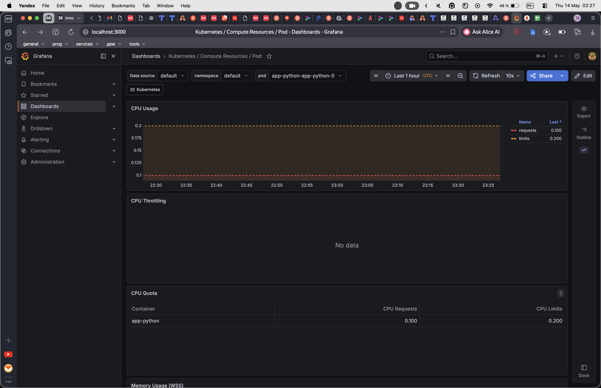
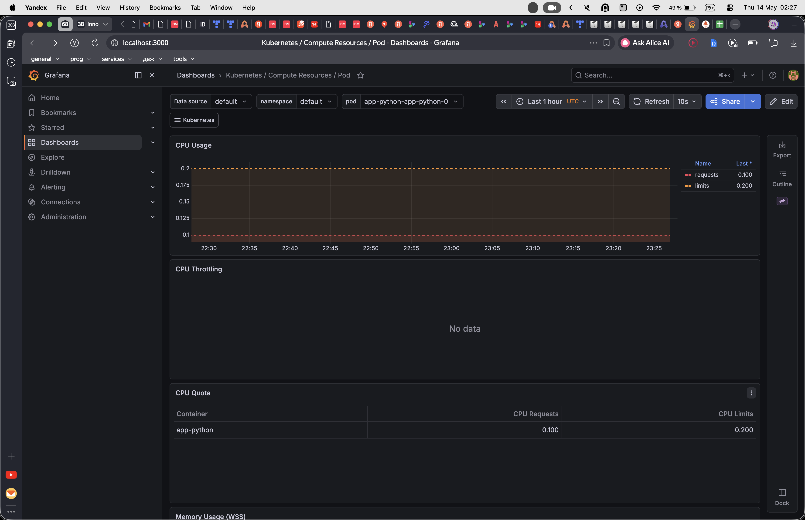
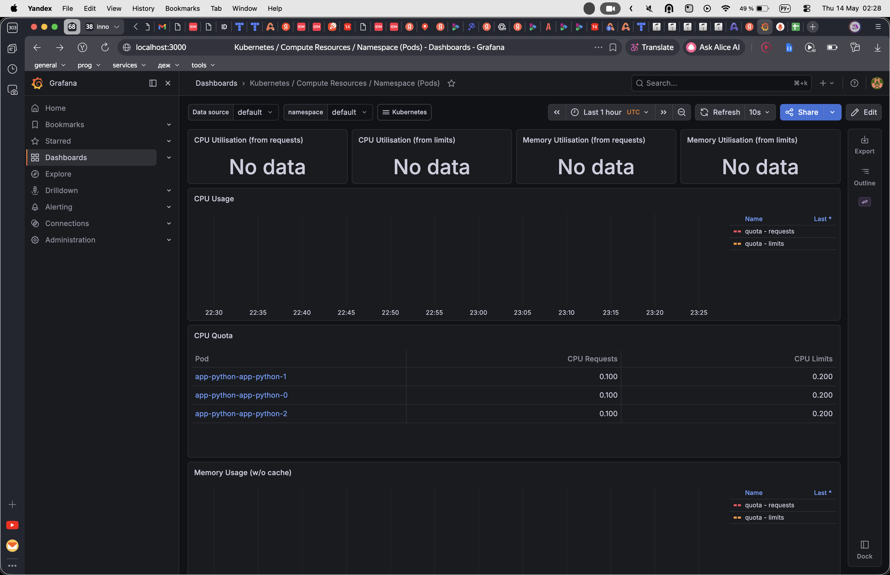
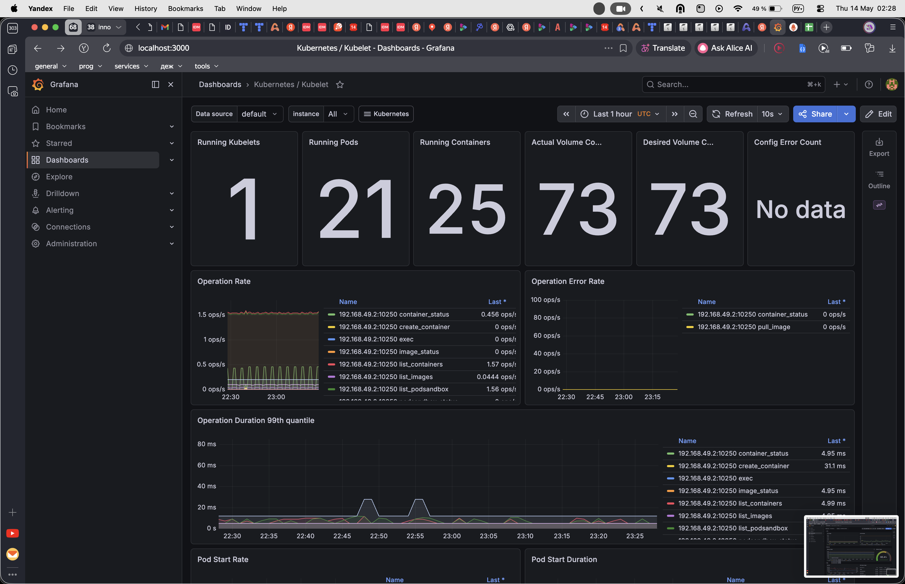
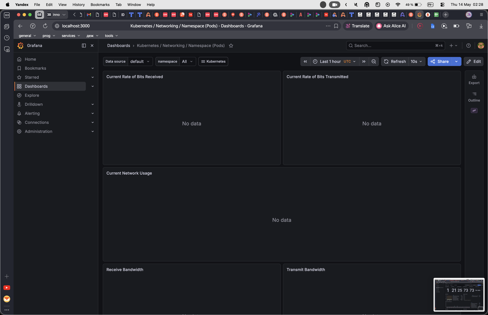
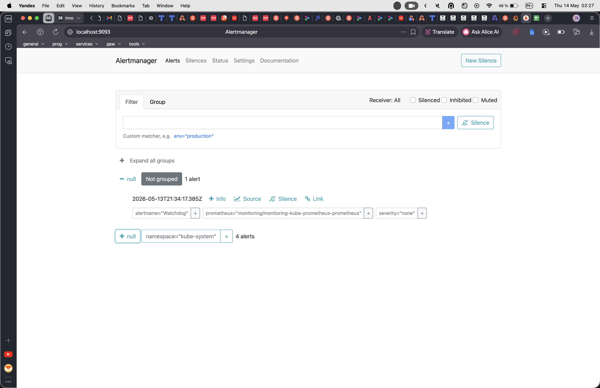

# Kubernetes Monitoring & Init Containers

Lab 16 deliverable — Kube-Prometheus stack installed on minikube, plus init
container patterns demonstrated in the `default` namespace.

---

## 1. Stack Components

| Component | Role |
|-----------|------|
| **Prometheus Operator** | Kubernetes controller that watches CRDs (`Prometheus`, `Alertmanager`, `ServiceMonitor`, `PodMonitor`, `PrometheusRule`) and reconciles them into running Prometheus/Alertmanager StatefulSets and scrape configs. Turns "monitoring as config" into actual workloads. |
| **Prometheus** | Pull-based time-series database. Scrapes `/metrics` endpoints from targets discovered via Kubernetes API + the Operator's ServiceMonitors, stores samples locally, and evaluates recording / alerting rules. |
| **Alertmanager** | Receives firing alerts from Prometheus, deduplicates, groups, silences, and routes them to receivers (email / Slack / PagerDuty / webhook). |
| **Grafana** | Visualization layer. Reads from Prometheus as a datasource and renders dashboards; the chart pre-installs the standard Kubernetes mixin dashboards. |
| **kube-state-metrics** | Listens to the Kubernetes API and exposes the *state* of objects as metrics — Deployment replicas, Pod phase, container restarts, PVC capacity, etc. It does not measure resource consumption; that's node-exporter / cAdvisor. |
| **node-exporter** | DaemonSet that exposes host-level metrics — CPU, memory, disk, filesystem, network — from `/proc` and `/sys` on every node. |

---

## 2. Installation

```bash
helm repo add prometheus-community https://prometheus-community.github.io/helm-charts
helm repo update

helm install monitoring prometheus-community/kube-prometheus-stack \
  --namespace monitoring \
  --create-namespace
```

### Evidence — `kubectl get po,svc -n monitoring`

```
NAME                                                         READY   STATUS    RESTARTS   AGE
pod/alertmanager-monitoring-kube-prometheus-alertmanager-0   2/2     Running   0          6m2s
pod/monitoring-grafana-86f47598f-s9dcx                       3/3     Running   0          7m6s
pod/monitoring-kube-prometheus-operator-56dfc8596-57fxw      1/1     Running   0          7m6s
pod/monitoring-kube-state-metrics-5957bd45bc-s6mlc           1/1     Running   0          7m6s
pod/monitoring-prometheus-node-exporter-l2dk2                1/1     Running   0          7m6s
pod/prometheus-monitoring-kube-prometheus-prometheus-0       2/2     Running   0          6m2s

NAME                                              TYPE        CLUSTER-IP       PORT(S)                      AGE
service/alertmanager-operated                     ClusterIP   None             9093/TCP,9094/TCP,9094/UDP   6m2s
service/monitoring-grafana                        ClusterIP   10.96.166.199    80/TCP                       7m6s
service/monitoring-kube-prometheus-alertmanager   ClusterIP   10.108.191.254   9093/TCP,8080/TCP            7m6s
service/monitoring-kube-prometheus-operator       ClusterIP   10.99.158.65     443/TCP                      7m6s
service/monitoring-kube-prometheus-prometheus     ClusterIP   10.100.117.127   9090/TCP,8080/TCP            7m6s
service/monitoring-kube-state-metrics             ClusterIP   10.98.90.156     8080/TCP                     7m6s
service/monitoring-prometheus-node-exporter       ClusterIP   10.101.178.191   9100/TCP                     7m6s
service/prometheus-operated                       ClusterIP   None             9090/TCP                     6m2s
```

### Access

```bash
# Grafana — default creds admin / prom-operator
kubectl port-forward svc/monitoring-grafana -n monitoring 3000:80

# Prometheus UI
kubectl port-forward svc/monitoring-kube-prometheus-prometheus -n monitoring 9090:9090

# Alertmanager UI
kubectl port-forward svc/monitoring-kube-prometheus-alertmanager -n monitoring 9093:9093
```

---

## 3. Grafana Dashboard Exploration

The 3-replica `app-python` StatefulSet was deployed to the `default`
namespace to give the dashboards a workload to observe:

```bash
helm install app-python ./k8s/app-python \
  -f ./k8s/app-python/values-statefulset.yaml -n default
```

Dashboards used:

- *Kubernetes / Compute Resources / Pod*
- *Kubernetes / Compute Resources / Namespace (Pods)*
- *Node Exporter / Nodes*
- *Kubernetes / Kubelet*
- *Kubernetes / Networking / Namespace (Pods)*

### Q1 — StatefulSet pod CPU / memory

Dashboard: *Kubernetes / Compute Resources / Pod*, `namespace=default`,
`pod=app-python-app-python-0`.

| Pod | CPU usage | Memory working set | CPU requests / limits |
|-----|-----------|--------------------|------------------------|
| `app-python-app-python-0` | ~1.25 mCPU | ~35.6 MiB | 100m / 200m |
| `app-python-app-python-1` | ~1.23 mCPU | ~35.6 MiB | 100m / 200m |
| `app-python-app-python-2` | ~1.23 mCPU | ~35.6 MiB | 100m / 200m |

Idle Python app — CPU sits well below requests; memory is stable across
replicas (no per-pod state divergence).



### Q2 — Namespace analysis: most / least CPU in `default`

Dashboard: *Kubernetes / Compute Resources / Namespace (Pods)*,
`namespace=default`.

- **Most CPU:** `app-python-app-python-0` (~1.25 mCPU) — all three
  StatefulSet replicas consume roughly the same.
- **Least CPU:** `init-download-demo` and `init-wait-demo` (~0 mCPU) —
  their init containers have already exited; the main containers are
  just `sleep 3600`.



### Q3 — Node metrics: memory % / MB, CPU cores

Dashboard: *Node Exporter / Nodes*, instance `192.168.49.2:9100`.

| Metric | Value |
|--------|-------|
| CPU logical cores | **4** |
| Memory total | **~5.77 GiB** |
| Memory used | **~3.42 GiB** (≈ **63.8 %**) |
| Disk `/data` | 103 GB total, 43.7 GB used (42.4 %) |



### Q4 — Kubelet: pods / containers managed

Dashboard: *Kubernetes / Kubelet*.

| Metric | Value |
|--------|-------|
| Running Kubelets | 1 |
| **Running Pods** | **21** |
| **Running Containers** | **25** |
| Actual / Desired Volume Count | 73 / 73 |



### Q5 — Network traffic for pods in `default`

Dashboard: *Kubernetes / Networking / Namespace (Pods)*.

Panels show "No data" for this namespace. On minikube the cAdvisor build
shipped with the kubelet does not expose `container_network_*` series
joined with the `pod` label, so the namespace networking dashboard cannot
aggregate per-pod RX/TX. Aggregate node-level traffic is still visible
on the Node Exporter dashboard (interfaces `eth0`, `docker0`, `bridge`,
and the per-pod `veth*` devices).



### Q6 — Active alerts (Alertmanager UI)

Alertmanager (`http://localhost:9093`) shows **5 active alerts**:

| Alert | Severity | Note |
|-------|----------|------|
| `Watchdog` | none | Heartbeat alert that always fires — confirms the alert pipeline is alive. |
| `TargetDown` (`job=kube-controller-manager`) | warning | minikube does not expose the controller-manager metrics endpoint. |
| `TargetDown` (`job=kube-scheduler`) | warning | Same — scheduler metrics endpoint not exposed on minikube. |
| `TargetDown` (`job=kube-etcd`) | warning | etcd metrics endpoint not exposed on minikube. |
| `etcdInsufficientMembers` | critical | Triggered because single-node etcd cannot meet a 3-member quorum rule. |

All five are expected on a single-node minikube and would clear on a
multi-node cluster with control-plane components exposing their metrics
endpoints.



---

## 4. Init Containers

Manifests live in `k8s/init-containers/`.

### 4.1 Download init container

`init-download.yaml` — busybox `wget`s `https://example.com` into an
`emptyDir` volume; the main container then reads that file from the same
shared volume mounted at `/data`.

```bash
kubectl apply -f k8s/init-containers/init-download.yaml
kubectl logs init-download-demo -c init-download
kubectl exec init-download-demo -- head -1 /data/index.html
```

Proof:

```
$ kubectl logs init-download-demo -c init-download
Connecting to example.com (8.6.112.0:443)
wget: note: TLS certificate validation not implemented
saving to '/work-dir/index.html'
index.html           100% |********************************|   528  0:00:00 ETA
'/work-dir/index.html' saved

$ kubectl exec init-download-demo -c main-app -- head -1 /data/index.html
<!doctype html><html lang="en"><head><title>Example Domain</title>...

$ kubectl get pod init-download-demo
NAME                 READY   STATUS    RESTARTS   AGE
init-download-demo   1/1     Running   0          15s
```

### 4.2 Wait-for-service init container

`init-wait-for-service.yaml` — busybox loops `nslookup myservice.default.svc.cluster.local`
every 2 s and only exits once the Service exists. The main container does not
start until the init container exits successfully.

```bash
kubectl apply -f k8s/init-containers/init-wait-for-service.yaml
kubectl logs init-wait-demo -c wait-for-service
```

Proof:

```
$ kubectl logs init-wait-demo -c wait-for-service
Server:		10.96.0.10
Address:	10.96.0.10:53

Name:	myservice.default.svc.cluster.local
Address: 10.110.44.19

$ kubectl get pod init-wait-demo
NAME             STATUS    READY
init-wait-demo   Running   1/1
```

If the `myservice` Service is removed before the pod starts, the init
container stays in the `Init:0/1` phase and loops on `nslookup` until the
Service appears — blocking the main container as designed.
