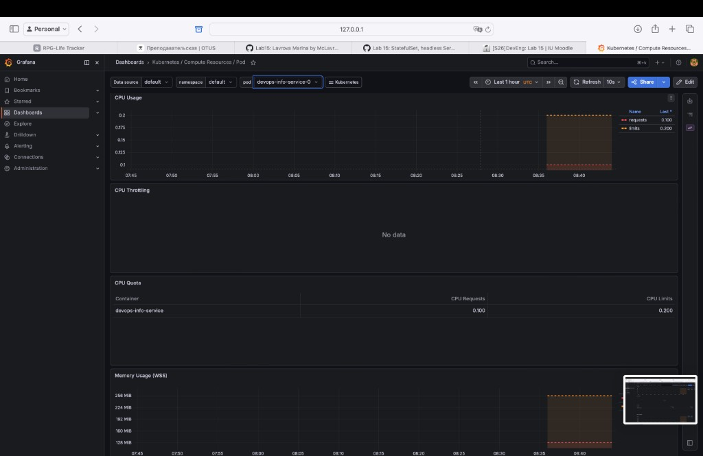
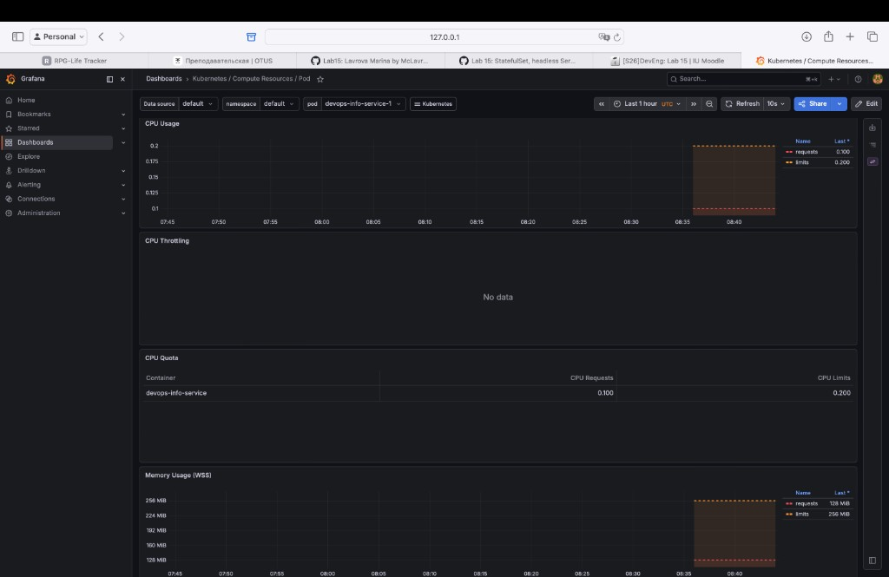
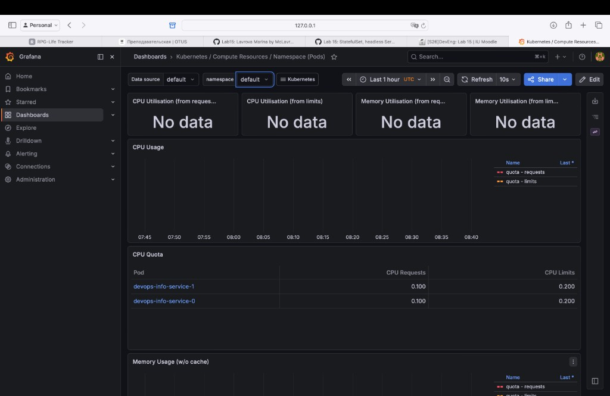
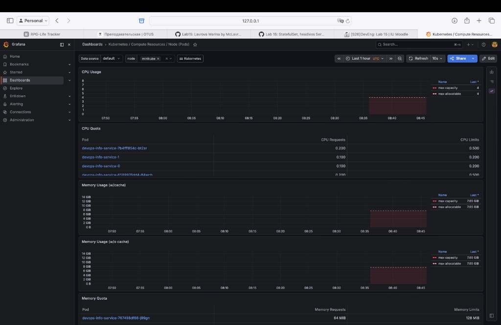
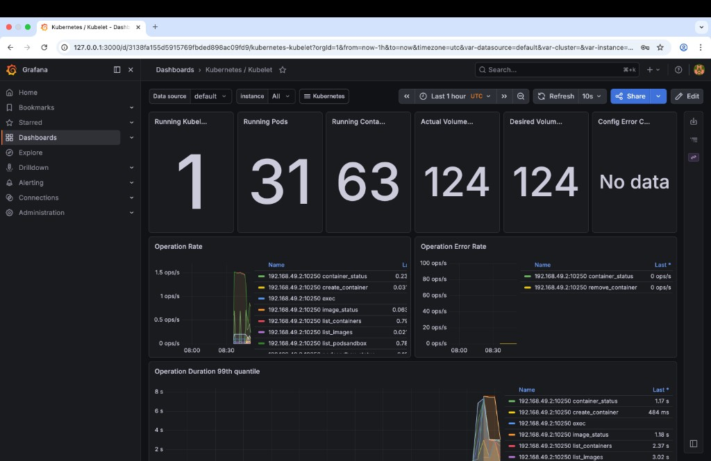
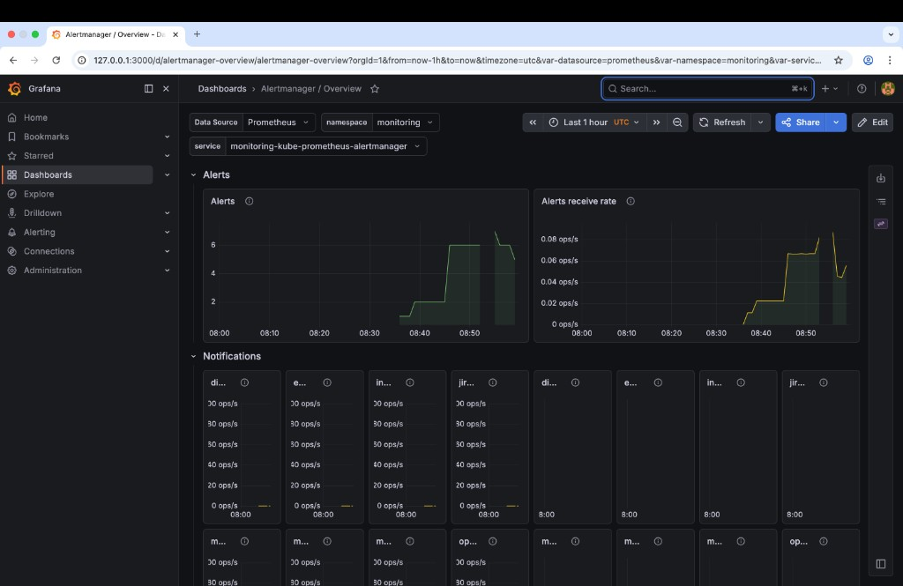

# Lab 16 — Monitoring and init containers

## 1. Stack components (Kube-Prometheus)

| Component | Role |
|-----------|------|
| **Prometheus Operator** | Kubernetes operator that manages Prometheus, Alertmanager, and scrape config from CRDs such as `ServiceMonitor` and `PodMonitor`. |
| **Prometheus** | Time-series database and scraper: pulls metrics from targets, stores samples, evaluates alerting rules. |
| **Alertmanager** | Receives alerts from Prometheus, deduplicates, groups, routes, and notifies (or silences) them. |
| **Grafana** | Dashboards and visualization; reads Prometheus (and other sources) as a data source. |
| **kube-state-metrics** | Exposes Kubernetes object state (Deployments, Pods, Jobs, …) as Prometheus metrics. |
| **node-exporter** | DaemonSet that exposes host/node hardware and OS metrics (CPU, memory, disk, etc.). |

---

## 2. Installation evidence

```
NAME                                                     READY   STATUS    RESTARTS   AGE
alertmanager-monitoring-kube-prometheus-alertmanager-0   2/2     Running   0          3m49s
monitoring-grafana-85dd87d58d-xcrtj                      3/3     Running   0          4m21s
monitoring-kube-prometheus-operator-54f68d65b4-mxn6f     1/1     Running   0          4m21s
monitoring-kube-state-metrics-5957bd45bc-544fd           1/1     Running   0          4m21s
monitoring-prometheus-node-exporter-t44bp                1/1     Running   0          4m21s
prometheus-monitoring-kube-prometheus-prometheus-0       2/2     Running   0          3m48s

NAME                                                         READY   STATUS    RESTARTS   AGE
pod/alertmanager-monitoring-kube-prometheus-alertmanager-0   2/2     Running   0          3m49s
pod/monitoring-grafana-85dd87d58d-xcrtj                      3/3     Running   0          4m21s
pod/monitoring-kube-prometheus-operator-54f68d65b4-mxn6f     1/1     Running   0          4m21s
pod/monitoring-kube-state-metrics-5957bd45bc-544fd           1/1     Running   0          4m21s
pod/monitoring-prometheus-node-exporter-t44bp                1/1     Running   0          4m21s
pod/prometheus-monitoring-kube-prometheus-prometheus-0       2/2     Running   0          3m48s

NAME                                              TYPE        CLUSTER-IP       EXTERNAL-IP   PORT(S)                      AGE
service/alertmanager-operated                     ClusterIP   None             <none>        9093/TCP,9094/TCP,9094/UDP   3m49s
service/monitoring-grafana                        ClusterIP   10.108.230.134   <none>        80/TCP                       4m21s
service/monitoring-kube-prometheus-alertmanager   ClusterIP   10.105.129.179   <none>        9093/TCP,8080/TCP            4m21s
service/monitoring-kube-prometheus-operator       ClusterIP   10.98.36.37      <none>        443/TCP                      4m21s
service/monitoring-kube-prometheus-prometheus     ClusterIP   10.101.101.181   <none>        9090/TCP,8080/TCP            4m21s
service/monitoring-kube-state-metrics             ClusterIP   10.100.211.93    <none>        8080/TCP                     4m21s
service/monitoring-prometheus-node-exporter       ClusterIP   10.96.6.233      <none>        9100/TCP                     4m21s
service/prometheus-operated                       ClusterIP   None             <none>        9090/TCP                     3m48s
```

---

## 3. Dashboard answers (Grafana)

1. **Pod resources (StatefulSet)** — CPU and memory for `devops-info-service` pods.

   **Answer:** **Kubernetes / Compute Resources / Pod**, namespace `default`: both pods have **CPU request 0.100 / limit 0.200**, **memory request 128 MiB / limit 256 MiB**; usage visible after scrapes. **CPU Throttling:** no series (not throttled).

   

   

2. **Namespace `default`** — Which pods use the **most** and **least** CPU?

   **Answer:** **Kubernetes / Compute Resources / Namespace (Pods)** — **CPU Quota:** `devops-info-service-0` and `devops-info-service-1` both **0.100 / 0.200** (same configured CPU). Utilization charts were empty in the captured window.

   

3. **Node metrics** — Memory usage (% and MB), CPU cores.

   **Answer:** **Kubernetes / Compute Resources / Node (Pods)**, node **minikube:** **4** CPU cores (capacity/allocatable), **7.65 GiB** memory capacity/allocatable; usage from ~08:36.

   

4. **Kubelet** — How many pods/containers does the kubelet manage?

   **Answer:** **Kubernetes / Kubelet:** **Running Pods: 31**, **Running Containers: 63**, **Kubelets: 1**, volumes **124 / 124**.

   

5. **Network** — Traffic for pods in namespace `default`.

   **Answer:** Networking dashboards showed **no data** on this cluster; no screenshot. (Common on minimal clusters when expected network metrics are absent.)

6. **Alerts** — How many **active** alerts?

   **Answer:** **Alertmanager / Overview** in Grafana: count rose from **0** to **2**, then up to about **6**, then fell; receive rate peak ~**0.08 ops/s**.

   

---

## 4. Init containers (implementation and proof)

**Implementation:** Chart enables **`wait-for-service`** (busybox: wait until `kubernetes.default.svc.cluster.local` resolves) and **`init-download`** (`wget` `https://example.com` → `index.html` on shared `emptyDir`). Main container mounts the volume read-only at **`/init-shared`**.

**Proof:**

```
NAME                    READY   STATUS    RESTARTS   AGE
devops-info-service-0   1/1     Running   0          64s
devops-info-service-1   1/1     Running   0          75s
```

`kubectl logs … -c wait-for-service`: *(no output — completed successfully.)*

`kubectl logs … -c init-download`:

```
wget: note: TLS certificate validation not implemented
```

`kubectl exec … -- head -n 5 /init-shared/index.html` (main container):

```
<!doctype html><html lang="en"><head><title>Example Domain</title><meta name="viewport" content="width=device-width, initial-scale=1"><style>body{background:#eee;width:60vw;margin:15vh auto;font-family:system-ui,sans-serif}h1{font-size:1.5em}div{opacity:0.8}a:link,a:visited{color:#348}</style></head><body><div><h1>Example Domain</h1><p>This domain is for use in documentation examples without needing permission. Avoid use in operations.</p><p><a href="https://iana.org/domains/example">Learn more</a></p></div></body></html>
```
