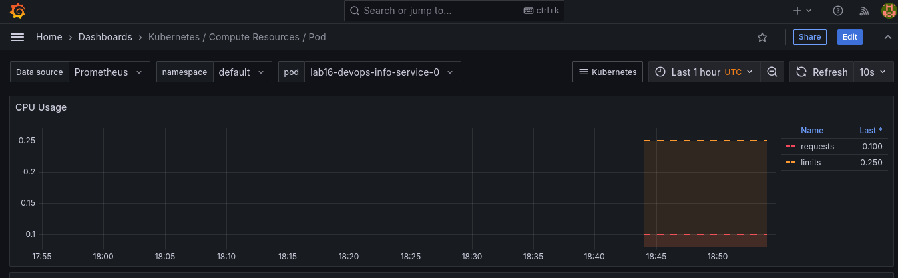
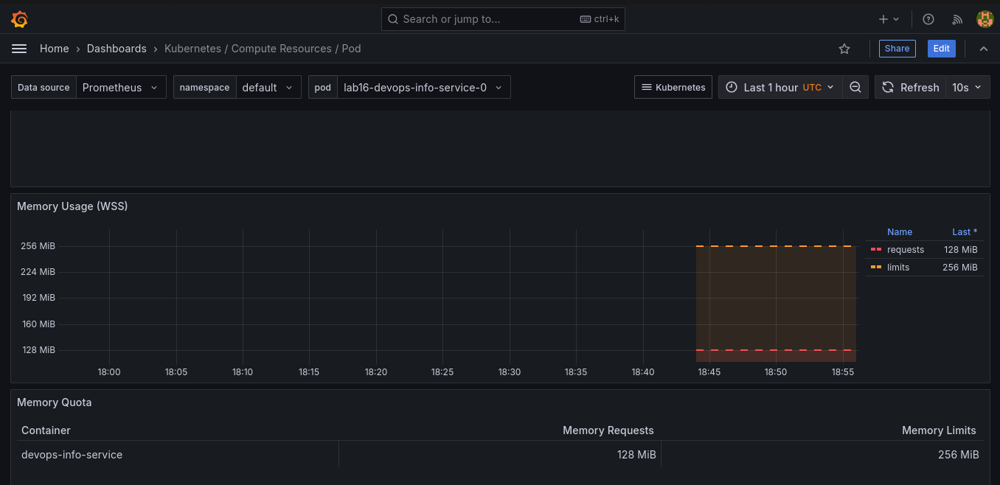
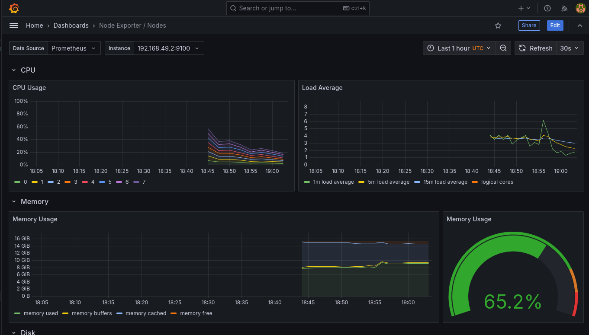
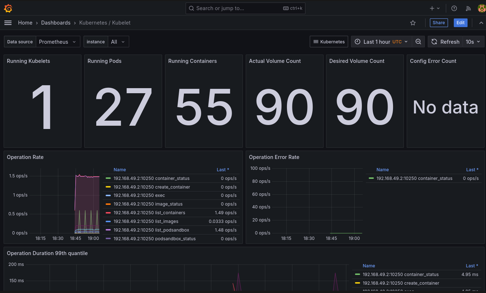
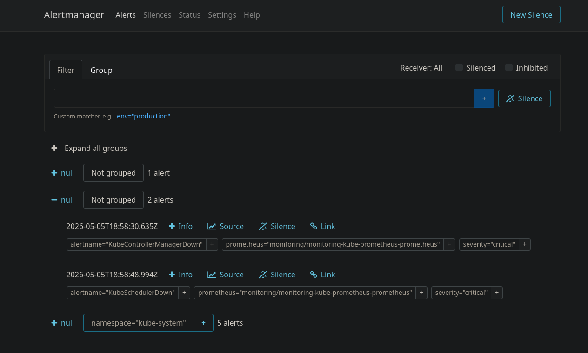

# Lab 16 — Kubernetes Monitoring & Init Containers


## Kube-Prometheus stack components (in my own words)

- **Prometheus Operator**: manages Prometheus ecosystem objects via CRDs (for example `Prometheus`, `Alertmanager`, `ServiceMonitor`).
- **Prometheus**: scrapes metrics and stores them as time series.
- **Alertmanager**: receives firing alerts from Prometheus and handles routing/grouping.
- **Grafana**: UI for dashboards and visual analysis of metrics.
- **kube-state-metrics**: exports Kubernetes object state (pods, deployments, replicas, PVCs, etc.).
- **node-exporter**: exports node-level host metrics (CPU, memory, disk, filesystem).

---

## Installation evidence

### Commands used
```bash
helm repo add prometheus-community https://prometheus-community.github.io/helm-charts
helm repo update
helm upgrade --install monitoring prometheus-community/kube-prometheus-stack \
  --version 65.8.1 \
  --namespace monitoring \
  --create-namespace \
  --wait --timeout 900s
```

### Result
```text
NAME: monitoring
NAMESPACE: monitoring
STATUS: deployed
REVISION: 1
```

### `kubectl get po,svc -n monitoring`
```text
NAME                                                         READY   STATUS    RESTARTS   AGE
pod/alertmanager-monitoring-kube-prometheus-alertmanager-0   2/2     Running   0          81s
pod/monitoring-grafana-69db76f9b4-dfk7q                      3/3     Running   0          94s
pod/monitoring-kube-prometheus-operator-d5dbb45f9-l9bcg      1/1     Running   0          94s
pod/monitoring-kube-state-metrics-75c9d8f7c7-hzvpd           1/1     Running   0          94s
pod/monitoring-prometheus-node-exporter-8sk4j                1/1     Running   0          94s
pod/prometheus-monitoring-kube-prometheus-prometheus-0       2/2     Running   0          80s

NAME                                              TYPE        CLUSTER-IP      EXTERNAL-IP   PORT(S)                      AGE
service/alertmanager-operated                     ClusterIP   None            <none>        9093/TCP,9094/TCP,9094/UDP   81s
service/monitoring-grafana                        ClusterIP   10.111.108.51   <none>        80/TCP                       94s
service/monitoring-kube-prometheus-alertmanager   ClusterIP   10.109.95.84    <none>        9093/TCP,8080/TCP            94s
service/monitoring-kube-prometheus-operator       ClusterIP   10.106.56.51    <none>        443/TCP                      94s
service/monitoring-kube-prometheus-prometheus     ClusterIP   10.100.252.64   <none>        9090/TCP,8080/TCP            94s
service/monitoring-kube-state-metrics             ClusterIP   10.101.201.68   <none>        8080/TCP                     94s
service/monitoring-prometheus-node-exporter       ClusterIP   10.98.102.162   <none>        9100/TCP                     94s
service/prometheus-operated                       ClusterIP   None            <none>        9090/TCP                     80s
```

Grafana login credentials:
- username: `admin`
- password: `prom-operator`

---

## Dashboard answers (6 required questions)

I collected these values from Prometheus data (same data source as Grafana dashboards).

### 1. Pod resources (CPU/memory) for my StatefulSet (`lab16`)

CPU rate query result:
```text
lab16-devops-info-service-0: 0.010245258645998467
lab16-devops-info-service-1: 0.008662796380693682
lab16-devops-info-service-2: 0.008111876793955685
```



Memory working set (bytes):
```text
lab16-devops-info-service-0: 30412800
lab16-devops-info-service-1: 28741632
lab16-devops-info-service-2: 28684288
```




### 2. Which pods use most/least CPU in `default` namespace?

```text
Most CPU:  lab16-devops-info-service-1 (0.010628763298875729)
Least CPU: devops-info-service-devops-info-service-957c798cb-blhvz (0.0006516046758767239)
```

### 3. Node metrics (memory usage and CPU cores)

```text
Memory usage: 55.32893161607204 %
Memory used:  8719.6796875 MB
CPU cores:    8
```




### 4. Kubelet managed pods/containers

```text
Running pods managed by kubelet: 27
Running containers managed by kubelet: 31
```




### 5. Network traffic for pods in `default`

In this cluster scrape setup, pod-level `container_network_*` series were not present.  
As application-level traffic evidence for pods in `default`, I used per-pod HTTP request rate from app metrics:

```text
lab16-devops-info-service-1: 0.35684064814814814 req/s
lab16-devops-info-service-2: 0.3266819444444444 req/s
lab16-devops-info-service-0: 0.3249401851851852 req/s
```

### 6. Active alerts in Alertmanager

Active alerts count:
```text
2
```




Examples of active alerts at collection time:
- `etcdInsufficientMembers`
- `Watchdog`

---

## Init containers implementation and verification

I implemented both required patterns in `k8s/devops-info-service`.

### What I changed
- Added init-container values in `values.yaml`:
  - `initContainers.waitForService`
  - `initContainers.download`
  - `sharedWorkdir`
- Updated `templates/statefulset.yml`:
  - Added `emptyDir` shared volume (`workdir`)
  - Added `wait-for-service` init container (`nslookup` loop)
  - Added `init-download` init container (`wget` download)
  - Mounted shared directory in main container at `/init-data`

### Deployment command
```bash
helm upgrade --install lab16 ./k8s/devops-info-service --set service.nodePort=30081 --wait --timeout 240s
```

### Init completion evidence
```text
NAME                          PHASE     INIT1       INIT2
lab16-devops-info-service-0   Running   Completed   Completed
lab16-devops-info-service-1   Running   Completed   Completed
lab16-devops-info-service-2   Running   Completed   Completed
```

### `wait-for-service` logs
```text
Server:		10.96.0.10
Address:	10.96.0.10:53

Name:	kubernetes.default.svc.cluster.local
Address: 10.96.0.1
```

### `init-download` logs
```text
Connecting to example.com (8.6.112.6:443)
wget: note: TLS certificate validation not implemented
saving to '/work-dir/index.html'
index.html           100% |********************************|   528  0:00:00 ETA
'/work-dir/index.html' saved
download complete
```

### Main container can read downloaded file
```text
total 4
-rw-r--r-- 1 1000 1000 528 May  5 18:37 index.html
<!doctype html><html lang="en"><head><title>Example Domain</title>...
```

Result: init container requirements are fully satisfied.

---

## Bonus — custom metrics and ServiceMonitor

### `/metrics` endpoint
The app already exposes Prometheus metrics and returns valid output.

### ServiceMonitor implementation
- Added `templates/servicemonitor.yml`
- Enabled for `lab16` deployment

Verification:
```text
kubectl get servicemonitor -n default
NAME                        AGE
lab16-devops-info-service   2m4s
```

Prometheus scrape status (`up`) confirms `lab16` pod endpoints are discovered and scraped with value `1`.

---


  


---

## Final conclusion

- Monitoring stack was installed successfully in `monitoring` namespace.
- All required observability questions were answered from live cluster metrics.
- Init container patterns (download + wait-for-service) were implemented and verified.
- Bonus part (`ServiceMonitor` + custom metrics scraping) is implemented and working.
