# Lab 16 - Kubernetes Monitoring & Init Containers

## 1. Stack Components

### Components and Their Roles

- **Prometheus Operator**
  - Kubernetes controller that manages monitoring CRDs (`Prometheus`, `Alertmanager`, `ServiceMonitor`, etc.).
  - Reconciles desired monitoring configuration into running StatefulSets/Services/Secrets.

- **Prometheus**
  - Time-series database and scraping engine.
  - Pulls metrics from Kubernetes components and workloads, stores samples, evaluates alert rules.

- **Alertmanager**
  - Receives alerts from Prometheus.
  - Deduplicates, groups, silences, and routes alerts to notification channels.

- **Grafana**
  - Visualization and dashboard UI for Prometheus data.
  - Used for cluster observability analysis and troubleshooting.

- **kube-state-metrics**
  - Exposes Kubernetes object state as metrics (pods, deployments, StatefulSets, jobs, etc.).
  - Key source for workload-level and control-plane-state insights.

- **node-exporter**
  - Exposes host-level metrics from each node (CPU, memory, filesystem, network).
  - Enables node capacity and health analysis.

---

## 2. Installation Evidence

### Installation Commands Used

```bash
kind create cluster --name devops-lab16
kubectl config use-context kind-devops-lab16

kubectl create namespace monitoring --dry-run=client -o yaml | kubectl apply -f -

helm upgrade --install monitoring prometheus-community/kube-prometheus-stack \
  --namespace monitoring
```

### kubectl get po,svc -n monitoring

```text
$ kubectl get po,svc -n monitoring
NAME                                                         READY   STATUS    RESTARTS   AGE
pod/alertmanager-monitoring-kube-prometheus-alertmanager-0   2/2     Running   0          116s
pod/monitoring-grafana-b88cdd65d-8zvmp                       3/3     Running   0          2m15s
pod/monitoring-kube-prometheus-operator-79d54ddcd8-nzmqm     1/1     Running   0          2m15s
pod/monitoring-kube-state-metrics-5957bd45bc-jsrgz           1/1     Running   0          2m15s
pod/monitoring-prometheus-node-exporter-56955                1/1     Running   0          2m15s
pod/prometheus-monitoring-kube-prometheus-prometheus-0       2/2     Running   0          116s

NAME                                              TYPE        CLUSTER-IP      EXTERNAL-IP   PORT(S)                      AGE
service/alertmanager-operated                     ClusterIP   None            <none>        9093/TCP,9094/TCP,9094/UDP   116s
service/monitoring-grafana                        ClusterIP   10.96.91.20     <none>        80/TCP                       2m15s
service/monitoring-kube-prometheus-alertmanager   ClusterIP   10.96.160.213   <none>        9093/TCP,8080/TCP            2m15s
service/monitoring-kube-prometheus-operator       ClusterIP   10.96.163.104   <none>        443/TCP                      2m15s
service/monitoring-kube-prometheus-prometheus     ClusterIP   10.96.233.94    <none>        9090/TCP,8080/TCP            2m15s
service/monitoring-kube-state-metrics             ClusterIP   10.96.117.100   <none>        8080/TCP                     2m15s
service/monitoring-prometheus-node-exporter       ClusterIP   10.96.154.239   <none>        9100/TCP                     2m15s
service/prometheus-operated                       ClusterIP   None            <none>        9090/TCP                     116s
```

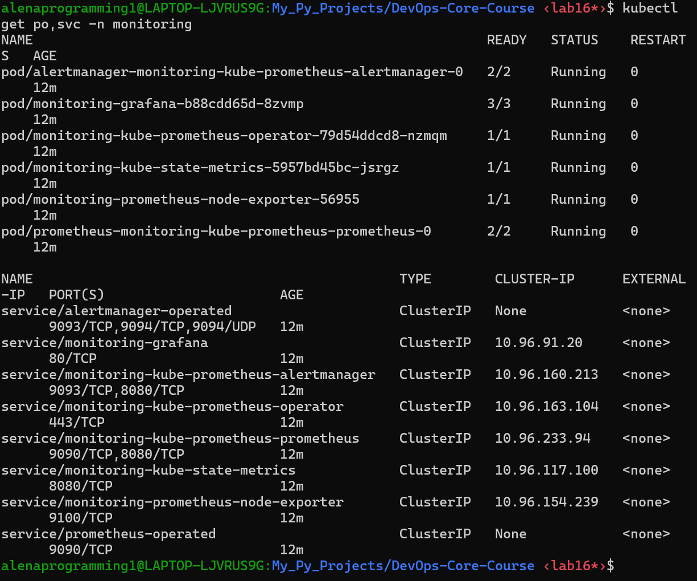

---

## 3. Dashboard Answers

### Access Commands

```bash
kubectl port-forward svc/monitoring-grafana -n monitoring 3000:80
kubectl port-forward svc/monitoring-kube-prometheus-alertmanager -n monitoring 9093:9093
```

Grafana URL:
- `http://localhost:3000`

Grafana credentials:
- Username: `admin`
- Password command:

```bash
kubectl --namespace monitoring get secrets monitoring-grafana -o jsonpath="{.data.admin-password}" | base64 -d ; echo
```

Alertmanager URL:
- `http://localhost:9093`

### Answers to All 6 Questions

1. **Pod Resources (StatefulSet CPU/Memory)**
   - Observed pod(s): `init-download-demo`, `wait-for-service-demo` (Lab 16 demo workload in `default` namespace).
   - CPU usage (last value from pod dashboard):
     - `init-download-demo`: `0.0000647` cores
     - `wait-for-service-demo`: `0.0000542` cores
   - Memory usage (from namespace pod dashboard):
     - `init-download-demo`: `560 KiB`
     - `wait-for-service-demo`: `372 KiB`
     - `dependency-svc-backend-d6744c4b4-mqv9c`: `1.50 MiB`

2. **Namespace CPU (default namespace)**
   - Highest CPU pod: `dependency-svc-backend-d6744c4b4-mqv9c` (`0.0000991` cores)
   - Lowest CPU pod: `init-download-demo` (`0` cores at capture moment)

3. **Node Metrics**
   - Memory usage (%): `67.0%`
   - Memory usage (GiB): approximately `5.0 GiB used` and `~7.4 GiB cached` (from Node Exporter memory panel)
   - CPU cores: `20 logical cores`

4. **Kubelet**
   - Pods managed by kubelet: `18`
   - Containers managed by kubelet: `27`

5. **Network (default namespace pods)**
   - Current RX/TX at capture moment: `0 b/s` for pod `dependency-svc-backend-d6744c4b4-mqv9c` (namespace `default`).
   - Recent traffic peaks (same dashboard time window, pod networking dashboard):
     - RX peak ~`150 b/s`
     - TX peak ~`180 b/s`
   - Most active pod by traffic in captured view: `dependency-svc-backend-d6744c4b4-mqv9c`.

6. **Alerts / Alertmanager**
   - Active alerts count: `6` (from Alertmanager overview dashboard at capture time)
   - Names/severities: visible in Alertmanager as active default stack alerts; exact labels depend on cluster state and may vary over time.

### Screenshot Evidence for Dashboard Answers

- Kubernetes / Compute Resources / Namespace (Pods)
- Kubernetes / Compute Resources / Pod
- Node Exporter / Nodes
- Kubernetes / Kubelet

Evidence screenshots:

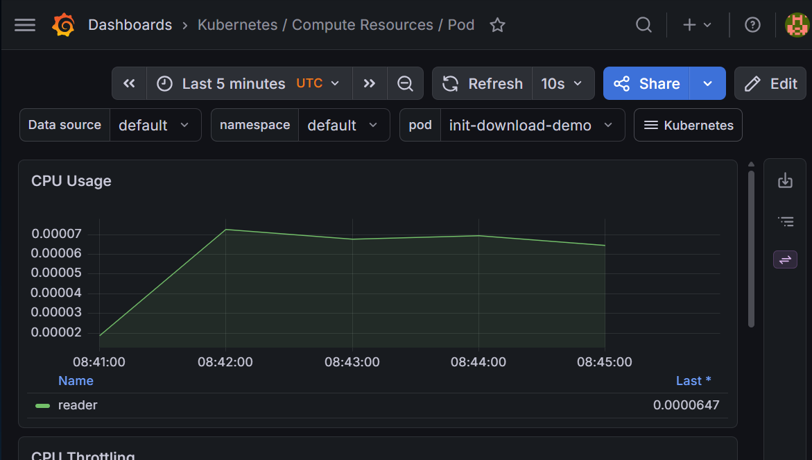
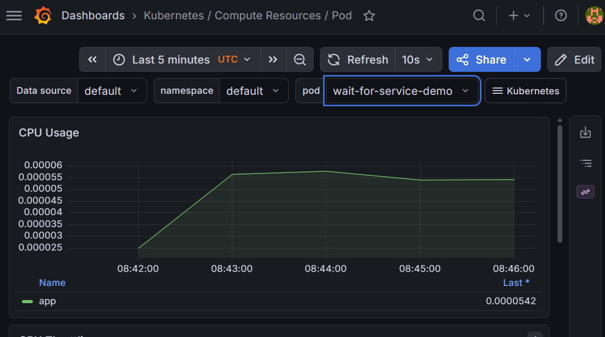
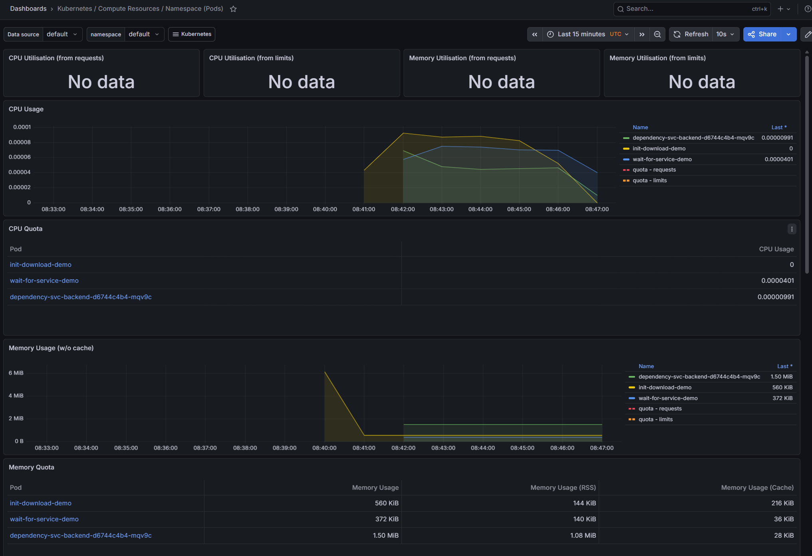
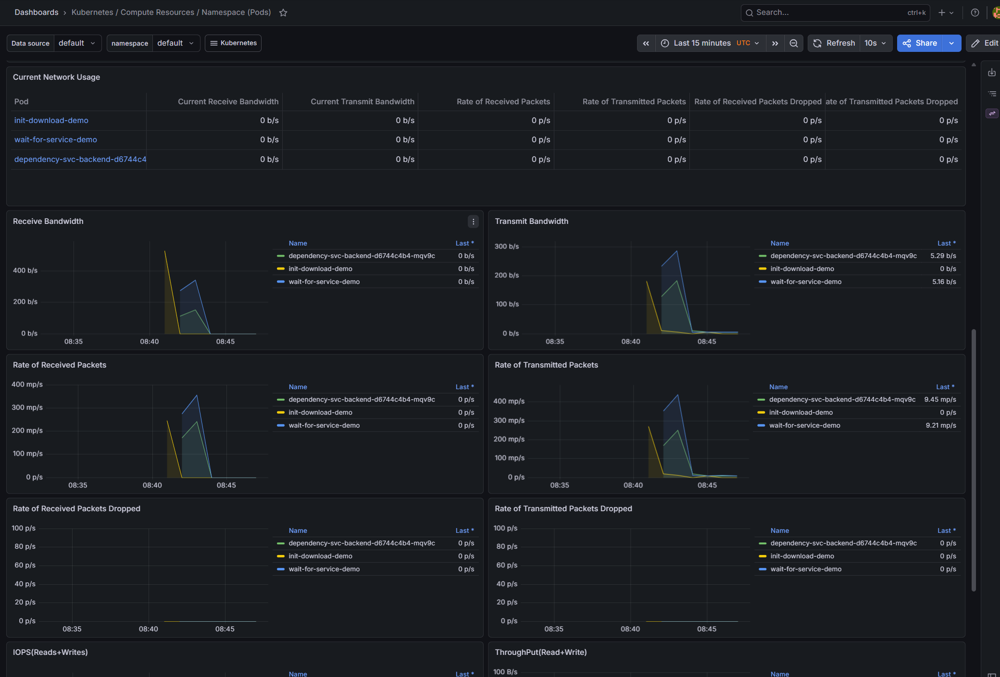
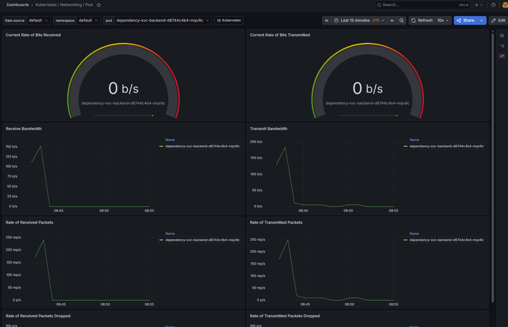
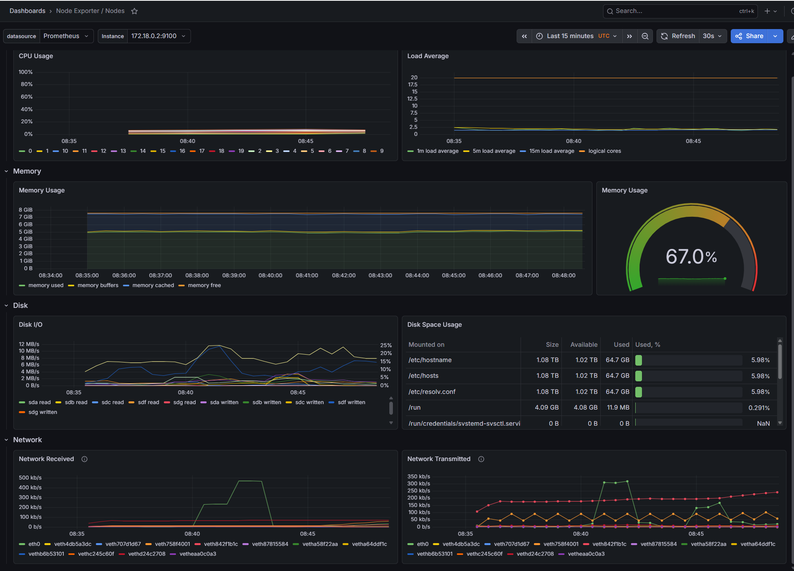
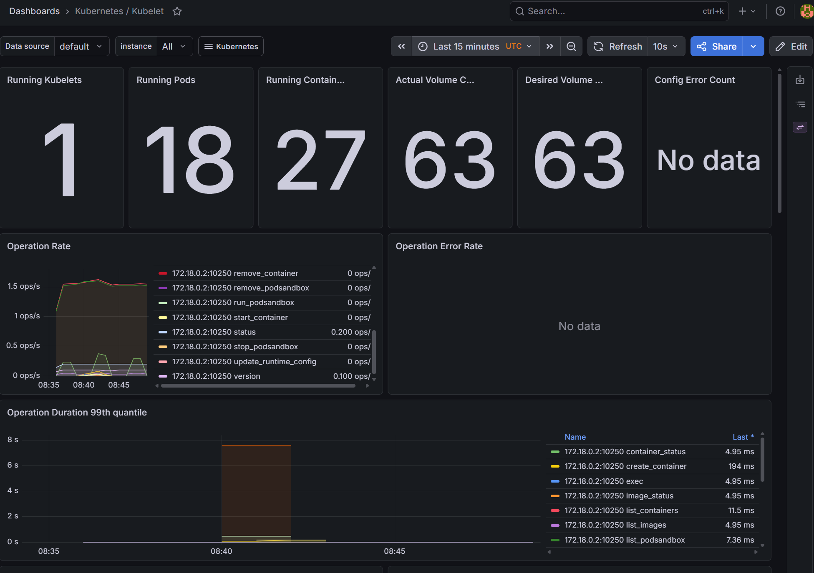
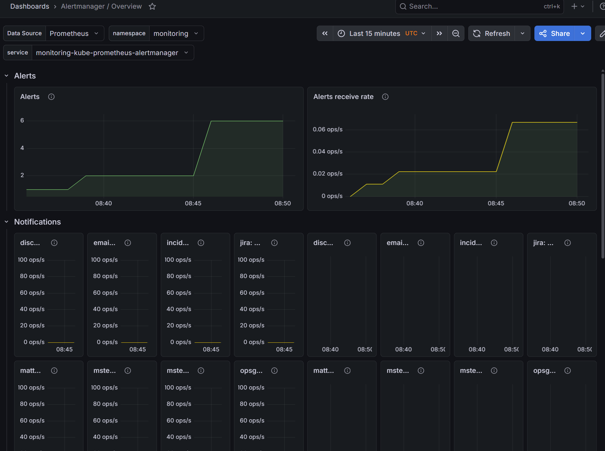

---

## 4. Init Containers

### 4.1 Basic Init Container: Download File Before Main Container

Manifest: `k8s/lab16/init-download-pod.yaml`

Run and verify commands used:

```bash
kubectl get pod init-download-demo -w
kubectl logs init-download-demo -c init-download
kubectl logs init-download-demo -c reader
kubectl exec init-download-demo -- head -n 20 /data/index.html
```

Verification evidence:

```text
$ kubectl logs init-download-demo -c init-download
Connecting to example.com (8.6.112.0:443)
wget: note: TLS certificate validation not implemented
saving to '/work-dir/index.html'
index.html           100% |********************************|   528  0:00:00 ETA
'/work-dir/index.html' saved
...
-rw-r--r--    1 root     root         528 Apr 28 08:39 index.html

$ kubectl logs init-download-demo -c reader
Main container started. Showing downloaded file:
<!doctype html><html lang="en"><head><title>Example Domain</title>...

$ kubectl exec init-download-demo -- head -n 20 /data/index.html
<!doctype html><html lang="en"><head><title>Example Domain</title>...
```

Result:
- Init container successfully downloaded the file.
- Main container accessed the shared file from `/data/index.html`.

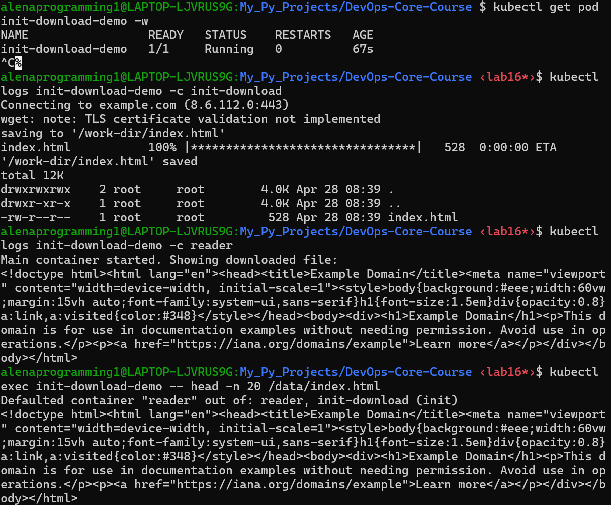

### 4.2 Wait-for-Service Pattern

Manifest: `k8s/lab16/wait-for-service.yaml`

Run and verify commands used:

```bash
kubectl apply -f k8s/lab16/wait-for-service.yaml
kubectl get pods -w
kubectl logs wait-for-service-demo -c wait-for-service
kubectl logs wait-for-service-demo -c app
kubectl exec wait-for-service-demo -- wget -qO- http://dependency-svc:5678
```

Verification evidence:

```text
$ kubectl get pods -w
NAME                                     READY   STATUS              RESTARTS   AGE
dependency-svc-backend-d6744c4b4-mqv9c   0/1     ContainerCreating   0          4s
wait-for-service-demo                    0/1     Init:0/1            0          4s
dependency-svc-backend-d6744c4b4-mqv9c   1/1     Running             0          7s
wait-for-service-demo                    0/1     PodInitializing     0          8s
wait-for-service-demo                    1/1     Running             0          9s

$ kubectl logs wait-for-service-demo -c wait-for-service
Waiting for dependency-svc HTTP endpoint...
Waiting for dependency-svc HTTP endpoint...
Dependency is reachable.

$ kubectl logs wait-for-service-demo -c app
Main container started after dependency became ready
dependency-ready

$ kubectl exec wait-for-service-demo -- wget -qO- http://dependency-svc:5678
dependency-ready
```

Result:
- Pod stayed in init phase until service endpoint became reachable.
- Main container started only after dependency readiness was confirmed.

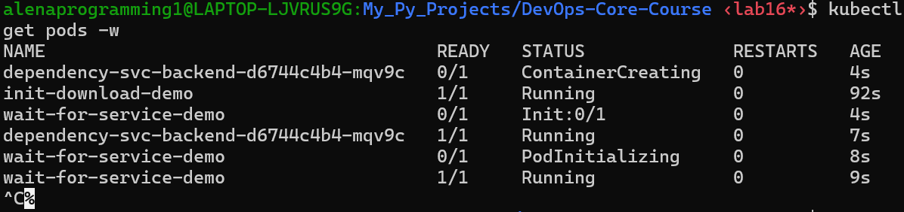
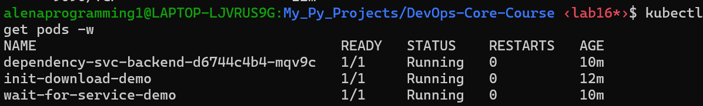
