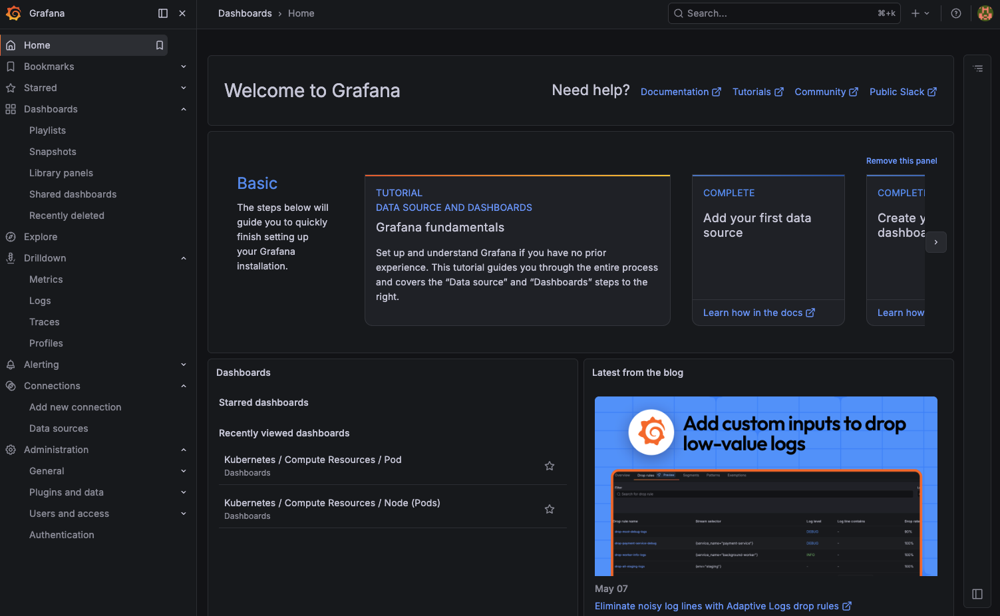
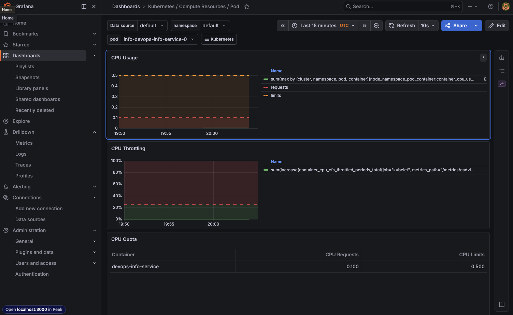
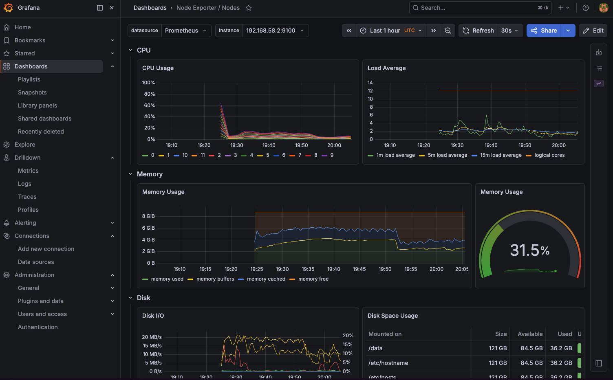
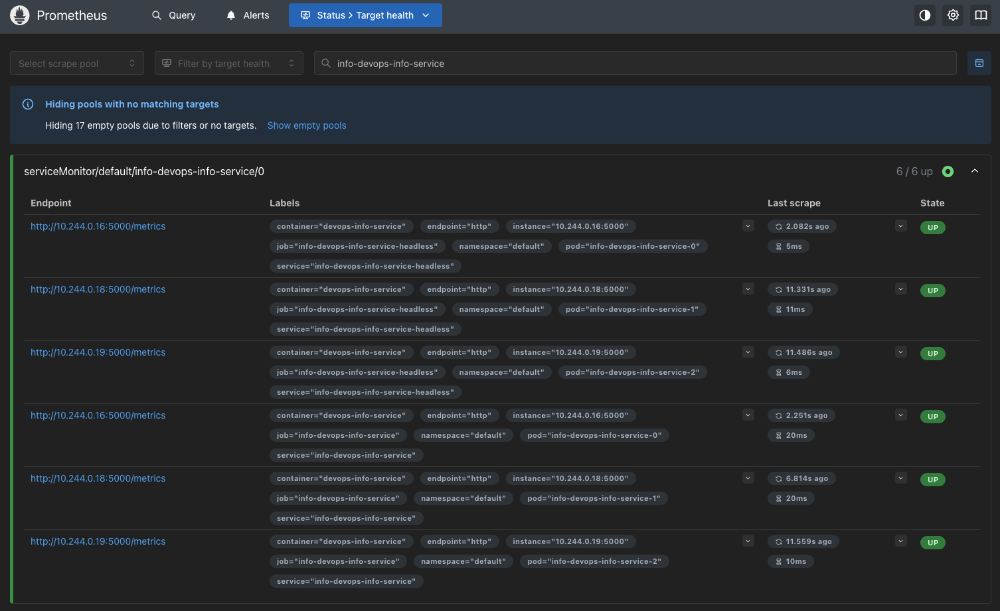

# Lab 16 — Kubernetes Monitoring & Init Containers

## 1. Monitoring Stack Components

| Component | Role |
| --- | --- |
| Prometheus Operator | Kubernetes controller that manages Prometheus, Alertmanager, rules, and scrape configuration from CRDs such as `ServiceMonitor`. |
| Prometheus | Time-series database and query engine. It scrapes metrics from Kubernetes components, node-exporter, kube-state-metrics, and the application. |
| Alertmanager | Receives firing alerts from Prometheus, groups/deduplicates them, and routes notifications. |
| Grafana | Dashboard UI for exploring Prometheus data with prebuilt Kubernetes dashboards. |
| kube-state-metrics | Exposes Kubernetes object state such as pod readiness, replicas, resource requests, and limits. |
| node-exporter | Exposes node OS and hardware metrics such as CPU, memory, filesystem, and network usage. |

## 2. Installation

Commands used:

```bash
minikube start -p lab16-adelina --driver=docker --kubernetes-version=v1.32.0
kubectl config use-context lab16-adelina

helm repo add prometheus-community https://prometheus-community.github.io/helm-charts
helm repo update

helm upgrade --install monitoring prometheus-community/kube-prometheus-stack \
  --namespace monitoring \
  --create-namespace \
  --set prometheus.prometheusSpec.maximumStartupDurationSeconds=60 \
  --wait \
  --timeout 10m
```

I used the current `kube-prometheus-stack` chart (`85.0.2`). The stack installed
successfully and all monitoring pods reached `Running`:

- Prometheus: `prometheus-monitoring-kube-prometheus-prometheus-0` (`2/2`)
- Alertmanager: `alertmanager-monitoring-kube-prometheus-alertmanager-0` (`2/2`)
- Grafana: `monitoring-grafana-f55f599bc-clvmk` (`3/3`)
- kube-state-metrics: `monitoring-kube-state-metrics-5746795bd9-nvpsv` (`1/1`)
- node-exporter: `monitoring-prometheus-node-exporter-6t74v` (`1/1`)
- Prometheus Operator: `monitoring-kube-prometheus-operator-5cdd7dcf48-5lmvz` (`1/1`)

Evidence: `monitoring/evidence/01-monitoring-installation.txt`.

## 3. Application Metrics and ServiceMonitor

The FastAPI application already exposes `/metrics` with `prometheus-client`.
For the bonus task I added Helm support for a `ServiceMonitor`:

- `devops-info-service/templates/servicemonitor.yaml`
- `devops-info-service/values.yaml`
- `devops-info-service/values-monitoring.yaml`

Deployment commands:

```bash
eval "$(minikube -p lab16-adelina docker-env)"
docker build -t devops-info-service:lab16 ./app_python

helm dependency build ./k8s/devops-info-service
helm upgrade --install info ./k8s/devops-info-service \
  -f ./k8s/devops-info-service/values-monitoring.yaml \
  --no-hooks \
  --wait \
  --timeout 5m
```

The app runs as a 3-replica StatefulSet. Prometheus discovers all three pods
through `ServiceMonitor/default/info-devops-info-service`; `up{job="info-devops-info-service"}`
returns `1` for each pod. A sample custom metric query returned:

```promql
sum by (endpoint,status) (http_requests_total{job="info-devops-info-service"})
```

Result: `endpoint="http", status="200" = 480`.

Evidence:

- `monitoring/evidence/02-app-servicemonitor.txt`
- `monitoring/evidence/04-prometheus-servicemonitor.txt`

## 4. Dashboard Answers

Captured with Prometheus queries corresponding to the Grafana dashboard panels.
Evidence: `monitoring/evidence/06-dashboard-promql-answers.txt`.

| Question | Answer |
| --- | --- |
| StatefulSet CPU/memory | CPU: pod-0 `0.00476`, pod-1 `0.00378`, pod-2 `0.00407` cores. Memory: pod-0 `37.07 MiB`, pod-1 `37.50 MiB`, pod-2 `36.89 MiB`. |
| Most/least CPU in `default` | Highest: `info-devops-info-service-0` (`0.00476` cores). Lowest active value: `init-download-demo` (`0.00004` cores); idle demo pods reported `0`. |
| Node metrics | Node memory used: `38.41%` / `3452.54 MiB`. CPU cores: `12`. |
| Kubelet pods/containers | Running pods: `19`. Running containers: `28`. |
| Network traffic | This stack exposed node network metrics but not pod-level `container_network_*` series in Prometheus. Use the Grafana Kubernetes network panel to confirm whether pod network graphs are empty in this Minikube/Kubernetes version. |
| Alerts | Alertmanager had 1 active alert: `Watchdog` with severity `none`. |

## 5. Screenshots

### Grafana Login

Open Grafana:

```bash
kubectl port-forward -n monitoring svc/monitoring-grafana 3000:80
kubectl get secret -n monitoring monitoring-grafana \
  -o jsonpath='{.data.admin-password}' | base64 -d; echo
```



### Kubernetes Namespace Pods Dashboard


### Pod Dashboard




### Node Exporter Dashboard



### Kubelet Dashboard


### Alertmanager


### Prometheus ServiceMonitor Target



## 6. Init Containers

Implemented manifests:

- `monitoring/init-download.yaml`
- `monitoring/wait-for-service.yaml`

Apply and verify:

```bash
kubectl apply -f k8s/monitoring/init-download.yaml
kubectl wait --for=condition=Ready pod/init-download-demo --timeout=120s
kubectl logs init-download-demo -c init-download
kubectl exec init-download-demo -- head -5 /data/index.html

kubectl apply -f k8s/monitoring/wait-for-service.yaml
kubectl wait --for=condition=Available deployment/init-dependency --timeout=120s
kubectl wait --for=condition=Ready pod/wait-for-service-demo --timeout=120s
kubectl logs wait-for-service-demo -c wait-for-service
kubectl logs wait-for-service-demo -c main-app
```

Results:

- `init-download-demo` downloaded `https://example.com` into `/work-dir/index.html`.
- The main container read the same file from the shared `/data` mount.
- `wait-for-service-demo` resolved `init-dependency.default.svc.cluster.local`
  before starting the main container.
- The main container printed `dependency is ready`.

Evidence: `monitoring/evidence/03-init-containers.txt`.
