# Kubernetes Monitoring & Init Containers Report

## Lab 16 — Kube-Prometheus Stack + Init Containers

---

## 1. Monitoring Stack Components

### Prometheus Operator
Manages Prometheus, Alertmanager, and related resources as Kubernetes-native custom resources (CRDs). It automates the lifecycle of monitoring components — creating, configuring, and scaling Prometheus instances declaratively. When you create a `ServiceMonitor` or `PrometheusRule` CR, the Operator picks it up and reconfigures the scrapers.

### Prometheus
Time-series database built for metrics collection and alerting. It scrapes HTTP endpoints (like `/metrics`) on configured targets at regular intervals, stores the data locally with a multi-dimensional data model, and provides PromQL — a powerful query language for aggregating and analyzing metrics. It is the central brain of the monitoring stack.

### Alertmanager
Handles alerts sent by Prometheus. It deduplicates, groups, and routes alerts to the right receiver (Slack, email, PagerDuty, webhook, etc.). Supports inhibition rules (suppress one alert if another is firing) and silences (temporarily mute alerts during maintenance).

### Grafana
Visualization and dashboarding platform. Connects to Prometheus as a data source and renders real-time graphs, heatmaps, tables, and gauges. Ships with pre-built Kubernetes dashboards that display cluster health, node metrics, pod resource usage, and more. Supports alerting natively as well.

### kube-state-metrics
Listens to the Kubernetes API server and generates metrics about the state of Kubernetes objects (deployments, pods, nodes, etc.). Unlike node-exporter (infrastructure), kube-state-metrics exposes object-level data like: `kube_deployment_status_replicas_available`, `kube_pod_container_status_restarts_total`, etc. It does not expose its own resource usage.

### node-exporter
Runs as a DaemonSet on every node and exposes hardware and OS-level metrics: CPU, memory, disk I/O, network statistics, filesystem usage. These metrics power the "Node Exporter / Nodes" dashboards in Grafana and form the foundation for cluster capacity planning.

| Component | Runs As | What It Provides |
|-----------|---------|-----------------|
| Prometheus Operator | Deployment | Manages CRDs, scales Prometheus |
| Prometheus | StatefulSet | Scrapes & stores metrics, PromQL |
| Alertmanager | StatefulSet | Alert routing & notification |
| Grafana | Deployment | Dashboards & visualization |
| kube-state-metrics | Deployment | K8s object state metrics |
| node-exporter | DaemonSet | Node hardware/OS metrics |

---

## 2. Installation

### Helm Setup

```bash
helm repo add prometheus-community https://prometheus-community.github.io/helm-charts
helm repo update

helm install monitoring prometheus-community/kube-prometheus-stack \
  --namespace monitoring \
  --create-namespace
```

### Verify Installation

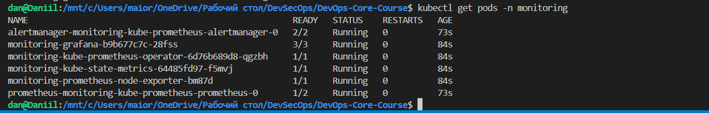

The screenshot shows all pods and services in the `monitoring` namespace running successfully after Helm installation. All components — operator, Prometheus, Alertmanager, Grafana, kube-state-metrics, and node-exporter — are in `Running` state.

---

## 3. Grafana Dashboard Exploration

**Access Grafana:**
```bash
kubectl port-forward svc/monitoring-grafana -n monitoring 3000:80
# Open http://localhost:3000 — login admin / Mg***YF
```

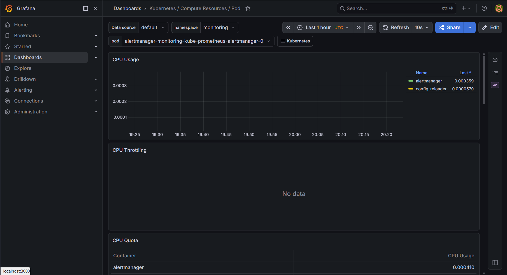

### 3.1 Pod Resources — StatefulSet CPU/Memory

**Start** application:
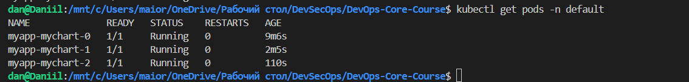

**Dashboard:** "Kubernetes / Compute Resources / Pod"

Filtered to show `myapp-x` StatefulSet pods. The dashboard displays CPU usage and memory usage graphs per pod, along with request / limit thresholds.

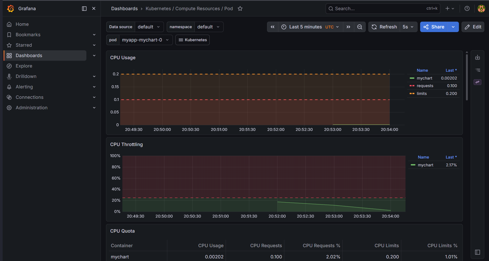

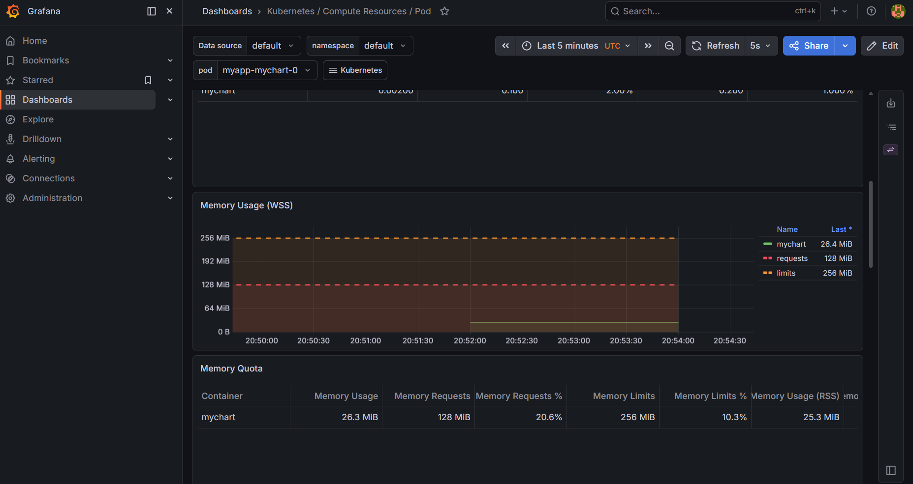

### 3.2 Namespace Analysis — Pod CPU and Memory in default Namespace

**Dashboard:** "Kubernetes / Compute Resources / Namespace (Pods)"

Shows CPU and memory usage for each pod sorted by consumption, making it easy to identify resource-heavy workloads.

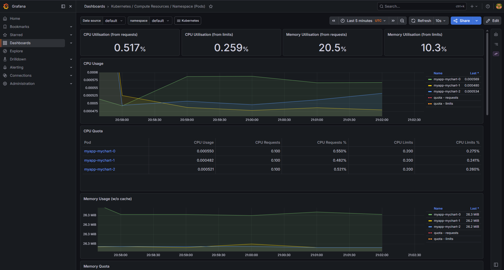

### 3.3 Node Metrics — Memory and CPU

**Dashboard:** "Node Exporter / Nodes"

Displays node-level metrics: memory usage, total CPU, load average, disk I/O, and network throughput.

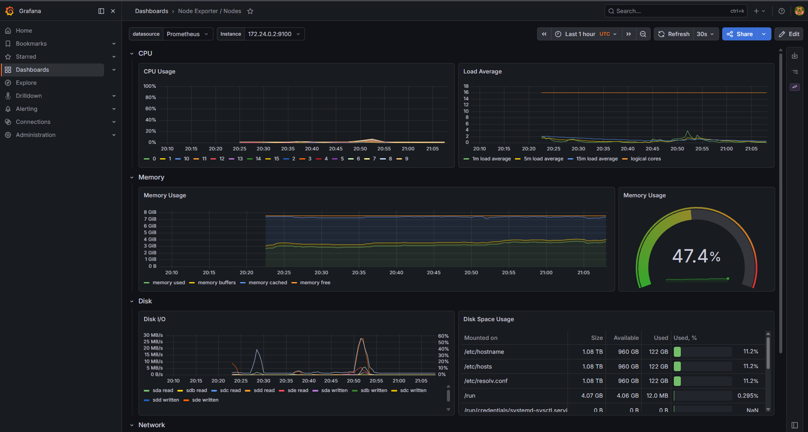

### 3.4 Kubelet — Pods and Containers Managed

**Dashboard:** "Kubernetes / Kubelet"

Shows the number of running pods and containers managed by kubelet, along with operational metrics like pod start latency and container runtime operations.

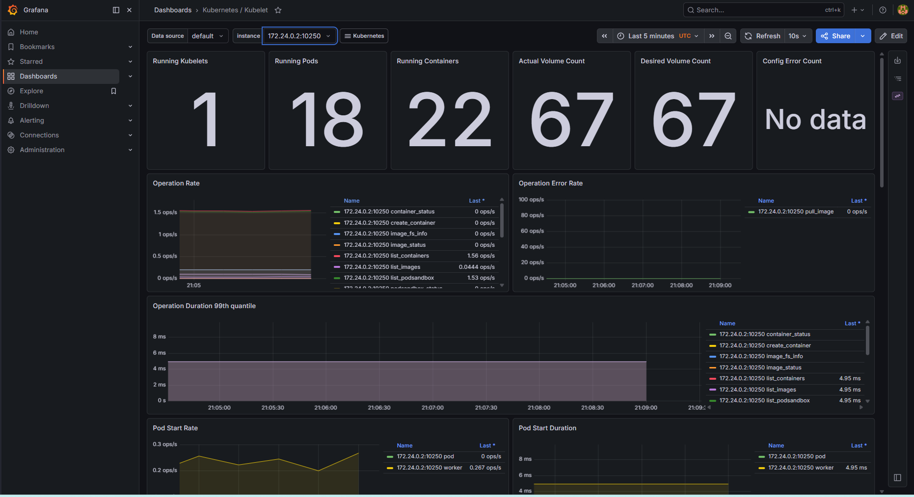

### 3.5 Network — Traffic for Pods in default Namespace

**Dashboard:** "Kubernetes / Networking / Namespace (Pods)"

Filtered to `default` namespace. Displays network receive and transmit rates in bytes per second for each pod.

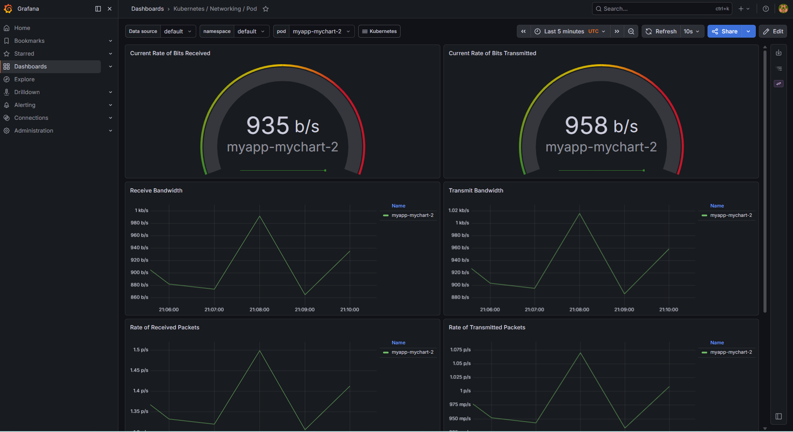

### 3.6 Alerts — Active Alerts in Alertmanager

**Access Alertmanager:**
```bash
kubectl port-forward svc/monitoring-kube-prometheus-alertmanager -n monitoring 9093:9093
```

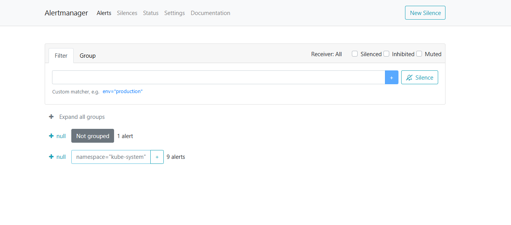

---

## 4. Init Containers

### 4.1 Basic Init Container — File Download

**Manifest:** `k8s/init-container-download.yaml`

```yaml
apiVersion: v1
kind: Pod
metadata:
  name: init-download-demo
  namespace: default
  labels:
    app: init-download-demo
spec:
  restartPolicy: Never
  initContainers:
    - name: init-download
      image: busybox:1.36
      command: ['sh', '-c', 'wget -q -O /work-dir/index.html https://example.com']
      volumeMounts:
        - name: workdir
          mountPath: /work-dir
  containers:
    - name: main-app
      image: busybox:1.36
      command:
        - sh
        - -c
        - |
          echo "Main container started"
          head -n 5 /data/index.html
          sleep 3600
      volumeMounts:
        - name: workdir
          mountPath: /data
  volumes:
    - name: workdir
      emptyDir: {}
```

**Deploy & Verify:**
```bash
kubectl apply -f k8s/init-container-download.yaml
kubectl logs init-download-demo -c init-download
kubectl logs init-download-demo        # Main container logs
kubectl exec init-download-demo -- head -5 /data/index.html
```

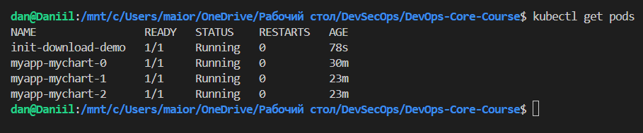

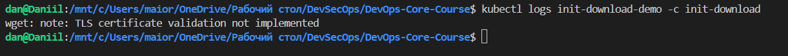

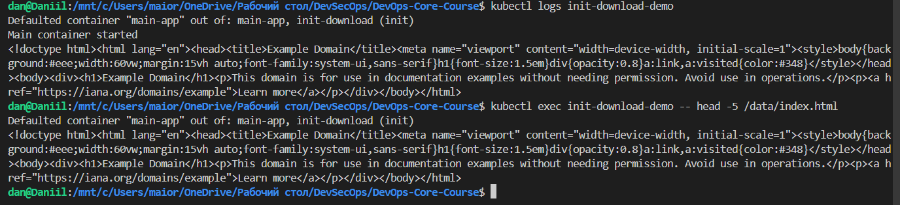

### 4.2 Wait-for-Service Pattern

**Manifest:** `k8s/init-container-wait-service.yaml`

This manifest deploys three resources:
1. **Deployment** `dependency-service` 
2. **Service** `dependency-service` 
3. **Pod** `wait-for-service-demo`

```yaml
apiVersion: apps/v1
kind: Deployment
metadata:
  name: dependency-service
  namespace: default
  labels:
    app: dependency-service
spec:
  replicas: 1
  selector:
    matchLabels:
      app: dependency-service
  template:
    metadata:
      labels:
        app: dependency-service
    spec:
      containers:
        - name: nginx
          image: nginx:1.27-alpine
          ports:
            - containerPort: 80
---
apiVersion: v1
kind: Service
metadata:
  name: dependency-service
  namespace: default
spec:
  selector:
    app: dependency-service
  ports:
    - port: 80
      targetPort: 80
      name: http
---
apiVersion: v1
kind: Pod
metadata:
  name: wait-for-service-demo
  namespace: default
  labels:
    app: wait-for-service-demo
spec:
  restartPolicy: Never
  initContainers:
    - name: wait-for-dependency
      image: busybox:1.36
      command:
        - sh
        - -c
        - |
          # Wait until the Service has ready endpoints (nslookup alone is not enough — it resolves ClusterIP immediately).
          until wget -q -T 2 -O /dev/null http://dependency-service/ 2>/dev/null; do
            echo "$(date): dependency-service not reachable yet, retrying in 2s..."
            sleep 2
          done
          echo "$(date): dependency-service returned HTTP — ready."
  containers:
    - name: main-app
      image: busybox:1.36
      command:
        - sh
        - -c
        - |
          echo "Main container started after init"
          wget -qO- http://dependency-service | head -n 3
          sleep 3600
```

**Deploy & Verify:**
```bash
kubectl apply -f k8s/init-container-wait-service.yaml
kubectl logs wait-for-service-demo -c wait-for-dependency
```

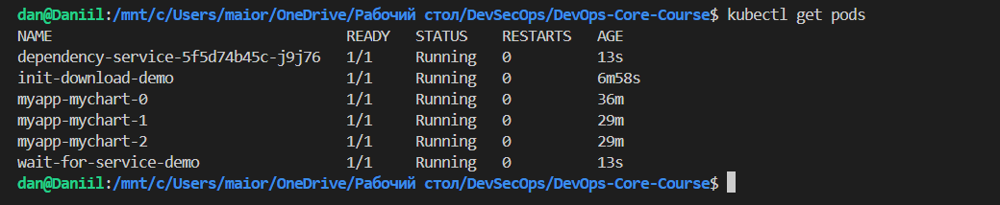

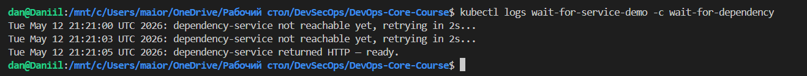

### Init Container Lifecycle

| Phase | Description |
|-------|-------------|
| **Pending** | Pod scheduled, init containers start in order |
| **Init:N/M** | N init containers completed out of M total |
| **PodInitializing** | All init containers done, main containers starting |
| **Running** | All containers running |

**Key Properties:**
- Init containers run **sequentially** in definition order.
- Each init container must complete successfully (exit 0) before the next starts.
- If any init container fails, Kubernetes restarts it (subject to `restartPolicy`).
- Init containers have their **own** resource requests/limits separate from the main container.
- They can use **different images** than the main container (e.g., `busybox` for setup, `python:3.13` for the app).
- They can access **Secrets and ConfigMaps** that the main container cannot, since they run before the main app.

---

## 5. Bonus — Custom Metrics & ServiceMonitor

### 5.1 Application Metrics Endpoint

The `myapp-mychart` Python/FastAPI application already exposes a `/metrics` endpoint using the `prometheus_client` library.

**Available metrics (from `app_python/app.py`):**

| Metric | Type | Description |
|--------|------|-------------|
| `http_requests_total` | Counter | Total HTTP requests, labeled by method, endpoint (path), and status code |
| `http_request_duration_seconds` | Histogram | Request duration in seconds, labeled by method and endpoint |
| `http_requests_in_progress` | Gauge | Number of active in-flight HTTP requests |
| `devops-info-service_uptime_seconds` *(JSON field, not Prometheus metric)* | Gauge (logical) | Service uptime in seconds (calculated in `/` and `/health` responses) |
| `visits` *(JSON field, not Prometheus metric)* | Counter (file-based) | Total number of visits stored in `/data/visits` file |

**Verify locally:**
```bash
kubectl port-forward svc/myapp-mychart 8000:80
# Open in browser: http://localhost:8000/metrics
```

```
# HELP python_gc_objects_collected_total Objects collected during gc
# TYPE python_gc_objects_collected_total counter
python_gc_objects_collected_total{generation="0"} 3196.0
python_gc_objects_collected_total{generation="1"} 565.0
python_gc_objects_collected_total{generation="2"} 0.0
# HELP python_gc_objects_uncollectable_total Uncollectable objects found during GC
# TYPE python_gc_objects_uncollectable_total counter
python_gc_objects_uncollectable_total{generation="0"} 0.0
python_gc_objects_uncollectable_total{generation="1"} 0.0
python_gc_objects_uncollectable_total{generation="2"} 0.0
# HELP python_gc_collections_total Number of times this generation was collected
# TYPE python_gc_collections_total counter
python_gc_collections_total{generation="0"} 66.0
python_gc_collections_total{generation="1"} 6.0
python_gc_collections_total{generation="2"} 0.0
# HELP python_info Python platform information
# TYPE python_info gauge
python_info{implementation="CPython",major="3",minor="12",patchlevel="13",version="3.12.13"} 1.0
# HELP process_virtual_memory_bytes Virtual memory size in bytes.
# TYPE process_virtual_memory_bytes gauge
process_virtual_memory_bytes 1.98914048e+08
# HELP process_resident_memory_bytes Resident memory size in bytes.
# TYPE process_resident_memory_bytes gauge
process_resident_memory_bytes 3.9284736e+07
# HELP process_start_time_seconds Start time of the process since unix epoch in seconds.
# TYPE process_start_time_seconds gauge
process_start_time_seconds 1.77861908272e+09
# HELP process_cpu_seconds_total Total user and system CPU time spent in seconds.
# TYPE process_cpu_seconds_total counter
process_cpu_seconds_total 1.5699999999999998
# HELP process_open_fds Number of open file descriptors.
# TYPE process_open_fds gauge
process_open_fds 6.0
# HELP process_max_fds Maximum number of open file descriptors.
# TYPE process_max_fds gauge
process_max_fds 1.048576e+06
# HELP http_requests_total Total HTTP requests
# TYPE http_requests_total counter
http_requests_total{endpoint="/health",method="GET",status="200"} 452.0
# HELP http_requests_created Total HTTP requests
# TYPE http_requests_created gauge
http_requests_created{endpoint="/health",method="GET",status="200"} 1.7786190862346385e+09
# HELP http_request_duration_seconds HTTP request duration
# TYPE http_request_duration_seconds histogram
http_request_duration_seconds_bucket{endpoint="/health",le="0.005",method="GET"} 450.0
http_request_duration_seconds_bucket{endpoint="/health",le="0.01",method="GET"} 450.0
http_request_duration_seconds_bucket{endpoint="/health",le="0.025",method="GET"} 451.0
http_request_duration_seconds_bucket{endpoint="/health",le="0.05",method="GET"} 451.0
http_request_duration_seconds_bucket{endpoint="/health",le="0.075",method="GET"} 451.0
http_request_duration_seconds_bucket{endpoint="/health",le="0.1",method="GET"} 451.0
http_request_duration_seconds_bucket{endpoint="/health",le="0.25",method="GET"} 452.0
http_request_duration_seconds_bucket{endpoint="/health",le="0.5",method="GET"} 452.0
http_request_duration_seconds_bucket{endpoint="/health",le="0.75",method="GET"} 452.0
http_request_duration_seconds_bucket{endpoint="/health",le="1.0",method="GET"} 452.0
http_request_duration_seconds_bucket{endpoint="/health",le="2.5",method="GET"} 452.0
http_request_duration_seconds_bucket{endpoint="/health",le="5.0",method="GET"} 452.0
http_request_duration_seconds_bucket{endpoint="/health",le="7.5",method="GET"} 452.0
http_request_duration_seconds_bucket{endpoint="/health",le="10.0",method="GET"} 452.0
http_request_duration_seconds_bucket{endpoint="/health",le="+Inf",method="GET"} 452.0
http_request_duration_seconds_count{endpoint="/health",method="GET"} 452.0
http_request_duration_seconds_sum{endpoint="/health",method="GET"} 0.3971219062805176
# HELP http_request_duration_seconds_created HTTP request duration
# TYPE http_request_duration_seconds_created gauge
http_request_duration_seconds_created{endpoint="/health",method="GET"} 1.7786190862346642e+09
# HELP http_requests_in_progress HTTP requests in progress
# TYPE http_requests_in_progress gauge
http_requests_in_progress 0.0
```

### 5.2 ServiceMonitor CRD

ServiceMonitor is used to allow Prometheus to automatically discover and scrape metrics from Kubernetes services. It defines which services should be monitored, which port should be used, and which HTTP path (typically `/metrics`) should be scraped.

In this project, the ServiceMonitor is configured to collect metrics from the application deployed in the `default` namespace. Service discovery is performed using a selector based on Kubernetes labels `app.kubernetes.io/instance` and `app.kubernetes.io/name`, which match the labels generated by the Helm chart.

The Prometheus Operator discovers this ServiceMonitor through the label `release: monitoring`, which links it to the Prometheus stack installed via Helm.

Metrics are scraped from the `/metrics` endpoint over the `http` port every 30 seconds, with a scrape timeout of 10 seconds.

As a result, the ServiceMonitor enables automatic integration of the application with Prometheus and ensures continuous metric collection without manual scrape configuration.


**Manifest:** `k8s/servicemonitor.yaml`

```yaml
apiVersion: monitoring.coreos.com/v1
kind: ServiceMonitor
metadata:
  name: myapp-monitor
  namespace: monitoring
  labels:
    release: monitoring
spec:
  namespaceSelector:
    matchNames:
      - default
  selector:
    matchLabels:
      app.kubernetes.io/name: myapp
  endpoints:
    - port: http
      path: /metrics
      interval: 30s
      scrapeTimeout: 10s
```

**Deploy:**
```bash
kubectl apply -f k8s/servicemonitor.yaml
kubectl get servicemonitors -n monitoring
```

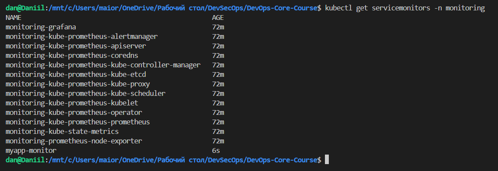

### 5.3 Verify Metrics in Prometheus

```bash
kubectl port-forward svc/monitoring-kube-prometheus-prometheus -n monitoring 9090:9090
# Open http://localhost:9090
```

In the Prometheus UI:
1. Go to **Status → Targets** — verify `myapp-monitor` shows as UP with green state.
2. Go to **Graph** — query `http_requests_total` to see your app's HTTP request counts.

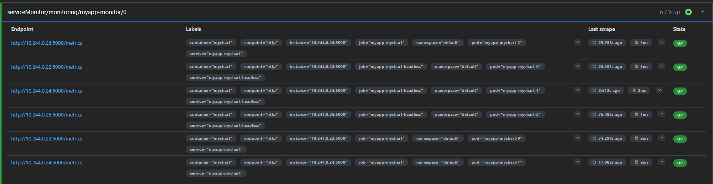

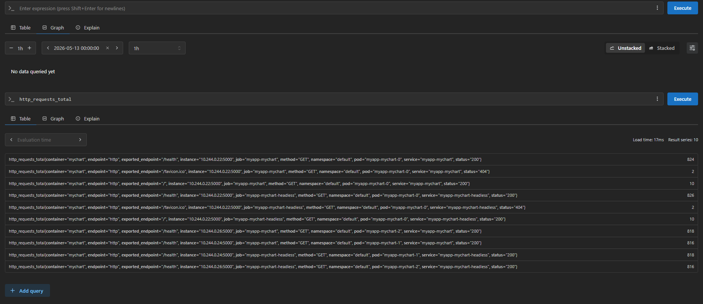

---